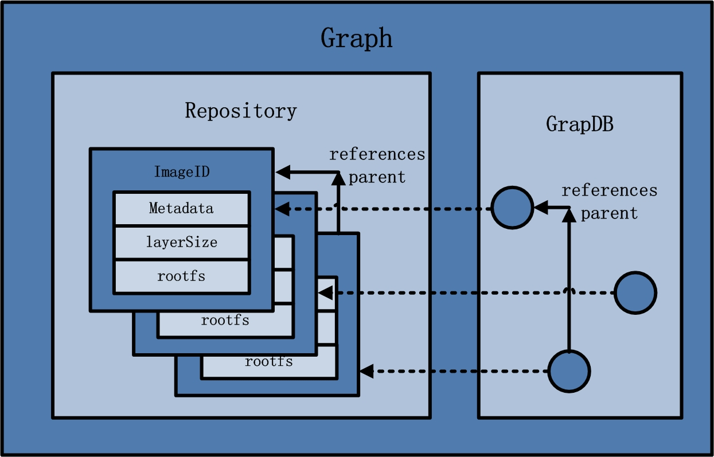
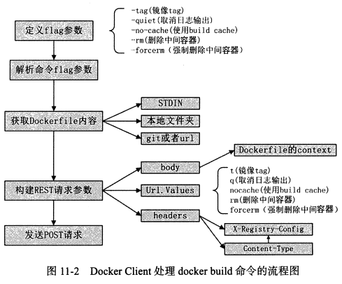

Docker源码分析

[TOC]

基于Docker1.2.0版本

# 第1章 Docker架构


## Docker总结构图


## Docker Daemon架构示意图


## Docker Server架构示意图


## Graph架构示意图





# 第9章 Docker镜像下载

## Docker镜像下载流程


- 命令：`docker pull ubuntu:14.04`
- 步骤：
  - 1.用户通过Docker Client发送pull命令，用于让Docker Daemon下载指定名称的镜像
  - 2.Docker Server接收Docker镜像的pull请求，创建下载镜像任务并触发执行
  - 3.Docker Daemon执行镜像下载任务，从Docker Register中下载指定镜像，并将其存储于本地Graph中

## Docker Client

- 主要函数：DockerCli的`CmdPull()`

- 步骤：

  - (1).解析命令中与Docker相关的参数（tag、remote、v、hostname）
  - (2).配置Docker下载镜像时所需的认证信息（authConfig）
  - (3).发送RESTful请求至Docker Daemon（`job.Run()`、`"POST","/images/create?"+v.Encode()`）

  ```
  源码：docker/api/client/command.go

  func (cli *DockerCli) CmdPull(args ...string)
  	---> tag := cmd.String()	//(1)
  	---> v      = url.Values{}	//(1)
  	---> remote = cmd.Arg(0)	//(1)
  	---> hostname, _, err := registry.ResolveRepositoryName(remote)	//(1)
  	---> authConfig := cli.configFile.ResolveAuthConfig(hostname)	//(2)
  	---> pull := func(authConfig registry.AuthConfig) error {}	//(3)
  		---> return cli.stream("POST", "/images/create?"+v.Encode()...}
  	---> if err := pull(authConfig);	//(3)
  ```


## Docker Server

- 步骤：
  - (1).解析HTTP请求中包含的请求参数：URL中大查询参数、HTTP Header中的认证信息
  - (2).创建镜像下载Job、并为该Job配置环境变量
  - (3).触发执行镜像下载Job

```
源码：docker/api/server/server.go

总过程：DockerCli.CmdPull() ---> postImagesCreate()

func postImagesCreate(...) error
	---> image、repo、tag、job	//(1)
	---> authConfig :=	//(1)
	---> job = eng.Job("pull", image, tag)	//(2)
	--- >if err := job.Run();	//(3)
	
```
## Docker Daemon

- 主要函数：`job.Run`  --->  Graph的`CmdPull()`

- 步骤

  - (1).解析Job参数（repository、tag、Docker Registry）
  - (2).Docker Daemon与Docker Registry建立会话（session）
  - (3).通过会话下载镜像
  - (4).Docker镜像下载至本地并存储与Graph（`s.pullRepository`）
  - (5).在TagStore中标记该镜像`s.Set()`

- image组成：

  - image json：元数据，比如Dockerfile中的ENV、暴露的端口，用来给容器内部进程配置环境，动态数据
  - image layer：实际内容，静态数据

- (4)Docker镜像下载至本地并存储与Graph、(5)在TagStore中标记该镜像的具体过程：

  - (4)Docker镜像下载至本地并存储与Graph

  

  - (5)在TagStore中标记该镜像的具体过程，即`s.Set()`

  


```
源码：docker/graph/pull.go

总流程：DockerCli.CmdPull() ---> postImagesCreate()--->TagStore.CmdPull()

func (s *TagStore) CmdPull() engine.Status
	---> localName、tag、authConfig	//(1)
	---> s.poolAdd	(1)：禁止下载中被的DockerClient发出相同的请求
	---> registry.NewSession()	//(2):创建session对象，与registry建立数据连接，用r进行数据传输
	---> s.pullRepository()	//(3):执行镜像下载
		---> r.GetRepositoryData() //获取指定repository中所有镜像的ID信息，存入RepositoryData的ImgList中
		---> r.GetRemoteTags() //获取指定repository的所有Tag信息
		---> s.pullImage()	//(4):从Docker Register下载Docker镜像
			---> r.GetRemoteHistory()	//获取指定image所有祖先镜像的ID信息
			---> r.GetRemoteImageJSON()	//获取指定image的json信息
			---> r.GetRemoteImageLayer() //获取指定image的layer信息
			---> s.graph.Register()	//将下载的镜像在TagStore的Graph中注册
		---> s.Set()	//(5):配置TagStore
			---> store.LookupImage(imageName) //查看Graph中是否确定存在指定image
			---> validateRepoName() //验证repository的名称是否合法
			---> validateTagName() //验证tag的名称是否合法
			---> store.reload() //加载本地的repository文件
			---> repo[tag] = img.ID //在repository对象中添加新镜像的tag信息以及image id
			---> return store.save() //保存repository信息，持久化到Docker Daemon本地
			
```


# 第10章 Docker镜像存储

## 镜像注册

- **镜像注册**主要分为4个步骤

  - 验证镜像ID的有效性
  - 创建镜像存储路径
  - 存储镜像内容
  - 在Graph中注册镜像ID

  ​

  


## 验证镜像ID

- 步骤：
  - 验证镜像合法性
  - 验证镜像是否已存在
  - 初始化镜像目录
    - 做法：删除一些冲突目录
    - 目的：使得后续Docker镜像存储时存储路径不会冲突

## 创建镜像路径

- 步骤（以aufs为例）
  - 创建mnt、diff、layers子目录
  - 挂载祖先镜像并返回根目录
- aufs目录地址
  - 镜像存放目录：`/var/lib/docker/aufs/diff`
  - 镜像挂载目录：`/var/lib/docker/aufs/mnt`
- 目录说明：
  - layers：每个镜像的元数据，这些元数据是这个镜像的祖先镜像ID列表
  - diff：每个镜像所在的layer，具体包含的文件系统内容，下载的镜像中与文件系统相关的内容，都会存在diff下的某个镜像ID目录下
  - mnt：目录下的每个文件都是一个镜像ID，代表该层镜像之上挂载的可读写layer


## 挂载祖先镜像并返回根目录

- 步骤：
  - 获取aufs/mnt/image_ID目录（RW层所在路径）
  - 如果不是基础镜像，挂载父类镜像


## 存储镜像内容

- 主要函数`image.StoreImage(img, jsonData, layerData, tmp, rootfs);`
- 参数分析：


- 步骤：

  - 1.解压镜像内容layerData至diff目录（StoreImage传入的镜像内容layerData是一个压缩包），解压的diff目录如下图所示。
    - 将其解压至aufs/diff/image_ID目录下
    - 开启镜像磁盘空间统计任务

  

  - 2.收集镜像所占空间大小，并记录
    - 将镜像大小收集，更新img的Size属性
    - 将镜像大小写入root，由于传入的是`_temp`，因此存入`_temp`。具体的做法为：在临时文件`/var/lib/docker/graph/_temp/layersize`写入`img.Size`
  - 3.将jsonData写入临时文件
    - 将json写入`/var/lib/docker/graph/_temp/json`

## 注册镜像ID

- 知识点：`TruncIndex`：Docker用户指定镜像ID的前缀，只要前缀满足在全局所有的镜像ID中唯一，Docker Daemon就可以通过TruncIndex定位到唯一的镜像ID
- 步骤：
  - 将`/var/lib/docker/graph/_temp`重命名为`/var/lib/docker/graph/`
  - 添加镜像ID至graph.idIndex，即添加到TruncIndex


```
源码：docker/graph/pull.go

其实是接上一章的s.graph.Register()

s.graph.Register(jsonData,layerData,img) 
	---> utils.ValidateID(img.ID) //验证镜像合法性
	---> graph.Exists(img.ID) //验证镜像是否已存在
	---> os.RemoveAll() //初始化镜像目录
	---> graph.driver.Create(img.ID, img.Parent) //调用aufs的Create,在aufs.go
		---> a.createDirsFor(id); //创建mnt、diff,再根据镜像ID创建镜像文件夹，aufs/mnt/image_ID,aufs/diff/image_ID
		---> os.Create(path.Join(a.rootPath(), "layers", id)) //写入层元数据,即写入到aufs/layers/image_ID下，将祖先镜像的镜像ID写入该镜像ID文件中
	---> rootfs, err := graph.driver.Get(img.ID, "") //挂载祖先镜像并返回根目录aufs/mnt/image_ID，调用aufs的Get，在aufs.go
		---> count := a.active[id] //获取镜像的引用数（有可能多个容器在用）
		---> out := path.Join(a.rootPath(), "diff", id) //如果不是基础镜像，挂载父镜像
	---> image.StoreImage() 
		---> differ.ApplyDiff(img.ID, layerData) //将layerData解压至aufs/diff/image_ID
		---> differ.DiffSize(img.ID) //开启镜像磁盘空间统计任务
		---> img.Size = size //更新img的Size属性
		---> img.SaveSize(root) //将镜像大小写入临时目录
		---> ioutil.WriteFile(jsonPath(root), jsonData, 0600) //将json写入临时目录
		---> os.Rename(tmp, graph.ImageRoot(img.ID)) //commit，重命名临时目录
		---> graph.idIndex.Add(img.ID) //将镜像ID添加至TruncIndex
	
```


# 第11章 Docker build实现

- docker build：通过一个Dockerfile文件以及相关内容，从一个基础镜像起步，对Dockerfile中的每一条命令，都在原先的镜像layer之上再额外构建一个新的镜像layer，直至构建出用户所需的镜像

## docker build执行流程


### Docker client与docker build



#### 1.定义并解析flag参数

#### 2.获取Dockerfile相关内容

- 获取Dockerfile的方式
  - 本地
  - STDIN
  - 远程：URL
  - git
- 解析Dockerfile源并构建context信息的流程图


#### 3.构建REST请求参数

#### 4.发送POST请求

```
源码：docker/api/client/command.go

func (cli *DockerCli) CmdBuild(args) error
	---> tag、suppressOutput、noCache、rm、forceRm //定义并解析flag参数
	---> context //根据Dockerfile构造的context信息
	---> body = utils.ProgressReader(context,...) //根据context生成请求体
	---> v.Set("t", *tag) //设置flag参数
	---> cli.stream("POST", fmt.Sprintf("/build?%s", v.Encode()), body,...) //发送POST请求至Docker Server
```

### Docker Server与docker build

```
源码：docker/api/server/server.go

createRouter
	--->"POST":"/build": 
		---> postBuild
			---> 解析请求参数
			---> eng.Job("build") //创建Job
			---> job.Stdin.Add(r.Body) //以job自身标准输入的形式将Dockerfile添加到job内部
			---> job.Run() //执行job.Run
```

### Docker Daemon与docker build

- Docker Daemon获取context的流程图（有三种方式）：


- buildFile：相当于一个生产镜像车间，只要有原料（Dockerfile）输入，它就可以按照要求为用户生产Docker镜像，build结构体相关属性如下：


- b.Build之后的事情：
  - Docker Daemon响应Docker Server
  - Docker Server响应Docker Client 

```
源码：docker/daemon/build.go

func (daemon *Daemon) CmdBuild(job *engine.Job)
	---> noCache、rm、authConfig、context //解析job环境变量
	---> context //根据三种方式之一获取context
	---> b := NewBuildFile(daemon,...) //根据noCache等参数创建buildFile对象
	---> id, err := b.Build(context) //buildFile根据context创建镜像并返回镜像ID
	---> daemon.Repositories().Set(repoName, tag, id, false) //将镜像ID注册到Repository中
```

