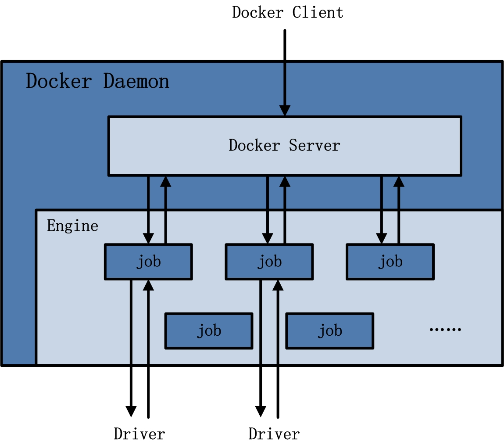
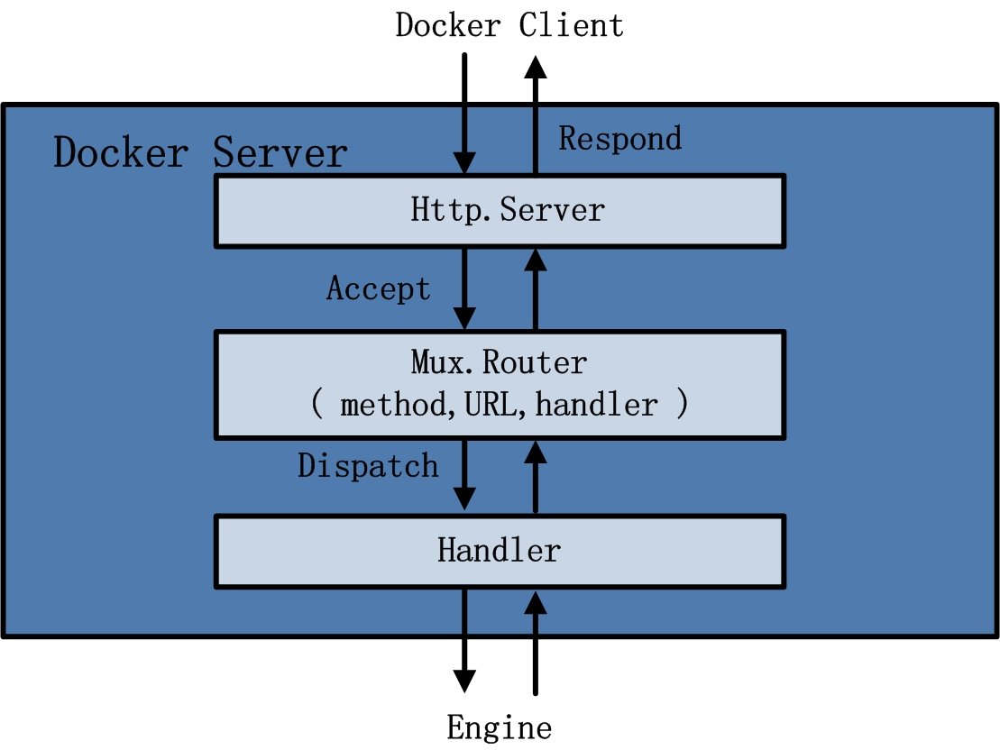
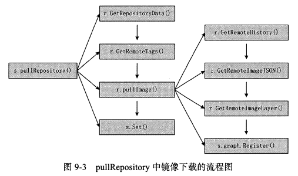
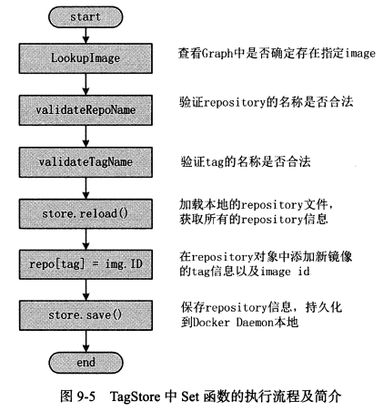

Docker源码分析

[TOC]

基于Docker1.2.0版本

# 第1章 Docker架构


## Docker总结构图


## Docker Daemon架构示意图





## Docker Server架构示意图





# 第9章 Docker镜像下载

## Docker镜像下载流程


- 命令：`docker pull ubuntu:14.04`
- 步骤：
  - 1.用户通过Docker Client发送pull命令，用于让Docker Daemon下载指定名称的镜像
  - 2.Docker Server接收Docker镜像的pull请求，创建下载镜像任务并触发执行
  - 3.Docker Daemon执行镜像下载任务，从Docker Register中下载指定镜像，并将其存储于本地Graph中

## Docker Client

- 主要函数：DockerCli的`CmdPull()`

- 步骤：

  - (1).解析命令中与Docker相关的参数（tag、remote、v、hostname）
  - (2).配置Docker下载镜像时所需的认证信息（authConfig）
  - (3).发送RESTful请求至Docker Daemon（`job.Run()`、`"POST","/images/create?"+v.Encode()`）

  ```
  源码：docker/api/client/command.go

  func (cli *DockerCli) CmdPull(args ...string)
  	---> tag := cmd.String()	(1)
  	---> v      = url.Values{}	(1)
  	---> remote = cmd.Arg(0)	(1)
  	---> hostname, _, err := registry.ResolveRepositoryName(remote)	(1)
  	---> authConfig := cli.configFile.ResolveAuthConfig(hostname)	(2)
  	---> pull := func(authConfig registry.AuthConfig) error {}	(3)
  		---> return cli.stream("POST", "/images/create?"+v.Encode()...}
  	---> if err := pull(authConfig);	(3)
  ```


## Docker Server

- 步骤：
  - (1).解析HTTP请求中包含的请求参数：URL中大查询参数、HTTP Header中的认证信息
  - (2).创建镜像下载Job、并为该Job配置环境变量
  - (3).触发执行镜像下载Job

```
源码：docker/api/server/server.go

总过程：DockerCli.CmdPull() ---> postImagesCreate()

func postImagesCreate(...) error
	---> image、repo、tag、job	(1)
	---> authConfig :=	(1)
	---> job = eng.Job("pull", image, tag)	(2)
	--- >if err := job.Run();	(3)
	
```
## Docker Daemon

- 主要函数：`job.Run`  --->  Graph的`CmdPull()`

- 步骤

  - (1).解析Job参数（repository、tag、Docker Registry）
  - (2).Docker Daemon与Docker Registry建立会话（session）
  - (3).通过会话下载镜像
  - (4).Docker镜像下载至本地并存储与Graph（`s.pullRepository`）
  - (5).在TagStore中标记该镜像`s.Set()`

- image组成：

  - image json：元数据
  - image layer：实际内容

- (4)Docker镜像下载至本地并存储与Graph、(5)在TagStore中标记该镜像的具体过程：

  - (4)Docker镜像下载至本地并存储与Graph

  

  - (5)在TagStore中标记该镜像的具体过程，即`s.Set()`

  


```
源码：docker/graph/pull.go

总流程：DockerCli.CmdPull() ---> postImagesCreate()--->TagStore.CmdPull()

func (s *TagStore) CmdPull() engine.Status
	---> localName、tag、authConfig	(1)
	---> s.poolAdd	(1)：禁止下载中被的DockerClient发出相同的请求
	---> registry.NewSession()	(2):创建session对象，与registry建立数据连接，用r进行数据传输
	---> s.pullRepository()	(3):执行镜像下载
		---> r.GetRepositoryData() 获取指定repository中所有镜像的ID信息，存入RepositoryData的ImgList中
		---> r.GetRemoteTags() 获取指定repository的所有Tag信息
		---> s.pullImage()	(4):从Docker Register下载Docker镜像
			---> r.GetRemoteHistory()	获取指定image所有祖先镜像的ID信息
			---> r.GetRemoteImageJSON()	获取指定image的json信息
			---> r.GetRemoteImageLayer() 获取指定image的layer信息
			---> s.graph.Register()	将下载的镜像在TagStore的Graph中注册
		---> s.Set()	(5):配置TagStore
```

