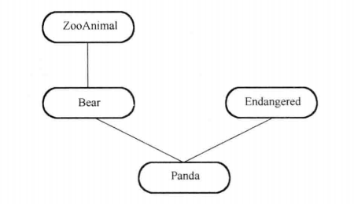
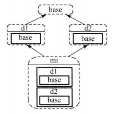
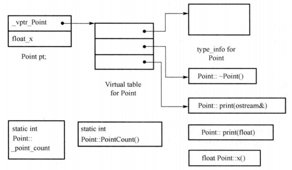
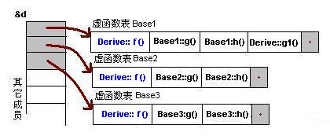
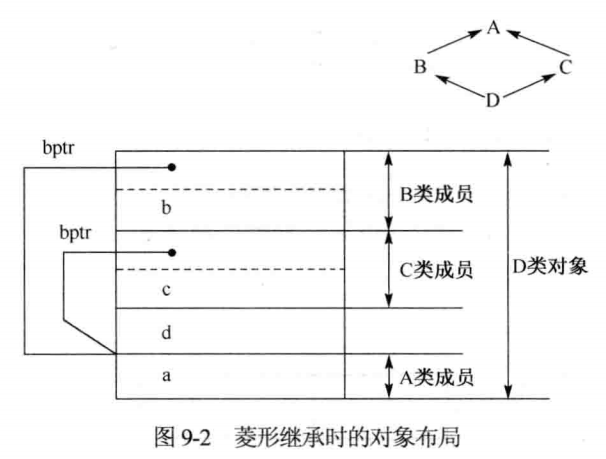
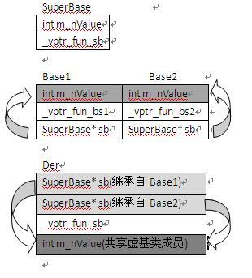
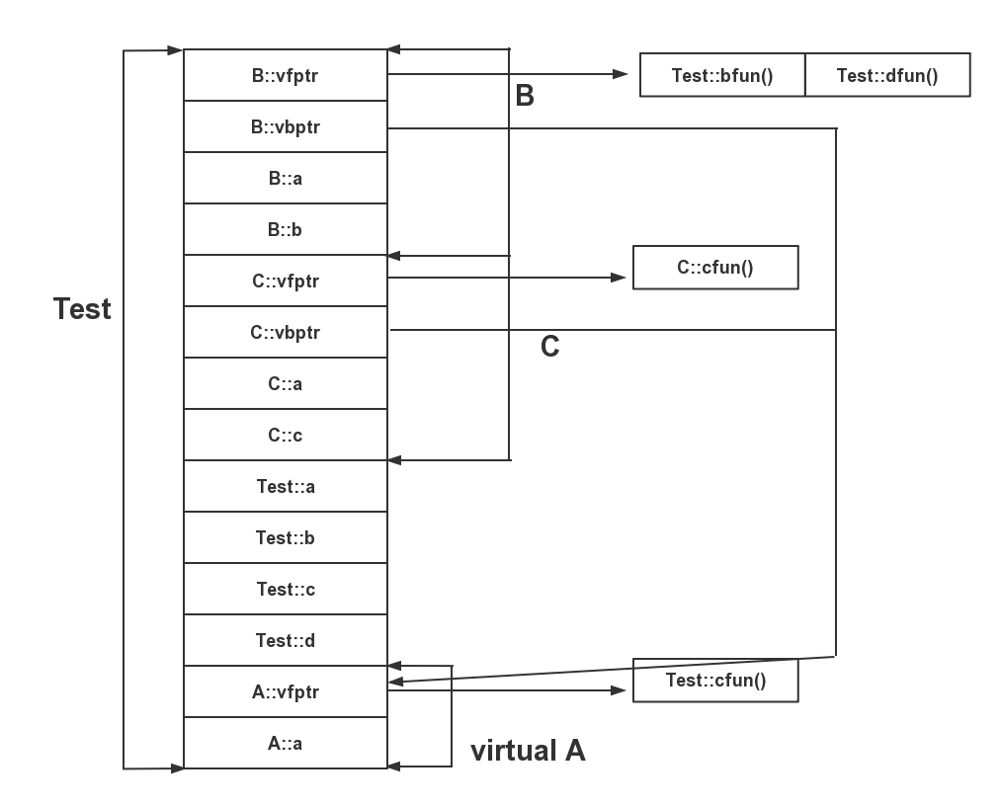
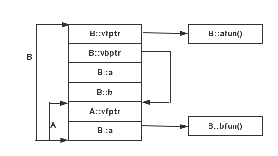
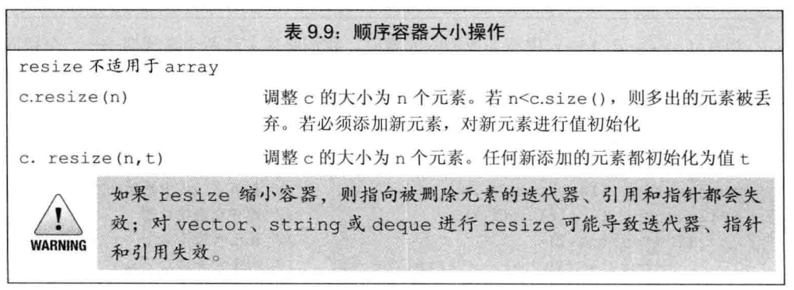

王道程序员求职宝典-第1篇 程序设计基础及数据结构基础

[TOC]

# 5 C预处理器、作用域、static、const以及内存管理

## 5.5 内存管理与释放

- 1.内存分区：栈、堆、全局（静态）区、程序代码区、文字常量区

  ```
  高地址
  ------------------
  kernal space（1G）
  ------------------
  [space]
  ------------------
  栈：向下增长        <---函数参数、局部变量、alloc（栈的动态分配）
  ------------------
  [space]
  ------------------
  堆:向上增长         <---new、delete、malloc、free
  ------------------
  [space]
  ------------------
  全局（静态）区：
  	BBS（未初始化）  <---非初始化的全局变量、静态变量,BBS的特点：程序执行之前自动清0（默认初始化）
  	DATA段（初始化） <---初始化的全局变量、静态变量
  ------------------
  程序代码区
  ------------------
  低地址
  ```

  - 关于文字常量区存放位置，视编译器
    - 专用的字符串池内存块
    - 静态数据区
    - 代码区

### 5.5.1 C语言内存操纵函数

- 1.指向文字常量的指针，指针可以更改指向，但是指针所指向的文字常量不能被更改。
  - `const char* p = "hello";`
  - 以下指向字符串的声明是错误的:
    - `const string* p = "hello"`
    - `char* p = "hello";`

### 5.5.2 C++内存管理

- 1.new时
  - 不显示初始化：
    - 类类型：调用默认构造函数 `string* ps = new string;`
    - 内置类型：无初始化 `int *pi = new int;`
  - 显示初始化
    - 类类型： `string* ps = new string();`
    - 内置类型： `int *pi = new int();//初始化为0`
- 2.const对象的动态分配
  - `const int *pci = new const int(1024);`
  - 必须在创建时初始化，之后不能修改
  - 是否需要显示初始化
    - 类类型：如果有默认构造函数，可以不显示初始化
    - 内置类型：必须显示初始化
- 3.new数组，只能用无参数构造函数
  - 正确：`Obj *objects = new Obj[100]` `Obj *objects = new Obj[100]()`
  - 错误：`Obj *objects = new Obj[100](1)`
- 4.malloc/free 与 new/delete的不同点：
  - (1).操作对象不同：
    - malloc/free是库函数不是运算符，不在编译器控制范围内，因此无法执行构造函数和析构函数
    - new的过程：
      - 调用operator new（实际上是malloc）标准函数，分配够大的原始的未类型化内存
      - 运行该类型的构造函数
      - 返回指向新分配并构造的对象的指针
    - delete sp过程：
      - 运行sp指向的对象的析构函数
      - operator delete（实际上是free）标准函数释放内存
  - (2).用法不同：
    - malloc：
      - 返回类型:void*
      - 传入参数为所需内存字节数
    - free(p)
      - 参数为void*
      - 如果p为NULL，可以多次调用；如果p不为NULL，只能调用一次
    - new
      - 内置sizeof、类型转换、类型安全检查功能
- 5.malloc/free与new/delete
  - malloc/free是C/C++标准库函数，new/delete是C++运算符
  - malloc手工计算字节数，new自动计算所需空间
  - malloc类型不安全，new类型安全
  - new调用operator new并调用对象构造函数，malloc不调用构造函数；delete调用析构函数，再调用operator delete，free不调用析构函数
  - malloc/free需要库文件支持，new/delete不需要
- 相同点：free/delete空指针可以多次，free/delete有指向的指针只能一次

# 8 类

## 8.2 类成员简介

### 8.2.1 成员函数

- 1.在类内**定义**的**非虚**函数默认为内联函数。
- 2.非static成员函数都有一个隐式的this常量指针，指向调用函数的对象。

### 8.2.2 构造函数

#### 构造函数

- 1.自动生成的默认构造函数对成员的初始化特性：
  - 类成员：调用其默认构造函数，如果没有则出错
  - 内置或复合类型成员，取决于调用默认构造函数的对象的位置：
    - 全局：初始化为0
    - 局部：不初始化，垃圾值


- 2.如果一个类NoDefault定义了一个接收string的构造函数，则有：
  - 编译器不合成默认构造函数
  - 具有NoDefault类作为类成员的类：不会自动生成默认构造函数，需自己定义，并显示初始化NoDefault类成员
  - 数组
    - 动态数组：不能作为其元素
    - 静态数组：需要提供显示的初始化式
  - 容器，例如vector
    - 提供初始化式：`vector<noDefault> v1(10,init);`，其中init为已经存在的 noDefault 对象，vector 中的元素都是从它复制构造的。
- 3.构造函数不能被定义为虚函数

#### 成员初始化列表

- 1.成员变量初始化顺序：与声明顺序一致，与初始化列表顺序无关。
- 2.构造函数初始化阶段：
  - 初始化阶段：初始化列表。
    - 类成员：调用默认构造函数，没有则报错。
    - 内置或复合类型成员：全局，初始化0；局部，不初始化，垃圾值。
  - 普通的计算阶段：构造函数体。
    - 类成员：如果在函数体内再次初始化类成员，相等于重复初始化，效率低。
- 3.必须使用初始化列表的成员变量：
  - 没有默认构造函数的类成员
  - const成员变量：但可以与static一起使用，在类外定义
  - 引用

#### 复制构造函数

- 1.复制控制：复制构造函数、赋值操作符、析构函数。
- 2.三法则：如果需要析构函数，则需要复制控制的所有（三种）。
- 3.需要自定义复制控制的情况：类具有指针成员。
- 4.复制构造函数的形式：const+引用：`MyClass(const MyClass &other)`
- 5.复制构造函数的使用场景：
  - 根据另一个同类型的对象初始化一个对象：
    - 直接初始化（圆括号）：在对象初始化时，通过括号给对象提供一定的参数，并且要求编译器使用普通的函数匹配来选择与我们提供的参数最匹配的构造函数
      - 直接初始化不一定要调用复制构造函数
    - 复制初始化（=号）：将一个已有的对象拷贝到正在创建的对象，如果需要的话还需要进行类型转换。
      - 复制初始化一定要调用复制构造函数
    - 复制初始化发生在下列情况：
      - 使用赋值运算符定义变量
      - 将对象作为实参传递给一个非引用类型的形参
      - 将一个返回类型为非引用类型的函数返回一个对象
      - 用花括号列表初始化一个数组中的元素或一个聚合类中的成员​
  - 类类型作为实参传给非引用类型形参
  - 类类型作为非引用类型的返回值
  - 初始化顺序容器：先调用默认构造函数，再调用复制构造函数
  - 数组：
    - 如果没有初始化式，调用默认构造函数
    - 有初始化式：`MyClass test[] = { MyClass(1) }`，先调用构造函数，再调用复制构造函数，但有的编译器会优化掉后来那步（编译器的思想是能不用临时对象就不用临时对象）
- 6.复制初始化和直接初始化的区别：
  - 直接初始化直接调用与**实参匹配**的构造函数，复制初始化总是调用复制构造函数。复制初始化首先使用指定构造函数创建一个临时对象，然后用复制构造函数将那个临时对象复制到正在创建的对象。所以当复制构造函数被声明为私有时，所有的复制初始化都不能使用。
  - 复制初始化`ClassTest ct3 = ct1`，调用复制构造函数
  - 直接初始化`ClassTest ct4(ct1)`，调用复制构造函数，这个是按照实参匹配调用的
  - 需要注意编译器优化而省略掉的步骤
- 7.复制构造函数的形参必须是引用，否则无限循环。
- 8.浅复制、深复制：引用、指针变量有区别

[入解释直接初始化与复制初始化的区别](https://blog.csdn.net/ljianhui/article/details/9245661)

### 8.2.3 析构函数

- 1.析构函数何时被自动调用：
  - 对象超出作用域
  - 动态分配的对象被delete
- 2.自动生成的析构函数，会自动执行类中非static数据成员的析构函数
- 3.类中定义了虚函数，析构函数也应该定义为虚函数，否则：
  - 基类指针指向派生类对象时，delete基类指针，只会调用基类的析构函数，释放基类对象，而派生类对象不被释放
- 4.即使定义了析构函数，也会合成析构函数，并在允许定义的析构函数之后运行合成析构函数
- 5.合成析构函数的释放顺序：
  - 非static成员在类中定义的逆序释放
  - 类成员：调用该成员的析构函数

### 8.2.4 构造函数与析构函数调用顺序

#### 单继承

- 1.构造函数不能继承，派生类需重新定义构造函数，若不显示调用基类构造函数，则调用其默认构造函数，调用格式：

  ```
  派生类类名（总参数列表）：基类构造函数(参数列表),派生类初始化列表{
      //派生类构造函数体
  }
  ```

- 2.派生类构造函数调用顺序：

  - 开辟派生类所需内存
  - 调用基类构造函数，对基类成员初始化
  - 派生类初始化列表：const、引用、没有默认构造函数的派生类 类类型成员
  - 派生类构造函数函数体

- 3.析构函数不能继承，但派生类析构函数会自动调用基类析构函数，调用顺序

  - 派生类析构函数
  - 基类析构函数

#### 多继承

- 1.派生类构造函数调用顺序：
  - 基类构造函数按派生列表顺序调用
  - 派生类初始化列表
  - 派生类构造函数体
- 2.析构函数调用顺序是构造函数调用的逆序
- 3.下图所示的构造函数的调用为
  - ZooAnimal构造函数
  - Bear构造函数
  - Endangered构造函数
  - Panda初始化列表
  - Panda构造函数函数体
- 4.如果在派生类的初始化列表显示指示调用基类的某个构造函数，不影响顺序。



#### 虚继承

[关于C++中的虚拟继承的一些总结](http://www.cnblogs.com/BeyondAnyTime/archive/2012/06/05/2537451.html)

### 9.1.3 转换构造函数（感觉应该把它放在这里）

- 1.例子：`class Integral{ Integral(int); //转换构造函数};`，以下情况都可以成为int转为Integral的转换构造函数：
  - 仅有一个int的构造函数
  - 构造函数有多个参数，但包含一个int参数，且至少除int之外，都有缺省值
  - 有一个可以隐式转换成int的参数的构造函数，如float
- 2.禁止通过构造函数进行隐式转换：`explicit Integral(int); `

### 9.1.4 类型转换函数

- 1.转换构造函数的作用：int--->Integral；类型转换函数的作用：Integral--->int

```c++
class Integral{
    Integral(int); //转换构造函数
    operator int(); //类型转换函数
}；
Integral integ = 1; //调用转换构造函数
int i = integ; //调用类型转换函数
```

- 注意点：
  - 1.必须为成员函数，不能是友元
  - 2.不指定返回类型，但必须返回
  - 3.不能有形参

# 9 面向对象编程

## 9.1 继承

- 继承：可以继承除构造函数和析构函数以外的成员。
  - static成员的继承:[类的static成员变量和成员函数能被继承吗](https://blog.csdn.net/herostarone/article/details/7330981)
    - 可继承，受访问限制，如private的就访问不到
    - 共用空间，如果用来计数要小心
- 多继承：直接基类有共同的间接基类，那么派生类中保存有这个间接基类的多份同名成员。可以在直接基类继承间接基类时使用**虚继承**，这样，派生类中就只有一份拷贝。

### 9.1.1 基类成员在派生类中的访问属性


### 9.1.2 继承时导致的二义性

#### 类间的转换

- 前提：基本类型的指针之间不含有隐式转换
- **公有**继承时：派生类的对象/对象指针/对象引用可以赋值给基类（隐式转换），反之不行
- 基类的对象指针/引用可以显示转换为派生类的指针/引用
- 非内建类型A和B，B能隐式转换为A有如下情况：
  - B公有继承自A，可以是间接继承：`class B: public A`
  - B中有A的类型转换函数：`class B{ operator A(); };`
  - A中实现了非explicit的构造转换函数：`class A{ A(const B&)};`

#### 多继承

- 1.多继承中的指针转换

```c++
class mi : public base1, public base2{
    member1 m1;
    member2 m2;
}

void main()
{
    mi MI;
    base1* b1 = &MI;
    base2* b2 = &MI;
    mi* b3 = &MI;
    //如果直接输出b1、b2、b3的this指针地址，b1的地址与b3的地址相等，但b2与b3不等
    //但如果进行比较
    if( b1 == b3 ) cout << "b1 == b3" << endl;
    if( b2 == b3 ) cout << "b2 == b3" << endl;
    //以上两个都会输出，因为b3会进行到基类的隐式转换，转换后才比较。
}
```


- 2.多继承中的二义性：多个基类中存在同名成员
  - 使用限定符`A::print()`（A为基类之一，print为同名成员）
- 3.菱形继承（直接基类有共同的基类）中的二义性：存在重叠的子对象
  - 在派生类对象调用函数时：使用限定符指定直接基类：`mi.D1::print()`（mi为派生类对象，D1为直接基类，print为直接基类的基类base中的函数）
  - 在将派生类对象mi转为BASE指针时：`BASE* pBase = (BASE*)(D1*)&d;`
  - 使用虚基类



## 9.2 虚函数多态

- 1.静态多态（函数重载、操作符重载、模板），动态多态（虚函数）
- 2.派生类派生类覆盖基类虚函数时：
  - 参数：个数和类型必须相同
  - 返回值：
    - 普通类型（非指针/引用）时，必须相同
    - 指针/引用类型时，派生类返回的可以是基类返回的子类型的指针/引用

### 虚函数的访问

- 1.普通类型（非指针/引用）访问虚函数：调用对象类型的虚函数版本
- 2.指针/引用类型：访问指针所指向对象类型的虚函数版本
- 3.动态调用的条件：
  - 虚函数
  - 指向派生类的基类指针/引用
- 4.构造函数不能为虚函数
  - [构造函数及析构函数与虚函数的关系](https://blog.csdn.net/linpengbin/article/details/50810584)
  - 必要性：在生成派生类对象时，派生类构造函数会自动调用基类的构造函数，因此没必要声明为虚函数
  - 内存角度：假设构造函数如果是虚函数，那么调用构造函数应该通过对象的虚函数指针来调用，而在调用构造函数之前，并没有为对象分配内存空间，因此对象也没有虚函数指针。
- 5.为什么虚构函数建议为虚函数
  - [构造函数及析构函数与虚函数的关系](https://blog.csdn.net/linpengbin/article/details/50810584)
  - 指向派生类的基类指针被释放时，如果析构函数不是虚函数，那只会按照指针的静态类型的析构函数版本来释放指针所指向的对象，这样，派生类的变量就得不到释放
  - 只有当对象的构造完全结束后VPTR的指向才最终确定
- 6.构造函数为什么不应该调用虚函数
  - [构造函数与析构函数中不调用虚函数](https://blog.csdn.net/linpengbin/article/details/51560276)
  - 在基类构造函数中调用虚函数，则希望的是基类构造函数的this指针动态调用派生类的虚函数版本
    - 其中一种说法
      - 生成派生类对象时，派生类构造函数调用首先调用基类构造函数，但基类构造函数不知道调用它的是派生类对象还是基类对象，因此都一视同仁地认为是基类对象，因此在这种情况下，虚函数执行的只是基类的版本，与预期不符
      - 即使基类的构造函数能调用派生类版本的构造函数，派生类版本的虚函数如果要达到多态的效果，其应该操作的是派生类自己的变量，但此时，派生类的变量还没被初始化
      - 在构造函数中，并不认为是this->构造函数，而是类名：：构造函数
    - 另一个说法：[C/C++—— 在构造函数中调用虚函数能实现多态吗](https://blog.csdn.net/Linux_ever/article/details/51056251)
      - 只有当对象的构造完全结束后VPTR的指向才最终确定
      - 因为构造子类对象的时候会首先调用父类的构造函数然后再调用子类的构造函数。当调用父类的构造函数的时候，此时会创建Vptr指针（也可以认为Vptr指针是属于父类的成员，所以在子类中重写虚函数的时候virtual关键字可以省略，因为编译器会识别父类有虚函数，然后就会生成Vptr指针变量），该指针会指向父类的虚函数表；然后再调用子类的构造函数，此时Vptr又被赋值指向子类的虚函数表。 （执行父类的构造函数的时候Vptr指针指向的是父类的虚函数表，所以只能执行父类的虚函数）
  - 在派生类构造函数中调用虚函数
    - 此时没有动态绑定
- 7.析构函数为什么不应该调用虚函数
  - [构造函数与析构函数中不调用虚函数](https://blog.csdn.net/linpengbin/article/details/51560276)
  - 在基类析构函数中调用虚函数
    - 与构造函数中的说法相似
  - 在派生类析构函数中调用虚函数
    - 此时没有动态绑定
- 8.不能声明为虚函数的有：
  - 普通函数（非成员函数）：只有重载，没有重写
  - 静态成员函数：
    - 不归对象所有
    - 没有this指针，因此无法使用虚函数指针
    - 静态函数编译时决定，而虚函数是运行时决定
    - [为什么虚函数(virtual)不能是static函数](https://blog.csdn.net/wyc12306/article/details/68942664)
  - 构造函数：上面4提到，主要是没有派生类的虚函数表的指针，使用的是基类的虚函数表指针
  - 友元函数：友元函数不被继承
- 9.声明为虚函数无意义的有：
  - 内联成员函数：内联函数是在编译时期展开,而虚函数的特性是运行时才动态联编,所以两者矛盾,不应该定义内联函数为虚函数
  - 赋值操作符重载函数：形参要求与类本身相同
- 10.如果虚函数有缺省值，而在调用虚函数时使用的是缺省值，则会使用基类中的缺省值，因为参数缺省值是在编译时确定的 [带默认参数的虚函数](https://blog.csdn.net/zhuimengzh/article/details/6787682)
- 11.虚函数的隐藏 ：[[关于C++中的虚拟继承的一些总结](http://www.cnblogs.com/BeyondAnyTime/archive/2012/06/05/2537451.html)]；[[C++中的重载，隐藏，覆盖，虚函数，多态浅析](http://www.cnblogs.com/liangning/p/3968151.html)]
  - **成员函数被重载的特征**
    - 相同的范围（在同一个类中）
    - 函数名字相同
    - 参数不同
    - virtual 关键字可有可无
  - **“覆盖”是指派生类函数覆盖基类函数，特征是**
    - 不同的范围（分别位于派生类与基类）
    - 函数名字相同
    - 参数相同
    - 基类函数必须有virtual 关键字
    - 返回类型相同（如果返回的是指针，派生类返回的类型可以是基类返回类型的子类）
  - **“隐藏”是指派生类的函数屏蔽了与其同名的基类函数，特征是：**
    - 虚函数时：如果派生类的函数与基类的函数同名，但是参数不同，此时，不论有无virtual关键字，基类的函数将被隐藏（注意别与重载混淆）
    - 非虚函数时：如果派生类的函数与基类的函数同名，但是参数相同，但是基类函数没有virtual 关键字。此时，基类的函数被隐藏（注意别与覆盖混淆）
  - 总结：在基类与派生类之间
    - 虚函数时：如果派生类和基类的函数名和参数都相同，属于覆盖
    - 虚函数/非虚函数时：只是函数名相同，参数并不相同，则属于隐藏
  - 三种情况怎么执行：
    - 重载：看参数
    - 隐藏：哪个类型（即使是指针）调用，就调用该类型所实现的版本
      - 例如基类指针指向派生类对象，派生类中的虚函数隐藏了基类的虚函数，那么基类指针在调用时，只能调用基类的版本，因为在基类指针的函数中，就没有派生类中参数不一样的那个版本，因此没法调用
    - 覆盖：调用派生类的实现版本


### 9.2.2 虚函数表指针（vptr）及虚基类表指针（bptr）

#### 1. 虚函数表指针

```c++
class Point{
public: 
    Point(float xval);
    virtual ~Point();
    float x() const;
    static int PointCount();
protected:
    virtual ostream& print(ostream &os) const;
    float _x;
    static int _point_count;
}；
```



**对于变量：**

- static：对象外，属于类，全局（静态）存储区
- non-static：对象中，属于对象

**对于函数：**

- static：代码区，属于类
- non-static：代码区，属于类。
  - 如果该类函数没有使用非静态成员变量，即使调用它的指针是nullptr也是不会报错的。使用非静态变量时才会用到this指针。P168
  - 如果有类A的对象oa，类B的指针pb，其中A中有变量a，b，B中有变量c，函数print并打印c，pb指向显示转换后的oa，调用pb->print，也有成功的可能，只要该函数（B实现的版本）操作的变量的偏移量在A中也有变量，即A的a，函数操作是根据pb类型的版本，变量使用的是oa变量的值，例如pb版本的是输出操作，则输出的结果是oa的a。P168
- virtual：由虚函数指向的虚函数表，指针属于对象（多个虚函数也是只有一个指针）。类也有一个指向虚函数表的指针。但函数的实现也是在代码区的，指针指向该代码区。如果不是动态调用，则与一般函数的调用方式没区别（在编译时就能确定）
- static函数与non-static函数最大的区别是this指针：[C++ 中静态成员函数与非静态成员函数的区别](http://www.jb51.net/article/113105.htm)
  - 非静态函数调用时编译器会向函数传递this指针
  - 静态成员函数编译器不向函数传递this指针

**其他**

- `type_info for Point`：用以支持runtime type identification,RTTI，typeid就在这里。

---

#### 2. 含静态变量、虚函数的类的空间计算

- 1.sizeof类或结构
  - 静态类型（成员或函数）不影响类的大小
  - 非静态函数不影响类的大小
  - 有1或多个虚函数，虚函数表指针大小
  - 空类，大小为1，被编译器安插进去的一个char，使得该类的两个对象得以在内存中配置独一无二的地址

### 3. 虚函数表的实现

- [C++ 虚函数表解析](https://blog.csdn.net/haoel/article/details/1948051/)
- 多继承时，有多个vPtr



- 菱形继承（非虚基类）：B继承A，C继承A，D继承B、C（P171）
  - A有虚函数：a、b、c、d
  - B覆盖（重写）虚函数：a、b
  - C覆盖（重写）虚函数：a、b
  - D覆盖（重写）虚函数：a、d


### 4.虚基类表指针（bptr）

- 1.菱形继承：B、C虚拟继承A`class B:virtual public A`，D普通继承A、B

- 2.在虚继承的情况下，基类不管在派生链中被派生了多少次，永远只会存在一个实体

- 3.在虚继承基类的子类中，子类会增加某种形式的指针（bptr），指针有两种可能：

  - 指向虚基类子对象
  - 指向相关表格，表格中存放：虚基类子对象地址**或**虚基类子对象的偏移量

  

- 4.同时存在vptr（虚函数表指针）和bptr（虚基类表指针）时，某些编译器会将其优化合并为一个指针

- 5.[[虚继承及继承的内存布局](http://www.cnblogs.com/demian/p/6538301.html)]；[C++ 多继承和虚继承的内存布局](https://www.oschina.net/translate/cpp-virtual-inheritance)；《深度探索C++对象模型》

  - GCC中结果为8, 12, 12, 16（32位机器）

    - sizeof(SuperBase) = sizeof(int) + 虚函数表指针
    - sizeof(Base1) = sizeof(Base2) = sizeof(int) + 虚函数指针 + 虚基类指针
    - sizeof(Der) = sizeof(int) + Base1中虚基类指针 + Base2虚基类指针 + 虚函数指针，其中int为虚基类继承下来的
    - 注意：**GCC**中：**子类中共享父类的虚函数表指针空间**
    - 另：非虚继承时，结果为8,8,8,16（两份m_bValue，与Base1共享的虚函数指针，与Base2共享的虚函数指针），子类中共享父类的虚函数表指针空间

  - VC中结果为：8, 16, 16, 24

    - sizeof(SuperBase) = sizeof(int) + 虚函数表指针
    - sizeof(Base1) = sizeof(Base2) = sizeof(int) + SuperBase虚函数指针 + 虚基类指针 + 自身虚函数指针
    - sizeof(Der) = sizeof(int) + Base1中虚基类指针 + Base2中虚基类指针 + Base1虚函数指针 + Base2虚函数指针 + 自身虚函数指针
    - 注意：**VC**中，虚继承时，虚函数表指针是独占的
    - 另：非虚继承时，结果为8,8,8,16（两份m_bValue，与Base1共享的虚函数指针，与Base2共享的虚函数指针），子类中共享父类的虚函数表指针空间（与虚继承不同）

```c++
    class SuperBase  
    {  
    public:  
        int m_nValue;  
        void Fun(){}  
        virtual ~SuperBase(){}  
    };  
    class Base1:  virtual public SuperBase  
    {  
    public:  
    virtual ~ Base1(){}  
    };  
    class Base2:  virtual public SuperBase  
    {  
    public:  
    virtual ~ Base2(){}  
    };  
    class Der:public Base1, public Base2  
    {  
    public:  
    virtual ~ Der(){}  
    };  
//我的VS输出Der布局的结果
/*
1>class Der	size(16):
1>	    +---
1> 0	| +--- (base class Base1)
1> 0	| | {vbptr}
1>	    | +---
1> 4	| +--- (base class Base2)
1> 4	| | {vbptr}
1>	    | +---
1>	      +---
1>	      +--- (virtual base SuperBase)
1> 8	| {vfptr}
1>12	| m_nValue
1>	    +---
*/
//如果是非虚继承
/*
1>class Der	size(16):
1>	    +---
1> 0	| +--- (base class Base1)
1> 0	| | +--- (base class SuperBase)
1> 0	| | | {vfptr}
1> 4	| | | m_nValue
1>	    | | +---
1>	    | +---
1> 8	| +--- (base class Base2)
1> 8	| | +--- (base class SuperBase)
1> 8	| | | {vfptr}
1>12	| | | m_nValue
1>	    | | +---
1>	    | +---
1>	    +---
*/
```

​	

6.自己的测试-非虚继承

- 虚函数表指针：与直接基类共享，因此只有2个
  - `B::A::vfptr`,Test自己的虚函数挂在这
  - `C::A::vfptr`
- 超级基类：有2份
  - `B::A::a`
  - `C::A::a`

```c++
class A
{
public:
	int a;
	virtual void afun() {}
};

class B : public A
{
public:
	int a;
	int b;
	virtual void afun() {}
	virtual void bfun() {}
};

class C : public A
{
public:
	int a;
	int c;
	virtual void afun() {}
	virtual void cfun() {}
};

class Test :public B, public C
{
public:
public:
	int a;
	int b;
	int c;
	int d;
	virtual void afun() {}
	virtual void bfun() {}
	virtual void dfun() {}
};

int main()
{
	cout << sizeof(A) << endl;
	cout << sizeof(B) << endl;
	cout << sizeof(C) << endl;
	cout << sizeof(Test) << endl;
	system("pause");
	return EXIT_SUCCESS;
}
/*
1>      class Test	size(48):
1>	    +---
1> 0	| +--- (base class B)
1> 0	| | +--- (base class A)
1> 0	| | | {vfptr}
1> 4	| | | a
1>	    | | +---
1> 8	| | a
1>12	| | b
1>	    | +---
1>16	| +--- (base class C)
1>16	| | +--- (base class A)
1>16	| | | {vfptr}
1>20	| | | a
1>	    | | +---
1>24	| | a
1>28	| | c
1>	    | +---
1>32	| a
1>36	| b
1>40	| c
1>44	| d
1>	    +---
1>
1>      Test::$vftable@B@:
1>	    | &Test_meta
1>	    |  0
1> 0	| &Test::afun
1> 1	| &Test::bfun
1> 2	| &Test::dfun
1>
1>      Test::$vftable@C@:
1>	    | -16
1> 0	| &thunk: this-=16; goto Test::afun
1> 1	| &C::cfun
*/
```


7.自己的测试-虚继承

- 虚函数表指针：3个
  - `B::vfptr`,Test自己的虚函数挂在这
  - `C::vfptr`
  - `A::vfptr`
- 虚基类指针：2个
  - `B::vbptr`
  - `C::vbptr`

```c++
class A
{
public:
	int a;
	virtual void afun() {}
};

class B : virtual public A
{
public:
	int a;
	int b;
	virtual void afun() {}
	virtual void bfun() {}
};

class C : virtual public A
{
public:
	int a;
	int c;
	virtual void afun() {}
	virtual void cfun() {}
};

class Test :public B, public C
{
public:
public:
	int a;
	int b;
	int c;
	int d;
	virtual void afun() {}
	virtual void bfun() {}
	virtual void dfun() {}
};

int main()
{
	cout << sizeof(A) << endl;
	cout << sizeof(B) << endl;
	cout << sizeof(C) << endl;
	cout << sizeof(Test) << endl;
	system("pause");
	return EXIT_SUCCESS;
}
/*
1>class Test	size(56):
1>	    +---
1> 0	| +--- (base class B)
1> 0	| | {vfptr}
1> 4	| | {vbptr}
1> 8	| | a
1>12	| | b
1>	    | +---
1>16	| +--- (base class C)
1>16	| | {vfptr}
1>20	| | {vbptr}
1>24	| | a
1>28	| | c
1>	    | +---
1>32	| a
1>36	| b
1>40	| c
1>44	| d
1>	    +---
1>	    +--- (virtual base A)
1>48	| {vfptr}
1>52	| a
1>	    +---
1>
1>      Test::$vftable@B@:
1>	    | &Test_meta
1>	    |  0
1> 0	| &Test::bfun
1> 1	| &Test::dfun
1>
1>      Test::$vftable@C@:
1>	    | -16
1> 0	| &C::cfun
1>
1>      Test::$vbtable@B@:
1> 0	| -4
1> 1	| 44 (Testd(B+4)A)
1>
1>      Test::$vbtable@C@:
1> 0	| -4
1> 1	| 28 (Testd(C+4)A)
1>
1>      Test::$vftable@A@:
1>	    | -48
1> 0	| &Test::afun
1>
*/
```



8.自己的测试-非虚继承-一次继承

- 虚函数表指针：1个

```c++
class A
{
public:
	int a;
	virtual void afun() {}
};

class B : public A
{
public:
	int a;
	int b;
	virtual void afun() {}
	virtual void bfun() {}
};
/*
1>class B	size(16):
1>   	+---
1> 0	| +--- (base class A)
1> 0	| | {vfptr}
1> 4	| | a
1>	    | +---
1> 8	| a
1>12	| b
1>	    +---
1>
1>       B::$vftable@:
1>	    | &B_meta
1>	    |  0
1> 0	| &B::afun
1> 1	| &B::bfun
1>
*/
```


9.自己的测试-虚继承-一次继承

- 虚函数表指针：2个
- 虚基类指针：1个

```c++
class A
{
public:
	int a;
	virtual void afun() {}
};

class B : virtual public A
{
public:
	int a;
	int b;
	virtual void afun() {}
	virtual void bfun() {}
};
/*
1>class B	size(24):
1>	    +---
1> 0	| {vfptr}
1> 4	| {vbptr}
1> 8	| a
1>12	| b
1>	    +---
1>	    +--- (virtual base A)
1>16	| {vfptr}
1>20	| a
1>	    +---
1>
1>       B::$vftable@B@:
1>	    | &B_meta
1>	    |  0
1> 0	| &B::bfun
1>
1>       B::$vbtable@:
1> 0	| -4
1> 1	| 12 (Bd(B+4)A)
1>
1>       B::$vftable@A@:
1>	    | -16
1> 0	| &B::afun
1>
*/
```



### 9.2.3 虚拟继承时构造函数的书写

- 若B、C虚继承自A，D继承自B、C。在构造D对象时，A构造函数只会调用一次，调用顺序为A、B、C、D
- 若要在D的构造函数中显示调用A的构造函数，只能写一次`D(总参数表):B(参数表),C(参数表),A(参数表)`。
- 直接基类的构造函数调用顺序只与派生时的顺序一样，与派生类中构造函数中的调用顺序无关。

### 9.2.4 纯虚函数

- 1.`virtual <类型名><函数名>(<参数列表>)=0`
- 2.抽象类
  - 定义了纯虚函数的类
  - 只定义了protected（或private）构造函数的类：其外部或派生类中都不能生成其对象（访问权限为protected的成员只能在本类中调用），但能派生出别的类
- 3.抽象类为什么不能实例化：
  - 抽象类中的虚函数没有具体的实现，所以没有办法实例化

## 9.3 动态运行时类型识别与显示转换

### 9.3.1 typeid

- 1.RTTI（runtime type identification），运行时类型识别：程序能够使用基类指针或引用来检索这些指针或引用所指对象的实际类型
- 2.RTTI操作符
  - typeid：返回指针或引用所指对象的实际类型，`typeid(*p)`，p所指向的对象类型带有虚函数时才返回动态类型，存在虚函数表中的`type_info`中
  - dynamic_cast：将基类类型指针或引用安全地转换为派生类型的指针或引用，必须定义了虚函数
- 3.如果表达式的类型是类类型且至少包含有一个虚函数，则typeid操作符返回表达式的动态类型，需要在运行时计算；否则，typeid操作符返回表达式的静态类型，在编译时就可以计算。

[typeid详解](http://www.cppblog.com/smagle/archive/2010/05/14/115286.aspx)

[type_info的位置](https://blog.csdn.net/coderjeff/article/details/46544171)：标准来说是在虚函数表的第一个指针位置，但也不一定

### 9.3.2 显示转换

- 1.`cast-name<type>(expression);`
- 2.reinterpret_cast:提供位级的显示转换，与圆括号一样，可用于不能隐式转换的类型之间进行类型转换
- 3.const_cast：将底层const属性去掉（底层const只有指针和引用类型才有，指的是所指向的对象是const的）
  - 不会出错的情况：指向const变量的指针，指针指向的对象不是const的
- 4.static_cast：类型之间的转换，以下情况是合法的：
  - 类型之间可以隐式转换时（派生类向基类的转换也是隐式转换的（指针/非指针类型都是））
  - 基类指针或引用转换为派生类指针或引用，但由于没有动态检查，所以不安全（虚基类时非法）
- 5.dynamic_cast，
  - 以下情况是合法的
    - type为类的指针，expression为类的指针
    - type为类的引用，expression为类的引用
    - type为`void*`
  - 出错情况
    - dynamic_cast涉及运行时类型检查（根据typeid），因此没有虚函数（没有虚函数表，因此没有冬天的typeid）的类使用它会编译时出错
    - dynamic_cast转换到指针时失败，返回值为0,nullptr
    - dynamic_cast转换为引用时失败，抛出`bad_cast`异常（因为引用不能返回null，所以就用抛出异常的方式）
  - 执行步骤：
    - 验证被请求的转换是否有效（在运行时检查）
    - 有效时，才执行转换
  - 主要用途：
    - 下行转换（基类到派生类）：与static_cast相比
      - 更安全，因为有类型检查
      - 可以执行虚基类到派生类之间的转换，static_cast只能非虚基类到派生类
    - 上行转换（派生类到基类）：与static_cast效果相同（因为能隐式转换）


# 5 综合知识（STL）

- 引用类型不能作为容器元素的类型
- 添加元素时，是将元素值**复制**到容器里，因此原始值与容器中的元素各不相关，新容器内元素值发生变化，被复制的原值不会受到影响
- 容器中的元素类型必须支持两个操作：
  - 赋值运算
  - 可以复制

## 5.2.1 顺序容器

- 1.分类
  - vector：支持快速**随机**访问
  - list：支持快速**插入/删除**
  - deque：双端队列
  - statck（容器适配器）：后进先出堆栈
  - queue（容器适配器）：先进先出
  - priority_queue（容器适配器）：有优先级管理的队列

### vector

- 1.内部结构：单向开口的连续线性空间


- 2.与数组的区别：
  - 数组：静态空间，不能改变
  - vector：动态空间，可以动态增加或减少元素
- 3.C.reserve(n):
  - 作用：至少分配容纳n个元素的内存空间
  - 详细说明：
    - reserve并不改变容器中元素的数量，它仅影响vector预先分配多大的内存空间
    - 只有当内存空间超过当前容量时，reserve调用才会改变vector的容量，如果需求大小大于当前容量，reserve至少分配与需求一样大的内存空间（可能更大）
    - 如果需求大小小于或等于当前容量，reserve什么也不做。特别是，当需求大小小于当前容量时，容器不会退回内存空间
    - 在调用reserve之后，capacity将会大于或等于传递给reserve的参数
- 4.C.resize(n)：
  - resize成员函数 只改变容器中元素的数目，而不是容器的容量
  - 我们同样不能用resize来减少容器预留的内存空间



- 5.capactiy和size的区别：
  - 容器的size是指它已经保存的元素的数目；而capacity则是在不分配新的内存空间的前提下它最多可以保存多少元素（包括已经保存的元素）
  - 只要没有操作需求超出vector的容量，vector就不能重新分配内存空间
  - 每个vector实现都可以选择自己的内存分配策略，但必须遵守的一条原则是：只有迫不得已时才可以分配新的内存空间。只有在指向insert操作时size与capacity相等，或者调用resize或reserve时给定的大小超过当前capacity，vector才可能重新分配内存空间。分配多少超过给定容量的额外空间，取决于具体实现
- 6.空间不足时分配空间
  - 步骤：
    - 重新分配一块更大内存空间
    - 将元素复制到新内存空间
    - 释放旧空间
  - 影响：
    - 迭代器失效
- 7.访问操作特性：
  - push_back：从后面插入元素，时间复杂度O(1)
  - 从其他地方插入（包括头部）：时间复杂度O(n)
- 8.迭代器失效的情况：
  - 重新分配内存时
  - 插入元素后，新插入元素之后的所有元素的迭代器失效
  - 删除元素后，被删除元素之后的任何元素的迭代器失效
- 9.push_back如何实现：
  - 1.若size<capacity，则直接将数加入
  - 2.否则，分配新内存，通常是将capacity增加一倍（capacity为0时，增加为1）
  - 3.重新分配一块大小等于新capacity的内存
  - 4.复制旧元素至新内存
  - 5.释放旧内存，并追加新数
- 10.`iter = erase(iter)`时如何实现
  - 删除迭代器iter指向的元素，iter迭代器失效
  - 返回迭代器下一个元素，因此迭代器要重新赋值
- 11.clear如何实现：
  - 设size位0,
  - 不释放内存，内存由vector底层释放
  - 也可手动释放，v释放的方式
    - v.swap(vector<T>())

### list

- 1.内部结构：双向环状链表
- 2.访问操作特性：
  - 不能随机访问
  - 可以双向遍历
  - 可动态插入删除
- 3.迭代器失效：
  - 增加元素，迭代器不失效
  - 删除元素，指向被删除元素的迭代器失效（别的迭代器不失效）

### deque

- 1.内部结构：双向开口的连续线性空间（一段一段的定量连续空间构成，既是分段连续线性空间，就必须有中央控制，使用map（不是STL的map容器）来维护这些分段）
- 2.访问操作特性：
  - 头尾插入删除,时间复杂度O(1)
  - 中间增加删除，时间复杂度O(n)
  - 随机访问，时间复杂度O(1)
- 3.deque与vector的区别
  - vector连续单向开口，deque连续双向开口
  - deque没有capacity概念，因为它是动态地以分段连续空间组合而成，随时可以增加一段新的空间并链接起来（一旦有必要在deque的前端或尾端增加新空间，便配置一段定量连续空间，串接在整个deque的头端或尾端）
  - 头部插入和删除时的效率差别
- [deque的实现原理和使用方法详解](https://blog.csdn.net/baidu_28312631/article/details/48000123)

### stack

- 容器适配器，可以将任意类型的序列容器转换为堆栈
- 推荐使用：deque
- 访问操作特性：
  - 后进先出
  - 不能遍历整个stack

### queue

- 容器适配器，可以将任意类型的序列容器转换为队列
- 推荐使用：deque
- 访问操作特性：
  - 先进先出
  - 不能遍历整个queue

### priority_queue

- 容器适配器，可以将任意类型的序列容器转换为优先级队列
- 推荐使用：vector
- 访问操作特性：
  - 只能访问第一个元素（优先级最高）
  - 不能遍历整个priority_queue


## 5.2.2 关联容器

- 1.关联容器与顺序容器的区别：
  - 关联容器：通过键存储和读取元素
  - 顺序容器：通过元素中容器中的位置存储和读取元素
- 2.分类：
  - set：<键>，仅包含一个键，有效地支持关于某个键是否存在的查询
  - map：<键，值>
- 3.实现原理：map、set、multimap、multiset使用红黑树实现

### map

- 特性：根据元素的键值自动排序


- 分类：
  - map：不允许两个元素拥有相同的键
  - multimap：允许两个元素拥有相同的键
- 访问操作特性：
  - 插入：迭代器不失效
  - 删除：被删的元素迭代器失效，别的元素迭代器不失效

### set

- 特性：根据元素的键值自动排序
- 分类：
  - set：不允许两个元素拥有相同的键
  - multiset：允许两个元素拥有相同的键
- 访问操作特性：
  - 插入：迭代器不失效
  - 删除：被删的元素迭代器失效，别的元素迭代器不失效

## 5.2.3 容器的选择

- 1.要求随机访问元素：vector、deque
- 2.中间插入删除元素：list
- 3.头尾删除元素：deque
- 4.中间插入删除元素，随机访问：输入时将元素装入list进行排序，之后复制到vector

