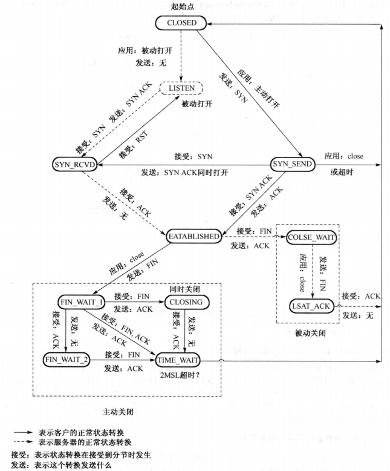

王道程序员求职宝典-第2篇 计算机网络基础

[TOC]

# 1 计算机网络模型

# 2 传输层与Socket基本操作简介

## 2.2 TCP连接的建立和终止

### TCP套接字

### TCP首部字段

### 三次握手建立连接详解

- 客户端的connect在第三次握手的第二次返回，服务器端的accpet在第三次握手的第三次返回

### 四次挥手释放连接详解

- 四次的原因：TCP半关闭。TCP连接是全双工，因此每个方向必须单独地进行关闭
- 一般为四个分组，但：
  - `FIN M`可以随数据一起发生
  - `ACK M+1`和`FIN N`可以一个分组发送
- 主动关闭可能的原因：
  - 进程调用close
  - 进程终止：自愿（调用exit、从main函数返回）、不自愿（进程收到一个终止本进程的信号）

### TCP状态转换图

- 主动关闭的一端进入TIME_WAIT状态

- 存在TIME_WAIT的两个理由：

  - 1.实现终止TCP全双工连接的可靠性：为了处理第四次挥手中ACK的丢失

    - 如果最后的ACK（第四次挥手）丢失，服务器会重发FIN（第三次挥手），因此客户必须维护状态信息以允许它重发最后的ACK（第四次挥手）

    - 如果客户不维护信息，服务器重发的FIN（第三次挥手）会被客户以RST响应，而服务器将RST解释为错误

      ​

      ​