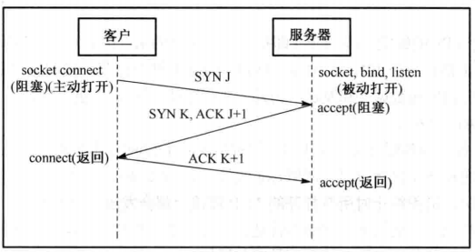
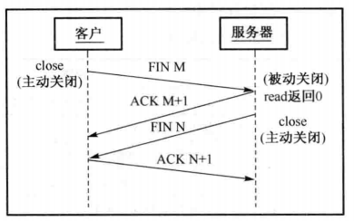
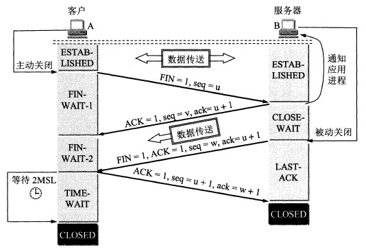
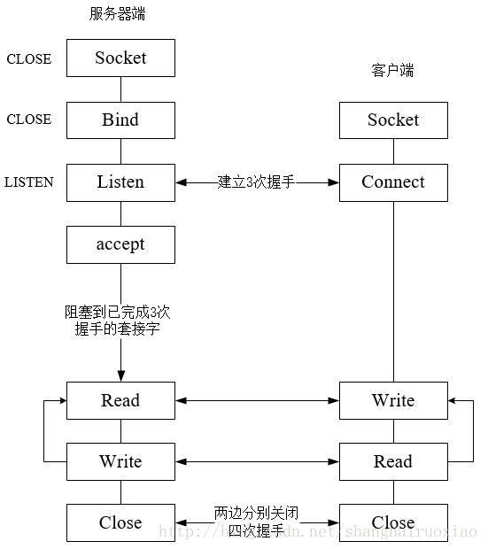
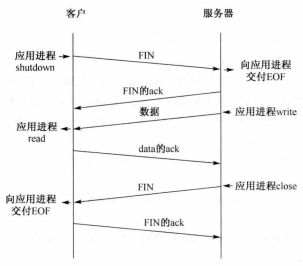
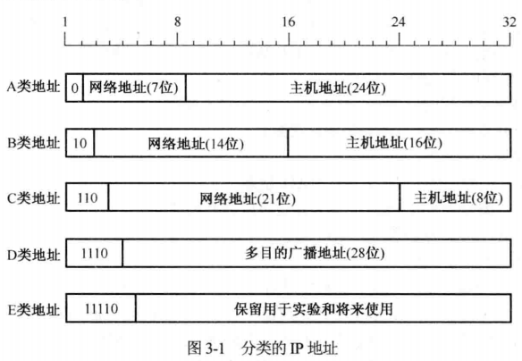

王道程序员求职宝典-第2篇 计算机网络基础

[TOC]

# 1 计算机网络模型


# 2 传输层与Socket基本操作简介

## 2.2 TCP连接的建立和终止

### TCP套接字


### TCP首部字段


### 三次握手建立连接详解



- 客户端的connect在第三次握手的第二次返回，服务器端的accpet在第三次握手的第三次返回

### 四次挥手释放连接详解




- 四次的原因：TCP半关闭。TCP连接是全双工，因此每个方向必须单独地进行关闭
- 发送FIN表示我不再发送数据
- 一般为四个分组，但：
  - `FIN M`可以随数据一起发生
  - `ACK M+1`和`FIN N`可以一个分组发送
- 主动关闭可能的原因：
  - 进程调用close
  - 进程终止：自愿（调用exit、从main函数返回）、不自愿（进程收到一个终止本进程的信号）

### TCP状态转换图




- 1.主动关闭的一端进入TIME_WAIT状态，也叫2MSL状态

- 2.存在TIME_WAIT的两个理由：

  - (1).实现终止TCP全双工连接的可靠性：为了处理第四次挥手中ACK的丢失

    - 如果最后的ACK（第四次挥手）丢失，服务器会重发FIN（第三次挥手），因此客户必须维护状态信息以允许它重发最后的ACK（第四次挥手）

    - 如果客户不维护信息，服务器重发的FIN（第三次挥手）会被客户以RST响应，而服务器将RST解释为错

  - (2).允许老的重复分组在网络中消失

    - 情景：关闭某个连接后，在相同IP地址和端口新建TCP连接，新建的连接称为前一个连接的化身
    - TIME_WAIT就是防止某个连接的老重复分组在连接终止后再现，从而被误解成属于同一个连接的化身
    - 解决方法：不允许处于TIME_WAIT状态的连接启动新的化身
    - MSL：报文最大生存时间
    - 2MSL：因为有两个方向，每个方向的分组最多存活1MSL，因此2MSL保证两个方向上前一个连接的迷失分组消逝

- 3.TCP为何采用三次握手，二次握手可以吗？

  - 三次握手是为了防止失效的连接请求报文段突然又传送到服务器，从而发生错误。
  - 客户端的第一个SYN丢失后，会重发SYN并正确建立连接，但如果第一个SYN并没有丢失只是被延迟了，如果只是二次握手，那么服务器为在此时又为丢失的SYN创建连接资源，并向客户端发送SYN ACK，但没有三次握手，所以客户端不给与理睬，那么服务器就就一直等待客户端发送数据，导致服务器资源浪费
  - 还有就是防止SYN洪泛

- 4.为何采用四次挥手

  - 当某一段收到FIN时，表示对方已经没有数据发送给自己了，但自己可能还有数据需要发送，因此未必会马上关闭socket，可能会先发送一些数据后，再发送FIN表示没有数据发送给对方了。

  - 而针对每个SYN，需要一个ACK。因此总共需要四次。


- 5.四次挥手并不一定需要四个报文段，有三种情况都是三个报文：

    - 情况1：状态图中由`FIN_WAIT_1`直接到`TIME_WAIT`：第三次挥手与第四次挥手可能会合并发送，此时主动关闭的一端发送最后的ACK，并由`FIN_WAIT_1`直接到`TIME_WAIT`
    - 情况2：状态转换图中，客户端由`FIN_WAIT_1`直接到`CLOSED`：服务器与客户端同时调用close函数关闭连接
    - 情况3：主动关闭端的第一个挥手与其最后的数据一起发送


### SOCKET基本操作

- 1.TCP相关函数：参照[面经/计算机网络/#8.TCP客户与服务器模型，用到哪些函数](interview/network/计算机网络.md)

> 1).TCP服务器端

```c
//1.创建套接字
// @domain：协议域，AF_INET、AF_INET6等
// @type:套接字类型，SOCK_STREAM、SOCK_SOCK_DGRAM、SOCK_RAW
// @protocal:指定协议，IPPROTP_TCP、IPPTOTO_UDP、IPPTOTO_SCTP
int socket(int domain,int type,int protocol);
//2.绑定套接字
// @server：一个指向特定于协议的地址结构的指针
int bind(int sockfd, const struct sockaddr * server, socklen_t addrlen);
//3.监听，调用listen后socket创建的“主动套接字”变成“监听套接字”，TCP状态由CLOSE跃迁到LISTEN状态
//有两个队列：未完成队列--->收到第1个SYN包，发送ACK（SYN_RCVD）；已完成队列--->已经完成了3次握手后（ESTABLISHED）
// @backlog：最大连接个数（两个队列连接数之和）
int listen(int sockfd, int backlog);
//4.accept函数,从已完成连接的队列中取走一个套接字,返回值称为“已连接套接字”
// @listenfd：服务器监听套接字
// @client:客户端地址
// @返回值：客户端连接套接字
int accept(int listenfd, struct sockaddr *client, socklen_t * addrlen); 
```

> 2). TCP客户端

```c
//1.创建套接字
int socket(int family,int type,int protocol);
//2连接服务器
// @sockfd:客户端套接字
// @sockaddr：指向套接字地址的结构的指针，服务器地址
int connect(int sockfd, const struct sockaddr * addr, socklen_t addrlen);
```


> 3).数据传输（服务端、客户端）

```c
int write(int sockfd, char *buf, int len);
int read(int sockfd, char *buf, intlen); 　

//TCP专用
ssize_t send(int sockfd, const void *buf, size_t len, int flags); 
ssize_t recv(int sockfd, void *buf, size_t len, int flags); 


```

> 4).关闭（服务端、客户端）

```c++
// @返回值：成功返回0，出错返回-1并设置errno
// 只是将套接字的引用计数减1，当计数为0时才触发TCP客户端向服务器发送终止连接请求
int close(int fd);

// @sockfd:要关闭的套接字
//允许选择以下几种方式关闭
//SHUT_RD:关闭连接的读端，接收缓冲区的数据将被丢弃，不发送FIN
//SHUT_WR:关闭连接的写端，又称为“半关闭”，接收缓冲区的数据将被发送，发送FIN
//SHUT_RDWR：相当于先调用SHUT_RD，再调用SHUT_WR
int shutdown(int sockfd, int howto);
```

> 5).简单的C语言socket编程

- [C语言实现Socket简单通信](https://blog.csdn.net/zhang___yong/article/details/78702559)


> 6).流程图



- 2.TCP半关闭：TCP提供了连接的一端在结束它的发送后还能接收来自另一端数据的能力，称为半关闭，通过调用shutdown实现。

  

- 3.close函数有两个限制，可以通过调用shutdown来避免，限制如下（close与shutdown的区别）：

  - 1).close函数只是把套接字的引用计数减1，当计数为0时才关闭套接字。shutdown函数（参数为SHUT_RDWR或SHUT_WR时）可以不管计数，直接激发TCP正常连接终止序列（四次挥手）。因此在多进程中，shutdown后其他的进程将无法利用此套接字，但close不会影响其他进程
  - 2).close同时终止数据传送的两个方向：读和写。有时候我们需要关闭写但仍然可以继续读，则需要使用shutdown

- 4.TCP为每条连接总共建立了7个定时器：

  - “连接建立（connection establishment）”定时器
  - “重传（retransmission）”定时器
  - “延迟ACK（delayed ACK）”定时器
  - “持续（persis）”定时器
  - “保活（keep live）”定时器
  - FIN_WAIT2定时器
  - TIME_WAIT定时器


# 3.网络层

### IPV4地址编码方式

- 1.IP地址的编码方式有三种：分类的IP地址、子网的划分、CIDR

### 分类的IP地址

- 1.分类的地址分为5类：A、B、C、D、E

- 2.每一类都有：网络号+主机号

  - 网络号：主机所连接到的网络
  - 主机号：主机或路由在该网络中的地址

  

- 3.特殊用途的地址：

  - **主机号**全全为0，表示网络本身
  - **主机号**全为1，表示网络的广播地址
  - `127.0.0.1`，环路自检地址，表示主机本身
  - 32位全为0，`0.0.0.0`，表示整个TCP/IP网络
  - 32位全为1，`255.255.255.255`表示整个TCP/IP网络的广播地址

- 4.在计算主机数时，一般要减2，即主机全为1和主机全为0的情况

### 子网的划分与子网掩码

- 1.分为3类：A、B、C


- 2.各类地址的默认子网掩码：
  - A类：`255.0.0.0`
  - B类：`255.255.0.0`
  - C类：`255.255.255.0`
- 3.使用子网划分时的地址格式：
  - A类：8位+子网X位+主机24-X位
  - B类：16位+子网X位+主机16-X位
  - C类：24位+子网X位+主机8-X位

### 无分类编址CIDR

- 1.CIDR（Classless Inter-Domain Routing）是使用**变长度**子网掩码的基础上消除传统A、B、C类网络划分
- 2.好处：
  - 大幅度提高IP地址空间的利用率
  - 减小路由表大小（与子网数相关）
  - 提高路由转发能力
- 3.CIDR特点：
  - 1).消除传统A、B、C类地址及子网的概念，“网络前缀”代替子网
  - 2).IP地址分为：网络前缀+主机号
  - 3).网络前缀相同的连续的IP地址组成“CIDR地址块”，称为“路由聚合”，或“构成超网”

### NAT

- 1.网络地址转换（NAT）：将专业网络地址（如企业内部网）转换为公用地址（如互联网），从而对外隐藏了内部管理的IP地址
- 2.NAT的好处：
  - 减少了IP地址注册的费用
  - 节省IPv4地址空间
  - 划出了部分IP地址为私有地址
- 3.私有IP地址
  - 私有IP地址不能直接用于Internet，必须通过网关利用NAT把私有地址转换为Internet中合法的全球IP
  - 好处：解决了IP地址不足的问题
  - 私有IP地址网段：
    - `10.0.0.0 ~ 10.255.255.255`
    - `172.16.0.0 ~ 172.31.255.255`
    - `192.168.0.0 ~ 192.168.255.255`
  - 互联网中所有路由器对于私有地址的数据一律不进行转发
- 4.如何使用NAT
  - 在专用网连接到因特网的路由器上安装NAT软件，且该NAT路由器至少有一个有效的外部全球地址
- 5.NAT路由器与普通路由器的区别
  - 普通路由器：
    - 转发数据报时不改变其源IP地址和目的IP地址
    - 工作在网络层
  - NAT路由器：转发IP数据报时，
    - 更换其IP地址（发出时，转换源地址，接收时转换目的地址）
    - 查看和转换传输层的端口
    - 工作在网络层和传输层

### ARP、RARP、ICMP

- 1.ARP（Address Resolution Protocol）：将IP地址映射到MAC地址
  - 每台主机（路由器）都有一个IP地址到MAC地址的映射表，ARP表
- 2.RARP（Reverse ARP）：物理地址到IP地址的转换协议
- 3.ICMP（Internet Control Message Protocol）：使得主机或路由器可以报告差错或异常情况
  - PING命令工作在应用层，利用直接使用网络层的ICMP，没有只是用传输层的TCP或UDP

### IPV6

- 1.地址表示
  - 128位
  - 通常使用冒号十六进表示,每16位用4位十六进制表示（2^4*4 == 16^4），因此分为8段4位十六进制
  - 可以使用零压缩，即一串连续的0可以使用一对冒号取代
    - `DE08:0:0:0:0:0:0:B3`
    - `DE08::B3`
- 2.主要变化：
  - 更大的地址空间
  - 扩展的地址层次结构
  - 灵活的首部格式
  - 改进的选项，可加快分组处理速度
  - 允许协议继续扩充
  - 支持即插即用
  - 支持资源的预分配
  - 增加了安全性（IPV6的关键特征），身份验证和保密验证
  - 分片限制由源点来完成，是端到端的，路由途中的路由器不允许进行分片

# 4.其他

### 4.1 输入URL按下回车后发生了什么？

- 1.浏览器向DNS服务器查询URL对应的IP地址
- 2.DNS返回IP地址
- 3.浏览器打开TCP连接（默认端口80），并向Web服务器发送HTTP请求
- 4.若页面发生跳转，服务器则以一个重定向响应，然后转到`5.`，否则转到`6.`
- 5.浏览器跟随重定向，再次发送HTTP请求
- 6.浏览器处理请求，返回HTTP响应
- 7.浏览器接受请求的页面源码
- 8.浏览器开始渲染HTTP
- 9.浏览器发送嵌入到HTML中的对象请求
- 10.浏览器进一步发送异步（Ajax）请求
- 11.浏览器关闭TCP连接

## 4.2 网络常用测试工具

### ping

- 1.作用：检查网络是否畅通或者网络连接速度
- 2.原理：利用网络上机器IP地址的唯一性，给目标IP发送一个数据包，要去对方返回一个同样大小的数据包以确定是否连通、延时是多少
- 3.用法：`ping www.baidu.com`
- 4.涉及协议：直接使用ICMP（装在IP里），没有TCP、UDP

### tracert

- 1.作用：
  - 确定IP数据包访问目标所采取的路径
  - 检测网络哪个部分出错
- 2.原理：利用IP生存时间字段（TTL）和ICMP错误消息
- 3.用法：
  - `tracetr www.baidu.com`
  - 输出：打印从当前主机到目的主机所经过的路由地址

### telnet

- 1.作用：测试Web服务器某端口是否正常
- 2.输入：`telnet www.baidu.com 80`

### netstat

- 1.作用
  - 监控TCP/IP
  - 显示路由表、实际的网络连接、每个网络接口设备的状态信息
  - 显示IP、TCP、UDP、ICMP相关统计数据
- 2.使用`netstat -an`显示所有连接的端口并用数字表示


