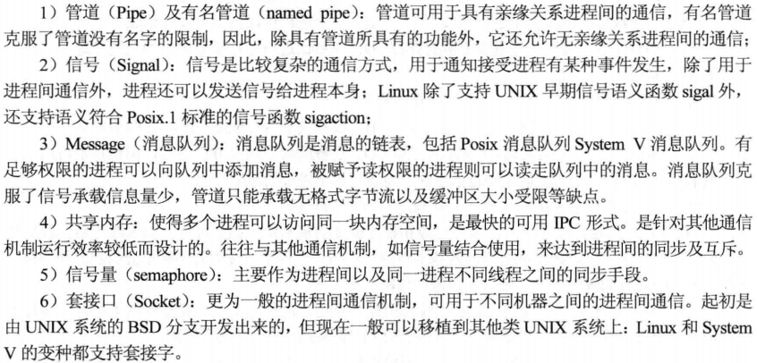

王道程序员求职宝典-第3篇 操作系统基础

[TOC]

# 进程管理

### 1.进程与程序的区别

### 2.fork与循环

- 1.相关题目 P323
- 2.相关博客
  - [当for循环，fork()，printf()相遇时的思考](https://blog.csdn.net/lukas_sun/article/details/71081847)
  - [fork循环](https://blog.csdn.net/alibo2008/article/details/44646411)

### 3.Linux默认情况下，进程做多能打开多少个文件

- 1024

### 4.线程

**进程与线程的区别：**

- 1.调度：

  - 进程是拥有资源的基本单位；线程是独立调度的基本单位
  - 同一进程中，线程的切换不会引起进程的切换；在不同进程之间的线程切换才会引起进程切换
- 2.拥有资源：

  - 进程：拥有资源的基本单元
  - 线程：拥有极少资源，可共享其隶属进程的系统资源
- 3.并发：

  - 进程之间可以并发
  - 同进程的线程间也可以并发，大大提高系统吞吐量
- 4.系统开销

  - 进程：

    - 创建和撤销时：都要分配和回收资源，付出代价较大
    - 切换时：需要保存旧的进程CPU环境，设置新的进程CPU环境

  - 线程：

    - 创建和撤销时：开销小
    - 切换时：只需要保存和设置少量寄存器内容
- 5.地址空间和其他资源
  - 进程：地址空间相互独立
  - 线程：同一进程的各个线程共享进程的资源
- 6.通信
  - 进程间通信：需要借助操作系统
  - 线程间通信：同一进程的线程共享进程的地址空间，可以直接读/写进程数据段（全局变量）

### 5.进程通信与进程同步

- 1.进程通信与同步的目的：

- 2.Linux进程间通信的方法：

- 3.Linux线程间通信的方法：互斥量（Mutex）、信号量（Semaphore）、条件变量

- 4.Windows进程间通信：与Linux相比，少了信号

- 5.Windows线程间通信：临界区（Critical section）、互斥量、信号量、事件（Event）

- 6.临界区与互斥量的区别：

  - 是否跨进程
    - 临界区：只能同步本进程内的线程，不能跨进程的线程
    - 互斥量、信号量、事件跨进程同步
  - 是否内核对象
    - 临界区：非内核对象，用户态进行锁操作，速度快
    - 互斥量：内核对象，内核态进行，速度慢
  - 可用的操作系统
    - Linux：只有互斥量
    - Windows：临界区、互斥量

  ​

### 6.死锁

- 1.死锁的原因
  - 系统资源的竞争
  - 进程推进顺序非法
- 2.死锁产生的必要条件四点，只要其中一点不成立就不会死锁
  - 互斥条件
  - 不剥夺条件
  - 请求和保持条件
  - 循环等待条件
- 3.死锁处理策略
  - 预防死锁：破坏四个必要条件之一
  - 避免死锁：银行家算法
  - 死锁的检测及解除：资源分配图进行描述，并化简该图：
    - 资源剥夺法
    - 撤销进程法
    - 进程回退法

# 内存管理

### 1.Belady异常

- 定义：所分配的物理块数增大而页故障数不减反增的异常现象
- 会出现此异常的页置换算法：FIFO（基于队列的）
- 不会出现此异常的页置换算法：
  - 堆栈类算法，如LRU
  - OPT

### 2.抖动

- 定义：刚刚换出的页面马上又要换入内存，刚刚换入的页面马上又要换出，这种频繁的页面调度行为成为抖动
- 原因：某个进程频繁访问的页面数高于可用的物理页帧数目