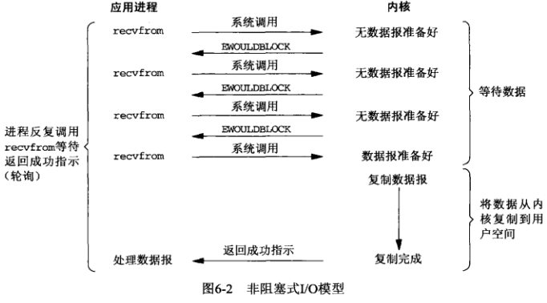
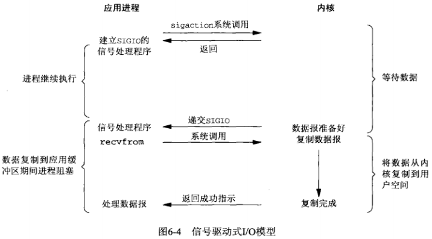

Unix网络编程

[TOC]

# 网络I/0模型

参考：

1. [select/poll/epoll区别](https://segmentfault.com/a/1190000003063859)
2. [几种网络服务器模型的介绍与比较](https://www.ibm.com/developerworks/cn/linux/l-cn-edntwk/index.html?ca=drs-)
3. [epoll为什么这么快](http://www.jianshu.com/p/b5bc204da984)(搞懂这篇文章，关于IO复用的问题就信手拈来了)
4. [网络通信 --> IO多路复用之select、poll、epoll详解](http://www.cnblogs.com/jeakeven/p/5435916.html)


> 1).IO模型

- **五种IO模型：**阻塞IO，非阻塞IO，IO复用，信号驱动式IO，异步IO
- 对于一次IO访问（以read举例），数据会先被拷贝到操作系统内核的缓冲区中，然后才会从操作系统内核的缓冲区拷贝到应用程序的地址空间。所以说，当一个read操作发生时，它会经历两个阶段：
  - 等待数据准备 (Waiting for the data to be ready)：数据拷贝到操作系统内核的缓冲区中
  - 将数据从内核拷贝到进程中 (Copying the data from the kernel to the process)

**1.阻塞式I/O模型**


**2.非阻塞I/O模型**



**3.I/O复用模型**

- select或poll使用的模型


**4.信号驱动式I/O模型**



**5.异步I/O模型**


**各种模型的区别**

- 前4种的区别：第一阶段是否阻塞；他们的第二阶段都是一样的（阻塞）
- 同步（前4种）与异步（第5种）的区别：第二阶段是否阻塞（真正的I/O操作：recvfrom阶段是否阻塞）


> 2).I/O 多路复用之select、poll、epoll详解

- I/O多路复用：一种机制，一个进程可以监视多个描述符，一旦某个描述符就绪（一般是读就绪或者写就绪），能够通知程序进行相应的读写操作
- I/O多路复用与多进程和多线程相比：最大优势是系统开销小，系统不必创建进程/线程，也不必维护这些进程/线程，从而大大减小了系统的开销

**select**

[select函数及fd_set介绍](https://blog.csdn.net/liitlefrogyyh/article/details/52101999)

[select、poll、epoll之间的区别总结[整理\]](http://www.cnblogs.com/Anker/p/3265058.html)

```c
/*
** @n:需要检查的文件描述字个数
** @readfds:用来检查可读性的一组文件描述字
** @writefds:用来检查可写性的一组文件描述字
** @exceptset:用来检查是否有异常条件出现的文件描述字。(注：错误不包括在异常条件之内)
** @timeout:超时，填NULL为阻塞，填0为非阻塞，其他值表示为一段超时时间。可设置超时时间，超时时间到了就跳过代码继续往下执行,用于决定select等待I/o的最长时间。如果为空将一直等待
 fd_set其实这是一个数组的宏定义，实际上是一long类型的数组，每一个数组元素都能与一打开的文件句柄(socket、文件、管道、设备等)建立联系，建立联系的工作由程序员完成，当调用select()时，由内核根据IO状态修改fd_set的内容，由此来通知执行了select()的进程哪个句柄可读
*/
int select (int n, fd_set *readfds, fd_set *writefds, fd_set *exceptfds, struct timeval *timeout);
```

- 基本原理：select 函数监视的文件描述符分3类，分别是writefds、readfds、和exceptfds。调用后select函数会阻塞，直到有描述符就绪（有数据可读、可写、或者有except），或者超时（timeout指定等待时间，如果立即返回设为null即可），函数返回。当select函数返回后，可以通过遍历fdset，来找到就绪的描述符。
- 优点：
  - 几乎在所有的平台上支持，良好跨平台支持
- 缺点：
  - 单个进程能够监视的文件描述符（fd）的数量存在最大限制，由FD_SETSIZE设置，默认值是1024。可以通过修改宏定义甚至重新编译内核的方式提升这一限制，但是这样也会造成效率的降低
  - 对socket进行扫描时是线性扫描，即采用轮询的方法，效率较低
  - 需要维护一个用来存放大量fd的数据结构，这样会使得用户空间和内核空间在传递该结构时复制开销大

**poll**

```c
/*
这个结构中fd表示文件描述符，events表示请求检测的事件，revents表示检测之后返回的事件，如果当某个文件描述符有状态变化时，revents的值就不为空
*/
struct pollfd {
	int fd;
	short events;
	short revents;
};
/*
** @fds:是一个struct pollfd结构类型的数组，用于存放需要检测其状态的Socket描述符；每当调用这个函数之后，系统不会清空这个数组，操作起来比较方便；特别是对于socket连接比较多的情况下，在一定程度上可以提高处理的效率；这一点与select()函数不同，调用select()函数之后，select()函数会清空它所检测的socket描述符集合，导致每次调用select()之前都必须把socket描述符重新加入到待检测的集合中；因此，select()函数适合于只检测一个socket描述符的情况，而poll()函数适合于大量socket描述符的情况。
** @nfds:nfds_t类型的参数，用于标记数组fds中的结构体元素的总数量
** @timeout:是poll函数调用阻塞的时间，单位：毫秒
*/
int poll (struct pollfd *fds, unsigned int nfds, int timeout);
```

- 基本原理：poll本质上和select没有区别，它将用户传入的链表拷贝到内核空间，然后查询每个fd对应的设备状态，如果设备就绪则在设备等待队列中加入一项并继续遍历，如果遍历完所有fd后没有发现就绪设备，则挂起当前进程，直到设备就绪或者主动超时，被唤醒后它又要再次遍历fd。这个过程经历了多次无谓的遍历
- 优点：
  - 它没有最大连接数的限制，原因是它是基于链表来存储的
- 缺点：
  - 大量的fd的链表被整体复制于用户态和内核地址空间之间，而不管这样的复制是不是有意义
  - poll还有一个特点是“水平触发”，如果报告了fd后，没有被处理，那么下次poll时会再次报告该fd
- poll与select的共同点：
  - 都需要在返回后，通过遍历文件描述符来获取已经就绪的socket。事实上，同时连接的大量客户端在一时刻可能只有很少的处于就绪状态，因此随着监视的描述符数量的增长，其效率也会线性下降
- poll与select的不同点
  - fd文件描述符集合的大小限制
  - 调用函数时是否清空fd文件描述符集合

**epoll**

```c
int epoll_create(int size)；//创建一个epoll的句柄，size用来告诉内核这个监听的数目一共有多大
int epoll_ctl(int epfd, int op, int fd, struct epoll_event *event)；
int epoll_wait(int epfd, struct epoll_event * events, int maxevents, int timeout);
```

- 基本原理：epoll支持水平触发和边缘触发，最大的特点在于边缘触发，它只告诉进程哪些fd刚刚变为就绪态，并且只会通知一次。还有一个特点是，epoll使用“事件”的就绪通知方式，通过epoll_ctl注册fd，一旦该fd就绪，内核就会采用类似callback的回调机制来激活该fd，epoll_wait便可以收到通知
- 优点：
  - 没有最大并发连接的限制，能打开的FD的上限远大于1024（1G的内存上能监听约10万个端口）
  - 效率提升，不是轮询的方式，不会随着FD数目的增加效率下降。只有活跃可用的FD才会调用callback函数；即Epoll最大的优点就在于它只管你“活跃”的连接，而跟连接总数无关，因此在实际的网络环境中，Epoll的效率就会远远高于select和poll
  - 内存拷贝，利用mmap()文件映射内存加速与内核空间的消息传递；即epoll使用mmap减少复制开销
- 工作模式：
  - 水平触发（LT（level trigger））：当epoll_wait检测到描述符事件发生并将此事件通知应用程序，应用程序可以不立即处理该事件。下次调用epoll_wait时，会再次响应应用程序并通知此事件
    - 缺省模式
    - 支持block和no-block socket
  - 边缘触发（ET（edge trigger））：当epoll_wait检测到描述符事件发生并将此事件通知应用程序，应用程序必须立即处理该事件。如果不处理，下次调用epoll_wait时，不会再次响应应用程序并通知此事件
    - 高速工作方式，效率要比LT模式高
    - 只支持no-block socket
- epoll与select/poll的区别：
  - 在select/poll中，进程只有在调用一定的方法后，内核才对所有监视的文件描述符进行扫描
  - epoll事先通过`epoll_ctl()`来注册一个文件描述符，一旦基于某个文件描述符就绪时，内核会采用类似callback的回调机制，迅速激活这个文件描述符，当进程调用`epoll_wait()`时便得到通知（此处去掉了遍历文件描述符，而是通过监听回调的的机制。这正是epoll的魅力所在）
- 注意：如果没有大量的idle-connection或者dead-connection，epoll的效率并不会比select/poll高很多，但是当遇到大量的idle-connection，就会发现epoll的效率大大高于select/poll

**总结：select、poll、epoll区别**

- 1.支持一个进程所能打开的最大连接数
  - select使用的是指针指向的long数组，位图
  - poll使用的是pollfd链表


- 2.FD剧增后带来的IO效率问题


- 3.消息传递方式
  - select每次调用时清空文件描述符集合，但poll不清空


**如何选择，需要结合场景和自身特点**

- 在连接数少并且连接都十分活跃的情况下：select和poll的性能可能比epoll好，因为epoll的通知机制需要很多函数回调

**另一版本：select、poll、epoll区别**

**select：**是最初解决IO阻塞问题的方法。用结构体fd_set来告诉内核监听多个文件描述符，该结构体被称为描述符集。由数组来维持哪些描述符被置位了。对结构体的操作封装在三个宏定义中。通过轮寻来查找是否有描述符要被处理，如果没有返回
存在的问题： 

- 1.内置数组的形式使得select的最大文件数受限与FD_SIZE
- 每次调用select前都要重新初始化描述符集，将fd从用户态拷贝到内核态，每次调用select后，都需要将fd从内核态拷贝到用户态
- 3.轮寻排查当文件描述符个数很多时，效率很低

**poll：**通过一个可变长度的数组解决了select文件描述符受限的问题。数组中元素是结构体，该结构体保存描述符的信息，每增加一个文件描述符就向数组中加入一个结构体，结构体只需要拷贝一次到内核态。poll解决了select重复初始化的问题。轮寻排查的问题未解决。

**epoll：**轮寻排查所有文件描述符的效率不高，使服务器并发能力受限。因此，epoll采用只返回状态发生变化的文件描述符，便解决了轮寻的瓶颈。 

>  3).为什么使用IO多路复用，最主要的原因是什么？ 

可达到在同一个线程内同时处理多个IO请求的目的。而在同步阻塞模型中，必须通过多线程的方式才能达到这个目的

>  4).epoll有两种触发模式？这两种触发模式有什么区别？编程的时候有什么区别？ 

epoll有EPOLLLT和EPOLLET两种触发模式，LT是默认的模式，ET是“高速”模式。LT模式下，只要这个fd还有数据可读，每次 epoll_wait都会返回它的事件，提醒用户程序去操作，而在ET（边缘触发）模式中，它只会提示一次，直到下次再有数据流入之前都不会再提示了，无论fd中是否还有数据可读。所以在ET模式下，read一个fd的时候一定要把它的buffer读光，也就是说一直读到read的返回值小于请求值，或者遇到EAGAIN错误