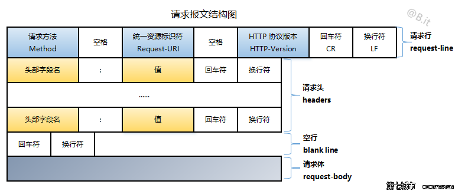
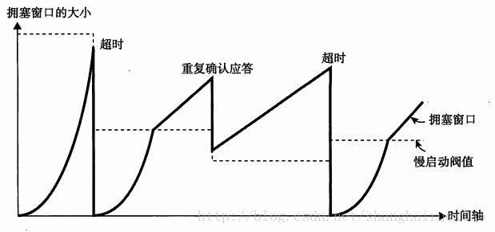
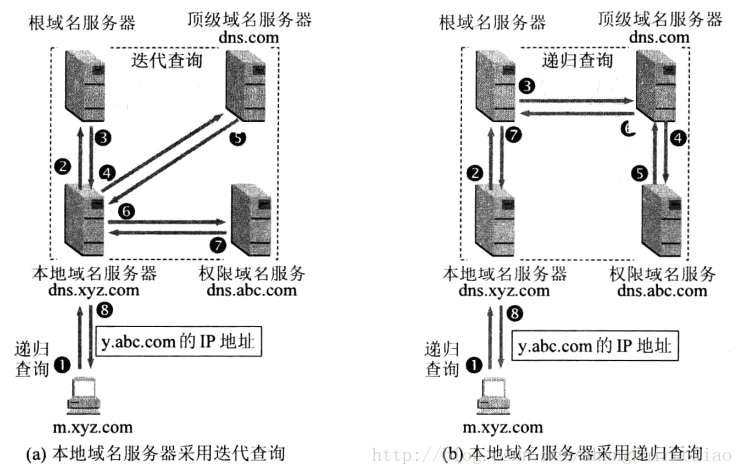
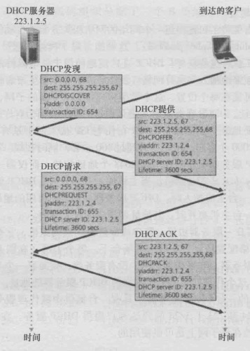
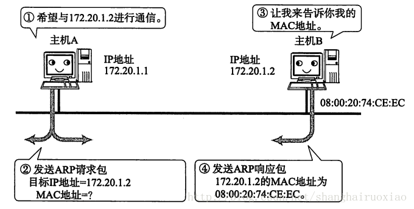

计算机网络

[TOC]

# 应用层

## 1.HTTP

[Awesome HTTP](https://github.com/semlinker/awesome-http#bs-%E7%BB%93%E6%9E%84%E5%AE%9A%E4%B9%89)

> 1).http/https 1.0、1.1、2.0

**(1).http的主要特点:** 

- 简单快速：只需要请求路径和请求方法
- 灵活：任意格式的数据对象
- 无连接：无连接的含义是限制每次连接只处理一个请求。服务器处理完客户的请求，并收到客户的应答后，即断开连接，采用这种方式可以节省传输时间。(当今多数服务器支持Keep-Alive功能，使用服务器支持长连接，解决无连接的问题)
- 无状态：没有记忆功能。（使用 cookie 机制可以保持 session，解决无状态的问题）

**(2).http1.1的特点**

- 默认持久连接:一直保持连接，可以发送多次HTTP请求 
- 管线化:同时发出多个HTTP请求，而不用一个个等待响应
- 断点续传

**(3).[http2.0的特点](http://www.cnblogs.com/frankyou/p/6145485.html)**

- 采用二进制格式而非文本格式
- 完全多路复用，只需一个HTTP连接就可以实现多个请求响应 
- 报头压缩
- 服务器可以将响应主动“推送”到客户端缓存中

**(4).get/post 区别**

一：用途

get重点在从服务器上获取资源，post重点在向服务器发送数据。

二：数据存放方式

get传输数据是通过URL请求，以`field（字段）= value`的形式，置于URL后，并用"?"连接，多个请求数据间用"&"连接，如`http://127.0.0.1/Test/login.action?name=admin&password=admin`，这个过程用户是可见的；

post传输数据通过Http的post机制，将字段与对应值封存在请求实体中（表单）发送给服务器，这个过程对用户是不可见的。

三：数据量和效率

Get传输的数据量小，因为受URL长度限制，但效率较高；

Post可以传输大量数据，所以上传文件时只能用Post方式。

四：安全

get是不安全的，因为URL是可见的，可能会泄露私密信息，如密码等；

post较get安全性较高。

**(5).返回状态码**

一：2XX 成功

```
200 OK：请求成功，信息包含在返回的响应报文中
```

二：3XX 重定向

```
301 Moved Permanently：请求的对象已经被永久转移了，新的URL定义在响应报文的Location首部中。客户机软件自动用新的URL获取对象
```

四：4XX 客户端错误

```
400 Bad Request：请求不能被服务器理解
403 Forbidden：服务器收到请求，但是拒绝提供服务。服务器通常会在响应报文中给出不提供服务的原因
404 Not Found：被请求的文档不在服务器上
```

五：5XX 服务器错误

```
505 HTTP Version Not Supported：服务器不支持请求报文使用的HTTP协议版本
```

**(6).http 协议头相关**

一、HTTP请求报文

- 请求行
- 请求头
- 空行
- 请求体




二、HTTP响应报文

- 状态行
- 响应头
- 空行
- 响应体


**(7).https与http的区别？如何实现加密传输？**

- HTTP协议传输的数据都是未加密的，也就是明文的，不安全，HTTPS协议是由SSL+HTTP协议构建的可进行加密传输、身份认证的网络协议，要比http协议安全。（SSL：Secure Sockets Layer）
- 具体区别：
  - 费用不同：https协议需要到ca申请证书，一般免费证书较少，因而需要一定费用
  - 传输加密：http是超文本传输协议，信息是明文传输，https则是具有安全性的ssl加密传输协议
  - 连接方式和端口：http和https使用的是完全不同的连接方式，用的端口也不一样，前者是80，后者是443
  - 协议复杂度：http的连接很简单，是无状态的；HTTPS协议是由SSL+HTTP协议构建的可进行加密传输、身份认证的网络协议，比http协议安全

[HTTP与HTTPS的区别](http://www.cnblogs.com/wqhwe/p/5407468.html)

**(8).浏览器中输入一个URL发生什么，用到哪些协议？**

[详细过程](https://github.com/guanjunjian/Interview-Summary/blob/master/notes/network/Computer-Networking-Top-Down.md#57-%E5%9B%9E%E9%A1%BE-web-%E9%A1%B5%E9%9D%A2%E8%AF%B7%E6%B1%82%E7%9A%84%E5%8E%86%E7%A8%8B)

- 浏览器中输入URL
- 浏览器将URL解析为IP地址，使用DNS（基于UDP），得到IP地址
  - 查询DNS缓存
  - 如果没有，给本地DNS发送查询请求
  - 本地DNS服务器使用：递归查询或迭代查询
- 与服务器建立一个http连接
  - 生成一个get请求报文（如果采用https还会先对http数据进行加密）
  - 将该报文传给TCP层
  - 将HTTP数据包分片，分片依据路径MTU和MSS
  - 发送给IP层
  - IP层通过路由选路，一跳一跳发送到目的地址
  	 网段内的寻址、IP地址的物理地址（ARP）	 	

# 运输层

## 1.为什么还要有传输层

- IP协议提供的是不可靠的传输协议
- IP协议只是将数据发送到了目标主机，没有实现由哪个应用程序来

## 2.TCP与UDP的区别

[TCP/IP(5)--TCP与UDP](https://blog.csdn.net/shanghairuoxiao/article/details/68927070)

> 1).特征区别

-	a.TCP基于有连接，UDP基于无连接
		b.TCP能保证可靠传输，UDP不能保证可靠传输
		c.TCP结构复杂，消耗资源多，建立过程较慢较复杂。UDP结构简单，消耗资源少，建立过程较快
		d.TCP基于流模式，UDP是数据报模式
		e.TCP连接只能是点到点（因为要建立连接），而UDP可以一对一，一对多或者多对多，因此广播和多播只能采用UDP数据报的方式
		f.TCP有确认，重传，拥塞控制机制，UDP在没有建立连接或者对方已经退出的情况下任然会继续发送数据，导致通信流量的浪费

> 2).场景区别

- tcp场景：用于实现可靠传输的情况，文件非常重要，对网络拥堵有较高要求的情况。如：电子邮件（SMTP）、远程终端访问(Telnet)、Web（HTTP）、文件传输（FTP）
- udp场景：
  - a.用于高速传输和实时性较高的场合（即时通信）
  - b.包总量较少的通信（DNS）
  - c.广播通信，例如：ARP、路由选择协议（RIP）、域名服务器（DNS）
- TCP、UDP都可以的场景：
  - 流式多媒体或因特网络电话可能使用TCP或UDP

> 3).首部区别

参考[TCP/IP(5)--TCP与UDP](https://blog.csdn.net/shanghairuoxiao/article/details/68927070)

UDP首部长度：8字节

TCP首都长度：20字节

IP首部长度：20字节

## 3.如何实现可靠的UDP 

由上层应用实现消息重传以实现UDP的可靠性。

采用消息重传的时候有两种方式，一种是发送者发起，另一种是接收者发起。

对于发送者发起的方式，一般情况下接收者会发送一个消息包的确认。发送者维护一个计时器并重传那些在某个确定的时间段里没有收到确认的消息包。这一类型的协议容易引起发送者溢出，因为要确认每一个发送的消息包。这种溢出现象被称为发送者（或者ACK）内爆。

对于接收者发起的方式，通信双方的接收者负责错误检测。在这个方式里，序列号被用于检测消息包丢失。当检测到消息包丢失，接收者请求发送者重传消息包。采用这种方法，如果消息包没有到达任何一个接收者，发送者容易因NACK溢出。这会引起发送者的负载过高和过多的重传。这种现像被称为NACK内爆。

## 4.TCP三次握手与四次挥手

[TCP/IP(6)--TCP协议详解](https://blog.csdn.net/shanghairuoxiao/article/details/68927100)

[《计算机网络——自顶向下方法 5.3》---arking](https://github.com/arkingc/note)


> 1).握手的目的：获取通信双方的原点序列号，建立连接。

> 2).握手为什么不是2次：

-	a.丢失无法确认
		b.防止SYN洪泛攻击

> 3).握手为什么不是4次？

如果是4次，那么会是：

-	(1).A发送SYN，SYN + A's Initial sequence number 
		(2).命名 B's ACK sequence number,B发送ACK
		(3).B发送SYN，SYN + B's Initial sequence number 
		(4).命名 A's ACK sequence number，A发送ACK

而这里(2)、(3)可以合并

> 4).2MSL是什么状态？作用是什么？

[TIME_WAIT状态原理](http://elf8848.iteye.com/blog/1739571)

TIME_WAIT状态。

MSL：Maximum Segment Lifetime，报文最大生存时间。

作用：

主动关闭端：A；被动关闭端B

-	(1).可靠地实现TCP全双工连接的终止:如果最后的ACK丢失，B重发FIN，因此A必须TIME_WAIT，在此期间可以重发ACK
		(2).允许老的重复分节在网络中消逝:如果第二个FIN发生重发，B也接收到了重发的ACK，则B关闭B的连接。但如果A没有TIME_WAIT，A与B立即又使用相同的端口重建了连接，“新连接”就有可能会收到“旧连接”中A发送的迷失的ACK。而2MSL的TIME_WAIT就是为了让迷失的ACK消逝。

## 5.经受时延的确认应答和Nagle算法

**经受时延的确认应答**：为了降低确认应答包的数量，TCP提出了经受时延的确认应答。接受端在收到数据后并不立即发送一个应答数据包，而是等待一段时间，如果有新的数据被接受就更新应答号，如果有其他数据要发送就坐上该数据包的顺风车。在系统的内核中维持了一个定时器，一般是200ms如果定时器溢出，即使没有其他数据到达，也发送该应答数据包。

**Nagle算法**：TCP是基于流的传输协议，在Rlogin和Telnet传输中会出现只有一个字节数据的TCP数据包。而一个TCP数据包的首部加上IP首部就有40个字节，很显然发这样的数据包划不来。为了减少这样的数据包，有人提出了Nagle算法。

Nagle算法简单讲就是，等待服务器应答包到达后，再发送下一个数据包。数据在发送端被缓存，如果缓存到达指定大小就将其发送，或者上一个数据的应答包到达，将缓存区一次性全部发送。

Nagle算法是从发送端角度考虑减少了数据包的个数，时延应答从接收端角度考虑减少了数据包的个数。

## 6.TCP可靠传输

《计算机网络 自顶向下》 3.5.4 P163

> 1).超时间隔

发生超时时，超时间隔翻倍，如果收到“上层应用的数据”和“收到ACK”中的任意一个计时器重新启动时，超时间隔由估计值（EstimatedRTT）和估计误差值（DevRtt）计算。

> 2).接收端发生ACK有几种情况

-	(1).期望报文段，且期望段之前的数据都已确认--->延迟ACK
		(2).期望报文段,且已经有一个延迟ACK--->立即发送单个累积ACK
		(3).比期望报文段大的失序报文段--->发送冗余ACK，即期待报文段ACK
		(4).能部分或填充接收间隔的报文段--->立即发送ACK

> 3).TCP可靠传输的机制

```
int NextSeqNum = InitialSeqNum
int SendBase = InitialSequNum

while(true)
{
	switch(event)
	{
		case:"收到上层应用的数据"

			使用NextSeqNum创建TCP报文段；	
			if(计时器未启动)
				启动计时器;
			将报文段传给网络层;
			NextSeqNum = NextSeqNum + 报文段长度;
			break;

		case:"超时"
			重传未确定的最小序号报文段;
			重启计时器;
			break;

		case:"收到ACK报文段，该ACK序号为y"

			if( y > SendBase )
			{
				//累积确认
				SendBase = y;
				if(还有未确认的报文段)
					重启计时器;
			}else
			{
				//收到已经确认过的报文段y的冗余ACK，即一共收到了4次时（1次确认收到，3次冗余）就发生快速重传
				冗余ACK数[y]++;
				if( 冗余ACK数[y]==3)
					重传y报文段;
			}
			break;
	}	
}
```

> 4).是GBN还是选择重传

-   发送端：
    -   只有一个定时器
    -   仅维护已发送但未被确认的字节的最小序号（SendBase）和下一个要发送但未被确认的字节的最小序号（NextSeqNum）
    -   有累积确认
-   接收端：
    -   缓存乱序分组，维护一个接收窗口，rcv_base 和窗口长度 N
    -   乱序分组到达时，若分组序号在接收窗口内，返回期待报文序号的ACK（冗余ACK）
-   重传时：
    -   发生条件：超时或 3 个冗余 ACK（即总 4 个 ACK）
    -   因为有累积确认，若 1，2，……，N 中只有 n（n<N）未确认，发生超时时，只重传 n
    -   超时加倍，但一旦受到一个 SampleRTT，就将超时设为`TimeoutInterval=EstimatedRTT+4*DevRTT`

TCP 可靠数据传输是 GBN 和选择重传的结合

## 7.TCP拥塞控制

[TCP/IP(6)--TCP协议详解](https://blog.csdn.net/shanghairuoxiao/article/details/68927100)


> 1).拥塞控制基本概念

(1).判定拥塞出现的条件：出现分组丢失（发生超时或收到重复确认）

-	3次冗余ACK(第一次冗余是第二次收到相同ACK时，所以一共4次)
		超时

(2).拥塞避免算法中用到了:慢启动、快速重传、快速恢复

(3).拥塞避免算法需要维持两个变量：拥塞窗口和慢启动阀值

(4).LastByteSent - LastByteAcked <= min{CongWin,RcvWindow}

> 3).慢启动

慢启动的增长模式：

-	条件：新的 ACK 到达
		{ cwnd = cwnd + MSS, dupACKcount = 0, 如果条件允许，传送新报文段 }

> 4).拥塞避免

拥塞避免的增长模式：

-	条件：新的 ACK 到达
		{ cwnd = cwnd + MSS * ( MSS / cwnd ), dupACKcount = 0, 如果条件允许，传送新报文段 }


> 5).拥塞控制算法：

先采用慢启动算法，到达慢启动阀值后采用拥塞避免算法。

慢启动阶段1：

-	1).通信开始时，发送方的拥塞窗口大小为1MSS。每收到1个ACK确认后，拥塞窗口大小加1MSS。
		2).出现确认包**超时**，发生拥塞
		3).设置“慢启动阈值”，值为前拥塞窗口大小的一半
		4).拥塞窗口大小设置为1MSS,重新进入慢启动过程

慢启动阶段2：

-	5).由于现在“慢启动阈值”已经存在，当拥塞窗口大小达到阈值后，停止使用慢启动算法，开始采用拥塞避免算法。

拥塞避免阶段：

有可能出现两种情况:

情况一：收到三次重复确认应答--->进入“快速恢复”阶段:

-	将“慢启动阈值”设置为当前拥塞窗口大小的一半
		拥塞窗口大小设置成阈值大小
		采用拥塞避免算法增加窗口大小，即cwnd = cwnd + MSS * ( MSS / cwnd )

情况二：发生超时

-	“慢启动阈值”设置为当前拥塞窗口的一半
		拥塞窗口设置为1MSS




## 8.TCP客户与服务器模型，用到哪些函数

[TCP/IP(7)-TCP Server与TCP Client(linux套接字)](https://blog.csdn.net/shanghairuoxiao/article/details/69803044)

> 1).TCP服务器端

```c
//1.创建套接字
// @domain：协议域，AF_INET、AF_INET6等
// @type:套接字类型，SOCK_STREAM、SOCK_SOCK_DGRAM、SOCK_RAW
// @protocal:指定协议，IPPROTP_TCP、IPPTOTO_UDP、IPPTOTO_SCTP
int socket(int domain,int type,int protocol);
//2.绑定套接字
// @server：一个指向特定于协议的地址结构的指针
int bind(int sockfd, const struct sockaddr * server, socklen_t addrlen);
//3.监听，调用listen后socket创建的“主动套接字”变成“监听套接字”，TCP状态由CLOSE跃迁到LISTEN状态
//有两个队列：未完成队列--->收到第1个SYN包，发送ACK（SYN_RCVD）；已完成队列--->已经完成了3次握手后（ESTABLISHED）
// @backlog：最大连接个数（两个队列连接数之和）
int listen(int sockfd, int backlog);
//4.accept函数,从已完成连接的队列中取走一个套接字,返回值称为“已连接套接字”
// @listenfd：服务器监听套接字
// @client:客户端地址
// @返回值：客户端连接套接字
int accept(int listenfd, struct sockaddr *client, socklen_t * addrlen); 
```

> 2). TCP客户端

```c
//1.创建套接字
int socket(int family,int type,int protocol);
//2连接服务器
// @sockfd:客户端套接字
// @sockaddr：指向套接字地址的结构的指针，服务器地址
int connect(int sockfd, const struct sockaddr * addr, socklen_t addrlen);
```


> 3).数据传输（服务端、客户端）

```c
int write(int sockfd, char *buf, int len);
int read(int sockfd, char *buf, intlen); 　

//TCP专用
ssize_t send(int sockfd, const void *buf, size_t len, int flags); 
ssize_t recv(int sockfd, void *buf, size_t len, int flags); 


```

> 4).关闭（服务端、客户端）

```c++
// @返回值：成功返回0，出错返回-1并设置errno
// 只是将套接字的引用计数减1，当计数为0时才触发TCP客户端向服务器发送终止连接请求
int close(int fd);

// @sockfd:要关闭的套接字
//允许选择以下几种方式关闭
//SHUT_RD:关闭连接的读端，接收缓冲区的数据将被丢弃，不发送FIN
//SHUT_WR:关闭连接的写端，又称为“半关闭”，接收缓冲区的数据将被发送，发送FIN
//SHUT_RDWR：相当于先调用SHUT_RD，再调用SHUT_WR
int shutdown(int sockfd, int howto);
```


> 5).流程图


## 9.UDP客户与服务器模型，用到哪些函数

[TCP/IP(8)-UDP Server与UDP Client(linux套接字)](https://blog.csdn.net/shanghairuoxiao/article/details/69951345)

> 1.套接字创建（服务器、客户端）

```c
//1.创建套接字，与TCP相同
sockfd = socket(AF_INET, SOCK_DGRAM, 0);
```

> 2.UDP服务器

```c
//1.绑定服务器地址到套接字上
int bind(int sockfd, const struct sockaddr *addr, socklen_t addrlen);
```

> 3.数据传输（服务器、客户端）

```c
//1.发送数据给指定地址
ssize_t sendto(int sockfd, const void *buf, size_t len, int flags, const struct sockaddr *dest_addr, socklen_t addrlen);
//2.接收数据
ssize_t recvfrom(int sockfd, void *buf, size_t len, int flags, struct sockaddr *src_addr, socklen_t *addrlen);
```


> 4).流程图


# 网络层

## 1.DNS

DNS(Domain Name System，域名系统)，基于UDP

> 1).域名的层次

- 顶级域名：表示国家：cn、us；表示通途：edu（教育）、com（商用）
- 二级域名：注册域名的机构，如cn之下，还有edu、com
- 三级域名：如大学：pku
- 四级域名


> 2).域名服务器与本地域名服务器

域名系统由域名服务器来维护。**本地域名服务器**与域名服务器不是一类东西。本地域名服务器是提供给一个网络或几个网络的主机来查询域名用的，他并没有维护域名与IP地址的对应关系。本地域名服务器分布在各个地方，离主机一般不超过几个路由。本地域名服务器中保存了根域名服务器的地址，如果需要查询的域名不在高速缓存中，就向根域名发送DNS查询数据报。

> 3).查询方式

递归查询和迭代查询

> 4).查询过程




## 2.DHCP

每个子网拥有一台DHCP服务器或用于该网络的一台DHCP服务器地址的DHCP中继代理（通常是一台路由器）

> 1).提供的服务

- 为主机分配IP地址
- 获取子网掩码
- 获取第一跳路由器地址（常称为默认网关）
- 提供本地DNS服务器的地址（记录在/etc/resolv.conf文件中）

> 2).过程

1. **DHCP服务器发现**：新到的客户端在67号端口使用UDP广播(255.255.255.255)**DHCP发现报文**，源地址为0.0.0.0
2. **DHCP服务器提供**：子网中收到DHCP请求报文的DHCP服务器使用**DHCP提供报文**作出响应，提供IP地址、网络掩码、IP地址租用期(通常设置为几个小时或几天)
3. **DHCP请求**：客户端从多个服务器的响应中选择一个，并用一个**DHCP请求报文**对选中的服务器进行响应，回显配置参数
4. **DHCP ACK**：服务器用**DHCP ACK报文**对DHCP请求报文进行响应，证实所要求的参数



## 3.ICMP

> 1).用途

用于主机和路由器彼此交互网络层信息

- 差错报告
- 源抑制
- 拥塞控制

> 2).与IP的关系

ICMP通常被认为是IP的一部分，但从体系结构上讲，它是位于IP之上，因为ICMP报文承载在IP分组中，作为IP有效载荷。

> 3).Traceroute

用途：获得到达目的主机的路由路径

过程：允许用户跟踪从一台主机到世界上任意一台其他主机之间的路由，使用ICMP报文实现。发送一系列不可达UDP端口号的UDP报文段，每个报文段封装后的数据报TTL字段逐1递增，TTL为n的数据报到达第n跳路由器时，由于TTL过期，路由器会生成ICMP报文响应，由此可以获得第n跳路由器的IP和名字，当一个数据报最终到达目的主机时，由于UDP端口不可达，目的主机生成一个ICMP报文，指示此错误信息，从而Traceroute知道不需要再发送探测分组了，因此获得了到达目的主机的所有路由数量、标识以及RTT

# 链路层

## 1.ARP

> 1).ARP

作用：通过ARP（Address Resolution Protocol，地址解析协议）请求包就可以获得目的IP地址的mac地址。

请求过程：

- (1).源主机以广播的形式，发送一个ARP请求包
- (2).所有与源主机在直连的主机都会收到一个请求包
- (3).目的IP地址的主机收到这个请求后，发送一个ARP应答，告诉源主机自己的mac地址



优化：为了减少ARP的请求次数，在主机和路由中存在一个ARP的缓存表，这张表中保存了最近用到的IP地址与mac地址的对应关系。

> 2).RARP

RARP（Reverse ARP，反向地址转换协议）用于无盘服务器，开机后通过发送RARP包给RARP服务器，通过mac地址得到IP地址

# 安全相关

至少了解攻击的原理和基本的防御方法，常见的攻击方法有一下几种：

## 1.SQL注入

## 2.XSS

## 3.CSRF

## 4.SYN洪水攻击

## 5.APR欺骗


