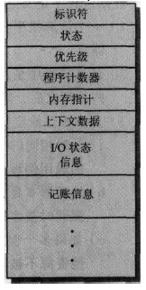

操作系统

[TOC]

# 进程与线程

参考：[进程与线程](http://blog.csdn.net/shanghairuoxiao/article/details/74012512)

## 1.进程与线程区别？

- 进程是资源分配的基本单位，线程是CPU调度的最小单位
- 进程有独立的地址空间，而同一进程中的线程共享该进程的地址空间

  - 进程拥有：代码段、堆栈段和数据段
  - 线程拥有：寄存器和堆栈（线程栈）
- 线程之间的通信比较方便：

  - 进程通信：进程通信的方式

  - 线程通信：使用同一进程下的共享数据通信。在一个线程中分配的堆在各个线程中均可以使用，在一个线程中打开的文件各个线程均可用，当然指同一进程中的线程
- 多进程比多线程程序要健壮：一个线程死掉整个进程就死掉了，但是在保护模式下，一个进程死掉对另一个进程没有直接影响。
- 线程的执行与进程是有区别的：每个独立的进程有有自己的一个程序入口，顺序执行序列和程序的出口，但是线程不能独立执行，必须依附与程序之中，由应用程序提供多个线程的并发控制
- linux中进程具有父子关系，形成进程树，但是线程是平等的没有父子关系

进程控制块：

## 2.多进程程序与多线程程序区别，优缺点，使用场合？

- 多进程程序：一个进程崩溃不会影响其他进程，但是进程之间的切换和通信代价较大

- 多线程程序：一个线程崩溃会导致整个进程死掉，其他线程也不能正常工作，但是线程之前数据共享和通信更加方便

- 进程需要开辟独立的地址空间，多进程对资源的消耗很大，而线程则是“轻量级进程”，对资源的消耗更小，对于大并发的情况，只有线程加上IO复用技术才能适应

**场景：**
- 频繁交互数据的、频繁的对同一个对象进行不同的处理--->多线程
- 并发编程、不需要很多数据交互--->多进程

## 3.进程之间的通信

1).通信需要解决的问题：数据传递、关键部位不会交叉、顺序。

2).进程间通信适用于线程，但是有一个不同的地方，进程间交换数据是在不同的地址空间进行，但是线程是在同一个地址空间进行，只要知道数据的地址，都可以很方便的访问。

3).七种进程间通信方式：

- **信号量**：信号量用于实现进程间的互斥与同步，而不是用于存储进程间通信数据
- **管道( pipe )**：管道是一种半双工的通信方式，数据只能单向流动，而且只能在具有亲缘关系的进程间使用。进程的亲缘关系通常是指父子进程关系
- **命名管道 (named pipe)** ： 有名管道也是半双工的通信方式，但是它允许无亲缘关系进程间的通信
- **消息队列( message queue )** ： 消息队列是由消息的链表，存放在内核中并由消息队列标识符标识。消息队列克服了信号传递信息少、管道只能承载无格式字节流以及缓冲区大小受限等缺点
- **信号 ( sinal )** ： 信号是一种比较复杂的通信方式，用于通知接收进程某个事件已经发生
- **共享内存( shared memory )** ：共享内存就是映射一段能被其他进程所访问的内存，这段共享内存由一个进程创建，但多个进程都可以访问。共享内存是最快的 **IPC** 方式，它是针对其他进程间通信方式运行效率低而专门设计的。它往往与其他通信机制，如信号两，配合使用，来实现进程间的同步和通信。
- **套接字( socket )** ： 套解口也是一种进程间通信机制，与其他通信机制不同的是，它可用于不同及其间的进程通信

4).管道（匿名管道）与命名管道的区别:匿名管道只能在具有公共祖先的两个进程间使用

5).**共享文件映射mmap**  //TODO

mmap建立进程空间到文件的映射，在建立的时候并不直接将文件拷贝到物理内存，同样采用缺页终端。mmap映射一个具体的文件可以实现任意进程间共享内存，映射一个匿名文件，可以实现父子进程间共享内存

6).**常见的信号**

- SIGINT：终止进程，中断进程
- SIGKILL：终止进程，杀死进程，不能被捕获
- SIGTERM：终止进程，软件终止信号，可以被捕获
- SIGSEGV：建立CORE文件，段非法错误
- SIGCHLD：忽略信号，当子进程停止或退出时通知父进程

## 4.进程和线程(POSIX)的系统调用

| 进程原语 | 线程原语       | 描述                       |
| -------- | -------------- | -------------------------- |
| fork     | pthread_create | 创建线程或进程             |
| waitpid  | pthread_join   | 获取线程进程或线程退出状态 |
| getpid   | pthread_self   | 获取进程ID或线程ID         |
| exit     | pthread_exit   | 退出进程或线程             |

## 5.进程状态转换

挂起：内存--->外存

激活：外存--->内存

## 6.互斥和同步