# 深度探索C++对象模型 笔记

<!-- GFM-TOC -->
* [第1章 关于对象](#第1章-关于对象)
    * [1.1 C++对象模型](#11-c++对象模型)
    * [1.3 对象的差异](#13-对象的差异)
        * [1.3.1 指针的类型](#131-指针的类型)
        * [1.3.2 加上多态之后](#132-加上多态之后)
* [第2章 构造函数语意学](#第2章-构造函数语意学)
    * [2.1 默认构造函数的构造操作](#21-默认构造函数的构造操作)
        * [1.该类中有类成员，且该类成员有默认构造函数](#1该类中有类成员，且该类成员有默认构造函数)
        * [2.该类继承于有默认构造函数的基类](#2该类继承于有默认构造函数的基类)
        * [3.该类有虚功能（虚函数或虚基类）](#3该类有虚功能虚函数或虚基类)
        * [总结](#总结)
    * [2.2 拷贝构造函数的操作](#22-拷贝构造函数的操作)
    * [2.3 程序转化语意学](#23-程序转化语意学)
        * [2.3.1 显示的初始化操作](#231-显示的初始化操作)
        * [2.3.2 参数的初始化](#232-参数的初始化)
        * [2.3.3 返回值的初始化](#233-返回值的初始化)
        * [2.3.4 在使用者层面做优化](#234-在使用者层面做优化)
        * [2.3.5 在编译器层面做优化](#235-在编译器层面做优化)
        * [2.3.6 拷贝构造函数：要还是不要](#236-拷贝构造函数要还是不要)
    * [2.4 成员们的初始化队列（初始化列表）](#24-成员们的初始化队列初始化列表)
* [第3章 Data语意学](#第3章-data语意学)
    * [3.1 数据成员的绑定](#31-数据成员的绑定)
    * [3.2 数据成员的布局](#32-数据成员的布局)
    * [3.3数据成员的存取](#33数据成员的存取)
        * [3.3.1 静态数据成员](#331-静态数据成员)
        * [3.3.2 非静态数据成员](#332-非静态数据成员)
    * [3.4 继承与数据成员](#34-继承与数据成员)
        * [3.4.1 单一继承且不含虚函数](#341-单一继承且不含虚函数)
        * [3.4.2 单一继承并含虚函数](#342-单一继承并含虚函数)
        * [3.4.3 多重继承](#343-多重继承)
        * [3.4.4 虚继承](#344-虚继承)
    * [3.6 指向数据成员的指针](#36-指向数据成员的指针)
* [第4章 函数语意学](#第4章-函数语意学)
    * [4.1 成员的各种调用方式](#41-成员的各种调用方式)
        * [4.1.1 非静态成员函数](#411-非静态成员函数)
        * [4.1.2 虚成员函数](#412-虚成员函数)
        * [4.1.3 静态成员函数](#413-静态成员函数)
    * [4.2 虚成员函数](#42-虚成员函数)
        * [4.2.1 单继承下的虚函数](#421-单继承下的虚函数)
        * [4.2.2 多重继承下的虚函数](#422-多重继承下的虚函数)
        * [4.2.3 虚继承下的虚函数](#423-虚继承下的虚函数)
    * [4.4 指向成员函数的指针](#44-指向成员函数的指针)
        * [4.4.1 支持“指向虚成员函数”的指针](#441-支持“指向虚成员函数”的指针)
        * [4.4.2 多重继承下，指向成员函数的指针](#442-多重继承下，指向成员函数的指针)
    * [4.5 lnline函数](#45-lnline函数)
        * [4.5.1 形式参数](#451-形式参数)
        * [4.5.2 局部变量](#452-局部变量)
* [第5章 构造、析构、拷贝语意学](#第5章-构造析构拷贝语意学)
    * [5.1 “无继承”情况下的对象构造](#51-“无继承”情况下的对象构造)
        * [5.1.1 抽象数据类型](#511-抽象数据类型)
        * [5.1.2 为继承做准备(虚函数的引入)](#512-为继承做准备虚函数的引入)
    * [5.2 继承体系下的对象构造](#52-继承体系下的对象构造)
        * [5.2.1 虚继承](#521-虚继承)
        * [5.2.2 虚函数表指针初始化语意](#522-虚函数表指针初始化语意)
    * [5.3 对象复制语意学](#53-对象复制语意学)
    * [5.5 析构语意学](#55-析构语意学)
* [第6章 执行期语意学](#第6章-执行期语意学)
    * [6.1 对象的构造和析构](#61-对象的构造和析构)
        * [6.1.1 全局对象](#611-全局对象)
        * [6.1.2 局部静态对象](#612-局部静态对象)
        * [6.1.3 对象数组](#613-对象数组)
    * [6.2 new和delete运算符](#62-new和delete运算符)
        * [6.2.1 new](#621-new)
        * [6.2.2 delete](#622-delete)
        * [6.2.3 operator new](#623-operator-new)
        * [6.2.4 operator delete](#624-operator-delete)
        * [6.2.5 针对数组的new语意](#625-针对数组的new语意)
    * [6.2.6 Placement Operator new的语意](#626-placement-operator-new的语意)
    * [6.3 临时性对象](#63-临时性对象)
* [第7章 站在对象模型的尖端](#第7章-站在对象模型的尖端)
    * [7.1 模板](#71-模板)
        * [7.1.1 模板的实例化行为](#711-模板的实例化行为)
        * [7.1.2 模板的错误报告](#712-模板的错误报告)
        * [7.1.3 模版中的名称决议法](#713-模版中的名称决议法)
        * [7.1.4 成员函数的实例化行为](#714-成员函数的实例化行为)
    * [7.2 异常处理](#72-异常处理)
        * [7.2.1 异常处理快速检阅](#721-异常处理快速检阅)
        * [7.2.2 对异常处理的支持](#722-对异常处理的支持)
        * [7.2.3 当一个实际对象在程序执行时被抛出发生的事情](#723-当一个实际对象在程序执行时被抛出发生的事情)
    * [7.3 执行期类型识别RTTI](#73-执行期类型识别rtti)
        * [7.3.1 保证安全的向下转换操作](#731-保证安全的向下转换操作)
        * [7.3.2 保证安全的动态转换（dynamic_cast）](#732-保证安全的动态转换dynamic_cast)
        * [7.3.3 Typeid运算符](#733-typeid运算符)
<!-- GFM-TOC -->

# 第1章 关于对象

## 1.1 C++对象模型

成员分类：

数据成员：static、non-static

成员函数：static、non-static、virtual

```c++
class Point {
public:
    Point( float xval );
    virtual ~Point();
    
    float x() const;
    static int PointCount();

protected:
	virtual ostream& print( ostream &os ) const;  
    
    float _x;
    static int _point_count;
};
```


每个类有一堆指向虚函数的指针，存放在表格中，这个表格称为**虚函数表**（vtbl），虚函数表的第一个slot中存放的是type_info，用于动态绑定时的类型识别。

该模型的优点：空间和存取时间的效率高

该模型的缺点：；类对象的非静态数据成员改变，需要重新编译

成员、函数放置的位置：

- 在类对象中的：
  - 1.non-static数据成员在每个类对象中
  - 2.虚基指针（vtbl）：如果有虚继承的话，在3.4节深入讨论
  - 2.虚函数指针（vptr）：指向类的虚函数表，设定和重置由类的构造函数、析构函数和拷贝赋值运算符自动完成
- 在对象之外的
  - 非虚函数：包括static、non-static
  - 静态数据成员

## 1.3 对象的差异

C++的多态只存在于一个个的public class继承体系中

**C++以以下方法支持多态：**

- 1.经由一组隐式的转化操作：把一个派生类的指针转化为一个指向public继承的基类指针
  - `shape *ps = new circle();`
- 2.经由虚函数机制
  - `ps->rotate();`
- 3.经由dynamic_cast和typeid运算符
  - `if( circle *pc = dynamic_cast<circle*>( ps ) )...`

多态的主要用途：经由一个共同的接口来影响类的封装

**sizeof一个类对象时需要考虑的部分：**

- 1.其non-static数据成员的总和
- 2.对齐导致填补的空间
- 3.支持虚函数和虚基类的指针

**类对象的布局：**

```c++
class ZooAnimal{
public:
    ZooAnimal();
    virtual ~ZooAnimal();
    virtual void rotate();
    
protected:
    int loc;
    string name;
};

ZooAnimal za( "Zoey" );
ZooAnimal *pza = &za;
```

za和pza的可能布局（注意string类型，string所存字符串长度与sizeof(对象)无关）：


如果string的布局是按图所示，则sizeof(za)==sizeof(ZooAnimal)==16字节（4+8+4）

- 但自己VS上测试的结果不一致
  - sizeof(stirng)==28
  - sizeof(za)==sizeof(ZooAnimal)==28+4+4==36

### 1.3.1 指针的类型

“指针类型”作用：告诉编译器如何解释某个特定地址中的内存内容及其大小

### 1.3.2 加上多态之后

```c++
class bear : public ZoonAnimal {
public:
    Bear();
    ~Bear();
    void rotate();
    virtual void dance();
protected:
    enum Dance {...};
    
    Dance dances_know;
    int cell_block;
};

Bear b("Yogi");
Bear *pd = &b;
Bear &rb = *pb;
```

- 注意enum类型的布局


```c++
Bear b;
ZooAnimal *pz = &b;
Bear *pb = &b;
```

**pz与pb的区别是：**

- pb所涵盖的地址包含整个Bear对象
- pz所涵盖的地址只包含Bear对象中的ZooAnimal子对象
- 不能通过pz来处理Bear的任何members，例外：虚函数


# 第2章 构造函数语意学

## 2.1 默认构造函数的构造操作

会自动合成默认构造函数的情况

### 1.该类中有类成员，且该类成员有默认构造函数

因为：该类需要调用类成员的默认构造函数来初始化类成员，因此必须生成一个该类的默认构造函数，但该类的默认构造函数不会初始化该类的其他没有默认构造函数的类成员或内置类型成员

**其他相关知识点：**

- 1). 如果一个类A内含一个或一个以上的类成员对象，那么由程序员显示定义的构造函数即使没有显示调用类成员对象的构造函数，A的显示声明的构造函数也会隐式地调用类成员的默认构造函数（这些隐式调用在初始化列表执行之前发生）
- 2). 如1).中的情况，如果有多个类成员，那么调用它们默认构造函数的顺序与声明顺序一致。

```c++
//1) 2)例子
class Dopey { public: Dopey(); ... };
class Sneezy { public: Sneezy( int ); Sneezy(); ... };
class Bashful { public: Bashful(); ... };

class Snow_White {
public:
    Dopey dopey;
    Sneezy sneezy;
    Bashful bashful;
private:
    int mumble;
};

//Snow_White的显示构造函数
Snow_White::Snow_White : sneezy(1024)
{
    mumble = 1024;
}

//Snow_White的显示构造函数实际上会发生
Snow_White::Snow_White : sneezy(1024)
{
    dopey.Dopey::Dopey();
    sneezy.Sneezy::Sneezy(1024);
    bashful.Bashful::Bashful();
    
    mumble = 1024;
}
```

### 2.该类继承于有默认构造函数的基类

原因：该类需要调用基类的默认构造函数，因此会编译器会为其合成一个默认构造函数。如果有多个基类，调用顺序与基类顺序一致

相关知识点：

- 1). 如果该类声明了别的构造函数，但没有默认构造函数，别的构造函数会隐式地调用基类的默认构造函数。此时不会合成默认构造函数
- 2). 如果同时存在有默认构造函数的基类和有默认构造函数的类成员对象，那么先调用基类的默认构造函数，再调用类成员对象的默认构造函数

### 3.该类有虚功能（虚函数或虚基类）

有虚功能的情况：

- 1). 类声明（或基层）了一个虚函数
- 2). 类派生自一个继承串链，其中有一个或多个虚基类

原因：该类需要默认构造函数为每个对象初始化虚函数表指针和虚基类指针

相关知识点：

- 1). 如果该类有程序员定义的显示构造函数，这些构造函数会隐式完成虚函数指针和虚基类指针的初始化工作

### 总结

- 1.除了以上提出的3种情况（实际上是4种），编译器不会为一个类合成默认构造函数
- 2.在合成的默认构造函数中，只有有默认构造函数的基类的子对象和有默认构造函数的类成员对象会被初始化，其他非静态成员都不会被初始化（包括整数、整数指针、整数数组等）
- 3.常见误解：
  - 任何class如果没有定义默认构造函数，都会被合成一个（错误！）
  - 合成的默认构造函数会显示设定类内每一个数据成员的默认值（错误！）

## 2.2 拷贝构造函数的操作

以一个类对象作为另一个对象的初值的情况有三种：

- 1.对一个对象显示的初始化操作：`X xx = x;`
- 2.对象被当做参数交给某个函数：`foo(xx);`
- 3.函数传回一个类对象：`X foo(){ X xx; return xx; }`

上述三种情况，会导致构造函数的调用，有可能发生以下三种情况：

- 一个临时类对象的产生
- 导致程序代码的脱变
- 或以上两种都有

**bitwise copy semantics**：位逐次拷贝语意

**bitwise copy**：将源对象中的成员变量中的每一位赋值到目标对象中。例如指针类型，只将源对象的指针中所存放的地址复制到目标指针的地址中，它们指向的其实是同一块内存地址空间。这会出现重复释放同一内存空间等问题

如果类中出现了**位逐次拷贝语意**，默认构造函数和默认拷贝构造函数就不会被合成，此时类的产生由**位逐次拷贝**完成

不展现**位逐次拷贝语意**的情况（与默认构造函数的情况是一样的）：

- 1.当类包含一个成员对象，该成员对象拥有一个拷贝构造函数（显示声明的拷贝构造函数或编译器合成的拷贝构造函数都可以）
  - 当前类合成的拷贝构造函数会自动调用该成员对象的拷贝构造函数
- 2.当class继承自一个基类，而该基类拥有一个拷贝构造函数（显示或合成）
  - 当前类合成的拷贝构造函数会自动调用该基类的拷贝构造函数
- 3.拥有虚功能时
  - 该类声明了一个或多个虚函数
    - 需要重新设定虚函数表的指针
  - 该类派生自一个继承串链，其中有一个或多个虚基类
    - 需要处理虚基类子对象


**重新设定虚函数表的指针**

当一个类声明了一个或多个虚函数，编译器会有如下操作：

- 1.为这个类增加一个虚函数表，表中含有每一个有作用的虚函数的地址
- 2.生成一个该类对象时，每个对象都有一个指向1.中虚函数表的指针

因为当一个类有虚函数、类对象有虚函数表指针时，编译器需要为其初始化，因此这样的类不再有“位逐次拷贝语意”，因此编译器需要合成一个拷贝构造函数

如果在有虚函数的情况下

- 当一个类对象以其派生类的某个对象作为初值时，使用“位逐次拷贝”，会出错
- 当一个类对象用另一个该类对象作为初值时，使用“位逐次拷贝”，不会出错
- 因此，问题只存在于“当一个类对象以其派生类的某个对象作为初值时”

有虚函数的情况下，使用“位逐次拷贝”和合成拷贝构造函数的区别：

- 位逐次拷贝方式：franny的虚函数表指针指向yogi所属类Bear的虚函数表
- 合成拷贝构造函数方式：franny虚函数表指针指向franny所属类ZooAnimal的虚函数表

```c++
//Bear继承自ZooAnimal
Bear yogi;
ZooAnimal franny = yogi; //这里会发生切割行为
```


**处理虚基类子对象**

有虚基类的情况下，当一个类对象以其派生类的某个对象作为初值时，使用“位逐次拷贝”，会出错。

例如：


```c++
RedPanda little_red;
Raccon little_critter = litter_red;
```

在这种情况下，为了完成正确的little_critter初值设定，编译器必须合成一个拷贝构造函数

合成构造函数需要做的：

- 1.设定虚基类指针/偏移量
- 2.对每一个成员指向不要的成员初始化操作
- 3.其他内存相关工作（3.4章节有关于虚基类有更详细的讨论）

当使用基类指针所指向的对象给基类对象赋值时，编译器无法知道“位逐次拷贝语意”是否还保持着，因为它无法知道基类指针是指向一个派生类对象还是基类对象，这种情况下，位逐次拷贝可能够用，可能不够**用**

```c++
//位逐次拷贝可能够用，可能不够用
Raccoon *ptr;
Raccoon little_critle = *ptr;
```

## 2.3 程序转化语意学

### 2.3.1 显示的初始化操作

显示初始化时，必要的程序转化有两个阶段：

- 1.定义（是指“占用内存”的行为）
- 2.调用拷贝构造函数

例如：

```c++
X x0;

void foo_bar() {
	X x1( x0 );
    X x2 = x0;
    X x3 = X( x0 );
}

//编译器的行为
void foo_bar() {
    //定义阶段
    X x1;
    X x2;
    X x3;

	//调用拷贝构造函数阶段
    x1.X::X( x0 );
    x2.X::X( x0 );
    x3.X::X( x0 );
}
```

### 2.3.2 参数的初始化

实现方式有两种：

- 方式一：
  - 1.以拷贝构造函数生成一个临时变量
  - 2.函数以引用的方式使用临时变量
  - 3.函数完成时，析构临时变量
- 方式二（拷贝建构）：
  - 1.实际参数直接建构在其应该的位置上，此位置视函数活动范围的不同，记录于程序堆栈中
  - 2.在函数返回之前，析构该参数

第一种方式的具体表现如下：

```c++
void foo( X x0 );
X xx = arg;
foo( xx );

//编译器的行为
X __temp0;
__temp0.X::X( xx );
void foo( X& x0 );
foo( __temp0 );
```

### 2.3.3 返回值的初始化

函数的返回值处理分为两个阶段：

- 1.加上一个额外参数，类型是类对象的引用，这个参数用来放置被“拷贝建构”而得的返回值
- 2.在return指令之前插入拷贝构造函数调用，拷贝生成上述引用的值

```c++
X bar()
{
    X xx;
    return xx;
}

//编译器的行为
void bar( X& __result )
{
    X xx;
    xx.X::X();
    
    //调用拷贝构造函数
    __result.X::XX( xx );
    
    return ;
}
```

因此，下面的行为都会变为：

```c++
//例子1：
X xx = bar();
//编译器的行为
X xx;
bar( xx );

//例子2
bar().memfunc();
//编译器的行为
X __temp0;
( bar(__temp0), __temp0 ).memfunc();

//例子3
X (*pf)(); //函数指针
pf = bar;
//编译器的行为
void (*pf)( X& );
pf = bar;
```

### 2.3.4 在使用者层面做优化

```c++
X bar( const T &y, const T &z )
{
    X xx; //调用X的默认构造函数
    //...以y和z来处理xx
    return xx； //这里会调用X的构造函数
}
//编译器的行为
void bar( X &__result )
{
    X xx;
    xx.X::X(); //调用默认构造函数
    //...以y和z来处理xx
    __result.X::X( xx ); //调用拷贝构造函数
    return;
}


//使用者优化后，只调用一次构造函数，效率更高
X bar( const T &y, const T &z )
{
    return X( y, z )； //这里调用X的两个参数的构造函数，而省略了调用构造函数的步骤
}
//编译器的行为
void bar( X &__result )
{
    __result.X::X( y, z );
    return;
}
```

### 2.3.5 在编译器层面做优化

NRV优化，即Named Return Value，具体优化过程如下：

```c++
X bar()
{
    X xx;
    //...处理xx
    return xx;
}
//优化前
void bar( X &__result )
{
    X xx;
    xx.X::X(); //调用默认构造函数
    //...处理xx
    __result.X::X( xx ); //调用拷贝构造函数
    return;
}
//NRV优化后
void bar( X &__result )
{
    //以__result直接调用默认构造函数
    __result.X::X();
    //...直接处理__result
    
    return;
}
```

NRV优化的必备条件：类有拷贝构造函数

NRV优化的受争议的点：

- 1.优化由编译器默默完成，它是否真的被完成，不清楚
- 2.一旦函数变得复杂，优化就变得难以施行（cfront会只有top level时才进行NRV优化，如果有嵌套的局部块返回语句，则不进行NRV优化）
- 3.某些程序员不喜欢应用程序被优化

会出现的问题：拷贝静态/全局变量时应如何处理

```c++
Thing outer; //全局变量
//代码块，局部区域
{
    //inner应该从outer拷贝过来，还是直接只用outer而忽略inner
    Thing inner( outer ); 
}
```

### 2.3.6 拷贝构造函数：要还是不要

如果有大量的数据成员初始化操作，而你又想编译器为你做NRV优化，则可以显示声明一个inline的拷贝构造函数，以激活编译器的NRV优化

另一个需要注意的问题：在拷贝构造函数中使用memcpy和memset时，不能有该类不能有虚功能，否则会出错

```c++
Point3d::Point3d( const Point3d &rhs )
{
    memcpy( this, &rhs, sizeof(Point3d) );
}

//如果Point3d有虚功能，例如虚函数，则编译器的行为是
Point3d::Point3d()
{
    //vptr必须在使用者的代码之前先设定妥当
    vptr_Point3d = vtbl_Point3d;
    //vptr可能被设置为其他不合适的值，例如实际传入的是一个Point3d的派生类的对象
    memcpy( this, &rhs, sizeof(Point3d) );
}
```

## 2.4 成员们的初始化队列（初始化列表）

必须在初始化列表进行初始化的数据成员：

- 1.初始化一个引用成员时
- 2.初始化一个const成员时（但static const只能在类初始化，不能在初始化列表初始化）
- 3.调用一个基类的构造函数，而它拥有一组参数时（即调用基类的非默认构造函数）
  - 因为如果不在初始化列表调用想要调用的基类非默认构造函数，初始化列表会自动调用基类的默认构造函数
- 4.调用一个类成员对象的构造函数，而它拥有一组参数时（即调用类成员对象的非默认构造函数）
  - 因为如果不在初始化列表调用想要调用的类成员对象非默认构造函数，初始化列表会自动调用类成员对象的默认构造函数


**注意：**

- 1.对于类成员对象，最好在初始化列表初始化。
  - 初始化列表初始化，只有一步：
    - 调用对应的构造函数初始化类对象
  - 在函数体中初始化，效率不高，会执行以下几步：
    - 调用类成员的默认构造函数（初始化列表阶段时调用）
    - 创建临时变量
    - 使用类对象的赋值拷贝运算符，将临时变量赋值给类对象
    - 析构临时变量
- 2.初始化列表阶段，类成员的初始化顺序由声明顺序决定

```c++
//错误
class X{
    int i;
    int j;
public:
    X ( int val ): j(val),i(j){}
}
//正确
class X{
    int i;
    int j;
public:
    //在初始化列表阶段，若类对象在局部变量，i会初始化为0，否则，i不初始化
    //在这里，先执行初始化列表阶段，对i的行为是不确定的，但j会初始化为val
    //接着，执行i=j
    X ( int val ): j(val){
    	i = j;
    }
}
```

- 3.是否可以在构造函数中调用某个成员函数对数据成员进行初始化
  - 答案：可以，但最好是在函数体初始化是调用，而不要在初始化列表中调用，因为此时this还没初始化完全
- 4.在派生类的初始化列表中，调用基类的构造函数，使用派生类的成员函数返回值作为参数。
  - 最好不要这样做，因为this完成初始化


# 第3章 Data语意学

```c++
//书上的说法
class X { }; //sizeof(X)==1
class Y : public virtual X { }; //sizeof(Y)==8，因为虚指针+Y的空1byte+3bytes对齐
class Z : public virtual X { }; //sizeof(Z)==8，因为虚指针+Y的空1byte+3bytes对齐
class A : public Y, public Z { }; //sizeof(A)==12，因为虚指针*2+X的空1byte+3bytes对齐

//但在我自己的VS上测试的sizeof有所不同
class X { }; //sizeof(X)==1
class Y : public virtual X { }; //sizeof(Y)==4
class Z : public virtual X { }; //sizeof(Z)==4
class Test : public Y, public Z { }; //sizeof(A)==8

//VS中A的布局
1>class Test	size(8):
1>	    +---
1> 0	| +--- (base class Y)
1> 0	| | {vbptr}
1>	    | +---
1> 4	| +--- (base class Z)
1> 4	| | {vbptr}
1>	    | +---
1>	    +---
1>	    +--- (virtual base X)
1>	    +---
1>
1>       Test::$vbtable@Y@:
1> 0	| 0
1> 1	| 8 (Testd(Y+0)X)
1>
1>       Test::$vbtable@Z@:
1> 0	| 0
1> 1	| 4 (Testd(Z+0)X)
1>vbi:	   class  offset o.vbptr  o.vbte fVtorDisp
1>               X       8       0       4 0
```

sizeof(X)为1，因为它有一个隐藏的1byte大小，那是被编译器安插进去的一个char，这使得该类的两个对象得以在内存中配置独一无二的地址

**一个类的大小（sizeof一个类或该类的对象），与一下几个因素相关**

- 1.语言本身造成的负担，如由虚函数、虚基类造成的虚函数指针和虚基指针
  - 虚基类的实现：
    - 虚基指针指向在该派生类中虚基类的子对象的起始位置
    - 虚基指针指向一个相关表格，表格中存放的是虚基类子对象的地址，或在该派生类对象上的偏移量（一般来说，在派生类对象的尾部）
- 2.编译器对于特殊情况提供的优化处理，例如：
  - 派生类本身也是空类，此时又虚继承于一个空类，由于派生类已经有一个4字节的指针，因此因自身空类产生的1字节就有能被优化掉（因为既然有成员了（虚基指针），就不需要安插一个char了）

**优化前**

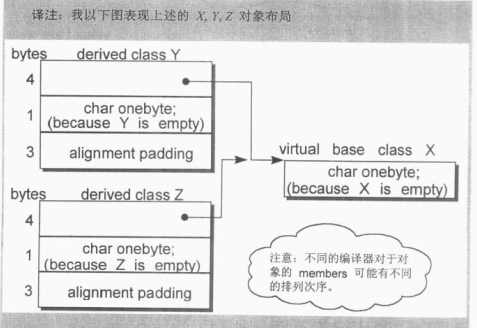

**优化后**

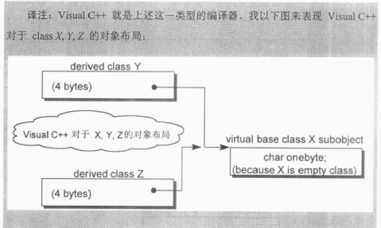

**在我的VS测试的结果**

```c++
class A {};
class Test : virtual public A {};

int main()
{
    cout<<sizeof(Test)<<endl; //输出为4
    return 0;
}

//内存分布输出为：
1>class Test	size(4):
1>	    +---
1> 0	| {vbptr}
1>	    +---
1>	    +--- (virtual base A)
1>	    +---
1>
1>       Test::$vbtable@:
1> 0	| 0
1> 1	| 4 (Testd(Test+0)A)
1>vbi:	   class  offset o.vbptr  o.vbte fVtorDisp
1>               A       4       0       4 0
```

- 3.对齐
- 4.其他非静态数据成员的大小

## 3.1 数据成员的绑定

**类成员的inline成员函数的数据成员绑定：**

- 1.函数体中的变量值的解析工作，在类声明完成之后才会进行
- 2.函数的参数列表中名称的解析工作，在出现参数列表代码的时候就开始进行

```c++
typedef int length;
int _val = 10;

class Point3d
{
public:
    //length为int，被解析为global，即::length
    // _val被解析为Point3d::_val;
    void mumble( length val ) { _val = val; }

private:
    typedef float length;
    //length被解析为float，即Point3d::length
    length _val;
};
```

为了避免2.中的情况，可以使用“防御性程序风格”

- a.把所有数据成员放在class声明起头处，以确保正确的绑定

除了a.之外，还有别的“防御性程序风格”，但这对解决上面2.的问题没有帮助

- b.把所有的inline functions，不管大小，都放在class声明之外

## 3.2 数据成员的布局

**非静态数据成员：**在每个类对象中的排序顺序与被声明的相对顺序一致，但不一定是连续的，介于两个数据成员之间的有可能是：

- 1.因对齐产生的字节
- 2.因虚功能产生的指针（虚函数指针、虚基类指针）
  - 虚指针的位置：
    - 传统：所有显示声明的成员的最好
    - 现在：每个对象的最前端

**静态数据成员：**存放在程序的静态/全局变量区，与类对象无关

**访问控制区域（acesss section）：**

- 1.指的是由public、private、protected声明的区域
- 2.区域内部的变量是按声明顺序进行存放的
- 3.区域之间并不保证与声明顺序一致，但区域之间，一般来说是连在一起，并按顺序存放的
- 4.区域个数的多少，不会影响类对象所占的空间

## 3.3数据成员的存取

### 3.3.1 静态数据成员

静态成员（数据成员、成员函数）的存取效率：使用对象和使用指针来访问静态成员，实际上都是通过`::`来访问

静态成员（数据成员、成员函数）的继承：静态成员可以被继承

- 1.继承的静态成员函数，派生类调用该函数时，是基类的实现版本
- 2.继承的静态数据成员，派生类与基类指向的是同一块数据，作为引用计数时要小心

### 3.3.2 非静态数据成员

```c++
//origin是类Point3d的一个对象
origin._y = 0.0;

//编译器的行为，&origin._y实际上等于
&origin + (&Point3d::y - 1);
//(&Point3d::y - 1)   为y的偏移位置
```

注意这里的-1，指向数据成员的指针，它的offset总是被加上1，目的是，用于区分：

- 1.一个指向数据成员的指针，用以指出类的第一个成员
- 2.一个指向数据成员的指针，没有指向任何成员（3.6节详细讲）

每个非静态成员的偏移位置在编译时期就可获知，即使该成员是基类的子对象的成员

**存取效率的比较：**

- 1.非虚继承，存取基类数据成员和派生类定义的数据成员的效率是一样的
- 2.虚继承，效率会比非虚继承慢，因为需要经过虚基指针寻址

**通过对象和指针访问数据成员的区别**

- 1.访问静态数据成员：没区别，都是通过`::`来访问，都是编译时确定
- 2.访问非静态数据成员
  - 1.无继承：没区别，都是编译时确定
  - 2.非虚继承：没区别，都是编译时确定
  - 3.虚继承：有区别
    - 指针访问：运行时访问，因为编译期间无法确定虚基指针，需要在运行时根据虚基指针间接导引获得
    - 对象访问：编译时确定

## 3.4 继承与数据成员

下面分四个部分讨论

- 1.单一继承且不含虚函数（只要继承不要多态）
- 2.单一继承并含虚函数（加上多态）
- 3.多重继承
- 4.虚继承

所有的讨论基于这样的一个例子：


### 3.4.1 单一继承且不含虚函数

非虚继承不会增加空间和存取效率上的额外负担

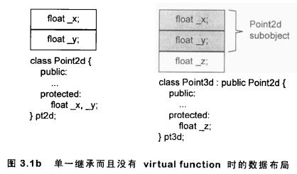

但因为“对齐”，使用非虚继承还是会导致空间上的负担：

**不使用继承时：**

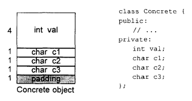

对象的大小为8bytes（4+1+1+1+对齐的1）

**使用非虚继承后**


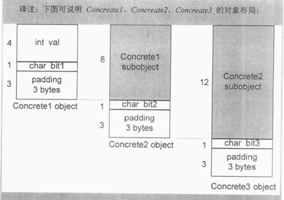

Concrete1为8bytes（4+1+对齐的3）

Concrete2为12bytes（Concrete1的8+1+对齐的3）

Concrete3为16bytes（Concrete2的12+1+对齐的3）

**在继承的子对象直接要保证对齐的目的：**

基类与派生类相互赋值的行为将会出错，如图所示，如果没有子对象之间的对齐，Concrete1对象赋值给Concrete2对象时，将会出错

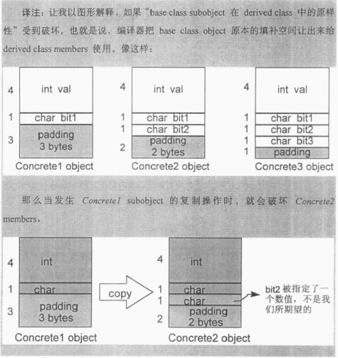

### 3.4.2 单一继承并含虚函数

 单一继承并含虚函数带来的额外负担有：

- 1.为每个类维护一个虚函数表，该表的slot个数一般为虚函数个数+一或两（用于存放runtime type identification，如type_info）
- 2.为每个该类的对象导入一个虚函数表指针vptr，提供运行时的链接
- 3.加强构造函数，使构造函数在构造对象时能为vptr设定初值，让对应类的虚函数表
- 4.加强析构函数，需要析构虚函数表指针

**虚函数表指针的位置：**

- 1.类对象的尾端（例如cfron编译器）
  - 好处：可以保留基类C struct的对象布局，因而允许在C程序代码中也能使用（基类C struct中没有虚函数）


- 2.类对象的头部
  - 好处：在多重继承下，通过指向类成员的指针调用虚函数更方便
  - 坏处：
    - 不能保留基类C struct的对象布局（基类C struct中没有虚函数）
    - 由派生类对象取址赋值给基类的指针时，需要编译器调整地址


```c++
//上面例子的代码
struct no_virts {
	int d1;
	int d2;
};

class has_vrts : public no_virts {
public:
	virtual void foo();
private:
	int d3;
};

//使用VS打印的结果如下，因此VS采用的是将虚指针放置与类对象前端的方式
1>class has_vrts	size(16):
1>	    +---
1> 0	| {vfptr}
1> 4	| +--- (base class no_virts)
1> 4	| | d1
1> 8	| | d2
1>	    | +---
1>12	| d3
1>	    +---
1>
1>      has_vrts::$vftable@:
1>	    | &has_vrts_meta
1>	    |  0
1> 0	| &has_vrts::foo
1>
1>has_vrts::foo this adjustor: 0
```

### 3.4.3 多重继承

多重继承时，如果将派生类对象地址（指针）赋值给基类指针时，有可能需要修改偏移的操作


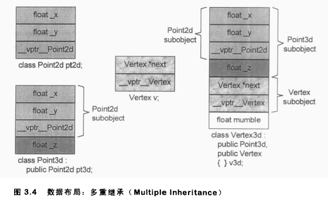

```c++
//派生类对象地址赋值给基类指针的例子
Vertex3d v3d;
Vertex *pv;
Point2d *p2d;
Point3d *p3d;

//需要修改偏移
pv = &v3d;
//编译器的行为
pv = (Vertex*)( ((char*)&v3d) + sizeof( Point3d ) );

//不需要修改偏移
p2d = &v3d;
p3d = &v3d;

//派生类指针赋值给基类指针的例子
Vertex3d *pv3d;
//需要修改偏移值
pv = pv3d;
//编译器的行为
//如果pv3d为0，表示为nullptr，则此时pv也应该设为空
//如果pv3d不为0，则修改偏移
pv = pv3d ? (Vertex*)( ((char*)&v3d) + sizeof( Point3d ) ) : 0;
```

### 3.4.4 虚继承

非虚多重继承和虚多重继承的区别：

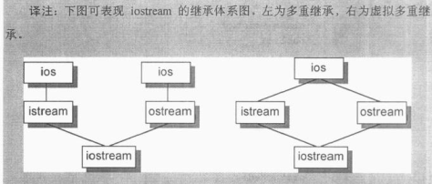

实现虚继承主要有三种主流策略

- 1.在每一个直接派生类（比如istream、ostream）中安插一些指针，每个指针指向一个虚基类，要想获取继承来的虚基类成员，可以通过相关指针间接完成

**1.直接派生类中安插指针**

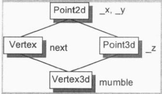

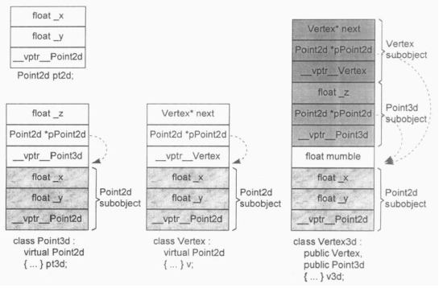

```c++
//通过相关间接获取虚基类成员
//例子1
void Point3d::operator += ( const Point3d &rhs )
{
    _x += rhs._x;
    _y += rhs._y;
    _z += rhs._z;
}
//编译器的行为
void Point3d::operator += ( const Point3d &rhs )
{
    this->__vbcPoint2d->_x += rhs.__vbcPoint2d->_x;
    this->__vbcPoint2d->_y += rhs.__vbcPoint2d->_y;
    this->_z += rhs._z;
}

//例子2，派生类指针向虚基类指针的转换
Point2d *p2d = pv3d;
//编译器的行为
Point2d *p2d = pv3d ? pv3d->__vbcPoint2d : 0;
```


这样实现的缺点：

- 1.每个对象必须对其每一个虚基类背负一个额外的指针。我们希望类对象有固定的负担，不因为其虚基类的个数而有所变化

  - 解决方法有两种：
    - a.使用虚基类表，表中存放指向虚基类的指针
    - b.使用虚基类表，表中存放虚基类的偏移量

- 2.由于虚继承串链的加长，导致间接存取层次的增加（如果有三次虚继承，则需要三次间接存取）。我们希望有固定的存取时间，不因为虚继承的深度而改变

  - 解决方法：经由拷贝操作所得所有嵌套的虚基指针，放到派生类对象中，以解决“固定存取时间”的问题。代价是需要更多的空间来存取指针


**对于使用虚基类表，存放表中虚基类的偏移量方法的详细解释**

使用该方法时，通常可以将虚基类偏移量与虚函数表中的指针放在一个表中，其中该表的正偏移量存放虚函数的指针，表的负偏移量存放虚基类的偏移量


```c++
//例子1
void Point3d::operator += ( const Point3d &rhs )
{
    _x += rhs._x;
    _y += rhs._y;
    _z += rhs._z;
}
//编译器的行为
void Point3d::operator += ( const Point3d &rhs )
{
    (this + __vptr__Point3d[-1])->_x += ( &rhs + rhs.__vptr__Point3d[-1] )->__x;
    (this + __vptr__Point3d[-1])->_y += ( &rhs + rhs.__vptr__Point3d[-1] )->__y;
    this->_z += rhs._z;
}

//例子2，派生类指针向虚基类指针的转换
Point2d *p2d = pv3d;
//编译器的行为
Point2d *pd2 = pv3d ? pv3d + pv3d->__vptr__Point3d[-1] : 0;
```

## 3.6 指向数据成员的指针

取一个类的非静态数据成员的地址，将会得到它在类中的偏移值。这种方法存取数据成员，效率更低

- `&Point3d::z`
- `float Point3d::*p1 = &Point3d::z; ` 

取一个真正绑定于类对象上的数据成员的地址，将会得到该成员在内存中的真正地址

- `&ob.z`，其中ob为Point3d的一个对象
- `int *p2 = &ob.z;`

[《C++Primber》笔记 第IV部分---19.4类成员指针](https://guanjunjian.github.io/2017/02/09/study-cpp-primer-summary_4/)

```c++
//下面的结果基于VS2017
class Point3d {
public:
	virtual ~Point3d();
	static void print()
	{
		printf("&Point3d::x = %p\n", &Point3d::x); //输出00000004
		printf("&Point3d::y = %p\n", &Point3d::y); //输出00000008
		printf("&Point3d::z = %p\n", &Point3d::z); //输出0000000C
	}
protected:
	static Point3d origin;
	float x, y, z;
};

int main(int argc, char* argv[])
{
	
	Point3d::print();
	system("pause");
	return 0;
}

//Point3d的内存布局
1>class Point3d	size(16):
1>	    +---
1> 0	| {vfptr}
1> 4	| x
1> 8	| y
1>12	| z
1>	    +---
1>
1>       Point3d::$vftable@:
1>	    | &Point3d_meta
1>	    |  0
1> 0	| &Point3d::{dtor}
```

书中有不同的解答：

```c++
//书中BCB3编译器的输出结果为：
class Point3d {
public:
	virtual ~Point3d();
	static void print()
	{
		printf("&Point3d::x = %p\n", &Point3d::x); //输出00000005
		printf("&Point3d::y = %p\n", &Point3d::y); //输出00000009
		printf("&Point3d::z = %p\n", &Point3d::z); //输出0000000D
	}
protected:
	static Point3d origin;
	float x, y, z;
};
```

书中BCB3中多出的1byte的解释为：为了区分“没有指向任何数据成员”的指针和“一个指向第一个数据成员”的指针（这种情况仅发生在将虚函数表放在末尾或没有虚函数的情况），考虑下面的情况：

```c++
float Point3d::*p1 = 0;
float Point3d::*p2 = &Point3d::x;

//这里该如何区分
//如果对指针数据成员的指针都加1的偏移量，那么就可以通过00000001是指向第一个数据成员，而00000000表示没有指向任何数据成员来区分
if( p1 == p2 ){}
```

**在多重继承后，类成员指针将会变得复杂**

看如下例子：

```c++
struct Base1 { int val1; };
struct Base2 { int val2; };
struct Derived : public Base1, public Base2 {};

void fun1( int Derived::*dmp, Derived *pd )
{
    //期待第一个参数得到的是一个“指向派生类的成员”的指针
    //如果传进来的是一个“指向基类成员”的指针，会怎样？
    pd->*dmp;
}

void fun2( Derived *pd )
{
    //bmp将成为1
    int Base2::*bmp = &Base2::val2;
    //bmp为1，但在派生类pd中，val2的偏移量应该是5，因此需要编译器的转换
    func1( bmp, pd );
}

//编译器的行为
void fun2( Derived *pd )
{
    int Base2::*bmp = &Base2::val2;
    func1( bmp ? bmp + sizeof( Base1 ) : 0 , pd );
}
```

# 第4章 函数语意学

函数分类

- 1.非静态成员函数
- 2.虚成员函数
- 3.静态成员函数

## 4.1 成员的各种调用方式

### 4.1.1 非静态成员函数

实际上**成员函数**会内化为**非成员函数**的形式，步骤如下：

- 1.改写函数原型，安插一个额外的参数this指针到成员函数中，用以提供一个存取管道，使类对象得以将此函数调用
- 2.对每一个非静态成员的存取操作改为经由this指针来存取
- 3.将成员函数重写为一个外部函数（extern），函数名经过mangle处理，使得它在程序中成为唯一的
  - 成员（数据成员、成员函数）名称前一般会加上类名、参数个数、参数类型等（用以重载）

```c++
//成员函数例子1，转化前
Point3d Point3d::normalize() const
{
    register float mag = magnitude();
    Point3d normal;
    
    normal._x = _x / mag;
    normal._y = _y / mag;
    normal._z = _z / mag;
    return normal;
}

//成员函数例子1，转换后
//Point3d拥有拷贝构造函数，且NRV优化启用
// 1.、3.
extern void magnitude__7Point3dFv(register const Point3d *const this, Point3d &__result);

void magnitude__7Point3dFv(register const Point3d *const this, Point3d &__result)
{
    // 2.
    register float mag = this->magnitude();
    //默认构造函数
    //__result用以取代返回值
    __result.Point3d::Point();
    __result._x = this->_x / mag;
    __result._y = this->_y / mag;
    __result._z = this->_z / mag;
    return;
}

//成员函数例子2，直接构建normal，转化前
//这可以节省默认构造函数引起的额外负担
Point3d Point3d::normalize() const
{
    register float mag = magnitude();
    normal._x = _x / mag;
    normal._y = _y / mag;
    normal._z = _z / mag;
    return Point3d(_x / mag, _y / mag, _z / mag);
}

//成员函数例子2，直接构建normal，转化后
void magnitude__7Point3dFv(register const Point3d *const this, Point3d &__result)
{
    register float mag = this->magnitude();
    //非默认构造函数
    //__result用以取代返回值
    __result.Point3d::point3d(this->_x / mag, this->_y / mag, this->_z / mag);
    return;
}

```

调用操作也需要修改

```c++
Point3d obj;
Point3d *ptr = &obj;
//修改前
Point3d result1 = obj.magnitude();
Point3d result2 = ptr->magnitude();

//修改后
magnitude__7Point3dFv( &obj, result1 );
magnitude__7Point3dFv( ptr, result2 );
```

### 4.1.2 虚成员函数

在4.2将详细介绍

**注意区别：**

- 1.指针调用虚函数与对象调用虚函数
- 2.虚函数内调用同类虚函数

```c++
//1.指针调用虚函数与对象调用虚函数

//指针调用虚函数
ptr->normalize();
//编译器的行为
/*
** vptr虚函数指针，指向该类的虚函数表，安插在每一个类对象中，其名称也会被mangle
** 函数传入ptr，作为this指针
*/
(*ptr->vptr[1])(ptr);

//对象调用虚函数
obj.normalize();
//编译器的行为
//这样是不必要的，实际上编译器不会这样做
(*obj.vptr[1])(&obj);
//编译器实际上是这样做，即“经由一个类对象调用虚函数”与“调用非静态成员函数”没区别
normalize_7Point3dFv( &obj );
```

```c++
//2.虚函数内调用同类虚函数
//假设normalize()为虚函数，magnitude()也为虚函数
Point3d Point3d::normalize() const
{
    register float mag = magnitude();
    Point3d normal;
    
    normal._x = _x / mag;
    normal._y = _y / mag;
    normal._z = _z / mag;
    return normal;
}

//其中的register float mag = magnitude()
//编译器的行为
//这样是不必要的，实际上编译器不会这样做
register float mag = ( *this->vptr[2] )(this);
//编译器实际上是这样做
//因为Point3d::magnitude()是在Point3d::normalize()的范围内调用，因为Point3d::normalize()已经确定了this的类型，因而这里的magnitude()可以直接使用类型调用，效率更高
register float mag = Point3d::magnitude();
```

### 4.1.3 静态成员函数

静态成员函数的**主要特性**：没有this指针

静态成员函数的**次要特性**（根源于其主要特性）：

- 1.不能直接存取类的非静态成员（数据成员、成员函数）
- 2.不能被声明为const（const成员函数）、volatile或virtual
- 3.不需要经过类对象调用

**静态成员函数定义的编译器转换过程：**

```c++
class Point3d{
public:
    static unsigned int object_count();
    ....
};
//非静态成员函数的定义
unsigned int Point3d::object_count();
{
    return _object_count;
}

//编译器的行为
//注意：1.mangle名称；2.没有this指针作为参数
unsigned int object_count_5dPoint3dSFv()
{
    return object_count_5Dpoint3d;
}
```

**静态成员函数调用的编译器转换过程：**

```c++
//指针调用
ptr->object_count();
//编译器的行为
object_count_5dPoint3dSFv();

//对象调用
obj.object_count();
//编译器的行为，与指针调用没差别
object_count_5dPoint3dSFv();
```

**取址静态成员函数**

[《C++Primber》笔记 第IV部分---19.4类成员指针](https://guanjunjian.github.io/2017/02/09/study-cpp-primer-summary_4/)

背景知识，成员函数指针：

```c++
class Screen {
    char get_cursor() const { return contents[cursor]; }
    inline char get(pos ht, pos wd) const;
}
char (Screen::*pm2)(Screen::pos,Screen::pos) const;

Screen myScreen, *pScreen = &myScreen;
char c1 = (pScreen->*pmf2)(0,0);
char c2 = (myScreen.*pmf2)(0,0);
```

但取一个**静态成员函数的地址**与取**非静态成员函数的地址**得到的指针类型不一样

```c++
unsigned int (*f1)();
//正确，&Point3d::object()返回的类型为unsigned int (*)();
f1 = &Point3d::object();

unsigned int (Point3d::*f2)();
//错误，&Point3d::object()的返回类型不为unsigned int (Point3d::*)();
f2 = &Point3d::object();
```

## 4.2 虚成员函数

对于一个由虚函数的类以及类成员，在编译期和执行期分别有不同的工作要做

**编译期工作：**

- 1.为类生成一个虚函数表，在虚函数表中为每个虚函数生成一个表格索引值（虚函数地址）
- 2.为类对象安插一个虚函数表指针，指向虚函数表

**执行期工作：**在特定的虚函数表slot（记录着虚函数的地址）中激活虚函数

**虚函数表中包括：**

- 1.该类定义的虚函数实例。即该类重写了基类的虚函数或该类自定义了新的虚函数
- 2.继承自基类的虚函数实例。即该类没有重写基类的对应虚函数时，才会有
- 3.一个`pure_virtual_called()`函数实例。它的作用：
  - 纯虚函数的空间保卫者
  - 作为执行期异常处理函数

### 4.2.1 单继承下的虚函数

```c++
//存虚函数在内存中的表现
class Test {
public:
	virtual void fun1() = 0;
	virtual void fun2() { cout << "hello" << endl; }
};
1>class Test	size(4):
1>	    +---
1> 0	| {vfptr}
1>	    +---
1>
1>       Test::$vftable@:
1>	    | &Test_meta
1>	    |  0
1> 0	| &Test::fun1
1> 1	| &Test::fun2
```

书本中相关例子：

**无派生时**

```c++
class Point{
public:
    //slot0用于存放type_info，用于RTTI
    //在slot1
    virtual ~Point();
    //在slot2，pure_virtual_called()，如果该函数被以外调用，通常的操作是结束掉这个程序
    virtual Point& mult( float ) = 0;
    
    //非虚函数，因此在表中没有
    float x() const { return x; }
    //在slot3
    virtual float y() const { return 0; }
    //在slot4
    virtual float z() const { return 0; }

protected:
    Point( float x = 0.0 );
    float _x;
};
```


**直接继承**

```c++
class Point2d : public Point {
public:
    Point2d( float x = 0.0, float y = 0.0 ) : Point( x ), _y(y) {};
    //重写
    ~Point2d(){}
    //纯虚函数被重写，注意这里的返回类型，是基类的派生类的引用，这是允许的
    Point2d& mult( float );
    //重写
    float y() const { return _y; }
    //z()没有重写，因此在虚函数表中还是Point::z()
protected:
    //新添加的元素
    float _y;
}
```


**间接继承**

```c++
class Point3d : public Point2d {
public:
    Point3d( float x = 0.0, float y = 0.0, float z = 0.0 ) : Point2d( x, y ),_z( z ) {}
    //重写
    ~Point3d();
    
    //重写
    Point3d& mult( float );
    //重写
    float z() const { return _z; }

private:
    //新添加的元素
	float _z;    
};
```

	

**虚函数的调用**

```c++
ptr->z();
//如果ptr不为空
( *ptr->vptr[4] )( ptr );
```

### 4.2.2 多重继承下的虚函数

```c++
class Base1 {
public:
	Base1();
	virtual ~Base1();
	virtual void speakClearly();
	virtual Base1 *clone() const;
protected:
	float data_Base1;
};

class Base2 {
public:
	Base2();
	virtual ~Base2();
	virtual void mumble();
	virtual Base2 *cline() const;
protected:
	float data_Base2;
};

class Derived : public Base1, public Base2 {
public:
	Derived();
	virtual ~Derived();
	virtual Derived *clone() const;
protected:
	float data_Derived;
};

//使用VS生成的内存分布图
//Base1的内存分布图
1>class Base1	size(8):
1>	    +---
1> 0	| {vfptr}
1> 4	| data_Base1
1>	    +---
1>
1>        Base1::$vftable@:
1>	    | &Base1_meta
1>	    |  0
1> 0	| &Base1::{dtor}  // Base1析构函数
1> 1	| &Base1::speakClearly
1> 2	| &Base1::clone

//Base2的内存分布图
1>class Base2	size(8):
1>	    +---
1> 0	| {vfptr}
1> 4	| data_Base2
1>	    +---
1>
1>       Base2::$vftable@:
1>	    | &Base2_meta
1>	    |  0
1> 0	| &Base2::{dtor}  // Base2析构函数
1> 1	| &Base2::mumble
1> 2	| &Base2::cline

//Derived的内存分布图
1>class Derived	size(20):
1>	    +---
1> 0	| +--- (base class Base1)
1> 0	| | {vfptr}
1> 4	| | data_Base1
1>	    | +---
1> 8	| +--- (base class Base2)
1> 8	| | {vfptr}
1>12	| | data_Base2
1>	    | +---
1>16	| data_Derived
1>	     +---
1>
1>       Derived::$vftable@Base1@:
1>	    | &Derived_meta
1>	    |  0
1> 0	| &Derived::{dtor}  // Base1虚函数表中的Derived析构函数
1> 1	| &Base1::speakClearly
1> 2	| &Derived::clone
1>
1>        Derived::$vftable@Base2@:
1>	    | -8
1> 0	| &thunk: this-=8; goto Derived::{dtor}  // Base2虚函数表中的Derived析构函数
1> 1	| &Base2::mumble
1> 2	| &Base2::cline
```

书中的布局：


（上图有一个问题，为什么在Base1的表中会有`Base2::mumble()`//TODO）

在多重继承下，一个派生类内含n-1个额外的虚函数表（n表示上一层基类的个数），对于本例来说，会有两个虚函数表：

- 1.一个主要表格，与Base1（派生顺序中最左端的基类）共享，如果派生类有新的虚构函数，添加到该表上
  - 表名：`vtbl__Derived`
  - 将Derived对象指定给Base1指针或Derived指针时，被处理的虚函数表是主要表格`vtbl__Derived`
- 2.一个次要表格，与Base2（派生顺序中第二个基类）有关
  - 表名：`vtbl__Base2__Derived`
  - 将Derived对象指定给Base2指针时，被处理的虚函数表是次要表格`vtbl__Base2__Derived`

**vcall thunk技术**

用处：多重非虚继承下的虚函数调用

步骤：

- 1.以适当的offset调整this指针
- 2.跳到虚函数中去

例如，经由Base2的指针调用Derived析构函数，其相关的thunk可能看起来时这样

```c++
pbase2_dtor_thunk:
	this += sizeof( base1 );
	Derived::~Derived( this );
```

**有三种情况，第二个或后续的基类会影响对虚函数的支持**

- 1.通过一个“指向第二个基类”的指针，调用派生类虚函数

```c++
Base2 *ptr = new Derived;
//这里调用派生类的虚析构函数Derived::~Derived
//ptr必须向后调整sizeof(Base1)个字节
delete ptr;
```

- 2.通过一个“指向派生类”的指针，调用第二个基类中一个继承而来的虚函数

```c++
Derived *pder = new Derived;
//调用Base2::mumble()
//pder必须被向后调整sizeof(Base1)个字节  TODO：书上说的是向前，不是很理解
pder->mumble();
```

- 3.前提：允许一个虚函数的返回值有所变化（派生类的实现版本的返回类型可以是基类实现版本的返回类型的子类）。通过“指向第二个基类”的指针调用clone()时，this指针的offset需要经过3次调整

```c++
//1.pd1调整指向Base2子对象
Base2 *pd1 = new Derived;
//2.pb1调整指向起始位置，从而调用Derived::clone()
//3.Derived::clone()传回一个指针，指向一个新的Derived对象，该对象的地址在被指定给pb2之前，必须调整并指向Base2子对象
Base2 *pb2 = pb1->clone();
```

### 4.2.3 虚继承下的虚函数

```c++
class Point2d {
public:
    Point2d( float = 0.0, float = 0.0 );
    virtual ~Point2d();
    
    virtual void mumble();
    virtual float z();
    
protected:
    float _x,_y;
};

class Point3d : public virtual Point2d {
public:
    Point3d( float = 0.0, float = 0.0, float = 0.0 );
    ~Point3d();
    float z();
protected:
    float _z;
};
```

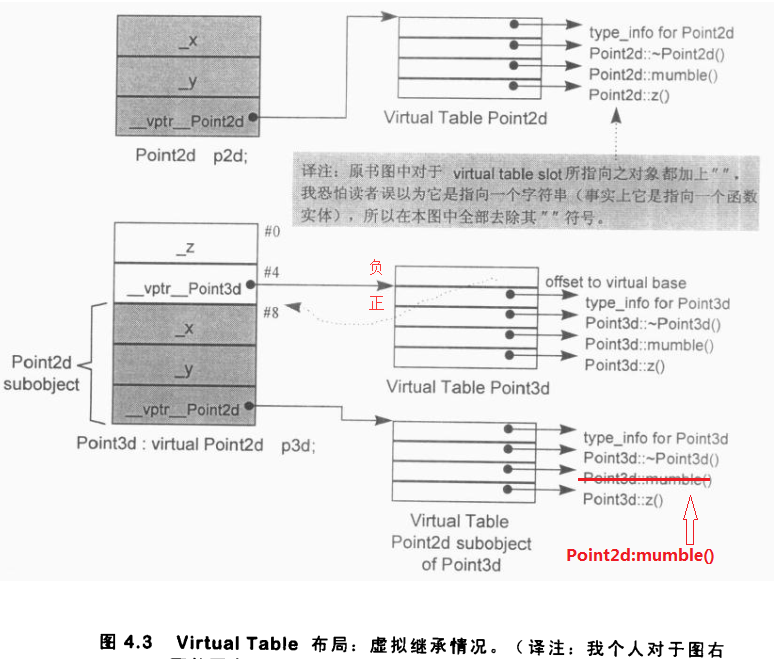

## 4.4 指向成员函数的指针

**指向类数据成员的指针**：取一个非静态数据成员的地址，得到的结果是该成员在类布局中的bytes位置（加1）。它是一个不完整的值，它需要被绑定于某个类对象的地址上，才能被存取

**指向类非静态成员函数的指针**：取一个非静态成员函数的地址，如果该函数是非虚函数，得到的结果是它在内存中真正的地址，它也是一个不完整的值，需要绑定于某个类成员的地址上，才能给通过它调用函数。所有非静态成员函数都需要对象的地址（即this指针）

**指向类静态函数的指针**：与一般的函数指针没区别，结果是它在内存中真正的地址，它不需要绑定与某个类成员（因为不需要this）

```c++
//声明语句：
/*
** double --> 返回类型
** Point3d::* ---> 类的函数成员
** pmf ---> 指针的名字
** () ---> 参数列表
*/
double (Point3d::*pmf)();
//定义并初始化指针
double (Point::*coord)() = &Point::x;
//可以再次赋值
coord = &Point::y;

//通过对象调用
(orginal.*coord)();
//编译器转化为
( coord )( &origin );

//通过指针调用
(ptr->*coord)();
//编译器转化为
( coord )( ptr );
```

### 4.4.1 支持“指向虚成员函数”的指针

对一个虚函数，其地址在编译期是未知的，所能知道的仅是虚函数在其虚函数表中的索引值（第几个slot）

**指向虚函数的指针**：取一个虚函数的地址，得到的结果是一个索引值（即在虚函数表中的第几个slot）

```c++
class Point {
public:
    virtual ~Point(); // &Point::~Point()结果为1
    float x(); // &Point::x()结果为x()在内存中的地址
    float y(); // &Point::y()结果为y()在内存中的地址
    virtual z(); // &Point::z()结果为2
};

float (Point::*pmf)() = &Point::z;
Point *ptr = new Point();
//通过“指向虚成员函数”的指针调用Point::z()
(ptr->*pmf)();
//编译器的行为
(* ptr->vptr[(int)pmf])( ptr );
```

根据例子可知：对于pmf这样的成员函数指针，需要同时支持“指向非虚成员函数”和“指向虚成员函数”，而指向这两种函数时，其存储的值是不一样的，因此pmf必须具备以下功能：

- 1.能够持有两种数值
  - 指向非虚成员函数时：函数在内存中的地址
  - 指向虚成员函数时：虚函数在虚函数表中的索引值
- 2.该数值能区分代表“内存地址”还是“虚函数表索引值”

### 4.4.2 多重继承下，指向成员函数的指针

为了让指向成员函数的指针能够同时支持

- 1.单一继承


- 2.多重继承
- 3.虚继承

Stroustrup（C++之父）设计了下面一个结构体

```c++
//用以支持在多重继承下指向成员函数的指针
struct __mptr {
	int delta; //用于多重继承，表示this指针的偏移量
    int index; //虚函数表索引，当不指向虚函数时，设为-1
    union {
    	ptrtofunc faddr; //非虚成员函数的地址
        int v_offset; //用于多重继承，表示虚基类（或多重继承中的第二个或后续的基类）的vptr位置，如果vptr放在类对象的起始位置，这个字段就不需要了。但放在起始位置会降低对C对象的兼容性
    }
}

//调用的翻译过程
( ptr->*pmf )();
//编译器的行为
( pmf.index < 0 ) //是否非虚成员函数，虚函数时index==-1
? 
( *pmf.faddr)(ptr) //如果是非虚函数，返回非虚成员函数的地址
:
( * ptr->vptr[pmf.index](ptr) ); //如果是虚函数，根据虚函数表检索虚函数的地址
```

__mptr只有在多重继承或虚继承的情况下才有必要性。许多编译器就在自身内部根据不同的类特性提供多种指向成员函数的指针，如微软就提供以下三种：

- 1.一个单一继承类对象（其中持有vcall thunk地址（支持虚函数，在4.2.2中有介绍）或函数地址（支持非虚函数））
- 2.一个多重继承类对象（其中持有__mptr中的faddr和delta两个变量）
- 3.一个虚继承类对象（其中持有__mptr中的所有变量）

## 4.5 lnline函数

程序员并不能强迫将任何函数变成inline。关键词inline（或者类中声明的成员函数，或者类的友元函数的定义，它们默认有inline关键字）只是一项请求，如果这项请求被接受，编译器就会用一个表达式合理地将这个函数扩展开来

处理一个inilen函数，有**两个阶段**

- 1.分析函数定义，决定该函数的是否可以成为inline函数（复杂程度、构建问题等方面考虑）
  - 如果不能成为inline，它被转为一个static函数（//TODO：这里怎么理解，没有this么?）,并在“被编译模块”内产生对应的函数定义
- 2.真正的函数扩展操作是在调用的那一点上，这会带来参数的求值操作和临时对象的管理

### 4.5.1 形式参数

inline函数的每一个形参都会被对应的实际参数取代，实参有以下三种情况和处理方式：

- 1.常量表达式，在替换之前完成求值操作，之后直接绑定到常量上
  - 常量表达式：表达式中的值都是常量
- 2.会带来副作用的实参，引入临时对象
  - 函数的副作用：调用函数时，除了返回函数值之外，还对主调用函数产生附加的影响。例如修改全局变量（函数外的变量）或修改参数
- 3.除了1、2之外的，直接代换

```c++
inline int min( int i, int j )
{
    return i < j ? i : j;
}

inline int bar()
{
    int minval;
    int vall = 1024;
    int val2 = 2048;
    
    //情况1：常量表达式
    minval = min( 1024, 2048 );
    //编译器的行为：在替换之前求值，minval直接与所求得的值进行绑定
    minval = 1024;
    
    //情况2：会带来副作用的实参
    minval = min( foo(), bar()+1 );
    //编译器的行为：导入一个临时变量，以避免重复求值
    int t1;
    int t2;
    minval = ( t1 = foo() ),( t2 = bar() + 1 ), t1 < t2 ? t1 : t2; 
    
    //情况3
    minval = min( val1, val2 );
    //编译器的行为：直接替换
    minval = val1 < val2 ? val1 : val2;
}
```

### 4.5.2 局部变量

**inline对局部变量的处理**

```c++
inline int min( int i, int j )
{
    //局部变量minval
    int minval = i < j ? i : j;
    return minval;
}

//在某个代码块中调用inline函数
{
    int local_val;
    int minval;
    
    minval = min( val1, val2 );
}
//编译器的行为
{
    int local_val;
    int minval;
    //将inline函数的局部变量名称经过mangle处理
    int __min_lv_minval;
    minval = ( __min_lv_minval = val1 < val2 ? val1 : val2 ), __min_lv_minval;
}
```

注意：

- 1.如果inline函数以单一表达式扩展多次（在同一等号中多次调用），则每次扩展都需要自己的一组局部变量
- 2.如果inline函数以分离的多个式子被扩展多次（在不同的等号中分别调用），那只需要一组局部变量，可以重复利用

**局部变量+有副作用的参数**

局部变量+有副作用的参数的inline函数可能会导致大量临时对象的产生，特别是它以单一表达式被扩展多次的话

```c++
{
    minval = min( val1, val2 ) + min( foo(), foo()+1 );
}
//编译器的行为
{
    //为inline中的局部变量产生临时变量
    int __min_lv_minval_00; //用于第一次调用
    int __min_lv_minval_01; //用于第二次调用
    
    //为放置inline函数参数的副作用值产生临时变量
    int t1;
    int t2;
    
    minval = ( (__min_lv_minval00 = val1 < val2 ? val1 : val2), __min_lv_minval00 ) +
        ((__min_lv_minval01 = ( t1 = foo()), ( t2 = foo+1 ), t1 < t2 ? t1 : t2 ), __min_lv_min__01 );
}
```

**inline函数的优势与劣势**

优势：

- 1.对封装提供了一种必要的支持，可以有效存取封装于类中的非public函数，例如inline的Get()函数
- 2.是C程序中大量使用的#define（预处理宏）的一个安全替代品，特别是如果宏中的参数有副作用的话

劣势：

- 1.inline函数如果被调用太多次的话，会产生大量的扩展代码，使程序大小暴涨
- 2.参数带有副作用、有多个局部变量、单一表达式做多次调用都会产生临时变量
- 3.inline中再有inline有可能会因为复杂度而没有办法扩展开


# 第5章 构造、析构、拷贝语意学

 **纯虚函数的存在**

- 可以定义和调用一个纯虚函数，但调用只能静态调用
- 当基类的析构函数定义为纯虚函数时，派生类的析构函数会被编译器扩张，以静态的方式调用其基类的虚析构函数
- 最好不要把析构函数定义为虚函数

**虚函数的使用和改进**

```c++
//修改前
class Abstract_base {
public:
    virtual ~Abstract_base() = 0;
    virtual void interface() const = 0;
    virtual const char* mumble() const { return _mumble; }
protected:
    char* _mumble;
};

//修改后
class Abstract_base {
public:
    //析构函数不要声明为虚函数
    virtual ~Abstract_base();
    //虚函数尽量不要声明为const
    virtual void interface() = 0;
    //对于几乎不会被派生了重写的函数，不要声明为虚函数
    const char* mumble() const { return _mumble; }
protected:
    //对于有数据成员的抽象类，需要在protected声明并定义一个初始化数据成员的构造函数，以便在派生类中调用，初始化基类数据成员
    Abstract_base ( char *pc = 0 );
    char* _mumble;
};
```

## 5.1 “无继承”情况下的对象构造

对于C风格的struct结构定义的数据结构（Plain Old Data），编译器只会为该结构生成无用的（trivival）默认构造函数、无用的析构函数、无用的拷贝构造函数、无用的拷贝赋值操作符

```c++
typedef struct
{
    float x, y, z;
} Point;
```

```c++
//要么无用的构造函数没被定义，要么无用的构造函数不被调用，与C中表现一样
Point global; 
Point foobar()
{
    //既没有构造，也没有析构，如果不初始化，可能会出错
    Point local; 
    //编译器行为：Point *heap = __new( sizeof(Point) )
    //但new开辟内存空间之后，没有调用默认构造函数，与C的malloc相似
    Point *heap = new Point;
    //像C一样的位搬移操作，如果local初始化过，则没有问题，如果没初始化过，则产生编译警告
    * heap = local;
    //编译器行为：__delete( heap );但不会调用析构函数，与C的free相似
    delete heap;
    //只是简单的位拷贝，不会调用无用的拷贝构造函数
    return local;
}
```

### 5.1.1 抽象数据类型

```c++
class Point {
public:
    Point( float x = 0.0, float y = 0.0, float z = 0.0 ): _x(x),_y(y),_z(z) {}
private:
    float _x,_y,_z;
}
```

```c++
//实施Point::Point( 0.0, 0.0, 0.0 );，初始化操作延迟到程序启动时
Point global; 
Point foobar()
{
    //默认构造函数的内联扩展
    //编译器的行为：local._x=0.0; local._y=0.0; local._z=0.0;
    Point local; 
    /*
    ** 编译器的行为：
    ** Point *heap = __new( sizeof(Point) );
    ** if( heap!=0 ) heap->Point::Point();
    **/
    Point *heap = new Point;
	//位拷贝操作，因为拷贝赋值构造是无用的，所以编译器没有合成（不满足合成条件）
    *heap = local;
	//删除heap指定的对象，但由于Point没有显示提供一个析构函数，因此不会调用
    //因为析构函数是无用的，所以编译器没有合成（不满足合成条件）
    delete heap;
    //位拷贝操作返回local的值，拷贝构造函数是无用的，所以编译器没有合成（不满足合成条件）
    return local;
}
```


**显示初始化列表**与**构造函数内联扩展**（constructor的inline expansion）

显示初始化列表优点：效率更高

显示初始化列表缺点：

- 1.只有当类成员都是public才有效
- 2.只能指定常量，因为它们在编译期就可以被求值
- 3.由于编译器没有自动施行“显示初始化列表”，所以初始化行为的失败可能性更高

对于构造函数内联扩展，编译器会有优化机制，对待它们就像是初始化列表所供应的一样

```c++
void mumble()
{
    //显示初始化列表
    Point local1 = { 1.0, 1.0, 1.0 };
    
    Point local2;  //构造函数内联扩展（只是这一行是）
    //对数据成员进行初始化
    local2._x = 1.0;
    local2._y = 1.0;
}
```

### 5.1.2 为继承做准备(虚函数的引入)

```c++
class Point {
public:
    Point( float x = 0.0, float y = 0.0 ): _x(x), _y(y) {}
    virtual float z();
protected:
    float _x, _y;
};
```

虚函数引入的**坏处**：

- 1.使每一个对象拥有一个虚函数表指针
- 2.引发编译器对类的扩展
  - 如果无构造函数，必须合成默认构造函数，并在构造函数中对虚函数表指针的初始化
  - 如果无拷贝构造函数和拷贝赋值运算符，必须合成它们，并对虚函数表指针进行设定

**构造函数的扩展**

```c++
//扩展前
Point( float x = 0.0, float y = 0.0 ): _x(x), _y(y) {}

//扩展后，编译器的行为
Point* Point::Point( Point *this, float x, float y ): _x(x), _y(y)
{
    //编译器行为：设定对象的初始化表指针
	this->__vptr_Point = __vtbl_Point;
    
    //初始化列表扩展，即使没有虚函数，也会进行的
    this->_x = x;
    this->_y = y;
    
    //传回this对象，即使没有虚函数，也会进行的
    return this;
}
```

**合成并扩展拷贝成员**

虚函数的引用导致编译器合成拷贝构造函数和拷贝赋值运算符，并在其中扩展对虚函数表的设定

```c++
//编译器行为
inline Point* Point::Point( Point *this, const Point &rhs )
{
    //仍然指向自己类型的虚函数表，而按位逐次拷贝而来的rhs的虚函数表
    this->__vptr_Point = __vtbl_Point;
    //将rhs中的_x、_y按位逐次拷贝（连续位拷贝）到*this的_x、_y
    //编译器在优化状态下可能回把对象的连续内容拷贝到另一个对象身上，而不会实现精确地以“以成员为基础”的赋值操作
    //但没优化时，是经由“数据成员赋值”将rhs的值赋值到*this中
    return this;
}
```

C++标准要求编译器尽量延迟成员的合成操作，直到正在遇到其使用场合才合成

引入虚函数后，再分析之前的例子：

```c++
Point global; 
Point foobar()
{
    Point local; 
    Point *heap = new Point;
    * heap = local;
    delete heap;
    return local;
}

//编译器的行为
Point::Point( 0.0, 0.0, 0.0 );
//以__result为返回值
Point foobar( Point &__result )
{
    
    //编译器的行为：
    //调用默认构造函数
    local.Point::Point(0.0, 0.0);
    
    //Point *heap = new Point;
    //编译器的行为
    Point *heap = __new( sizeof(Point) );
    if( heap!=0 ) heap->Point::Point();
	
    //拷贝赋值操作符合成并调用
    *heap = local;
    
	//删除heap指定的对象，调用析构函数
    delete heap;
    
    //拷贝构造函数的应用
     __result.Point::Point( local );
    //调用local的析构函数
    local.Point::~Point();
    
    return;
}
```

## 5.2 继承体系下的对象构造

```c
T  object;
```

以上代码会发生的事：

- 1.首先调用虚基类构造函数，所有虚基类先于非虚基类调用，从左到右，从深到浅
  - 如果虚基类的构造函数在派生类的初始化列表中，那么调用指定构造函数，否则调用默认构造函数
  - 派生类的每一个虚基类的偏移量在执行期间被保存
  - 虚基类的构造函数由继承体系中最底层派生类构造函数调用，用以支持这一行为的机制必须被放进来（5.2.1节介绍）

```c++
class A {
public:
	A() { cout << "A()"<< endl; }
};

class B
{
public:
	B() { cout << "B()" << endl; }
};

class C :virtual public B {
public:
	C() { cout << "C()" << endl; }
};

class D : public A, public C {
public:
	D() { cout << "D()" << endl; }
};
D d;

/*
输出为：
B()
A()
C()
D()
*/
```

- 2.直接基类的构造函数被调用，按继承顺序进行
  - 如果直接基类的某个构造函数在初始化列表中调用，则调用指定构造函数，否则调用默认构造函数
  - 如果直接基类时多重继承下的第二或后续的基类，那么this指针必须有所调整
- 3.如果类对象有虚函数指针，初始化虚函数指针，指向合适的虚函数表
- 4.执行初始化列表中的初始化操作
- 5.如果某个数据成员是类类型，并且没有初始化列表中显示初始化，则调用其默认构造函数

### 5.2.1 虚继承

```c++
class Point {
public:
    Point( float x = 0.0, float y = 0.0 );
    Point( const Point& );
    Point& operator=( const Point& );
    virtual ~Point();
    virtual float z() { return 0.0; }
protected:
    float _x,_y;
};

class Point3d : public virtual Point {
public:
    Point3d( float x = 0.0, float y = 0.0, float z = 0.0 ) 
        : Point( x, y ), _z(z) {}
     Poin3d( const Point3d& rhs )
         :Point( rhs ), _z(z) {}
     Point3d& operator=( const Point3d& );
    ~Point();
    virtual float z() { return _z; }
    
protected:
    float _z;
}
```

虚基类的构造函数由继承体系的最底层派生类构造函数调用

例如，下图中Point的构造函数由最底层派生类PVertex调用


因此在每个有虚基类的构造函数中，需要加入判断是否为应该调用虚基类的构造函数

```c++
//在虚基类情况下的构造函数扩充
Point3d* Point3d::Point3d( Point3d *this, bool __most_derived, float x, float y, float z)
{
    //如果是最底层的派生类了，调用虚基类的构造函数
    if(__most_derived != false )
        this->Point::Point( x, y );
    //初始化派生类自己的虚函数表指针
    this->__vptr_Point3d = __vtbl_Point3d;
    //初始化虚基类的虚函数表指针
    this->__vptr_Point3d_Point = __vtbl_Point3d_Point;
    this->_z = rhs._z;
    return this;
}

Vertex3d* Vertex3d::Vertex3d( Vertex3d *this, bool __most_derived, float x, float y, float z )
{
    //如果是最底层的派生类了，调用虚基类的构造函数
    if(__most_derived != false )
        this->Point::Point( x, y );
    
    //调用直接基类的构造函数，向它们的构造函数中设__most_derived为false
    this->Point3d::Point3d( false, x, y, z );
    this->Vertex::Vertex( false, x, y );
    
    //设定虚函数表指针
    //安插用户代码
    return this;
}
```

更有效的做法：

将构造函数分为两种：

- 如果构造完整对象时：无条件地调用虚基类构造函数，并设定虚函数表指针
- 如果自身是派生类的子对象，被派生类调用自身的构造函数时：不调用虚基类构造函数，不设置虚函数表指针（关于虚基类的部分）

### 5.2.2 虚函数表指针初始化语意

**在构造函数或析构函数中调用虚函数（直接调用、间接调用（非虚函数调用虚函数）、虚函数调用虚函数），调用的是正在进行构建或析构的类实现的版本**

在构造函数中，虚函数指针**初始化的时机为**：

- 在基类构造函数调用之后，在初始化列表和用户代码之前
- 这样可以保证在构造函数和析构函数中调用虚函数的正确性

```c++
PVertex::PVertex( float x, float y, float z )
    :_next(0), Vertex3d( x,y,z ), Point( x,y )
{
    if( spyOn )
        cerr << "Within PVertex::PVertex()"
        	<< "size: " << size() << endl; //size()为虚函数
}

//编译器的行为
PVertex* PVertex::PVertex( PVertex* this, bool __most_derived, float x, float y, float z )
{
    //如果是最底层的派生类，调用虚基类构造函数
    if(__most_derived!=false)
        this->Point::Point( x,y );
    //无条件地调用直接基类的构造函数
    this->Vertext3d::Vertex3d( x, y, z );
    
    //初始化自身的虚函数表指针，指向正在构建的对象（子对象）的类的虚函数表
    this->__vptr_PVertex = __vtbl_PVertex;
    //初始化虚基类的虚函数表指针
    this->__vptr_Point__PVertex = __vtbl_Point_PVertex;
    
    //用户代码
    if( spyOn )
        cerr << "Within PVertex::PVertex()"
        << "size: "
        //根据正在构建的对象（子对象）的类的虚函数表进行虚函数调用
        << (*this->__vptr__PVertex[ 3 ].faddr)(this)
        << endl;
    return this;
}
```

**优化方法**

使用对**完整对象的构造函数**和对**子对象的构造函数**，可以避免在基类中对虚函数表指针的多次初始化，只有在**完整对象的构造函数**时，才进行虚函数表的初始化操作

但，有一种情况，即使是**子对象的构造函数**也必须设定虚函数表的：当一个子对象的构造函数中调用了虚函数（无论是直接调用还是间接调用（通过一个非虚函数调用虚函数）），都必须设定虚函数表指针

## 5.3 对象复制语意学

设计一个类，并一个类对象赋值给另一个类对象时，有三种选择：

- 1.什么都不做，使用默认行为
- 2.提供一个显示拷贝赋值操作符
- 3.拒绝将一个类对象赋值给另一个类对象，有两种方式：
  - 将拷贝赋值运算符声明为private，并且只声明不定义
  - 函数声明为delete

一个类，只有不表现**位逐次拷贝语意**时，才会合成一个拷贝赋值运算符，以下情况，会合成拷贝赋值运算符：

- 1.当一个类内含一个类对象，该类对象的类型包含一个拷贝赋值运算符
- 2.当一个类的基类有拷贝赋值运算符时
- 3.有虚功能时（派生类对象赋值给基类对象时，虚函数表指针不能按位逐次拷贝）
  - 虚函数
  - 虚基类

**合成的拷贝赋值运算符**

以下图中的Point3d为例

``` c++
//编译器的行为
inline Point3d& Point3d::oprator=( Point3d* const this, const Point3d &p3d )
{
    //调用虚基类的赋值构造函数，对派生类的虚基类子对象进行赋值操作
    this->Point::operator=(p3d);
    
    _z = p.z;
    return *this;
}
```

**拷贝赋值列表**

拷贝赋值列表是与构造函数的初始化列表相似的概念，但是C++并没有对这个特性进行支持

```c++
//不允许这样做
inline Point3d& Point3d::operator=( const Point3d &p3d )
 : Point(p3d), z( p3d.z ){}

//只能这样做
inline Point3d& Point3d::oprator=( Point3d* const this, const Point3d &p3d )
{
    //调用虚基类的赋值构造函数，对派生类的虚基类子对象进行赋值操作
    this->Point::operator=(p3d);
    //或 ( *(Point*)this ) = p3d;
    
    _z = p.z;
    return *this;
}
```

如果不支持**拷贝赋值列表**，则无法在虚继承体系下，决定是否调用虚基类的拷贝赋值运算符

**虚基类的拷贝赋值运算符**


编译器如何能够在Point3d和Vertex的拷贝赋值运算符决定是否调用虚基类的拷贝赋值运算符？

- 1.不能使用拷贝构造函数中使用`__most_derived`参数的办法，因为（//TODO:这里原因没看懂）
- 2.只能使用分裂函数的方法，但这种方法只对合成的函数，则定义是明确的；对于用户定义的，则不定义不明确
  - 对于完整对象：调用虚基类的拷贝赋值运算符
  - 对于不完整对象：不调用虚基类的拷贝赋值运算符

现在的大多数做法：多次调用虚基类的拷贝赋值运算符，因此作者建议：

- 1.尽可能不要允许一个虚基类的拷贝操作
- 2.不要在任何虚基类中声明数据

## 5.5 析构语意学

会合成析构函数的情况：

- 1.类内含类对象，且该类对象有析构函数
- 2.基类有析构函数

如果不是以上两种情况，则不合成析构函数，也不会调用析构函数

如果有以上两种情况，则会根据用户定义和不定义析构函数，产生两种结果：

- 1.不定义析构函数，编译器合成析构函数，并调用类对象或基类的析构函数
- 2.用户定义析构函数，则编译器扩展定义的析构函数，使它调用类对象或基类对象的析构函数
  - 扩展方式：与构造函数的方式相似
  - 扩展顺序：与构造函数的相反

**析构函数的顺序**

- 1.析构函数体中的代码执行
- 2.如果类拥有类类型的对象，且该对象拥有析构函数，按它们的声明顺序的逆序调用它们的析构函数
- 3.如果对象内含有虚函数表指针，重置虚函数表指针，让其指向适当的基类的虚函数表
- 4.如果有直接非虚基类，按继承顺序的逆序调用析构函数
- 5.如果有虚基类，且虚基类有析构函数，且目前在析构的类是整个派生体系的最底层的类，则按虚基类的构造顺序的逆序调用虚基类的析构函数

**析构函数的实现**

最佳实现方式就是维护两份析构函数实例

- 1.对于完整对象，总是设定好虚函数表指针，并调用虚基类的析构函数
- 2.对于基类子对象，除非在析构函数中调用了一个虚函数，否则不会调用虚基类的析构函数，也不会设定虚函数表指针


# 第6章 执行期语意学

## 6.1 对象的构造和析构

### 6.1.1 全局对象

```c++
//这是一个全局对象
Matrix identity;

main()
{
    //identity必须在此处被初始化
    Matrix m1 = identity;
    ...
    return 0;
}
```

C++保证，一定会在main()函数中第一次用到identity之前，把identity构造出来，而在main()函数结束之前吧identity摧毁掉

像identity这样的全局变量如果有构造函数和析构函数的话，我们说它需要**静态的初始化操作和内存释放操作**


**munch策略：**

一个可移植但成本颇高的**全局变量静态初始化和内存释放**方法（一个比较过时的方法）

策略的具体描述为：

- 1.为每一个需要静态初始化的文件产生一个_sti()函数，内含必要的构造函数调用操作或构造函数的内联扩展
  - 例如前面的identity对象会在matrix.c中产生出下面的__sti()函数：

```c++
//编译器的行为
__sti__matrix_c__identity()
{
    identity.Matrix::Matrix();  //静态初始化
}
```

- 2.在每一个需要静态的内存内存释放操作的文件中，产生一个__std()函数，内含必要的析构函数调用操作，或是析构函数的内联扩展
- 3.提供一组runtime library "munch"函数：个`_main()`函数（用以调用可执行文件中的所有`__sti()`函数）,以及一个exit()函数（以类似方式调用所有的_`_std()`函数）


**注意**：C语言不为静态变量自动设定初值

**被静态初始化的对象的缺点**：

- 1.如果支持异常处理，被静态初始化的对象不能放在try代码块内（//TODO:原因？）
- 2.为了控制”需要跨越模块做静态初始化“的objects的相依顺序，而扯出来的复杂度

**作者建议**：

- 不使用需要自动静态初始化的全局对象

### 6.1.2 局部静态对象

```c++
const Matrix& identity()
{
    static Matrix mat_identity;
    //...
    return mat_identity;
}
```

- mat_identity的constructor必须只能执行一次，虽然上述函数可能被调用多次
- mat_identity的destructor必须只能执行一次，虽然上述函数可能会被调用多次

编译器的做法：

- 1.无条件地在程序起始时构造出对象来。（缺点：导致所有的局部静态对象都在程序起始时被初始化，即使它们所在的那个函数从不被调用）
- 2.identity()被调用时才把mat_identity构造起来

cfront实现的方法是

- 1.**构造**：导入一个临时性对象以保护mat_identity的初始化操作。第一次调用identity()时，这个临时对象为false，于是构造函数会被调用，然后临时对象被改为true，再次调用identity()，由于临时对象为true，因此不会再次构造
- 2.**析构**：析构函数也需要有条件地实施于mat_identity，只有在mat_identity已经被构造起来才调用，可以通过临时对象是否为true来判断mat_identity是否已经构造

### 6.1.3 对象数组

```c++
Point knots[10];
```

如果Point没有定义一个构造函数和析构函数，那么上述代码执行的工作与建立一个“内建类型所组成的数组”一样多，只会分配足够内存以存储10个连续的Point元素，但不会构造Point对象

如果Point**定义了默认构造函数**，在cfront编译器中，使用一个命名为vec_new()的函数，产生出以类对象构造而成的数组。（比较新的编译器，则是提供两个函数，一个用来处理”没有虚基类“的类，另一个用来处理”内含虚基类“的类，后一个函数通常被称为vec_vnew()）

函数vec_new()类型通常如下：

```c++
void* vec_new(
    void *array,                        //数组起始地址
    size_t elem_size,                   //每一个class object的大小
    int elem_count,                     //数组中的元素个数
    void (*constructor)(void*),
    void (*destructor)(void*,char)
    )
```

- constructor是类的默认构造函数的函数指针
- destructor是类的默认析构函数的函数指针
- array的值：
  - 具体的数组地址，表示静态数组，即knots这样的
  - 0，表示动态数组，即使用new操作符生成于heap中的对象数组

vec_new的具体使用：

```c++
Point knots[10];
//编译器的行为
vec_new(&knots,sizeof(Point),10,&Point::Point,0);
```

对于提供了一个或兑个显示初值的类对象数组：

```c++
Point knots[ 10 ] = { Point(), Point( 1.0, 1.0, 0.5 ), -1.0 };
//编译器的行为
//显示初始化前3个元素
Point::Point( &knots[0] );
Point::Point( &knots[1], 1.0, 1.0, 0.5 );
Point::Point( &knots[2], -1.0, 0.0, 0.0 );
//以vec_new初始化后面7个元素
vec_new( &knots+3, sizeof( Point ), 7, &Point::Point, 0 );
```

如果Point也定义了**析构函数**，当knots的生命结束时，该析构函数也必须实施于10个Point元素身上，经由一个类似的vec_delete()的runtime library函数完成：

```c++
void* vec_delete(
    void *array,                        //数组起始地址
    size_t elem_size,                   //每一个class object的大小
    int elem_count,                     //数组中的元素个数
    void (*destructor)(void*,char)
    )
```

## 6.2 new和delete运算符

### 6.2.1 new

```c++
int *pi = new int(5);
```

实际上是由两个步骤完成的：

```c++
//通过适当的new运算符函数实例，配置所需内存
//这里的new就是下文提到的operator new
int *pi = __new(sizeof(int));
//将配置得来的对象设置初值
*pi = 5;
```

更进一步，初始化操作应该在内存配置成功后才执行：

```c
int *pi;
if(pi = __new(sizeof(int))) 
    *pi = 5;
```

对类对象的情况：

```c++
Point3d *origin = new Point3d;

//编译器的行为，无异常处理的情况
Point3d *origin;
if( origin = __new( sizeof( Point3d ) ) )
    origin = Point3d::Point3d( origin );

//编译器的行为，有异常处理的情况
Point3d *origin;
if( origin = __new( sizeof( Point3d ) ) )
{
	try{
        origin = Point3d::Point3d( origin );
    }catch(...)
    {
       //如果出现异常
        //调用__delete以释放new分配的内容
        __delete( origin );
    	//将异常上上层传递
        throw;
    }
}
   
```

### 6.2.2 delete

```c++
delete pi;
```

delete pi时，如果pi是0，C++要求delete运算符不要有操作。因此”编译器“必须为此调用构造一层保护

```c++
//保护
if(pi != 0)
    //释放内存，但是pi并不会设为为0
    //__delete就是下文提到的operator delete
    __delete(pi);   
```

对类对象的情况：

```c++
delete origin;

//编译器的行为，无异常处理的情况
if( origin != 0 )
{
    Point3d::~Point3d( origin );
    __delete( origin );
}

//编译器的行为，有异常处理的情况
if( origin != 0 )
{
    try{
        oint3d::~Point3d( origin );
    }catch(...)
    {
        __delete( origin );
        //将异常上上层传递
        throw;
    }
}
```

### 6.2.3 operator new

以下版本并未考虑异常处理

```c++
extern void* operator new(size_t size)
{
    if(size == 0)
        size = 1;

    void *last_alloc;
    while(!(last_alloc = malloc(size))){
        //出错处理
        //允许使用者提供一个属于自己的_new_handler()函数
        if(_new_handler)
            (*_new_handler)();
        else
            return 0;
    }
    return last_alloc;
}
```

```c++
//是合法的
//但语言要求每一次对new的调用都必须传回一个独一无二的指针。解决此问题的传统方法是传回一个指针，指向一个默认为1 byte的内存区块（上述代码中将size设为1的原因）
new T[0];
```

operator new实际上总是以标准的C malloc完成，但不一定得这么做

### 6.2.4 operator delete

以下版本并未考虑异常处理

operator delete也总是以标准的C free()完成

```c++
extern void operator delete(void *ptr)
{
    if(ptr)
        free((char*)ptr);
}
```

### 6.2.5 针对数组的new语意

```c++
int *p_array = new int[5];

//编译器的行为
int *p_array = (int*)__new(5 * sizeof(int));
```

vec_new()不会真正被调用，vec_new()的主要功能是把默认构造函数施行于数组中的每个类对象中，但int类型没有默认构造函数。这里只会调用operator new分配空间

```c++
//struct simple_aggr{float f1,f2;};
simple_aggr *p_aggr = new simple_aggr[5];
```

vec_new()也不会被调用。因为simple_aggr并没有定义一个构造函数或析构函数，所以配置数组以及清除p_aggr数组的操作，只是单纯地获得内存和释放内存。由operator new和operator delete来完成

如果class定义了一个默认构造函数，某些版本的vec_new()就会被调用

```c++
Point3d *p_array = new Point3d[10];

//编译器的行为
Point3d *p_array;
p_array = vec_new( 0, sizeof( Point3d ), 10, &Point3d::Point3d, &Point3d::~Point3d );
```

当 delete 一个指向数组的指针时，C++2.0版之前，需要提供数组的大小。而2.1版后，不需要提供数组大小，只有在 `[]` 出现时，编译器才寻找数组的维度。否则它便假设只有单独一个object要被删除

```c++
//C++2.0版之前
int array_size = 10;
Point3d *p_array = new Point3d[ array_size ];
delete[ array_size ] p_array;

//只有第一个元素会被析构，其他元素仍然存在
delete p_array;
//正确的写法
delete[] p_array;
```

C++2.1之后，delete不需要提供数组大小，如何**记录数组**的元素？有两种方法：

- 1.为vec_new()所传回的每一个内存区块配置一个额外的word，然后把元素个数包藏在这个word之中，通常这种被包藏的数值称为cookie
- 2.Jonathan和Sun编译器维护一个”联合数组“，放置指针及大小。Sun同时也把析构函数的地址放置在“联合数组”中

**cookie策略的问题**：

- 如果一个坏指针被交给delete_vec()，取出来的cookie自然是不合法的。一个不合法的元素个数和一个坏指针的起始地址，会导致析构函数以非预期的次数被实施于一段非预期的区域
- ”联合数组“的策略下，坏指针的可能结果就只是取出错误的元素个数而已

**避免以一个基类指针指向一个派生类对象所组成的数组（如果派生类对象比基类对象大的话）**

```c++
Point *ptr = new Point3d[10];
delete[] ptr;
```

**存在的问题**：

- 实施于数组上的析构函数，是根据交给vec_delete()函数的”被删除的指针类型的析构函数“（在本例中就是Point的析构函数），与我们的期望不符
- 每一个元素的大小也一并被传递过去（本例中是Point类对象的大小）
- vec_delete()以“Point的析构函数”和“Point的对象大小”迭代走过每一个数组元素，最终执行失败，原因：执行了错误的析构函数和元素大小。从第一个元素之后，该destructor即被施行于不正确的内存区块中

**解决方法**：

- 1.程序员层面
- 2.析构函数设为虚函数

```c++
//循环delete
for( int ix = 0; ix < elem_count; ++ )
{
    Point3d *p = &((Point3d*)ptr)[ix];
    delete p;
}
```

**VS中的测试**

将析构函数设为虚函数，就不会有问题

析构函数非虚：

```c++
class A {
public:
	A() { cout << "A()" << " "; }
	~A() { cout << "~A()" << " "; }
};

class B : public A {
public:
	B() { cout << "B()" << " "; }
	~B() { cout << "~B()" << " "; }
};
int main(int agrc, char** agrv)
{
	A* p = new B[3];
	delete[] p;
	cout << endl;
	system("pause");
	return 0;
}
//输出：A() B() A() B() A() B() ~A() ~A() ~A()

//虚析构函数
class A {
public:
	A() { cout << "A()" << " "; }
	//虚析构函数
	virtual ~A() { cout << "~A()" << " "; }
};

class B : public A {
public:
	B() { cout << "B()" << " "; }
	~B() { cout << "~B()" << " "; }
};
int main(int agrc, char** agrv)
{
	A* p = new B[3];
	delete[] p;
	cout << endl;
	system("pause");
	return 0;
}
//输出：A() B() A() B() A() B() ~B() ~A() ~B() ~A() ~B() ~A()
```

## 6.2.6 Placement Operator new的语意

Placement Operator new：一个预定义好的重载的operator new，它需要两个参数

```c++
void* operator new( size_t, void *p );
//使用
//arena指向一块内存区域，返回根据Point2w构造函数构造好的指向arena的Point2w类型的指针
Point2w *ptw = new ( arena ) Point2w;

//编译器的行为
//1.将arena void* 转换为 Point2w*
Point2w *ptw = ( Point2w* ) arena;
//2.将Point2w构造函数实施于arena所指向的地址
if( ptw != 0 )
    ptw->Point2w::Point2w();
```

**问题1：析构**

如果placement operator在原已存在的一个对象上构造新的对象，而原已存在的对象的类有析构函数，但这个函数不会自动被调用，需要手动调用其析构函数

```c++
//错误的析构方式，不仅析构，还释放掉了内存
delete ptw;
ptw = new (arena) Point2w;

//正确的析构方式，只析构，不释放
ptw->~Point2w;
ptw = new (arena) Point2w;
```

由于无法得知arena所指向的区域是否需要析构，所以这一切都需要程序员负责，编译器不会自动执行

**问题2：真正的指针类型**

arena指向的内存：

- 1.必须是相同类型的
- 2.一块“新鲜”内存，并且足够荣内该类型的对象

```c++
//相同类型的
Point2w *arena = new Point2w;

//“新鲜”的存储空间
char* arena = new char[ sizeof( Point2w ) ];

//之后再执行placement operator new
Point2w* ptw = new (arena) Point2w;
```

**问题3：多态**

placement operator new并不支持多态，被交给new的指针，应该适当地指向一块预先配置好的内存

如果派生类比其基类大，如：

```c++
Point2w *p2w = new ( arena ) Point3w; 
```

Point3w的构造函数将导致严重的破坏，因为arena指向的内存只有Point2w对象的大小

如果派生类与基类一样大，如：

```c++
struct Base { int j; virtual void f(); };
struct Derived : Base { void f(); };

void() fooBar
{
    Base b;
    b.f(); //使用对象调用，静态调用虚函数，Base::f()被调用
    b.~Base(); 
    new ( &b ) Derived; 
    b.f(); // 哪一个f()被调用？
}
```

不能确切的说哪一个f()被调用，使用者可能以为调用的是Derived::f()，但大部分编译器调用的是Base::f()

VS中的结果：

```c++
struct Base { int j; virtual void f() { cout << "Base"<<" "; } };
struct Derived : Base { void f() { cout << "Derived"<<" "; } };

void fooBar()
{
	Base b;
	b.f(); //使用对象调用，静态调用虚函数，Base::f()被调用
	b.~Base();
	new (&b) Derived;
	b.f(); // 哪一个f()被调用？
}

int main(int agrc, char** agrv)
{
	fooBar();
	cout << endl;
	system("pause");
	return 0;
}
//输出：Base Base
```

## 6.3 临时性对象

临时对象的分析，需要考虑三种情况：

```c++
//情况1
T c = a + b;
//情况2
c = a + b;
//情况3
a + b;
```

**情况1**：`T c = a + b;`

有三种方式：

- 方式一：
  - 产生一个临时性对象，放置a+b的结果
  - 使用T的拷贝构造函数把临时性对象当做c的初始值
- 方式二：
  - 不需要临时性对象，也不需要对临时性对象构造函数和析构函数进行调用
  - 以拷贝构造的方式，将a+b的值放到c中（2.3节加法运算符的转换曾有讨论）
- 方式三：
  - 视operator+()而定
  - 如果operator+()实施NRV优化，将直接在c中求表达式结果，避免执行c的拷贝构造函数和临时性对象的析构函数

由于C++标准允许编译器厂商对于临时性对象的产生有完全的自由度，为了市场竞争，**情况1**中的表达式几乎不会产生一个临时性对象

**情况2**：`c = a + b;`

情况2中的临时性对象不能被忽略

```c++
c = a + b;
//编译器的行为
T temp;
temp.operator+(a,b);
c.operator=(temp);//将临时对象赋值到c中
temp.T::~T();//析构临时性对象
```

情况2不能将c直接传递给`operator+`运算符操作，因为`operator+`并不会调用c对象的析构函数，而`operator=`会先调用析构函数，后调用拷贝构造函数。我们是希望将临时性对象赋值给一块“新鲜”的内存

所以类似于`c = a+b;`这种语句是不安全的，并且会产生很多临时性对象，所以我们建议使用更有效率的初始化语句: 

`T c = a + b;`

**情况3**：`a + b;` 

没有目标对象，有必要产生一个临时对象以放置运算后的结果

该情况下，需要考虑**临时性对象的生命周期**问题（即临时性对象的析构函数什么时候调用）

- 1.对于产生临时对象的完整表达式，临时对象的摧毁应该是对完整表达式求值过程中的最后一个步骤
  - 如`?:`语句，任何一个子表达式产生的任何一个临时对象，都应该在完整表达式求值完成后，才可以毁去
- 2.凡持有表达式执行结果的临时性对象，应该保留到对象的初始化操作完成为止

```c++
bool verbose;
...
String progNameVersion = !verbose ? 0 : progName + progVersion;
//如果在完整的”? : 表达式“结束后就销毁临时的progName + progVersion对象，那么就无法正确初始化progNameVersion
```

- 3.如果一个临时性对象被绑定在一个引用或指针，临时性对象将保留，直到指针和引用的生命周期结束

```c++
const char *progNameVersion = progName + progVersion;
```

# 第7章 站在对象模型的尖端

本章包括三个方向的问题：

- 1.模板（template）
- 2.异常处理（exception handling，EH）
- 3.执行期类型识别（runtime type identification，RTTI）

## 7.1 模板

**实例化**：进程将真正的类型和表达式绑定到模板相关形式参数上

三个主要讨论方向：

- 1.**模板的声明**：当你声明一个模版类时会发生什么事情 
- 2.如何实例化**类对象**、**内联非成员对象**、**成员模板函数**：每一个编译单位都会拥有一份实例
- 3.如何实例化**非成员模板函数**、**成员模板函数**、**静态模板类成员**：每一个执行文件中只需要一份实例

### 7.1.1 模板的实例化行为

```c++
template< class Type >
class Point
{
public:
    enum Status { unallocated, normalized };
    
    Point( Type x = 0.0, Type y = 0.0, Type z = 0.0 );
    ~Point();
    
    void* operator new( size_t );
    void operator delete( void*, size_t );

private:
    static Point< Type > *freeList;
    static int chunkSize;
    Type _x, _y, _z;
};
```

- 1.template class声明时，实际程序中什么也没有做
  - 静态数据成员、内嵌enum和enumerators并不可用
  - 以上三种类型的数据只能通过某个实例来存取或操纵

```c++
//错误行为
Point::Status s;
Point::Status::freeList;

//正确行为
Point< float >::Status s;
Point< float >::freeList;
```

- 2.每个静态数据成员对应一种模板实例

```c++
//与Point类的float实例产生关联
Point< float >::freeList;
//与Point类的double实例产生关联
Point< double >::freeList;
```

- 3.指向值为0的模板的指针和引用
  - 指针：什么也没有发生
  - 引用：会实例化一个对应的模板实例

```c++
//什么也没有发生
Point< float > *ptr = 0;

//实例化一个Point的float实例
const Point< float > &ref = 0;
//编译器的行为
Point< float > temporary( float(0) );
const Point< float > &ref = temporary;
```

- 4.模板对象
  - 会产生模板类的实例化

```c++
//Point的非静态成员在此时被实例化，其Type被绑定为float
//但成员函数此时还不实例化，看5.
const Point< float > origin;
```

- 5.成员函数的实例化
  - **是否实例化**：未被使用过的成员函数不应该被实例化，只有在成员函数被使用的时候，C++标准才要求它们被实例化
  - **实例化时间**：
    - 编译时
    - 链接时

### 7.1.2 模板的错误报告

编译时期只会解析词汇错误和解析错误，而模版的类型检查则推迟到模版被实例化的时候进行，这会导致一些非常明显的模版错误不能被及时检测出来：

```c++
template <class type>
class Foo{
	public:
		Foo();
		type val();
		void val(type);
	private:
		type _val;
};

//Foo类中没有bogus_member成员函数，这样的明显的错误，编译时期确并不能发现
template <class type> double Foo<type>::bogus_member(){
	//Foo中也没有dbx数据成员
    return this->dbx;
}
```

编译器会将模版的声明收集成为一系列的“lexical tokens”（词汇标记），解析模版的操作则需要等到真正实例化操作时才开始，会将这些tokens**推送到解析器**， 然后调用类型检验

### 7.1.3 模版中的名称决议法

需要区分“**模板声明作用域**”和“**模板实例化作用域**”

对于一个非成员名字的决议结果，是根据这个名字的使用是否与“**用以实例化该模板的参数类型**”有关而决定的

- 与实例化模板参数类型**无关**：以“**模板声明作用域**”来决定name
- 与实例化模板参数类型有**关**：以“**模板实例化作用域**”来决定name

（//TODO：与自己在VS中测的结果不一致）

```c++
extern double foo(double);

template <class type>
class ScopeRules {
public:
	void invariant() {
		_member = foo(_val);
	}
	type type_dependent() {
		return foo(_member);
	}

private:
	int _val;
	type _member;

};


extern int foo(int);
ScopeRules<int> sr0;
sr0.invariant(); //调用extern double foo(double);
sr0.type_dependent(); //调用extern int foo(int);
```

前提：函数的决议结果只和函数的原型有关，和函数的返回值没有关系

- 1.`invariant()`：因为_val的类型是int，与“**用以实例化该模板的参数类型**”无关，因此调用操作根据“**模板声明作用域**”来决定foo()的调用，此时可选的函数只有1个，因此调用`extern double foo(double);`
- 2.`type_dependent()`：因为_member的类型是Type，与“**用以实例化该模板的参数类型**”有关，因此调用操作根据“**模板实例化作用域**”来决定foo()的调用，此时可选的函数有2个：`extern double foo(double);`和`extern int foo(int);`，由于实例化Type为int，因此调用`extern int foo(int);`

### 7.1.4 成员函数的实例化行为

模版函数实例化的策略目前主要有两种： 

- 1.编译时期策略 
- 2.链接时期策略 

编译器设计者必须解决的三个问题：

- 1.编译器如何找到函数定义 
  - 方法一：包含一个template program text file,像头文件一样
  - 方法二：要求一个文件命名规则，如我们在Point.h中发现的函数声明，其template program text一定要放置于文件Point.c,Point.cpp中 
- 2.编译器如何能够只实例化程序中用到的成员函数 
  - 方法一：忽略这个要求，把实例化类的所有成员函数都产生出来 
  - 方法二：模拟链接操作，检测哪个函数需要，只为它们生产实例 
- 3.编译器如何阻止成员函数在多个.o文件中被实例化？ 
  - 方法一：产生多个实例，然后从链接器中获得支持，最后只留下一个
  - 方法二： 由使用则引导“模拟链接阶段”的实例化策略 ，决定哪些实例才是所需要的

## 7.2 异常处理

### 7.2.1 异常处理快速检阅

C++异常处理由三个主要的词汇组件构成：

- 1.一个**throw**语句，它在程序某处发出一个异常，被抛出的异常类型可以是内建类型，也可以是用户自定义类型
- 2.一个或多个**catch**子句，每一个catch子句都是一个“异常处理”,提供实际的处理程序
- 3.一个**try**区段，区段中有一些列的语句，这些语句可能会引发catch子句起作用

当一个异常抛出的时候，控制权会从函数调用中被释放出来，并寻找一个吻合的catch子句，如果没有吻合者，则调用默认的处理例程terminate()

不断寻找catch子句的过程叫做**栈展开**，栈展开的过程中，将一个个函数从栈中推出，在每一个函数被推出栈之前，会先调用该函数中局部对象的析构函数


异常处理改变了函数在资源管理上的语意，如下面函数含有一块共享内存的locking和unlocking操作，虽然看起来和exception没有什么关系，但在exception之下并不能保证能够正确运行： 

```c++
void mumble(void *arena){
	Point *p = new Point;
	smLock(arena);//对共享区域加锁
	...//如果这里出现异常，程序不能正确运行，因为异常处理并不会去对该共享内存进行解锁操作
	smUnLock(arena);//解锁
	delete p;
}
```

解决方法：添加一个default catch子句，处理正常异常处理机制所不能处理的问题：

```c++
void mumble(void *arena){
	Point *p;
	p = new Point;//new如果出现异常，new自身会有heap上的析构处理，也就不需要delete操作，所以不需要在try block区域内
	try{
		smLock(arena);
		//...
	}
	catch(...){
		//添加共享内存解锁操作
		smUnLock(arena);
		delete p ;
		throw;
	}
	smUnLock(arena);
	delete p;

}
```

建议：将资源需求封装于一个类对象体内，由析构函数来释放资源，如下：

### 7.2.2 对异常处理的支持

当一个异常发生时，编译系统必须完成以下事情：

- 1.检验发生throw操作的函数 
- 2.决定throw操作是否发生在try区段中 
- 3.若是，则将异常类型和每个catch子句进行比较 
- 4.如果比较后吻合，流程控制交给catch子句 
- 5.如果throw的发生并不在try区段中，或没有一个catch子句吻合则 
  - 摧毁所有激活的局部对象 
  - 从堆栈中将目前的函数弹出（unwind）
  - 进入到程序堆栈中的下一个函数中，重复上述2~5

> 7.2.2.1 决定throw是否发生在一个try区段中

包含异常处理的函数可以分为三个区域：

- 1.try区段以外的区域，没有局部变量被激活 
- 2.try区段以外的区域，但有一个以上的局部对象被激活，并且需要析构 
- 3.try区段以内的区域 

编译器通过“**程序计数范围表格**”（program counter-range表格）标示以上三种区域

为了在一个内含try区段的函数中标出某个区域，可以把程序计数（program counter）的起始值和结束值存储在一个表格中

**查找过程**：

当throw操作发生时，目前程序计数器中的值拿来和对应的"范围表格"进行比对，以决定目前作用中的区域是否在一个try区段中，如果是，则找出相关的catch子句，如果这个exception无法被处理，该函数会从函数栈中推出，**程序计数**会被设定为调用端地址，这样的循环再重新开始

> 7.2.2.2 将异常的类型和每一个catch子句的类型做比较

**对于抛出的异常**

每一个抛出来的异常，编译器必须产生一个类型描述器，对异常类型进行编码，如果该异常是一个派生类，则编码中必须要包括所有基类的类型信息。RTTI正是因为支持异常处理而获得的副产品

**对于catch子句**

每一个catch子句也产生一个类型描述器

**对于整个函数**

每一个函数都会产生一个exception表格，它描述与函数相关的各区域、任何必要的善后处理代码、catch子句的位置

**比较过程**

执行期的异常处理将“抛出对象的类型描述器“和”每一个catch子句的类型描述器“进行比较，直到找到一个吻合的、或是直到堆栈已经被完全展开而terminate()被调用

### 7.2.3 当一个实际对象在程序执行时被抛出发生的事情

当一个异常被抛出时，异常对象会被产生出来并通常放置在相同形式的异常数据堆栈中。从throw端传给catch子句的是：**异常对象的地址**、**类型描述器**（或是一个函数指针，该函数会传回与该异常类型有关的类型描述器对象）、可能会有的**异常对象描述器**

考虑如下问题：

有一个catch子语句：

```c++
catch( exPoint p ){
	//do something;
	throw;
}
```

和一个异常对象，类型为exVertex，派生自exPoint

p会发生如下事情：

- 1.由于p是一个对象参数，所以会将抛出的异常exVertex**拷贝构造**给catch子句内部的局部变量 
- 2.由于p是一个对象而不是一个引用，当其内容被拷贝的时候，异常对象的非exPoint部分会被切掉。如果异常对象有虚函数，异常对象的虚函数表指针会指向exPoint的虚函数表，因此以对象为参数的catch语句无法**动态处理**
- 3.并且catch子句中对异常的修改不会作用到原异常对象 

优化：**使用引用**

```c++
catch(exPoint &p ){
	//do something;
	throw;
}
```

另一个问题：**全局异常对象**

```c++
exVertex errVer;

muble()
{
    if( muble_cond )
    {
        errVer.fileName("muble()");
        throw errVer;
    }
}
```

构造并放置于异常堆栈中的是全局变量errVer的复制品，catch子句对于异常对象的改变都是局部性的，不会影响errVer。当一个catch子句评估完毕并且不会再抛出异常后，该复制品被销毁（//TODO：这里不是很理解）

## 7.3 执行期类型识别RTTI

### 7.3.1 保证安全的向下转换操作

C++ 缺乏一种保证安全的**向下转换**机制（downcast）,只有在“类型真的可以被适当转换的情况下”才能执行**向下转换**,一个类型安全的**向下转换**必须对指针有所查询，看它是否指向它所表达的对象的真正类型 

目前编译器的做法：所有多态类的对象都维护一个指针，指向虚函数表，与该类相关的RTTI对象的地址放在虚函数表中（通常放在第一个slot），该地址只需要被设定一次，并且是被编译器静态设定的（即虚函数表生成时）

### 7.3.2 保证安全的动态转换（dynamic_cast）

`dynamic_cast`运算符可以在执行期决定真正的类型

- 如果向下转换是安全的（即如果基类指针指向一个派生类对象），这个运算符会传回被适当转换过的指针
- 如果向下转换不是安全的
  - 如果是指针，返回0
  - 如果是引用，抛出一个`bad_cast`异常

dynamic_cast的成本：在执行期获取对象的类型描述器：

```c++
((type_info*)(pt->vptr[0]))->type_descriptor;
```

type_info是C++标准所定义的类型描述器的类名称，该类中放置着索求的类型信息

### 7.3.3 Typeid运算符

Typeid运算符返回一个const reference，类型为type_info,该类定义如下：

```c++
class type_info{
public:
	virtual ~type_info();
	bool operator == (const type_info&) const;
	bool operator!=(const type_info&) const;
	bool before(const type_info&) const; //用于排序

	const char* name() const; //传回class的原始名称
    const char* raw_name() const; //传回class名称的编码字符串,微软的VC++支持
private:
	type_info(const type_info&);
	type_info& operator=(const type_info&);

	//data_member
 }
```

使用VC++完成的一个小示范，用以检验编码后的类名称


**内建类型和非多态的自定类型**

```c++
int *ptr;
//typeid传回的是一个const type_info&
if( typeid( ptr ) == typeid( int* ) )
```

type_info和typeid也可使用于**内建类型和非多态的自定类型**， 与多态类型的**差异**在于：

- 1.**内建类型和非多态的自定类型**的type_info是在**编译期静态**取得的； 多态类型的指针或引用的type_info是在**执行期动态**取得的 
- 2.**内建类型和非多态的自定类型**一般实现策略是需要时才产生type_info对象，而非程序一开头就产生


