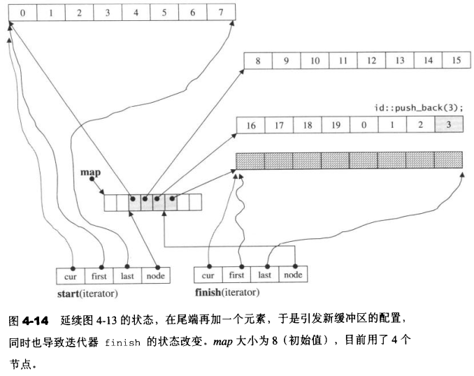
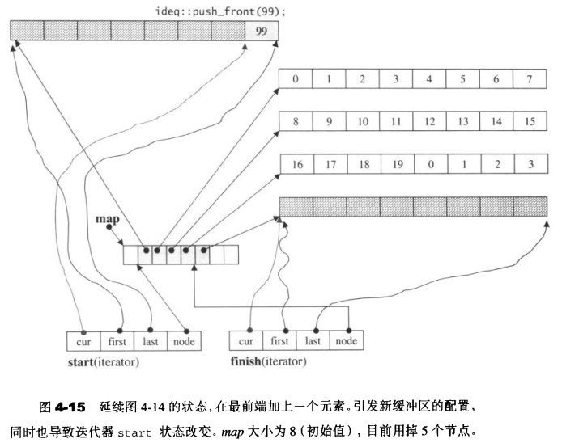
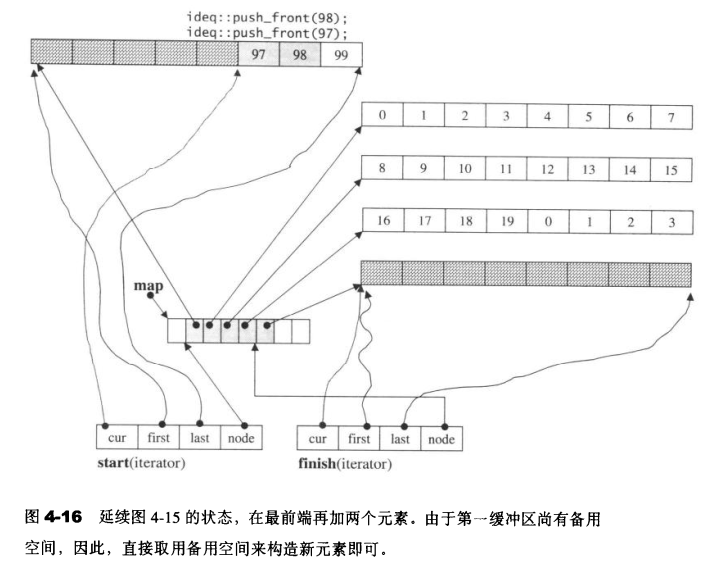

> **1.push_back()**

**push_back()**：

```c++
  void push_back(const value_type& t) {
    //最后缓冲区尚有两个（含）以上的元素的备用空间
    if (finish.cur != finish.last - 1) {
      //直接在备用空间上构造元素
      construct(finish.cur, t);
      ++finish.cur;
    }
    else
      //最后缓冲区只剩一个元素备用空间
      push_back_aux(t);
  }
```

**push_back_aux()**：

```c++
//只有当finish.cur == finish.last - 1才会被调用
//即，只有当最后一个缓冲区只剩一个备用元素空间时才会被调用
template <class T, class Alloc, size_t BufSize>
void deque<T, Alloc, BufSize>::push_back_aux(const value_type& t) {
  value_type t_copy = t;
  //若符合某种条件则必须重换一个map
  reserve_map_at_back();
  //配置一个新节点（缓冲区）
  *(finish.node + 1) = allocate_node();
  __STL_TRY {
    //构造新值到之前剩下的那个元素空间中
    construct(finish.cur, t_copy);
    //改变finish，指向新节点
    finish.set_node(finish.node + 1);
    //设定finish的状态
    finish.cur = finish.first;
  }
  __STL_UNWIND(deallocate_node(*(finish.node + 1)));
}
```



**reserve_map_at_back()**：


> **2.push_front()**

**push_front()**：

```c++
  void push_front(const value_type& t) {
    //第一缓冲区尚有备用空间
    if (start.cur != start.first) {
      //直接在备用空间上构造元素
      construct(start.cur - 1, t);
      //调整第一缓冲区的使用状态
      --start.cur;
    }
    else //第一缓冲区已无备用空间
      push_front_aux(t);
  }
```

**push_front_aux()**：

```c++
// 只有当start.cur == start.first时才会调用
//即，只有当第一个缓冲区没有任何备用元素时，才会被调用
template <class T, class Alloc, size_t BufSize>
void deque<T, Alloc, BufSize>::push_front_aux(const value_type& t) {
  value_type t_copy = t;
  //若符合某种条件则必须重换一个map
  reserve_map_at_front();
  //配置一个新节点（缓冲区）
  *(start.node - 1) = allocate_node();
  __STL_TRY {
    //改变start，令其指向新节点
    start.set_node(start.node - 1);
    //设定start的状态
    start.cur = start.last - 1;
    //构造新元素到新节点的元素空间中
    construct(start.cur, t_copy);
  }
  catch(...) {
  }
} 
```






