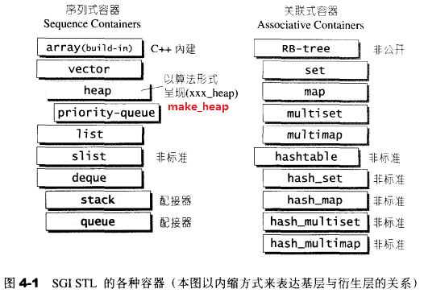
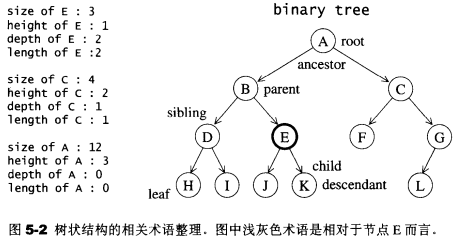

# 第5章 关联式容器

以**RB-tree**作为底层机制（自身也是关联容器，但不对外开放）

- 1.set
- 2.multiset
- 3.map
- 4.multimap

以**hash table**作为底层机制（自身也是容器，由SGI STL提供，不在标准规范之列，下面几个容器也不在）

- 1.hash_set
- 2.hash_multiset
- 3.hash_map
- 4.hash_multimap

**定义**：每个元素都有一个键值（key）和一个实值（value）。当元素被插入到关联式容器中时，容器内部结构（可能是RB-tree，也可能是hash-table）便依照其键值大小，以某种特定规则将这个元素放置于适当的位置。

**特性**：关联容器没有所谓头尾（只有最大元素和最小元素），所以不会有以下操作：

- 1.push_back()
- 2.push_frornt()
- 3.pop_back()
- 4.pop_front()
- 5.begin()
- 6.end()

**实现**：关联式容器的内部结构是一个平衡二叉树，被广泛运用于STL的是RB-tree（红黑树）

## 5.1 树的导览

**术语**：

- 1.路径长度：根节点至任何节点之间有唯一路径，路径所经过的边数
- 2.深度：根节点至任一节点的路径长度，即该节点的深度。根节点的深度为0
- 3.高度：某节点至其最深子节点（叶节点）的路径长度。树的高度即是根节点的高度
- 4.大小：任何节点的大小时指其所有子代（包括自己）的节点总数

> 二叉搜索树

**插入**：

**删除1：只有一个子节点**：

**删除2：有两个子节点**：

> 平衡二叉搜索树

“平衡”的大致意思是：没有任何一个节点深度过大

AVL-tree、RB-tree、AA-tree均可实现平衡二叉搜索树

> AVL tree

**AVL tree要求**：任何节点的左右子树高度相差最多维1

**插入后不平衡的情况**：

**调整**：只要调整“插入点至根节点”路径上，平衡状态被破坏的各个节点中最深的那一个，便可使整棵树重新获得平衡

**“平衡被破坏”的四种分类**：

- 1.