# 第5章 关联式容器


以**RB-tree**作为底层机制（自身也是关联容器，但不对外开放）

- 1.set
- 2.multiset
- 3.map
- 4.multimap

以**hash table**作为底层机制（自身也是容器，由SGI STL提供，不在标准规范之列，下面几个容器也不在）

- 1.hash_set
- 2.hash_multiset
- 3.hash_map
- 4.hash_multimap

**定义**：每个元素都有一个键值（key）和一个实值（value）。当元素被插入到关联式容器中时，容器内部结构（可能是RB-tree，也可能是hash-table）便依照其键值大小，以某种特定规则将这个元素放置于适当的位置。

**特性**：关联容器没有所谓头尾（只有最大元素和最小元素），所以不会有以下操作：

- 1.push_back()
- 2.push_frornt()
- 3.pop_back()
- 4.pop_front()
- 5.begin()
- 6.end()

**实现**：关联式容器的内部结构是一个平衡二叉树，被广泛运用于STL的是RB-tree（红黑树）

## 5.1 树的导览

**术语**：

- 1.路径长度：根节点至任何节点之间有唯一路径，路径所经过的边数
- 2.深度：根节点至任一节点的路径长度，即该节点的深度。根节点的深度为0
- 3.高度：某节点至其最深子节点（叶节点）的路径长度。树的高度即是根节点的高度
- 4.大小：任何节点的大小时指其所有子代（包括自己）的节点总数


> 二叉搜索树

**插入**：

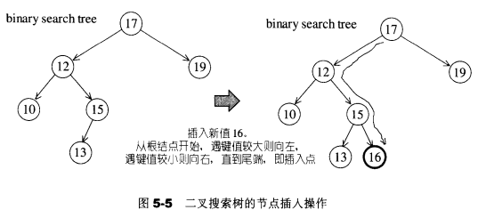

**删除1：只有一个子节点**：

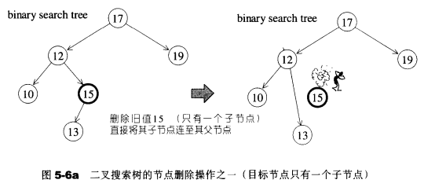

**删除2：有两个子节点**：


> 平衡二叉搜索树

“平衡”的大致意思是：没有任何一个节点深度过大

AVL-tree、RB-tree、AA-tree均可实现平衡二叉搜索树

> AVL tree

**AVL tree要求**：任何节点的左右子树高度相差最多维1

**插入后不平衡的情况**：


**调整**：只要调整“插入点至根节点”路径上，平衡状态被破坏的各个节点中最深的那一个，便可使整棵树重新获得平衡

**“平衡被破坏”的四种分类**：（假设最深节点为X，“平衡被破坏”意味着X的左右两颗子树的高度相差2）

- 1.插入点位于X的左子节点的左子树---左左（与4对称，**外侧插入**）
- 2.插入点位于X的左子节点的右子树---左右（与3对称，**内侧插入**）
- 3.插入点位于X的右子节点的左子树---右左（与2对称，**内侧插入**）
- 4.插入点位于X的右子节点的右子树---右右（与1对称，**外侧插入**）

外侧插入解决办法：单旋转操作

内侧插入解决办法：双旋转操作


**单旋转**：


**双旋转**：

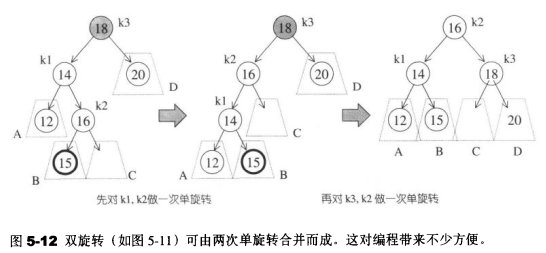

## 5.2 RB-tree

RB-tree（红黑树）是一个二叉搜索树，并且满足下图的4个条件：


**另**：新增节点必须为红色

### 5.2.1 插入节点

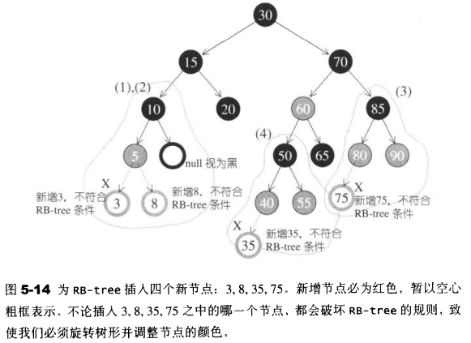

为了方便讨论，为某些特殊节点定义一些代名词

```
X:新节点
P：父节点
G：祖父节点
S：伯父节点，父节点的兄弟节点
GG：曾祖父节点

   GG
   /
   G
  / \
  P  S
 /
X
```

根据X的插入位置及外围节点（S和GG）的颜色，有四种考虑：

- 情况1：S为黑色，X为外侧插入
- 情况2：S为黑色，X为内侧插入
- 情况3：S为红色，X为外侧插入，GG为黑色
- 情况4：S为红色，X为外侧插入，GG为红色

> 情况1：S为黑色，X为外侧插入

**解决方法**：

- a：P，G做单旋转
- b：更改P，G的颜色

此时可能产生不平衡状态（高度相差1以上），这是可以的，因为RB-tree没有这么严格


> 情况2：S为黑色，X为内侧插入

**解决方法**：

- a：P，X做单旋转
- b：更改G，X颜色
- c：G左单旋转

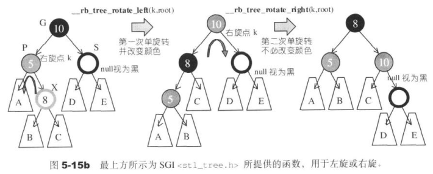

> 情况3：S为红色，X为外侧插入，GG为黑色

**解决方法**：

- a：P，G做单旋转，
- b：改变X的颜色

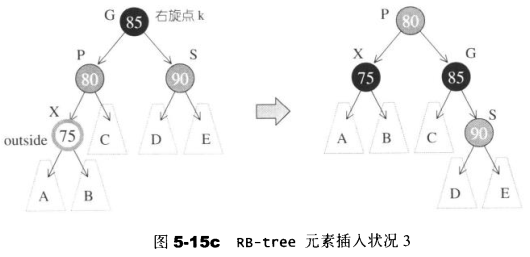

> 情况4：S为红色，X为外侧插入，GG为红色

**解决方法**：

- a：P，G做单旋转
- b：改变X的颜色
- c：持续往上做，直到不再有父子连续为红的情况

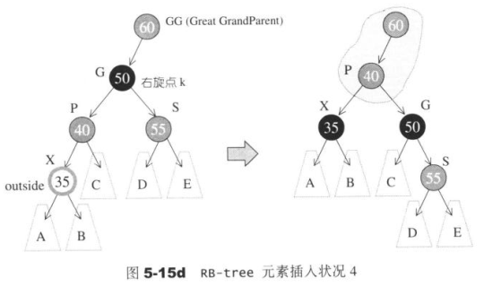

### 5.2.2 一个由上而下的程序

**目的**：为了避免**情况4**”父子节点皆为红色“的情况持续向RB-tree的上层结构发展，形成处理时效上的瓶颈，可以施行一个**由上而下的程序**

**由上而下的程序**：假设新增节点A，那么沿着A的路径向上，只要看到有某个节点X的两个子节点皆为红色，就把X改为红色，并把两个子节点改为黑色


**插入的操作**：

- 1.如果插入节点A的父节点P仍然为红色（此时S不可能为红），则根据情况1或情况2处理
  - 情况1：S为黑色，A为外侧插入
  - 情况2：S为黑色，A为内侧插入
- 2.如果插入节点A的父节点P不为红色
  - 要么，直接插入
  - 要么，插入，再做一次单旋转（如下图）

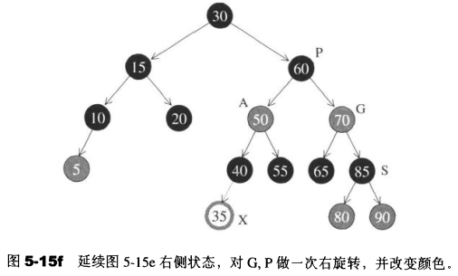

### 5.2.3 RB-tree的节点设计

为了有更大的弹性，节点分为两层：`__rb_tree_node`继承于`__rb_tree_node_base`

minimum()和maximum()函数可以让RB-tree搜索极值变得很容易

RB-tree的各种操作时常需要上溯其父节点,因此有parent指针

```c++
typedef bool __rb_tree_color_type;
const __rb_tree_color_type __rb_tree_red = false;   //红色为0
const __rb_tree_color_type __rb_tree_black = true;  //黑色为1

//RB-tree节点的基类
struct __rb_tree_node_base
{
  typedef __rb_tree_color_type color_type;
  typedef __rb_tree_node_base* base_ptr;

  color_type color; //颜色
  base_ptr parent;  //指向父节点的指针
  base_ptr left;    //指向左子节点的指针
  base_ptr right;   //指向右子节点的指针

  //静态函数，获取以x为根节点的RB-tree最小节点的指针
  static base_ptr minimum(base_ptr x)
  {
    while (x->left != 0) x = x->left;
    return x;
  }

  //静态函数，获取以x为根节点的RB-tree最大节点的指针
  static base_ptr maximum(base_ptr x)
  {
    while (x->right != 0) x = x->right;
    return x;
  }
};

//RB-tree节点类
template <class Value>
struct __rb_tree_node : public __rb_tree_node_base
{
  typedef __rb_tree_node<Value>* link_type;
  Value value_field;    //RB-tree节点的value
};
```

**键和值都包含在value_field中** 

下面是RB-tree的节点图表，其中`__rb_tree_node::value_field`填为10


### 5.2.4 RB-tree的迭代器

RB-tree迭代器实现为两层：`__rb_tree_iterator`继承于`__rb_tree_base_iterator`


RB-tree迭代器属于双向迭代器，但不具备随机定位能力 

前进操作operator++()调用了基类迭代器的increment()，后退操作operator--()调用了基类迭代器的decrement()。前进或后退的举止行为完全依据二叉搜索树的节点排列法则 

**__rb_tree_base_iterator**：

```c++
//迭代器基类
struct __rb_tree_base_iterator
{
  typedef __rb_tree_node_base::base_ptr base_ptr;
  typedef bidirectional_iterator_tag iterator_category;
  typedef ptrdiff_t difference_type;

  base_ptr node;    //节点基类类型的指针，将迭代器连接到RB-tree的节点

  //实际上就是中序遍历的“下一个节点”问题，
  //但需要考虑RB-tree头节点的特殊情况，参考状况（4）
  void increment()
  {
    //状况（1）：如果node右子树不为空，则找到右子树的最左子节点
    if (node->right != 0) {
      node = node->right;
      while (node->left != 0)
        node = node->left;
    }
    else {
      //状况（2）：如果node右子树为空，
      //需要找到某个节点，该节点是其父节点的左孩子
      base_ptr y = node->parent;
      while (node == y->right) {
        node = y;
        y = y->parent;
      }
      //状况（3）：找到了某个节点node，该节点是其父节点y的左孩子，
      //如果node的右孩子不是其父节点y，
      //则increment的结果为找到节点node的父节点y
      if (node->right != y)
        node = y;
      //状况（4）：找到了某个节点node，该节点是其父节点y的左孩子，
      //如果node的右孩子是其父节点y，
      //则increment的结果为找到节点node，
      //当迭代器指向根节点，而根节点无右子节点时，对迭代器进行increment，
      //会进入状况（4），结果为end()，详情看下图
    }
  }
  
  //实际上就是中序遍历的“上一个节点”问题，
  //但需要考虑RB-tree头节点的特殊情况，参考状况（1）
  void decrement()
  {
    //状况（1）：这种情况发生于node为header时（亦即node为end()时）
    //header右子节点即mostright，指向max节点
    //当迭代器为end()时，若对它进行decrement，会进入状态（1），结果为max
    if (node->color == __rb_tree_red &&
        node->parent->parent == node)
      node = node->right;            //
    else if (node->left != 0) {
     //状况（2）：如果左子树不为空，则找到左子树的最右子节点
      base_ptr y = node->left;
      while (y->right != 0)
        y = y->right;
      node = y;
    }
    else {
      //状况（3）：如果左子树为空，则到某个节点node，该节点node是其父节点y的右孩子，
      //则decrement的结果为该节点的父节点y
      base_ptr y = node->parent;
      while (node == y->left) {
        node = y;
        y = y->parent;
      }
      node = y;
    }
  }
};
```


**__rb_tree_iterator**：

```c++
//迭代器类
template <class Value, class Ref, class Ptr>
struct __rb_tree_iterator : public __rb_tree_base_iterator
{
  typedef Value value_type;
  typedef Ref reference;
  typedef Ptr pointer;
  typedef __rb_tree_iterator<Value, Value&, Value*>             iterator;
  typedef __rb_tree_iterator<Value, const Value&, const Value*> const_iterator;
  typedef __rb_tree_iterator<Value, Ref, Ptr>                   self;
  typedef __rb_tree_node<Value>* link_type; //指向RB-tree节点的指针类型

  __rb_tree_iterator() {}
  __rb_tree_iterator(link_type x) { node = x; }
  __rb_tree_iterator(const iterator& it) { node = it.node; }

  //解引用操作为获取所指RB-tree节点的value
  reference operator*() const { return link_type(node)->value_field; }
#ifndef __SGI_STL_NO_ARROW_OPERATOR
  pointer operator->() const { return &(operator*()); }
#endif /* __SGI_STL_NO_ARROW_OPERATOR */

  //调用父类的increment()，函数会修改node成员，使其指向后一个RB-tree节点
  self& operator++() { increment(); return *this; }
  self operator++(int) {
    self tmp = *this;
    increment();
    return tmp;
  }
    
  //调用父类的decrement()，函数会修改node成员，使其指向前一个RB-tree节点
  self& operator--() { decrement(); return *this; }
  self operator--(int) {
    self tmp = *this;
    decrement();
    return tmp;
  }
};
```

### 5.2.5 RB-tree的数据结构

```c++
template <class Key, class Value, class KeyOfValue, class Compare,
          class Alloc = alloc>
class rb_tree {
protected:
  typedef void* void_pointer;
  typedef __rb_tree_node_base* base_ptr;
  typedef __rb_tree_node<Value> rb_tree_node;
  typedef simple_alloc<rb_tree_node, Alloc> rb_tree_node_allocator;
  typedef __rb_tree_color_type color_type;
public:
  typedef Key key_type;
  typedef Value value_type;
  typedef value_type* pointer;
  typedef const value_type* const_pointer;
  typedef value_type& reference;
  typedef const value_type& const_reference;
  typedef rb_tree_node* link_type;
  typedef size_t size_type;
  typedef ptrdiff_t difference_type;
  //...
protected:
  size_type node_count; // keeps track of size of tree
  link_type header;  
  Compare key_compare;
  //...
public:
  typedef __rb_tree_iterator<value_type, reference, pointer> iterator;
  //...
};
```

### 5.2.6 RB-tree的构造

> RB-tree的空间配置器

```c++
class rb_tree {
protected:
  //...
  typedef __rb_tree_node<Value> rb_tree_node;
  typedef simple_alloc<rb_tree_node, Alloc> rb_tree_node_allocator;
  //...
};
```

> RB-tree的构造

RB-tree的构造方式有两种：

- 1.现有的RB-tree复制一个新的RB-tree
- 2.产生一颗空树

**产生空树**：

```c++
/*
template <class Key, class Value, class KeyOfValue, class Compare,
          class Alloc = alloc>

Key、Value、KeyOfValue、Compare、Alloc(这里使用默认alloc）
*/
rb_tree<int,int,identity<int>,less<int>> itree;
```

**rb_tree()**：

```c++
class rb_tree {
  //...
  void init() {
    //产生一个节点空间，令header指向它
    header = get_node(); 
    //令header为红色，用于区分header与root（root为黑色）
    color(header) = __rb_tree_red; 
                                   
    root() = 0;
    //令header的左子节点为自己
    leftmost() = header;
    //令header的右子节点为自己
    rightmost() = header;
  }
public:
  
  rb_tree(const Compare& comp = Compare())
    : node_count(0), key_compare(comp) { init(); }
  //...
};
```


### 5.2.7 RB-tree的元素操作

- **节点操作**
  - [涉及内存管理的操作](STL/RB-tree-涉及内存管理的操作.md)
    - 分配节点：get_node()
    - 释放节点：put_node()
    - 创建节点：create_node()
    - 拷贝节点：clone_node()
    - 销毁节点：destroy_node()
  - [获取节点成员的操作](STL/RB-tree-获取节点成员的操作.md)
    - left()
    - right()
    - parent()
    - value()
    - key()
    - color()
- **[RB-tree元素操作](STL/RB-tree-元素操作.md)**
  - 获取root节点：root()
  - 获取最左子节点：leftmost()
  - 获取最右子节点：rightmost()
  - 获取起始节点：begin()
  - 获取末尾节点：end()
  - 是否为空：empty()
  - 大小：size()
  - 可容纳的最大值：max_size()
  - **[插入节点](STL/RB-tree-插入节点.md)**：
    - 节点值独一无二：insert_unique()
    - 允许节点值重复：insert_equal()
  - **[元素搜索](STL/RB-tree-元素搜索.md)**： 
    - find()

## 5.3 set

**特性**：

- 1.所有元素都会根据元素的键值自动被排序
- 2.不同时拥有实值和键值，键值就是实值，实值就是键值
- 3.set不允许两个元素有相同的键值（multiset允许）
- 4.迭代器不能改变set的元素值（因为需要根据元素值排序），因此set的迭代器是一种constant iterators
- 5.当客户端对它进行元素新增操作或删除操作时，操作之前的所有迭代器，在操作完之后都依然有效（被删除的那个元素的迭代器除外）

**底层机制**：标准STL set以RB-tree为底层机制，几乎所有的set操作行为，都只是转调用RB-tree的操作行为而已

**set定义:**

```c++
template <class Key, class Compare = less<Key>, class Alloc = alloc>
class set {
public:
    ...
    //键值和实值类型相同，比较函数也是同一个
    typedef Key key_type;
    typedef Key value_type;
    typedef Compare key_compare;
    typedef Compare value_compare;
private:
    /*以下的identity为RB-tree中使用的KeyofValue，用以获取key
    identity定义于<stl_function.h>
    
    template <class T>
    struct identity : public unary_function<T, T> {
       const T& operator()(const T& x) const { return x; }
     };
    */
    typedef rb_tree<key_type, value_type, 
                  identity<value_type>, key_compare, Alloc> rep_type;
    rep_type t;  // 内含一棵RB-tree，使用RB-tree来表现set
public:
    //...
    //iterator定义为RB-tree的const_iterator，表示set的迭代器无法执行写操作
    typedef typename rep_type::const_iterator iterator;
    //...
};
```

**[set相关操作](STL/set-相关操作.md)**

- 所有的set的操作行为，RB-tree都已提供，set只是转调用
- 插入操作调用的是RB-tree的insert_unique()

## 5.4 map

**特性**：

- 1.所有元素都会根据元素的键值自动排序
- 2.map的所有元素都是pair，同时拥有实值和键值
- 3.map不允许两个元素拥有相同的键值
- 4.不可以改变元素的键值（因为根据键值进行排序），可以改变元素的实值，因此map的迭代器既不是constant iterators，也不是mutable iterators
- 5.当客户端对它进行元素新增操作或删除操作时，操作之前的所有迭代器，在操作完之后都依然有效（被删除的那个元素的迭代器除外）

**底层机制**：标准STL map以RB-tree为底层机制，几乎所有的map操作行为，都只是转调用RB-tree的操作行为而已

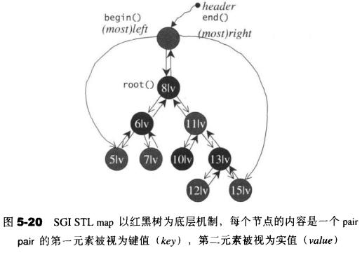

**pair的定义**：

```c++
//<stl_pair.h>
template <class T1, class T2>
struct pair {
  typedef T1 first_type;
  typedef T2 second_type;

  T1 first; //注意，它是public
  T2 second; //注意，它是public
  pair() : first(T1()), second(T2()) {}
  pair(const T1& a, const T2& b) : first(a), second(b) {}
};
```

**map定义**：

```c++
template <class Key, class T, class Compare = less<Key>, class Alloc = alloc>
class map {
public:
  typedef Key key_type;     //键值类型
  typedef T data_type;      //实值类型
  typedef T mapped_type;    
  typedef pair<const Key, T> value_type;    //键值对，RB-tree节点中的value类型
  typedef Compare key_compare;  //键值比较函数

  //...

private:
  /*
  select1st<value_type>是RB-tree中使用的KeyofValue
  */
  typedef rb_tree<key_type, value_type, 
                  select1st<value_type>, key_compare, Alloc> rep_type;
  rep_type t;  // 内含一棵RB-tree，使用RB-tree来表现map
public:
  //...
  //迭代器和set不同，允许修改实值
  typedef typename rep_type::iterator iterator;
  ...

  //下标操作
  T& operator[](const key_type& k) {
    return (*((insert(value_type(k, T()))).first)).second;
  }

  //插入操作，使用的是RB-tree的insert_unique()
  pair<iterator,bool> insert(const value_type& x) { return t.insert_unique(x); }

  //...
};
```

**[map相关操作](STL/map-相关操作.md)**

- 所有的map的操作行为，RB-tree都已提供，map只是转调用
- 插入操作调用的是RB-tree的insert_unique()

**insert()**：

- 返回值是一个pair，由一个迭代器和一个bool值组成，后者表示插入成功与否，成功的话前者即指向被插入的那个元素

```c++
  pair<iterator,bool> insert(const value_type& x) { return t.insert_unique(x); }
```

**operator[]**：

用法有两种：

- 左值：`simap[string("jjhou")] = 1;`
- 右值：`int number = simap[string("jjhou")];`

```c++
  T& operator[](const key_type& k) {
    return (*((insert(value_type(k, T()))).first)).second;
  }

//分解为：
//1.根据键值和实值做出一个元素，
//由于实值未知，所以T()产生一个与实值类型相同的临时对象代替，
value_type(k, T())
//2.把这个元素插入到map里面去，
//返回一个pair，第一个元素指向插入妥当的新元素，
//或指向插入失败点（键值重复）的旧元素
//如果作为左值，以此“实值待填”的元素将位置卡好
//如果作为右值，此时的插入操作返回的pair的第一个元素（迭代器）指向键值符合的旧元素
insert(value_type(k, T()))
//3.取出pair的第一个元素，这是一个迭代器，指向被插入的元素
(insert(value_type(k, T()))).first
//4.解引用迭代器，获得一个map元素，是一个由键值和实值组成的pair
*(insert(value_type(k, T()))).first
//5.取map元素pair的第二个元素
(*(insert(value_type(k, T()))).first).second
//6.最后以T& 引用传递方式传回
```

## 5.5 multiset

multiset的特性及用法和set完全相同，唯一的差别在于它允许键值重复，插入操作采用的是底层机制RB-tree的insert_equal()而非insert_unique() 

## 5.6 multimap

multimap的特性及用法和map完全相同，唯一的差别在于它允许键值重复，插入操作采用的是底层机制RB-tree的insert_equal()而非insert_unique() 

## 5.7 hashtable

**二叉搜索树特点**：具有“对数平均时间”（O(logN)）的表现，**但**输入数据需要有足够的随机性

**散列表特点**：具有“常数平均时间”（O(N)）的表现，以统计为基础，不需要依赖输入元素的随机性

**散列函数**：负责将一个元素映射为一个“大小可接收的索引”

- 存在**碰撞问题**：因为元素个数大于array容量，可能有不同的元素被映射到相同的位置（亦即有相同的索引）
- **解决方法**：线性探测、二次探测、开链等

**负载系数**：元素个数除以表格大小，负载系数永远在0~1之间（除非采用**开链策略**）

> 线性探测

**插入**：计算出某个元素的插入位置，而该位置上的空间不再可用时，循序往下一一寻找

**搜索**：计算出来的位置上的元素与我们搜索的目标不符，就循序往下一一寻找，直到找到吻合者，或遇到空格元素

**删除**：采用惰性删除，即只标记删除记号，实际删除操作则待表格重新整理（因为搜索时的循序查找过程）

线性探测存在**基本聚集**（primary clustering）：多个元素具有相同的索引（或在一块区域），那么这些元素插入时需要循序往下一一寻找合适的位置。平均插入成本的成长幅度远高于负载系数的成长幅度。基本聚集会产生很长的探查序列，从而使表变得越来越大。这种过度的探查会降低表的性能

- 解决方法：二次探测

> 二次探测

如果散列函数计算出新元素的位置为H，而该位置实际上已经被使用，那么我们就依序尝试`H+1^2`、`H+2^2`、`H+3^2`、`H+4^2`、...`H+i^2`，而不是像线性探测那样依次尝试`H+1`、`H+2`、`H+3`、`H+4`...`H+i`

二次探测解决了**基本聚集**，但存在**二次聚集**（secondary clustering）：两个元素经散列函数计算出的位置若相同，则插入时所探测的位置也相同，形成某种浪费

- 解决方法：双散列法（double hashing）

> 开链

**做法**：在每一个表格元素中维护一个list。散列函数为我们分配一个list，然后在该list身上执行元素的插入、搜索、删除等操作。针对list进行的搜索时一种线性操作

表格的负载系数大于1

SGI STL的hash table采用的是开链法

### 5.7.2 hashtable的桶（buckets）与节点（nodes）

SGI STL的hash table采用的是开链法

遵循SGI的命名，称hash table表格内的元素位桶（buckets），表格内的每个单元，涵盖的是节点（一个或多个）

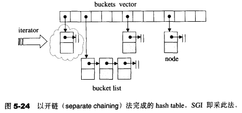

**hash bale的节点定义**：

bucket所维护的linked list不是STL的list或slist，而是自行维护的hash table node

```c++
template <class Value>
struct __hashtable_node
{
    __hashtable_node *next;
    Value val;
};
```

### 5.7.3 hashtable的迭代器

```c++
template <class Value, class Key, class HashFcn,
          class ExtractKey, class EqualKey, class Alloc>
struct __hashtable_iterator {
  typedef hashtable<Value, Key, HashFcn, ExtractKey, EqualKey, Alloc>
          hashtable;
  typedef __hashtable_iterator<Value, Key, HashFcn, 
                               ExtractKey, EqualKey, Alloc>
          iterator;
  typedef __hashtable_const_iterator<Value, Key, HashFcn, 
                                     ExtractKey, EqualKey, Alloc>
          const_iterator;
  typedef __hashtable_node<Value> node;

  typedef forward_iterator_tag iterator_category;
  typedef Value value_type;
  typedef ptrdiff_t difference_type;
  typedef size_t size_type;
  typedef Value& reference;
  typedef Value* pointer;

  node* cur;        //迭代器目前所指的节点
  hashtable* ht;    //指向相应的hashtable（因为可能需要从一个bucket跳到下一个bucket）

  __hashtable_iterator(node* n, hashtable* tab) : cur(n), ht(tab) {}
  __hashtable_iterator() {}
  reference operator*() const { return cur->val; }
  pointer operator->() const { return &(operator*()); }
  iterator& operator++();
  iterator operator++(int);
  bool operator==(const iterator& it) const { return cur == it.cur; }
  bool operator!=(const iterator& it) const { return cur != it.cur; }
};
```

bashtable迭代器必须维系着整个“bucket vector”的关系，并记录着所指的节点

**前进操作**

- 首先尝试从目前所指向的节点出发，前进一个节点（利用节点的next即可轻易完成）
- 如果目前节点正巧是list的尾端，就调至下一个bucket身上，指向下一个bucket的list的头部节点

```c++
template <class V, class K, class HF, class ExK, class EqK, class A>
__hashtable_iterator<V, K, HF, ExK, EqK, A>&
__hashtable_iterator<V, K, HF, ExK, EqK, A>::operator++()
{
  const node* old = cur;
  cur = cur->next;  //如果存在，就是它。否则进入以下if流程
  if (!cur) {
    //根据元素值，定位出下一个bucket，其起头处就是我们的目的地
    size_type bucket = ht->bkt_num(old->val);
    while (!cur && ++bucket < ht->buckets.size())
      cur = ht->buckets[bucket];
  }
  return *this;
}

template <class V, class K, class HF, class ExK, class EqK, class A>
inline __hashtable_iterator<V, K, HF, ExK, EqK, A>
__hashtable_iterator<V, K, HF, ExK, EqK, A>::operator++(int)
{
  iterator tmp = *this;
  ++*this;
  return tmp;
}
```

hashtable的迭代器没有后退操作，hashtable也没有定义所谓的逆向迭代器 

### 5.7.4 hashtable的数据结构

buckets聚合体以vector完成

```c++
template <class Value, class Key, class HashFcn,
          class ExtractKey, class EqualKey, class Alloc = alloc>
class hashtable;

...

template <class Value, class Key, class HashFcn,
          class ExtractKey, class EqualKey,
          class Alloc> //先前声明时，已给出Alloc默认值alloc
class hashtable {
public:
  typedef HashFcn hasher;
  typedef EqualKey key_equal;
  ...
private:
  //以下3者都是function  objects
  hasher hash;
  key_equal equals;
  ExtractKey get_key;

  typedef __hashtable_node<Value> node;  //hashtable节点类型
  typedef simple_alloc<node, Alloc> node_allocator;

  vector<node*,Alloc> buckets; //hashtable的桶数组，以vector完成
  size_type num_elements;      //元素个数
  ...
};
```

对模板参数的解释：

- Value：节点的实值类型
- Key：节点的键值类型
- HashFcn：散列函数的函数类型
- ExtractKey：从节点中取出键值的方法（函数或仿函数）
- EqualKey：判断键值相同与否的方法（函数或仿函数）
- Alloc：空间配置器，缺省使用std::alloc

<stl_hash_fun.h>中定义了数个现场的散列函数（仿函数）

散列函数计算bucket的位置，SGI将这项任务赋予bkt_num()，由它调用散列函数取得一个可以执行取模运算的值

SGI STL以质数来设计表格大小，并且先将28个质数（逐渐呈现大约2倍的关系）计算好，以备随时访问，同时提供一个函数，用来查询在这28个质数中，“最接近某数并大于某数”的质数： 

```c++
//注意，long至少有32位
static const int __stl_num_primes = 28;
static const unsigned long __stl_prime_list[__stl_num_primes] =
{
  53,         97,           193,         389,       769,
  1543,       3079,         6151,        12289,     24593,
  49157,      98317,        196613,      393241,    786433,
  1572869,    3145739,      6291469,     12582917,  25165843,
  50331653,   100663319,    201326611,   402653189, 805306457, 
  1610612741, 3221225473ul, 4294967291ul
};

//该函数被next_size()所调用
//以下函数找出上述28个质数中，最接近并大于或等于n的那个质数
inline unsigned long __stl_next_prime(unsigned long n)
{
  const unsigned long* first = __stl_prime_list;
  const unsigned long* last = __stl_prime_list + __stl_num_primes;
  const unsigned long* pos = lower_bound(first, last, n);
  return pos == last ? *(last - 1) : *pos;
}

//总共可以有多少buckets，返回值为4294967291
size_type max_bucket_count() const
  { return __stl_prime_list[__stl_num_primes - 1]; } 
```

### 5.7.5 hashtable的构造

> 配置节点和释放节点

- new_node()
- delete_node()

```c++
  node* new_node(const value_type& obj)
  {
    node* n = node_allocator::allocate();
    n->next = 0;
    __STL_TRY {
      construct(&n->val, obj);
      return n;
    }
    __STL_UNWIND(node_allocator::deallocate(n));
  }

  void delete_node(node* n)
  {
    destroy(&n->val);
    node_allocator::deallocate(n);
  }
```

> 构造函数

**使用例子**：

对模板参数的解释：

- Value：节点的实值类型
- Key：节点的键值类型
- HashFcn：散列函数的函数类型
- ExtractKey：从节点中取出键值的方法（函数或仿函数）
- EqualKey：判断键值相同与否的方法（函数或仿函数）
- Alloc：空间配置器，缺省使用std::alloc

```c++
//
hashtable<int, int, hash<int>, identity<int>, equal_to<int>, alloc> iht(50, hash<int>(), equal_to<int>());
```

**调用过程**：

```
hashtable()
	---> initialize_buckets()
		---> next_size()
```

**代码**：

```c++

  hashtable(size_type n,
            const HashFcn&    hf,
            const EqualKey&   eql)
    : hash(hf), equals(eql), get_key(ExtractKey()), num_elements(0)
  {
    initialize_buckets(n);
  }

  void initialize_buckets(size_type n)
  {
    //传入50，返回53
    const size_type n_buckets = next_size(n);
    //保留53个元素空间
    buckets.reserve(n_buckets);
    //将53个元素空间都设为nullptr（因为没有元素）
    buckets.insert(buckets.end(), n_buckets, (node*) 0);
    num_elements = 0;
  }
  //返回最接近n并大于或等于n的质数
  size_type next_size(size_type n) const { return __stl_next_prime(n); 
```

### 5.7.6 hashtable的元素操作

- 重建表操作：resize()
- 

> **[重建表操作 resize()](STL/hashtable-resize().md)**

**表格重建的判断原则**：拿元素个数（把新增元素计入后）和bucket vector的大小比较，如果前者大于后者，则重建表格。因此可知，list的最大容量与vector的大小相同

**操作**：

- 1.处理每一个旧的bucket
- 2.指向bucket中list的起始节点
- 3.找到节点对应新的bucket号
- 4.令目前处理的旧bucket起始节点为first的下一个节点
- 5.将当前节点链入新的bucket的list中（放于list头）
- 6.继续处理旧bucket的下一个节点

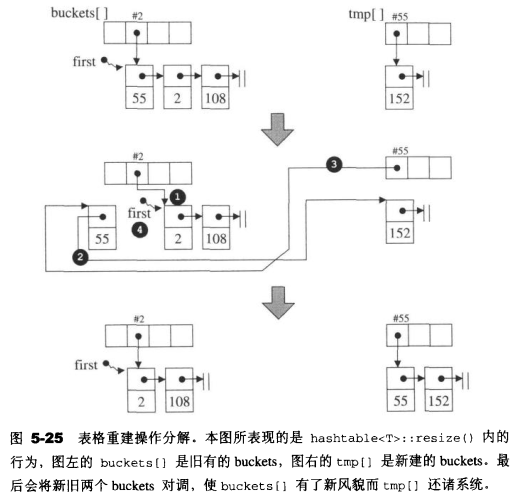

> **[不允许重复插入 insert_unique()](STL/hashtable-insert_unique().md)**

**使用例子**：

```c++
iht.insert_unique(59);
iht.insert_unique(60);
```

```c++
insert_unique()
    ---> resize()  //判断是否需要重建表格，如果需要就扩充
    ---> insert_unique_noresize()  //1.计算应位于哪个bucket
                                   //2.遍历到节点串查找是否存在键值重复的节点,如果有则什么都不做，返回pair，第一个元素指向重复的元素的迭代器，第二个元素为false
                                   //3.将新节点插入list头部
                                   //4.返回插入节点的迭代器和成功组成的pair
```

> **[允许重复插入 insert_equal()](STL/hashtable-insert_equal().md)**

**使用例子**：

```c++
ith.insert_equal(59);
ith.insert_equal(59);
```

```c++
insert_equal()
    ---> resize()  //判断是否需要重建表格，如果需要就扩充
    ---> insert_equal_noresize(obj)  //1.如果找到键值相同的节点，直接构建新节点，并将其插入到键值相同的节点后，返回
                                     //2.如果没找到键值相同的节点，则在节点串的首部插入新节点
```

> **判断bucket位置 bkt_num()**

```c++
  //版本1：接受实值和bucket个数
  size_type bkt_num(const value_type& obj, size_t n) const 
  {
    return bkt_num_key(get_key(obj), n); //调用版本4
  }
  //版本2：只接受实值
  size_type bkt_num(const value_type& obj) const 
  {
    return bkt_num_key(get_key(obj)); //调用版本3
  }

  //版本3：只接受键值
  size_type bkt_num_key(const key_type& key) const //版本3
  {
    return bkt_num_key(key, buckets.size()); //调用版本4
  }
  //版本1：接受键值和bucket个数
  size_type bkt_num_key(const key_type& key, size_t n) const //版本4
  {
    return hash(key) % n; //返回key和buckets数目取模的结果
  }
```

> 整体删除 clear()

**步骤**：

- 1.删除list中每个节点
- 2.将bucket置空

```c++
template <class V, class K, class HF, class Ex, class Eq, class A>
void hashtable<V, K, HF, Ex, Eq, A>::clear()
{
  //遍历每一个bucket
  for (size_type i = 0; i < buckets.size(); ++i) {
    node* cur = buckets[i];
    while (cur != 0) {
      node* next = cur->next;
      delete_node(cur); //释放当前节点
      cur = next;       //继续处理下一节点
    }
    buckets[i] = 0; //将bucket的节点串设为空
  }
  num_elements = 0; //将hashtable的元素个数设为0
}
```

> 复制 copy_from()

**步骤**：

- 1.清除自己的节点
- 2.根据ht的bucket数量为自己预留空间。如果本身空间已经足够就不进行处理，否则会增大
- 3.从自己的buckets vector尾端开始，插入n个源，值为Null（此时bucket vector为空，所以所谓的尾端，就是起始处）
- 4.遍历hashtable的每一个bucket，复制每一个bucket中的节点

```c++
template <class V, class K, class HF, class Ex, class Eq, class A>
void hashtable<V, K, HF, Ex, Eq, A>::copy_from(const hashtable& ht)
{
  //先清除自己的节点
  buckets.clear();
  //根据ht的bucket数量为自己预留空间
  //如果本身空间已经足够就不进行处理，否则会增大
  buckets.reserve(ht.buckets.size());
  //从自己的buckets vector尾端开始，插入n个源，值为Null
  //此时bucket vector为空，所以所谓的尾端，就是起始处
  buckets.insert(buckets.end(), ht.buckets.size(), (node*) 0);
  __STL_TRY {
    //遍历bt的每一个bucket，复制每一个bucket中的节点
    for (size_type i = 0; i < ht.buckets.size(); ++i) {
      if (const node* cur = ht.buckets[i]) {
        node* copy = new_node(cur->val);
        buckets[i] = copy;
       
        //针对同一个list，复制每一个节点
        for (node* next = cur->next; next; cur = next, next = cur->next)        {
          copy->next = new_node(next->val);
          copy = copy->next;
        }
      }
    }
    num_elements = ht.num_elements; //更新节点数
  }
  __STL_UNWIND(clear());
}
```

> **查找元素 find()**

```c++
  iterator find(const key_type& key) 
  {
    //首先寻找落在哪一个bucket内
    size_type n = bkt_num_key(key);
    node* first;
    //从bucket list的头开始，一一对比每个元素的键值，对比成功就跳出
    for ( first = buckets[n];
          first && !equals(get_key(first->val), key);
          first = first->next)
      {}
    return iterator(first, this);
} 
```

> **统计某键值的元素个数 count()**

```c++
  size_type count(const key_type& key) const
  {
    const size_type n = bkt_num_key(key);
    size_type result = 0;
    //从bucket list的头开始，一一对比每个元素的键值，对比成功就加1
    for (const node* cur = buckets[n]; cur; cur = cur->next)
      if (equals(get_key(cur->val), key))
        ++result;
    return result;
}
```

