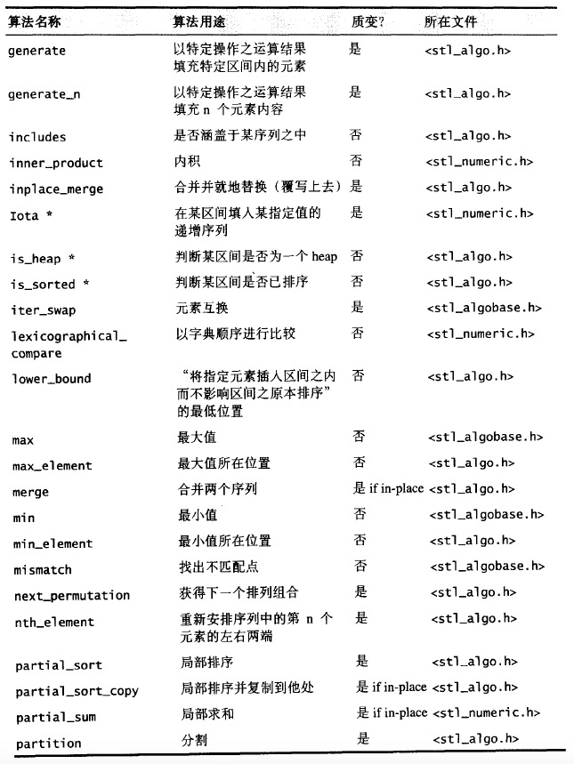
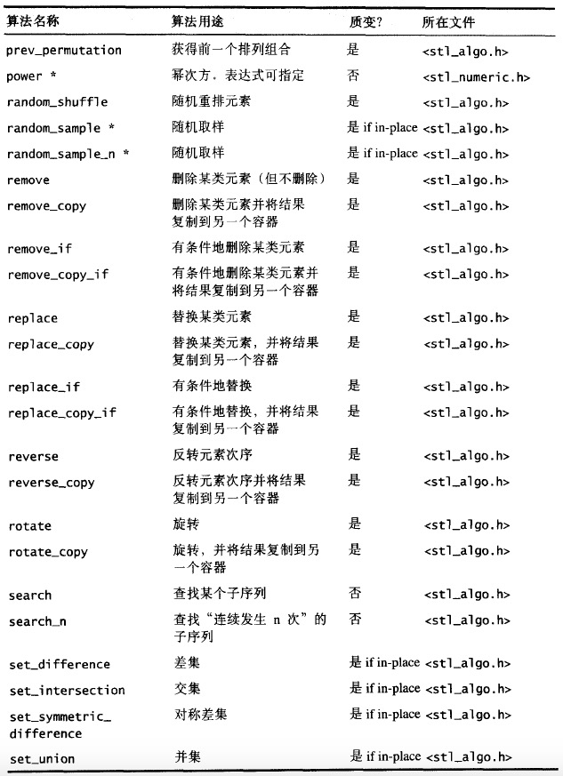
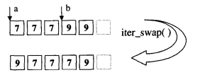
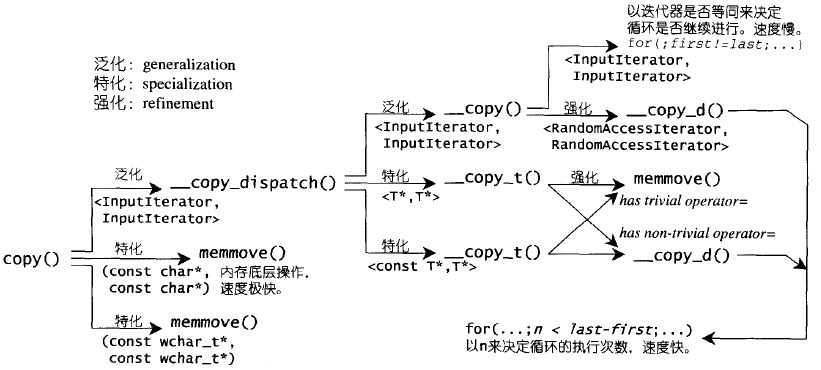

# 第6章 算法

所有的STL算法都作用在由迭代器[first,last)所标出来的区间上

**质变算法**（mutating algorithms）：运算过程中会更改区间内（迭代器所指）的元素的内容

**非质变算法**（nomutating algorithms）：运算过程中不会改变区间内（迭代器所指）的元素内容

表格中凡是不在STL标准规格之列的SGI专属算法，都以*加以标示






### 6.1.5 STL算法的一般形式

**函数缺省行为**：

许多STL算法不只支持一个版本：这一类算法的某个版本采用缺省运算行为，另一个版本提供额外参数，接受外界传入一个仿函数，以便采用其他策略。有两种形式：

- 重载函数：例如unique()
- 不同名称的函数：使用非缺省行为的版本一般以`_if`结尾，如`find_if()`

**质变算法的原地算法**：

- in-place（就地进行）版：就地改变操作对象
- copy（另地进行）版：将操作对象的内容复制一份副本，然后再副本上进行修改并返回该副本。copy版总是以`_copy`结尾，如`replace()_copy()`

但并不是所有质变算法都有copy版本，例如sort()就没有，如果希望“无copy版本”的算法实施于某一段区间元素的副本身上，调用函数前需自行制作副本，并以副本调用函数

**算法位置**

- 数值算法：实现于SGI的`<stl_numeric.h>`，是内部文件。STL规定用户必须包含的是上层的`<numeric>`
- 其他算法：实现于SGI的`<stl_algobase.h>`（基本算法）和`<stl_algo.h>`（其他算法），是内部文件。STL规定用户必须包含的是上层的`<algorithm>`

## 6.3 数值算法 <stl_numeric.h>

### 6.3.2 accumulate

accumulate用来计算init和[first,last)内所有元素的和

**例子**：

```c++
int ia[5] = { 1, 2, 3, 4, 5 };
vector<int> iv(ia, ia+5);

//结果为15，即0+1+2+3+4+5=15
accumulate(iv.begin(), iv.end(), 0);

//结果为-15，即0-1-2-3-4-5=-15
accumulate(iv.begin(), iv.end(), 0, minus<int>());
```

**源码分析**：

```c++
template <class InputIterator, class T>
T accumulate(InputIterator first, InputIterator last, T init) {
  for ( ; first != last; ++first)
    init = init + *first;
  return init;
}

template <class InputIterator, class T, class BinaryOperation>
T accumulate(InputIterator first, InputIterator last, T init,
             BinaryOperation binary_op) {
  for ( ; first != last; ++first)
    init = binary_op(init, *first);
  return init;
}
```

## 6.4 基本算法 <stl_algobase.h>

> equal() 

如果两个序列在[first,last)区间内相等，equal返回true

前提：两个序列个数相等

```c++
template <class InputIterator1, class InputIterator2>
inline bool equal(InputIterator1 first1, InputIterator1 last1,
		  InputIterator2 first2) {
  for ( ; first1 != last1; ++first1, ++first2)
    if (*first1 != *first2)
      return false;
  return true;
}

template <class InputIterator1, class InputIterator2, class BinaryPredicate>
inline bool equal(InputIterator1 first1, InputIterator1 last1,
		  InputIterator2 first2, BinaryPredicate binary_pred) {
  for ( ; first1 != last1; ++first1, ++first2)
    if (!binary_pred(*first1, *first2))
      return false;
  return true;
}
```

> fill()

将[first,last)内的所有元素改填新值

```c++
template <class ForwardIterator, class T>
void fill(ForwardIterator first, ForwardIterator last, const T& value) {
  for ( ; first != last; ++first)
    *first = value;
}
```

> fill_n()

将[first,last)内的前n个元素改填新值，返回的迭代器指向被填入的最后一个元素的下一个位置

```c++
template <class OutputIterator, class Size, class T>
OutputIterator fill_n(OutputIterator first, Size n, const T& value) {
  for ( ; n > 0; --n, ++first)
    *first = value;
  return first;
}
```

> iter_swap()

将两个ForwardIterator所指向的对象对调



```c++
template <class ForwardIterator1, class ForwardIterator2>
inline void iter_swap(ForwardIterator1 a, ForwardIterator2 b) {
  __iter_swap(a, b, value_type(a));
}

template <class ForwardIterator1, class ForwardIterator2, class T>
inline void __iter_swap(ForwardIterator1 a, ForwardIterator2 b, T*) {
  T tmp = *a;
  *a = *b;
  *b = tmp;
}

template <class Iterator>
inline typename iterator_traits<Iterator>::value_type*
value_type(const Iterator&) {
  return static_cast<typename iterator_traits<Iterator>::value_type*>(0);
}
```

> max()

取两个对象中的较大值

```c++
template <class T>
inline const T& max(const T& a, const T& b) {
  return  a < b ? b : a;
}

template <class T, class Compare>
inline const T& max(const T& a, const T& b, Compare comp) {
  return comp(a, b) ? b : a;
}
```

> min()

取两个对象中的较小值

```c++
template <class T>
inline const T& min(const T& a, const T& b) {
  return b < a ? b : a;
}

template <class T, class Compare>
inline const T& min(const T& a, const T& b, Compare comp) {
  return comp(b, a) ? b : a;
}
```

> swap()

交换两个对象的内容

```c++
template <class T>
inline void swap(T& a, T& b) {
  T tmp = a;
  a = b;
  b = tmp;
}
```

> copy()

SGI STL的copy算法用尽各种办法，包括函数重载、类型特性、偏特化等编程技巧来尽可能地加强效率



copy将输入区间`[first,last)`内的元素复制到输出区间`[result,result+(last-first))`内，也就是说，它会执行赋值操作`*result = *first,*(result+1) = *(first+1),...`依次类推。返回一个迭代器：`result+(last-first)`。copy对其template参数所要求的条件非常宽松。其输入区间只需由inputIterators构成即可，输出区间只需要由OutputIterator构成即可。这**意味着可以使用copy算法，将任何容器的任何一段区间的内容，复制到任何容器的任何一段区间上** 


**重叠问题**：如果输出区间的起点位于输入区间内，copy算法便**可能**会在输入区间的（某些）元素尚未被复制之前，就覆盖其值，导致错误。如果copy算法的迭代器决定调用memmove()来执行任务，就不会造成上述错误。因为memmove()会将整个输入区间的内容复制下来，没有被覆盖的危险

**空容器copy问题**：copy会为输出区间内的元素赋予新值，而不是产生新的元素。它不能改变输出区间的迭代器个数。换句话说，copy不能直接用来将元素插入空容器中。如果想将元素插入序列之内，要么使用序列容器的insert成员函数，要么使用copy算法并搭配insert_iterator 

**copy()函数**：

有三个版本：

- 1.完全泛化版本
  - **__copy_dispatch()**
- 2.针对原生指针const char*的特化版本
  - **memmove()**
- 3.针对原生指针const wchar_t*的特化版本
  - **memmove()**

```c++
//1.完全泛化版本
template <class InputIterator, class OutputIterator>
inline OutputIterator copy(InputIterator first, InputIterator last,
                           OutputIterator result)
{
  return __copy_dispatch<InputIterator,OutputIterator>()(first, last, result);
}

//针对原生指针const char*的特化版本（memmove）
inline char* copy(const char* first, const char* last, char* result) {
  memmove(result, first, last - first);
  return result + (last - first);
}

//3.针对原生指针const wchar_t*的特化版本（memmove）
inline wchar_t* copy(const wchar_t* first, const wchar_t* last,
                     wchar_t* result) {
  memmove(result, first, sizeof(wchar_t) * (last - first));
  return result + (last - first);
}
```

**__copy_dispatch()**：

有三个版本：

- 1.完全泛化版本
  - __copy(）（InputIterator版本）：以迭代器等同于否，决定循环是否继续，效率低
  - __copy(）（RandomAccessIterator版本）
    - __copy_d()：以n决定循环的次数，效率快
- 2.指针对两个参数都是`T*`指针形式的偏特化版本
  - __copy_t()(无用赋值操作符版)
    - memmove()
  - __copy_t()(有用赋值操作符版)
    - __copy_d()
- 3.针对第一个参数为`const T*`指针形式，第二个参数为`T*`指针形式的偏特化版本
  - __copy_t()(无用赋值操作符版)
    - memmove()
  - __copy_t()(有用赋值操作符版)
    - __copy_d()

```c++
//1.完全泛化版本
template <class InputIterator, class OutputIterator>
struct __copy_dispatch
{
  OutputIterator operator()(InputIterator first, InputIterator last,
                            OutputIterator result) {
    return __copy(first, last, result, iterator_category(first));
  }
};

//2.指针对两个参数都是T*指针形式的偏特化版本
template <class T>
struct __copy_dispatch<T*, T*>
{
  T* operator()(T* first, T* last, T* result) {
    typedef typename __type_traits<T>::has_trivial_assignment_operator t; 
    return __copy_t(first, last, result, t());
  }
};

//3.针对第一个参数为const T*指针形式，第二个参数为T*指针形式的偏特化版本
template <class T>
struct __copy_dispatch<const T*, T*>
{
  T* operator()(const T* first, const T* last, T* result) {
    typedef typename __type_traits<T>::has_trivial_assignment_operator t; 
    return __copy_t(first, last, result, t());
  }
};
```

**__copy(）函数**：

```c++
//InputIterator版本
template <class InputIterator, class OutputIterator>
inline OutputIterator __copy(InputIterator first, InputIterator last,
                             OutputIterator result, input_iterator_tag)
{
  //以迭代器等同于否，决定循环是否继续，效率低
  for ( ; first != last; ++result, ++first)
    *result = *first;
  return result;
}

//RandomAccessIterator版本
template <class RandomAccessIterator, class OutputIterator>
inline OutputIterator 
__copy(RandomAccessIterator first, RandomAccessIterator last,
       OutputIterator result, random_access_iterator_tag)
{
  return __copy_d(first, last, result, distance_type(first));
}
```

**__copy_t()函数**：

```c++
//无用赋值操作符版
template <class T>
inline T* __copy_t(const T* first, const T* last, T* result, __true_type) {
  memmove(result, first, sizeof(T) * (last - first));
  return result + (last - first);
}

//有用赋值操作符版
template <class T>
inline T* __copy_t(const T* first, const T* last, T* result, __false_type) {
  return __copy_d(first, last, result, (ptrdiff_t*) 0);
}
```

**__copy_d()函数**：

```c++
template <class RandomAccessIterator, class OutputIterator, class Distance>
inline OutputIterator
__copy_d(RandomAccessIterator first, RandomAccessIterator last,
         OutputIterator result, Distance*)
{
  for (Distance n = last - first; n > 0; --n, ++result, ++first) 
    *result = *first;
  return result;
}
```

> copy_backward() 


