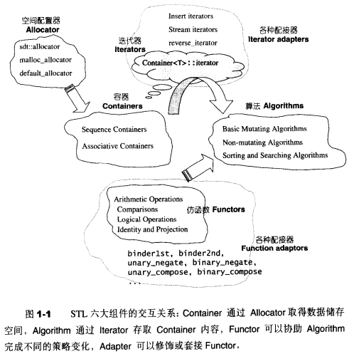
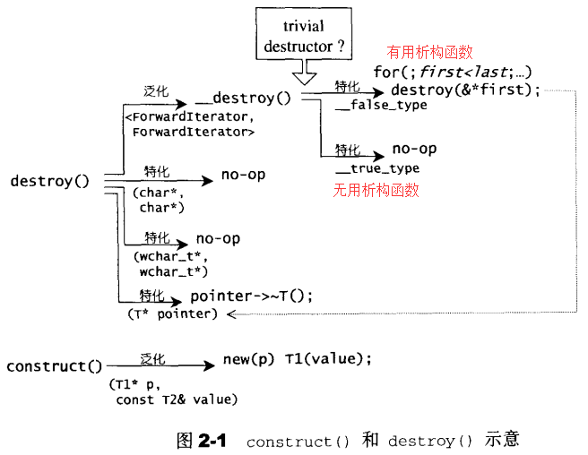
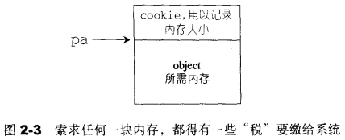
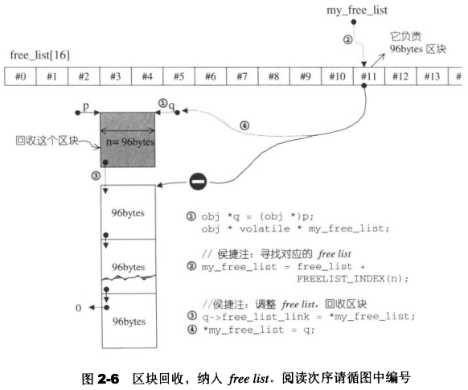

STL源码剖析 笔记

<!-- GFM-TOC -->
* [第1章 STL概论与版本简介](#第1章-stl概论与版本简介)
    * [1.2 STL 六大组件 功能与运用](#12-stl-六大组件-功能与运用)
    * [1.3 GNU 源代码开放精神](#13-gnu-源代码开放精神)
    * [1.8 SGI STL 实现版本](#18-sgi-stl-实现版本)
        * [1.8.1 GNU C++ headers 文件分布](#181-gnu-c++-headers-文件分布)
        * [1.8.2 SGI STL 文件分布与简介](#182-sgi-stl-文件分布与简介)
        * [1.8.3 SGI STL 的编译器组态设置](#183-sgi-stl-的编译器组态设置)
    * [1.9 可能令你困惑的 C++ 语法](#19-可能令你困惑的-c++-语法)
* [第2章 空间配置器 allocator](#第2章-空间配置器-allocator)
    * [2.1 空间配置器的标准接口](#21-空间配置器的标准接口)
    * [2.2 具备次配置力（sub-allocation）的SGI空间配置器](#22-具备次配置力sub-allocation的sgi空间配置器)
        * [2.2.1 SGI 标准的空间配置器 allocator](#221-sgi-标准的空间配置器-allocator)
        * [2.2.2 SGI 特殊的空间配置器 alloc](#222-sgi-特殊的空间配置器-alloc)
        * [2.2.3 构造和析构基本工具：construct()和destroy()](#223-构造和析构基本工具construct和destroy)
        * [2.2.4 空间的配置与释放 alloc](#224-空间的配置与释放-alloc)
        * [2.2.5 第一级配置器 __malloc_alloc_template 剖析](#225-第一级配置器-__malloc_alloc_template-剖析)
        * [2.2.6 第二级配置器 __default_alloc_template 剖析](#226-第二级配置器-__default_alloc_template-剖析)
        * [2.2.7 空间配置函数 allocate()](#227-空间配置函数-allocate)
        * [2.2.8 空间释放函数 deallocate()](#228-空间释放函数-deallocate)
        * [2.2.9 重新填充 refill()](#229-重新填充-refill)
        * [2.2.10 内存池 chunk_alloc()](#2210-内存池-chunk_alloc)
    * [2.3 内存基本处理工具](#23-内存基本处理工具)
        * [2.3.1 uninitialized_copy](#231-uninitialized_copy)
        * [2.3.2 uninitialized_fill](#232-uninitialized_fill)
        * [2.3.3 uninitialized_fill_n](#233-uninitialized_fill_n)
* [第3章 迭代器概念与traits编程技法](#第3章-迭代器概念与traits编程技法)
<!-- GFM-TOC -->

# 第1章 STL概论与版本简介

## 1.2 STL 六大组件 功能与运用

STL提供**六大组件**，彼此可以组合套用： 

- 1.**容器**（containers）：各种数据结构，如：vector、list、deque、set、map。用来存放数据。从实现的角度来看，STL容器是一种**class template** 
- 2.**算法**（algorithms）：各种常用算法，如：sort、search、copy、erase。从实现的角度来看，STL算法是一种 **function template**
- 3.**迭代器**（iterators）：容器与算法之间的胶合剂，是所谓的“泛型指针”。共有五种类型，以及其他衍生变化。从实现的角度来看，迭代器是一种将 `operator*`、`operator->`、`operator++`、`operator- -` 等指针相关操作进行重载的**class template**。所有STL容器都有自己专属的迭代器，只有容器本身才知道如何遍历自己的元素。原生指针(native pointer，就是普通指针)也是一种迭代器
- 4.**仿函数**（functors）：行为类似函数，可作为算法的某种策略（policy）。从实现的角度来看，仿函数是一种重载了operator()的class或**class template**。一般的函数指针也可视为狭义的仿函数
- 5.**配接器**（adapters）：一种用来修饰容器、仿函数、迭代器接口的东西。例如：STL提供的queue 和 stack，虽然看似容器，但其实只能算是一种容器配接器，因为它们的底部完全借助deque，所有操作都由底层的deque供应。
  - 改变 functors接口者，称为function adapter
  - 改变 container 接口者，称为container adapter
  - 改变iterator接口者，称为iterator adapter
- 6.**配置器**（allocators）：负责空间配置与管理。从实现的角度来看，配置器是一个实现了动态空间配置、空间管理、空间释放的**class template**



## 1.3 GNU 源代码开放精神

**GNU**(音译为“革奴”)，代码**G**UN is **N**ot **U**nix。GNU计划中，早期最著名的软件包括Emacs和GCC，晚期最著名的是Linux操作系统

**GNU以所谓的GPL(General Public License，广泛开放授权)来保护(或说控制)其成员**：使用者可以自由阅读与修改GPL软件的源码，但如果使用者要传播借助GPL软件而完成的软件，必须也同意GPL规范。这种精神主要是强迫人们分享并回馈他们对GPL软件的改善。得之于人，舍于人 

## 1.8 SGI STL 实现版本

**SGI STL实现版本**

- 继承自HP版本，所以每一个头文件都有HP的版本说明 
- 此外还加上SGI的公司版权声明 
- 不属于GNU GPL范畴，但属于open source范畴 
- **被GCC采用**（GCC对C++语言特性支持很好，连带给予了SGI STL正面影响） 
- 可读性很高 
- 为了具有高度移植性，考虑了不同编译器的不同编译能力 

### 1.8.1 GNU C++ headers 文件分布

**版本**：[cygnus c++ 2.91.57 for windows](../../source/STL/cygwin-b20.1-full2.zip)

在[[g++/](../../source/STL/g++)]下有128个文件，在[[g++/std](../../source/STL/g++/std)]下有8个文件

### 1.8.2 SGI STL 文件分布与简介

上一小节所呈现的众多头文件中，概略可分为五组：

- 1.**C++标准规范下的C头文件(无扩展名)**：cstdio，cstdlib，cstring，...
- 2.**C++标准程序库中不属于STL范畴者**：stream，string，...
- 3.**STL标准头文件(无扩展名)**：vector，deque，list，map，algorithm，functional，...
- 4.**C++标准定案前，HP所规范的STL头文件**：vector.h，deque.h，list.h，map.h，algo.h，functional.h，...
- 5.**SGI STL内部文件**(**STL真正实现与此**)：stl_vector.h，stl_deque.h，stl_list.h，stl_map.h，stl_algo.h，stl_functional，...

前两组不在本书讨论范围内

### 1.8.3 SGI STL 的编译器组态设置

不同的编译器**对C++语言的支持程度**不尽相同。作为一个希望具备广泛移植能力的程序库，SGI STL准备了一个**环境组态文件**[<stl_config.h>](../source/STL/g++/stl_config.h)，其中定义了许多常量，标示某些组态的成立与否，所有STL头文件都会直接或间接包含这个组态文件，并以条件式写法，让预处理器根据各个常量决定取舍哪一段程序代码，例如： 


<stl_config.h>文件起始处有一份常量定义说明，然后针对各家不同的编译器以及可能的不同版本，给予常量设定

## 1.9 可能令你困惑的 C++ 语法

>  1.9.1 stl_config.h 中的各种组态

- 组态3：**__STL_STATIC_TEMPLATE_MEMBER_BUG**
  - 测试在class template中拥有static data members 
- 组态5：**__STL_CLASS_PARTIAL_SPECIALIZATION**
  - 测试class template partial specialization（类模板偏特化）——在class template的一般化设计之外，特别针对某些template参数做特殊设计  
- 组态6：**__STL_FUNCTION_TMPL_PARTIAL_ORDER**
  - 测试函数模板的偏特化
- 组态7：**__STL_EXPLICIT_FUNCTION_TMPL_ARGS**
  - 整个SGI STL内都没有用到这一常量定义
- 组态8：**__STL_MEMBER_TEMPLATES**
  - 测试 class template之内可否再有 template（members） 
- 组态10：**__STL_LIMITED_DEFAULT_TEMPLATES**
  - 测试template 参数可否根据前一个template参数而设定默认值 
- 组态11：**__STL_NON_TYPE_TMPL_PARAM_BUG**
  - 测试 class template 可否拥有 non-type template（非类型模板参数） 参数
- 组态：**__STL_EXPLICIT_FUNCTION_TMPL_ARGS**（bound friend templates）

```c++
 * ifdef __STL_EXPLICIT_FUNCTION_TMPL_ARGS
 * 	define __STL_NULL_TMPL_ARGS <>
 * else
 * 	define __STL_NULL_TMPL_ARGS
 * endif
 
 这个组态常量常常出现在类似这样的场合（class template的friend函数声明）：
 * // in <stl_stack.h>
 * template <class T,class Sequence = deque<T> >
 * class stack{
 * 	friend bool operator== __STL_NULL_TMPL_ARGS (const stack &,const stack &);
 * 	friend bool operator< __STL_NULL_TMPL_ARGS (const stack &,const stack &);
 * };
 展开后就变成了：
 * template <class T,class Sequence = deque<T> >
 * class stack{
 * 	friend bool operator== <> (const stack &,const stack &);
 * 	friend bool operator< <> (const stack &,const stack &);
 * };
```

- 组态：**__STL_TEMPLATE_NULL**（class template explicit specialization）

```c++
 * ifdef __STL_CLASS_PARTIAL_SPECIALIZATION
 * 	define __STL_TEMPLATE_NULL template<>
 * else
 * 	define __STL_TEMPLATE_NULL
 * endif
 
 这个组态常量常常出现在类似这样的场合：
 * // in <type_traits.h>
 * template <class type> struct __type_traits { ...};
 * __STL_TEMPLATE_NULL struct __type_traits<char> { ...};
 *
 * // in <stl_hash_fun.h>
 * template <class key> struct hash { ...};
 * __STL_TEMPLATE_NULL struct hash<char> { ...};
 * __STL_TEMPLATE_NULL struct hash<unsigned char> { ...};
 展开后就变成了：
 * template <class type> struct __type_traits { ...};
 * template<> struct __type_traits<char> { ...};
 *
 * template <class key> struct hash { ...};
 * template<> struct hash<char> { ...};
 * template<> struct hash<unsigned char> { ...};
```

>  1.9.2 临时对象的产生与运用

有时候刻意制造一些临时对象，刻意使程序干净清爽

刻意制造临时对象的**方法**是：在类型别名之后直接加上一堆小括号，并可指定初值，**例如**：`Shape(5,3)`或`int(8)`。其**意义**相当于调用相应的构造函数且不指定对象名称

STL最常将此技巧用于**仿函数**与**算法**的搭配上，例如：

```c++
template <typename T>
class print
{
public:
    void operator()(const T& elem)
    { cout << elem << ' '; }
};
//print<int>()是一个临时对象，不是一个函数调用操作
//这个对象被传入for_each中起作用，当for_each结束时
//这个临时对象生命周期结束
for_each(iv.begin(), iv.end(), print<int>());
```

>  1.9.3 静态常量整数成员在 class 内部直接初始化

如果类内含const static 整型数据成员，根据C++标准规定，我们可以在类内直接给予初值。所谓“整型”，不单只是int

```c++
template<typename T>
class testClass
{
public:
    static const int _datai = 5;
    static const long _datal = 3L;
    static const char _datac = 'c';
};
```

>  1.9.4 自增/自减/解引用 操作符

**自增（++）/解引用（*）**操作符在迭代器的实现上占有非常重要的地位，因为任何一个迭代器**必须**实现前进和取址功能

**有些**迭代器有双向移动功能，因此还需要实现**自减（--）**操作符

>  1.9.5 前闭合后开区间表示法 [)

一对迭代器所标示的是个所谓的前闭后开区间，以[first, last)表示。整个实际范围从first开始，直到last-1

> 1.9.6 function call 操作符（operator()）

许多STL算法都提供了两个版本

- 1.用于一般情况（例如排序时以递增方式排序）
- 2.用于特殊情况（例如排序时由使用者指定以何种特殊关系进行排序）

第2种情况中，需要用户指定某个条件或某个策略，而条件或策略的背后由一整组操作构成，便需要某种特殊的东西来代表这“一整组操作”，有两种方法：

- 1.**函数指针**。缺点：
  - 无法持有自己的状态（局部状态）
  - 无法达到组件技术上的可适配性（无法再将某些修饰条件加诸于其上而改变其状态）
- 2.**仿函数**：使用起来像函数一样的东西。如你针对某个类进程operator()重载，该类就称为一个仿函数

```c++
template <class T>
struct plus
{
	T operator()(const T& x, const T& y) const { return x + y; }
};

int main()
{
    //第1对括号产生仿函数的临时对象
    //第2对括号，以该临时对象，调取其operator()函数
    cout<< plus<int>()(43,50) << endl;
}
```

# 第2章 空间配置器 allocator

不称作”内存分配器“，是因为分配的空间不一定是内存，可以是磁盘或其它辅助存储介质。可以实现一个获取磁盘空间的allocator。不过这里介绍的空间分配器获取的空间是内存 

## 2.1 空间配置器的标准接口

```c++
allocator::value_type
allocator::pointer
allocator::const_pointer
allocator::reference
allocator::const_reference
allocator::size_type
allocator::difference_type
//rebind是一个嵌套的class template，class rebind<U> 拥有唯一成员other,是一个typedef，代表allocator<U>
allocator::rebind
//构造函数
allocator::allocator()
//拷贝构造函数
allocator::allocator(const allocator&) 
//泛化的拷贝构造函数
template <class U> allocator::allocator(const allocator<U>&)
//析构函数
allocator::~allocator()
//返回某个对象的地址，算式 a.address(x) 等同于&x
pointer allocator::address(reference x) const 
//返回某个const对象的地址，算式 a.address(x) 等同于&x
const_pointer allocator::address(const_reference x) const
//配置空间，足以容纳n个T对象
//第2个参数是提示，实现上可能会利用它来增进区域性，或完全忽略
pointer allocator::allocate(size_type n,const void* = 0)
//归还之前配置的空间
void allocator::deallocate(pointer p,size_type n)
//返回可成功配置的最大量
size_type allocator::max_size() const
//根据x（调用p所指向类型的构造函数），在p指向的地址构造一个T对象。相当于new((void*)p) T(x)
void allocator::construct(pointer p,const T& x)
//等同于p->~T()，析构地址p的对象
void allocator::destroy(pointer p)
```

**但**这些结构：

**完全无法应用于SGI STL**，因为SGI STL在这个项目上根本就脱离了STL标准规格，使用一个专属的、拥有次层配置能力的、效率优越的特殊分配器。事实上SGI STL仍然提供了一个标准的分配器接口，只是把它做了一层隐藏，这个标准接口的分配器名为simple_alloc 

## 2.2 具备次配置力（sub-allocation）的SGI空间配置器

SGI STL的配置器与众不同：

- **名称**是alloc（标准为allocator）
- 不接受任何参数

在程序中显示采用SGI配置器

```c++
vector<int, std::alloc> iv;
```

SGI STL未符合标准，但通常不会给我们带来困扰，因为通常使用默认的空间配置器，SGI STL的每个容器已经指定其缺省的空间配置器为alloc，如vector的声明：

```c++
template<class T, class Alloc = alloc> //缺省使用alloc为配置器
class vector { ... };
```

### 2.2.1 SGI 标准的空间配置器 allocator

虽然SGI也定义有一个符合部分标准、名为[allocator](../../source/STL/g++/defalloc.h)（defalloc.h）的配置器，但SGI自己从未用过它，也不建议我们使用。主要原因是效率不佳，只把C++的::operator new和::operator delete做一层薄薄的包装而已 

### 2.2.2 SGI 特殊的空间配置器 alloc

STL allocator将**配置内存**和**构造对象**分开，将**对象析构**和**释放内存**分开

- **alloc::allocate()**负责内存配置，**alloc::deallocate()**负责释放内存
- **::construct()**负责构造对象，**::destroy()**负责对象析构

STL标准规定分配器定义于`<memory>`中，SGI`<memory>`内含两个文件（负责分离的2阶段操作 ）：

[<memory>](../../source/STL/g++/memory)

```c++
#include <stl_alloc.h>      //负责内存空间的配置与释放
#include <stl_construct.h>  //负责对象内容的构造与析构
```


### 2.2.3 构造和析构基本工具：construct()和destroy()

[<stl_construct.h>](../../source/STL/g++/stl_construct.h)



**destroy有两个版本**：

- 1.接收一个指针，准备将该指针所指向的析构掉
- 2.接收first和last两个迭代器，准备将[first,last)范围内的所有对象析构掉
  - 有用的析构函数：遍历析构
  - 无用的析构函数：什么也不做

**注意**：STL规定分配器必须拥有名为construct()和destroy()的两个成员函数，然而SGI特殊的空间分配器std::alloc并未遵守这一规则，所以实际上这部分属于STL allocator，但不属于std::alloc。即，SGI特殊的空间分配器std::alloc不包含”2.2.3  造和析构基本工具：construct()和destroy()“，只包含”2.2.4 空间的配置与释放，std::alloc“

### 2.2.4 空间的配置与释放 alloc

空间配置和空间释放由[<stl_alloc.h>](../../source/STL/g++/stl_alloc.h)负责

SGI对内存分配与释放的设计哲学如下： 

- 向system heap申请空间
- 考虑多线程状态（本章的讨论暂不考虑多线程）
- 考虑内存不足时的应变措施
- 考虑过多“小型区块”可能造成的内存碎片问题（**SGI设计了双层级分配器**）

C++的内存分配基本操作是::operator new(),内存释放基本操作是::operator delete()。这两个全局函数相当于C的malloc()和free()函数。SGI正是以malloc和free()完成内存的分配与释放

**双层级配置器**：

考虑到小型区块所可能造成的内存碎片问题，SGI设计了双层级分配器： 

- **第一级分配器**
  -  直接使用malloc()和free()
- **第二级分配器**：视情况采用不同的策略
  -  当分配区块超过128bytes时，视为“足够大”，调用第一级分配器
  - 当分配区块小于128bytes时，视为“过小”，为了降低额外负担，采用复杂的memory pool整理方式，不再求助于第一级分配器


整个设计究竟只开放第一级配置器，或是同时开放第二级配置器，取决于**__USE_MALLOC**是否被定义（定义则只开放第一级配置器）

无论alloc被定义为第一级或第二级分配器，SGI还为它再包装一个接口，使分配器的接口能够符合STL规格： 

```c++
//Alloc传入的是配置器的类型（一级或二级）
template<class T, class Alloc>
class simple_alloc {

public:
    static T *allocate(size_t n)
                { return 0 == n? 0 : (T*) Alloc::allocate(n * sizeof (T)); }
    static T *allocate(void)
                { return (T*) Alloc::allocate(sizeof (T)); }
    static void deallocate(T *p, size_t n)
                { if (0 != n) Alloc::deallocate(p, n * sizeof (T)); }
    static void deallocate(T *p)
                { Alloc::deallocate(p, sizeof (T)); }
};
```

内部四个成员函数其实都是单纯的转调用，调用传递给配置器（一级或二级）的成员函数，**这个接口使分配器的分配单位从bytes转为个别元素的大小**。SGI STL容器全部使用这个simple_alloc接口，如图：


### 2.2.5 第一级配置器 __malloc_alloc_template 剖析

**源码分析**：

第一级分配器__malloc_alloc_template定义在头文件[<stl_alloc.h>](../../source/STL/g++/stl_alloc.h)中： 

[__malloc_alloc_template实现](STL/__malloc_alloc_template.md)

- 1.第一级配置器以malloc()、free()、realloc()等C函数执行实际的内存分配、释放、重分配操作 
- 2.实现出类似C++ new-handler的机制
  - 由于SGI以malloc而非::operator new来配置内存，因此SGI不能直接使用C++的set_new_handler() ，必须仿真一个类似的函数
  - **C++ new handler机制**：可以要求系统在内存分配需求无法被满足时，调用一个你所指定的函数。换句话说，一旦::operator new无法完成任务，在丢出std::bad_alloc异常状态之前，会先调用由客户指定的处理例程，该处理例程通常即被称为new-handler
- 3.oom_malloc和oom_realloc：循环调用“内存不足处理例程”，期望在某次调用之后，获得足够的内存而圆满完成任务。如果“内存不足处理例程”并未被客端设定，这两个函数便不客气地调用__THROW_BAD_ALLOC丢出**bad_alloc**异常信息，或利用exit(1)中止程序

### 2.2.6 第二级配置器 __default_alloc_template 剖析

第二级分配器多了一些机制，避免太多小额区块造成内存的碎片，小额区块带来以下问题： 

- 1.产生内存碎片 
- 2.配置时的额外负担：额外负担是一些区块信息，用以管理内存。区块越小，额外负担所占的比例就越大，越显浪费 



SGI第二级配置器的**做法**：

- 1.**大区块**：区块大于128bytes时
  - 移交第一级配置器处理
- 2.**小额区块**：当区块小于等于128bytes时 
  - 以**内存池管理(也称为次层分配)** 
    - 每次分配一大块内存，并维护对应的自由链表(free-list)，下次若载有相同大小的内存需求，就直接从free-list中拨出。如果客户释放小额区块，就由分配器回收到free-list中
    -  **维护有16个free-list**，各自管理大小分别为8，16，24，32，40，48，56，64，72，80，88，96，104，112，120，128bytes的小额区块 
    - SGI第二级分配器会主动将任何小额区块的内存需求量上调至8的倍数（例如客户要求30bytes，就自动调整为32bytes）

**free-list节点结构**：

```c++
union obj{
    union obj * free_list_link; //系统视角
    char client_data[1];        //用户视角
}
```

为了维护链表，每个节点需要额外的指针（指向下一个节点），解决办法：使用union

- 从obj的第一字段观之，obj可被视为一个指针，指向相同形式的另一个obj
- 从obj的第二字段观之，obj可视为一个指针，指向实际区块


**源码分析**：

第二级分配器__default_alloc_template定义在头文件[<stl_alloc.h>](../../source/STL/g++/stl_alloc.h)中：

[__default_alloc_template实现](STL/__default_alloc_template.md)

### 2.2.7 空间配置函数 allocate()

函数**做法**：

- 1.若区块大于128bytes，就调用第一级分配器 
- 2.若区块小于128bytes，检查对应的free-list 
  - 若free-list之内有可用的区块，则直接使用 
  - 若free-list之内没有可用区块，将区块大小调至8倍数边界，调用refill()，准备为free-list重新填充空间 

**源码分析**：

allocate()定义在头文件[<stl_alloc.h>](../../source/STL/g++/stl_alloc.h)中

[allocate()实现](STL/allocate().md)


### 2.2.8 空间释放函数 deallocate()

函数**做法**：

- 1.若区块大于128bytes，就调用第一级分配器 
- 2.若区块小于128bytes，找出对应的free-list，将区块回收 

**源码分析**：

deallocate()定义在头文件[<stl_alloc.h>](../../source/STL/g++/stl_alloc.h)中

[deallocate()实现](STL/deallocate().md)



### 2.2.9 重新填充 refill()

allocate()发现free list中没有可用块区了时，就调用refill()，准备为free list重新填充空间。新的空间将取自内存池（由chunk_alloc()完成）。缺省取得20个新节点（新区块），内存池空间不足时获得的节点数可能小于20

**源码分析**：

refill()定义在头文件[<stl_alloc.h>](../../source/STL/g++/stl_alloc.h)中

[refill()实现](STL/refill().md)

### 2.2.10 内存池 chunk_alloc()

该函数的工作：从内存池中取出空间给free list使用

**函数思路**：

chunk_alloc()函数从内存池申请空间，根据`end_free-start_free`判断内存池中剩余的空间

- 如果剩余空间充足 
  - 直接调出20个区块返回给free-list
- 如果剩余空间不足以提供20个区块，但足够供应至少1个区块
  - 拨出这不足20个区块的空间（能分配多少区块，就分配多少区块）
- 如果剩余空间连一个区块都无法供应
  - 试着让内存池中的残余零头还有利用价值，分配给适当的free-list
  - 利用malloc()从heap中分配内存（大小为需求量的2倍，加上一个随着分配次数增加而越来越大的附加量），为内存池注入新的可用空间
    - 如果malloc()获取失败，chunk_alloc()就四处寻找有无”尚有未用且区块足够大“的free-list（大小为[size,128]的free-list）。找到了就挖出一块交出。递归调用自身
    - 如果上一步仍为失败，那么就调用第一级分配器，第一级分配器有out-of-memory处理机制，或许有机会释放其它的内存拿来此处使用。如果可以，就成功，否则抛出bad_alloc异常 
  - 如果上面的步骤找到一定的内存空间，则递归调用自身

**源码分析**：

chunk_alloc()定义在头文件[<stl_alloc.h>](../../source/STL/g++/stl_alloc.h)中

[chunk_alloc()实现](STL/chunk_alloc().md)

**例子**：

- 1.一开始，客端调用chunk_alloc(32,20)，于是malloc()分配40个32bytes区块，其中第1个交出，另19个交给free-list[3]维护，余20个留给内存池 
- 2.接下来客户调用chunk_alloc(64,20)，此时free_list[7]空空如也，必须向内存池申请。内存池只能供应(32*20)/64=10个64bytes区块（步骤1中剩余的），就把这10个区块返回，第1个交给客户，余9个由free_list[7]维护 
- 3.此时内存池全空。接下来再调用chunk_alloc(96,20)，此时free-list[11]空空如也，必须向内存池申请。而内存池此时也为空，于是以malloc()分配40+n(附加量)个96bytes区块，其中第1个交出，另19个交给free-list[11]维护，余20+n(附加量)个区块留给内存池... 


## 2.3 内存基本处理工具

STL定义了5个全局函数，作用于未初始化空间上：

- 1.construct()
- 2.destroy()
- 3.uninitialized_copy()，对应于高层函数copy()
- 4.uninitialized_fill()，对应于高层函数fill()
- 5.uninitialized_fill_n()，对应于高层函数fill_n()

本节分析后3个函数，如果要使用后3个函数，应该包含[<memory>](../../source/STL/g++/memory)，但SGI把它们实际定义于[<stl_uninitialized.h>](../../source/STL/g++/stl_uninitialized.h)

一些需要提前知道的知识：**POD**

POD意指Plain Old Data，也就是标量类型(scalar types)或传统的C struct类型。POD类型必然拥有trivial ctor/dtor/copy/assignment函数。因此，可以对POD类型采用最有效的初值填写手法，而对non-POD类型采取最保险的做法 

**三个内存基本函数的泛型版本与特化版本的执行流程**：


### 2.3.1 uninitialized_copy

```c++
template <class InputIterator, class ForwardIterator>
inline ForwardIterator
  uninitialized_copy(InputIterator first, InputIterator last, ForwardIterator result);
```

**三个参数**：

- 1.迭代器first：指向输入端的起始位置
- 2.迭代器last：指向输入端的结束位置（前闭后开区间）
- 3.迭代器result：指向输出端（欲初始化空间）的起始处

uninitialized_copy将内存的配置与对象的构造行为分离开（本函数完成“构造行为”），如果作为输出目的地的[result, result+(last-first))范围内的每一个迭代器i都未初始化，该函数会调用`construct(&*(result+(i-first)),*i)`，产生*i的复制品，放置于输出范围的相对位置上

uninitialized_copy的**用处**：容器的全区间构造函数通常调用该函数来完成，具体过程如下：

- 1.配置内存区块，足以容纳范围内的所有元素
- 2.使用uninitialized_copy()，在该内存区块上构造元素

uninitialized_copy具有**commit or rollbak语意**：要么构造所有元素，要么不构造任何元素，如果任何一个拷贝构造函数丢出异常，必须能够将所有元素析构掉

**uninitialized_copy源码分析**：

```
uninitialized_copy
	---> __uninitialized_copy //判断first是否为POD
		---> __uninitialized_copy_aux(...,__true_type) //first为POD
			---> copy(first, last, result);//交给高阶函数执行，STL的copy()
		---> __uninitialized_copy_aux(...,false_type) //first不是POD
			---> construct(&*cur, *first);
uninitialized_copy(const char* first,...) //针对first为char*的特化版本
uninitialized_copy(const wchar_t* first,...) //针对first为wchar_t*的特化版本
```

[uninitialized_copy()实现](STL/uninitialized_copy().md)

### 2.3.2 uninitialized_fill

```c++
template <class ForwardIterator, class T>
inline void uninitialized_fill(ForwardIterator first, ForwardIterator last, const T& x);
```

**三个参数**：

- 1.迭代器first：指向输出端（欲初始化空间）的起始处
- 2.迭代器last：指向输出端（欲初始化空间）的结束处（前闭后开区间）
- 3.x：表示初值

uninitialized_fill将内存的配置与对象的构造行为分离开（本函数完成“构造行为”），如果作为输出目的地的[first, last)范围内的每一个迭代器i都未初始化，该函数会调用`construct(&*i,x)`，在i所指之处产生x的复制品

uninitialized_fill具有**commit or rollbak语意**：要么构造所有元素，要么不构造任何元素，如果任何一个拷贝构造函数丢出异常，必须能够将所有元素析构掉

**uninitialized_fill源码分析**：

```
uninitialized_fill
	---> __uninitialized_fill //判断first是否为POD
		---> __uninitialized_fill_aux(...,__true_type) //first为POD
			---> fill(first, last, x);//交给高阶函数执行，调用STL算法fill()
		---> __uninitialized_fill_aux(...,false_type) //first不是POD
			---> construct(&*cur, x);
```

[uninitialized_fill()实现](STL/uninitialized_fill().md)

### 2.3.3 uninitialized_fill_n

```c
template <class ForwardIterator, class Size, class T>
inline ForwardIterator uninitialized_fill_n(ForwardIterator first, Size n,const T& x);
```

**三个参数**：

- 1.迭代器first：指向初始化空间的起始处
- 2.n：表示欲初始化空间的大小
- 3.x：表示初值

uninitialized_fill_n将内存的配置与对象的构造行为分离开（本函数完成“构造行为”）。该函数为指定范围内的所有元素设定相同的初值。如果[first, first+n)范围内的每一个迭代器i都未初始化，该函数会调用`construct(&*i,x)`，在i所指之处产生x的复制品

uninitialized_fill_n具有**commit or rollbak语意**：要么构造所有元素，要么不构造任何元素，如果任何一个拷贝构造函数丢出异常，必须能够将所有元素析构掉

**uninitialized_fill_n源码分析**：

```
uninitialized_fill_n
	---> __uninitialized_fill_n //判断first是否为POD
		---> __uninitialized_fill_n_aux(...,__true_type) //first为POD
			---> fill_n(first, n, x);//交给高阶函数执行
		---> __uninitialized_fill_n_aux(...,false_type) //first不是POD
			---> construct(&*cur, x);
```

[uninitialized_fill_n()实现](STL/uninitialized_fill_n().md)

# 第3章 迭代器概念与traits编程技法

iterator模式定义：提供一种方法，使之能够依序巡防某个容器所含的各个元素，而又无需暴露该容器的内部表述方式

迭代器是一种“智能指针”

STL容器都提供专属迭代器

迭代器最重要的编程工作是对operator*（解引用）和operator->（成员访问）进行重载

## 3.3 迭代器相应类别

**相应类别**：迭代器所指之物的类别是相应类别的一种

**需求**：假设算法中有必要声明一个变量，以“迭代器所对象的类别”为类型，如何是好？C++不支持`typeof()`，而`typeid()`只能获得类型名称，而不能用来声明变量

**解决方法**：

- 1.**函数模板的参数推导机制**
  - 缺点：无法用于函数的返回类型声明
- 2.**声明内嵌类型**
  - 缺点：无法用于非类类型，如原生指针。因为非类类型无法声明内嵌类型
- 3.**偏特化**
  - 优点：解决非类类型的“相应类别”萃取

下面对这三个方法详细说明

> **1.函数模板的参数推导机制**


编译器会自动进行template参数推导，于是导出类别T，解决了问题

**缺点**：迭代器所指对象的类别，称为该迭代器的value type。该方法无法将value type用于返回值的类型声明。函数的“模板推导机制”只能推导参数，无法推导函数的返回值类别

> **2.声明内嵌类型**


**注意**：func()的返回类别必须加上关键字typename，因为T是一个模板参数，在它编译器具现化之前，编译器对T一无所知，编译器此时并不知道`MyIter<T>::value_type`代表的是一个类别或是一个成员函数或数据成员。关键字typename的用意在于告诉编译器这是一个类别，如此才能顺利通过编译

**缺点**：并不是所有迭代器都是类类型，原始指针就不是。如果不是类类型，就无法为它定义内嵌类别。但STL绝对必须接受原生指针作为一种迭代器

> **3.偏特化**

解决**非类类型的迭代器**的**相应类别**的萃取

- 指针对迭代器的模板参数为指针，设计特化版本的迭代器
- 针对**指向常数对象的指针**，设计特化版本的迭代器

## 3.4 Traits编程技法

使用3.3节提到的后两种方法实现`iterator_traits`类，该类专门用来“萃取”迭代器的特性

> 常用的迭代器相应类别

最常用到的迭代器相应类别有五种：value type、difference type、pointer、reference、iterator、iterator catagoly，如果你希望你所开发的容器与STL水乳交融，一定要为你的容器的迭代器定义这五种对应类别。“特性萃取机”traits会很忠实地将原汁原味榨取出来

> Traits的实现

```c++
//声明内嵌类型
template <class Iterator>
struct iterator_traits {
  typedef typename Iterator::iterator_category iterator_category;
  typedef typename Iterator::value_type        value_type;
  typedef typename Iterator::difference_type   difference_type;
  typedef typename Iterator::pointer           pointer;
  typedef typename Iterator::reference         reference;
};

//偏特化：原生指针
template <class T>
struct iterator_traits<T*> {
  typedef random_access_iterator_tag iterator_category;
  typedef T                          value_type;
  typedef ptrdiff_t                  difference_type;
  typedef T*                         pointer;
  typedef T&                         reference;
};

//偏特化：指向常数对象的指针
template <class T>
struct iterator_traits<const T*> {
  typedef random_access_iterator_tag iterator_category;
  typedef T                          value_type;
  typedef ptrdiff_t                  difference_type;
  typedef const T*                   pointer;
  typedef const T&                   reference;
};
```

> Traits的使用

```c++
template<class I>
typename iterator_traits<I>::value_type  //函数的返回类型
func(I ite)
{
    return *ite;
}
```

 


