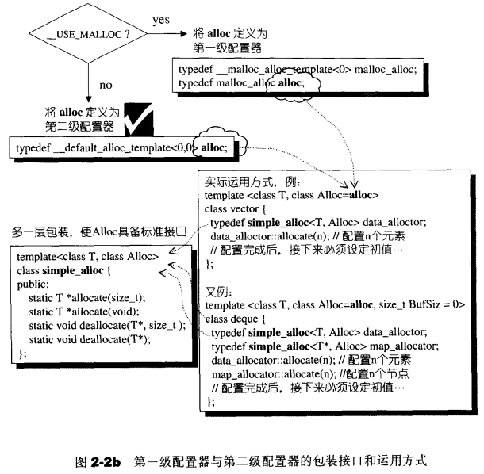
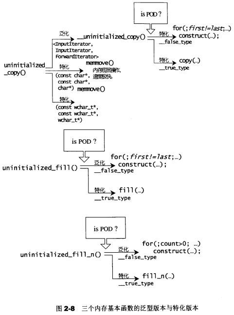
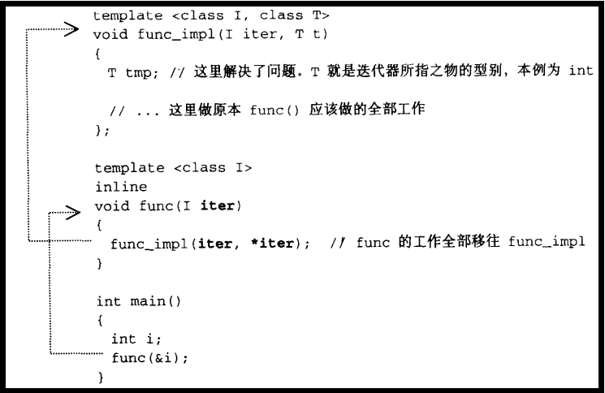
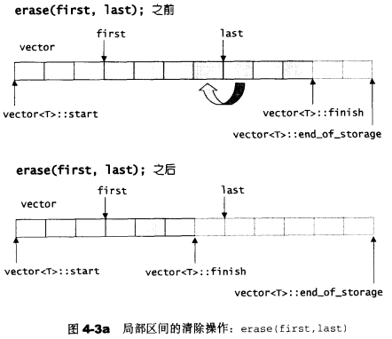
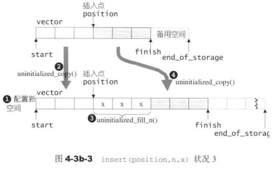
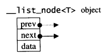
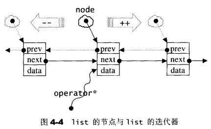
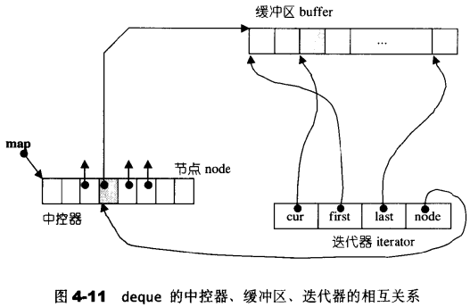

STL源码剖析 笔记

<!-- GFM-TOC -->
* [第1章 STL概论与版本简介](#第1章-stl概论与版本简介)
    * [1.2 STL 六大组件 功能与运用](#12-stl-六大组件-功能与运用)
    * [1.3 GNU 源代码开放精神](#13-gnu-源代码开放精神)
    * [1.8 SGI STL 实现版本](#18-sgi-stl-实现版本)
        * [1.8.1 GNU C++ headers 文件分布](#181-gnu-c++-headers-文件分布)
        * [1.8.2 SGI STL 文件分布与简介](#182-sgi-stl-文件分布与简介)
        * [1.8.3 SGI STL 的编译器组态设置](#183-sgi-stl-的编译器组态设置)
    * [1.9 可能令你困惑的 C++ 语法](#19-可能令你困惑的-c++-语法)
* [第2章 空间配置器 allocator](#第2章-空间配置器-allocator)
    * [2.1 空间配置器的标准接口](#21-空间配置器的标准接口)
    * [2.2 具备次配置力（sub-allocation）的SGI空间配置器](#22-具备次配置力sub-allocation的sgi空间配置器)
        * [2.2.1 SGI 标准的空间配置器 allocator](#221-sgi-标准的空间配置器-allocator)
        * [2.2.2 SGI 特殊的空间配置器 alloc](#222-sgi-特殊的空间配置器-alloc)
        * [2.2.3 构造和析构基本工具：construct()和destroy()](#223-构造和析构基本工具construct和destroy)
        * [2.2.4 空间的配置与释放 alloc](#224-空间的配置与释放-alloc)
        * [2.2.5 第一级配置器 __malloc_alloc_template 剖析](#225-第一级配置器-__malloc_alloc_template-剖析)
        * [2.2.6 第二级配置器 __default_alloc_template 剖析](#226-第二级配置器-__default_alloc_template-剖析)
        * [2.2.7 空间配置函数 allocate()](#227-空间配置函数-allocate)
        * [2.2.8 空间释放函数 deallocate()](#228-空间释放函数-deallocate)
        * [2.2.9 重新填充 refill()](#229-重新填充-refill)
        * [2.2.10 内存池 chunk_alloc()](#2210-内存池-chunk_alloc)
    * [2.3 内存基本处理工具](#23-内存基本处理工具)
        * [2.3.1 uninitialized_copy](#231-uninitialized_copy)
        * [2.3.2 uninitialized_fill](#232-uninitialized_fill)
        * [2.3.3 uninitialized_fill_n](#233-uninitialized_fill_n)
* [第3章 迭代器概念与traits编程技法](#第3章-迭代器概念与traits编程技法)
<!-- GFM-TOC -->

# 第1章 STL概论与版本简介

## 1.2 STL 六大组件 功能与运用

STL提供**六大组件**，彼此可以组合套用： 

- 1.**容器**（containers）：各种数据结构，如：vector、list、deque、set、map。用来存放数据。从实现的角度来看，STL容器是一种**class template** 
- 2.**算法**（algorithms）：各种常用算法，如：sort、search、copy、erase。从实现的角度来看，STL算法是一种 **function template**
- 3.**迭代器**（iterators）：容器与算法之间的胶合剂，是所谓的“泛型指针”。共有五种类型，以及其他衍生变化。从实现的角度来看，迭代器是一种将 `operator*`、`operator->`、`operator++`、`operator- -` 等指针相关操作进行重载的**class template**。所有STL容器都有自己专属的迭代器，只有容器本身才知道如何遍历自己的元素。原生指针(native pointer，就是普通指针)也是一种迭代器
- 4.**仿函数**（functors）：行为类似函数，可作为算法的某种策略（policy）。从实现的角度来看，仿函数是一种重载了operator()的class或**class template**。一般的函数指针也可视为狭义的仿函数
- 5.**配接器**（adapters）：一种用来修饰容器、仿函数、迭代器接口的东西。例如：STL提供的queue 和 stack，虽然看似容器，但其实只能算是一种容器配接器，因为它们的底部完全借助deque，所有操作都由底层的deque供应。
  - 改变 functors接口者，称为function adapter
  - 改变 container 接口者，称为container adapter
  - 改变iterator接口者，称为iterator adapter
- 6.**配置器**（allocators）：负责空间配置与管理。从实现的角度来看，配置器是一个实现了动态空间配置、空间管理、空间释放的**class template**


## 1.3 GNU 源代码开放精神

**GNU**(音译为“革奴”)，代码**G**UN is **N**ot **U**nix。GNU计划中，早期最著名的软件包括Emacs和GCC，晚期最著名的是Linux操作系统

**GNU以所谓的GPL(General Public License，广泛开放授权)来保护(或说控制)其成员**：使用者可以自由阅读与修改GPL软件的源码，但如果使用者要传播借助GPL软件而完成的软件，必须也同意GPL规范。这种精神主要是强迫人们分享并回馈他们对GPL软件的改善。得之于人，舍于人 

## 1.8 SGI STL 实现版本

**SGI STL实现版本**

- 继承自HP版本，所以每一个头文件都有HP的版本说明 
- 此外还加上SGI的公司版权声明 
- 不属于GNU GPL范畴，但属于open source范畴 
- **被GCC采用**（GCC对C++语言特性支持很好，连带给予了SGI STL正面影响） 
- 可读性很高 
- 为了具有高度移植性，考虑了不同编译器的不同编译能力 

### 1.8.1 GNU C++ headers 文件分布

**版本**：[cygnus c++ 2.91.57 for windows](../../source/STL/cygwin-b20.1-full2.zip)

在[[g++/](../../source/STL/g++)]下有128个文件，在[[g++/std](../../source/STL/g++/std)]下有8个文件

### 1.8.2 SGI STL 文件分布与简介

上一小节所呈现的众多头文件中，概略可分为五组：

- 1.**C++标准规范下的C头文件(无扩展名)**：cstdio，cstdlib，cstring，...
- 2.**C++标准程序库中不属于STL范畴者**：stream，string，...
- 3.**STL标准头文件(无扩展名)**：vector，deque，list，map，algorithm，functional，...
- 4.**C++标准定案前，HP所规范的STL头文件**：vector.h，deque.h，list.h，map.h，algo.h，functional.h，...
- 5.**SGI STL内部文件**(**STL真正实现与此**)：stl_vector.h，stl_deque.h，stl_list.h，stl_map.h，stl_algo.h，stl_functional，...

前两组不在本书讨论范围内

### 1.8.3 SGI STL 的编译器组态设置

不同的编译器**对C++语言的支持程度**不尽相同。作为一个希望具备广泛移植能力的程序库，SGI STL准备了一个**环境组态文件**[<stl_config.h>](../source/STL/g++/stl_config.h)，其中定义了许多常量，标示某些组态的成立与否，所有STL头文件都会直接或间接包含这个组态文件，并以条件式写法，让预处理器根据各个常量决定取舍哪一段程序代码，例如： 


<stl_config.h>文件起始处有一份常量定义说明，然后针对各家不同的编译器以及可能的不同版本，给予常量设定

## 1.9 可能令你困惑的 C++ 语法

>  1.9.1 stl_config.h 中的各种组态

- 组态3：**__STL_STATIC_TEMPLATE_MEMBER_BUG**
  - 测试在class template中拥有static data members 
- 组态5：**__STL_CLASS_PARTIAL_SPECIALIZATION**
  - 测试class template partial specialization（类模板偏特化）——在class template的一般化设计之外，特别针对某些template参数做特殊设计  
- 组态6：**__STL_FUNCTION_TMPL_PARTIAL_ORDER**
  - 测试函数模板的偏特化
- 组态7：**__STL_EXPLICIT_FUNCTION_TMPL_ARGS**
  - 整个SGI STL内都没有用到这一常量定义
- 组态8：**__STL_MEMBER_TEMPLATES**
  - 测试 class template之内可否再有 template（members） 
- 组态10：**__STL_LIMITED_DEFAULT_TEMPLATES**
  - 测试template 参数可否根据前一个template参数而设定默认值 
- 组态11：**__STL_NON_TYPE_TMPL_PARAM_BUG**
  - 测试 class template 可否拥有 non-type template（非类型模板参数） 参数
- 组态：**__STL_EXPLICIT_FUNCTION_TMPL_ARGS**（bound friend templates）

```c++
 * ifdef __STL_EXPLICIT_FUNCTION_TMPL_ARGS
 * 	define __STL_NULL_TMPL_ARGS <>
 * else
 * 	define __STL_NULL_TMPL_ARGS
 * endif
 
 这个组态常量常常出现在类似这样的场合（class template的friend函数声明）：
 * // in <stl_stack.h>
 * template <class T,class Sequence = deque<T> >
 * class stack{
 * 	friend bool operator== __STL_NULL_TMPL_ARGS (const stack &,const stack &);
 * 	friend bool operator< __STL_NULL_TMPL_ARGS (const stack &,const stack &);
 * };
 展开后就变成了：
 * template <class T,class Sequence = deque<T> >
 * class stack{
 * 	friend bool operator== <> (const stack &,const stack &);
 * 	friend bool operator< <> (const stack &,const stack &);
 * };
```

- 组态：**__STL_TEMPLATE_NULL**（class template explicit specialization）

```c++
 * ifdef __STL_CLASS_PARTIAL_SPECIALIZATION
 * 	define __STL_TEMPLATE_NULL template<>
 * else
 * 	define __STL_TEMPLATE_NULL
 * endif
 
 这个组态常量常常出现在类似这样的场合：
 * // in <type_traits.h>
 * template <class type> struct __type_traits { ...};
 * __STL_TEMPLATE_NULL struct __type_traits<char> { ...};
 *
 * // in <stl_hash_fun.h>
 * template <class key> struct hash { ...};
 * __STL_TEMPLATE_NULL struct hash<char> { ...};
 * __STL_TEMPLATE_NULL struct hash<unsigned char> { ...};
 展开后就变成了：
 * template <class type> struct __type_traits { ...};
 * template<> struct __type_traits<char> { ...};
 *
 * template <class key> struct hash { ...};
 * template<> struct hash<char> { ...};
 * template<> struct hash<unsigned char> { ...};
```

>  1.9.2 临时对象的产生与运用

有时候刻意制造一些临时对象，刻意使程序干净清爽

刻意制造临时对象的**方法**是：在类型别名之后直接加上一堆小括号，并可指定初值，**例如**：`Shape(5,3)`或`int(8)`。其**意义**相当于调用相应的构造函数且不指定对象名称

STL最常将此技巧用于**仿函数**与**算法**的搭配上，例如：

```c++
template <typename T>
class print
{
public:
    void operator()(const T& elem)
    { cout << elem << ' '; }
};
//print<int>()是一个临时对象，不是一个函数调用操作
//这个对象被传入for_each中起作用，当for_each结束时
//这个临时对象生命周期结束
for_each(iv.begin(), iv.end(), print<int>());
```

>  1.9.3 静态常量整数成员在 class 内部直接初始化

如果类内含const static 整型数据成员，根据C++标准规定，我们可以在类内直接给予初值。所谓“整型”，不单只是int

```c++
template<typename T>
class testClass
{
public:
    static const int _datai = 5;
    static const long _datal = 3L;
    static const char _datac = 'c';
};
```

>  1.9.4 自增/自减/解引用 操作符

**自增（++）/解引用（*）**操作符在迭代器的实现上占有非常重要的地位，因为任何一个迭代器**必须**实现前进和取址功能

**有些**迭代器有双向移动功能，因此还需要实现**自减（--）**操作符

>  1.9.5 前闭合后开区间表示法 [)

一对迭代器所标示的是个所谓的前闭后开区间，以[first, last)表示。整个实际范围从first开始，直到last-1

> 1.9.6 function call 操作符（operator()）

许多STL算法都提供了两个版本

- 1.用于一般情况（例如排序时以递增方式排序）
- 2.用于特殊情况（例如排序时由使用者指定以何种特殊关系进行排序）

第2种情况中，需要用户指定某个条件或某个策略，而条件或策略的背后由一整组操作构成，便需要某种特殊的东西来代表这“一整组操作”，有两种方法：

- 1.**函数指针**。缺点：
  - 无法持有自己的状态（局部状态）
  - 无法达到组件技术上的可适配性（无法再将某些修饰条件加诸于其上而改变其状态）
- 2.**仿函数**：使用起来像函数一样的东西。如你针对某个类进程operator()重载，该类就称为一个仿函数

```c++
template <class T>
struct plus
{
	T operator()(const T& x, const T& y) const { return x + y; }
};

int main()
{
    //第1对括号产生仿函数的临时对象
    //第2对括号，以该临时对象，调取其operator()函数
    cout<< plus<int>()(43,50) << endl;
}
```

# 第2章 空间配置器 allocator

不称作”内存分配器“，是因为分配的空间不一定是内存，可以是磁盘或其它辅助存储介质。可以实现一个获取磁盘空间的allocator。不过这里介绍的空间分配器获取的空间是内存 

## 2.1 空间配置器的标准接口

```c++
allocator::value_type
allocator::pointer
allocator::const_pointer
allocator::reference
allocator::const_reference
allocator::size_type
allocator::difference_type
//rebind是一个嵌套的class template，class rebind<U> 拥有唯一成员other,是一个typedef，代表allocator<U>
allocator::rebind
//构造函数
allocator::allocator()
//拷贝构造函数
allocator::allocator(const allocator&) 
//泛化的拷贝构造函数
template <class U> allocator::allocator(const allocator<U>&)
//析构函数
allocator::~allocator()
//返回某个对象的地址，算式 a.address(x) 等同于&x
pointer allocator::address(reference x) const 
//返回某个const对象的地址，算式 a.address(x) 等同于&x
const_pointer allocator::address(const_reference x) const
//配置空间，足以容纳n个T对象
//第2个参数是提示，实现上可能会利用它来增进区域性，或完全忽略
pointer allocator::allocate(size_type n,const void* = 0)
//归还之前配置的空间
void allocator::deallocate(pointer p,size_type n)
//返回可成功配置的最大量
size_type allocator::max_size() const
//根据x（调用p所指向类型的构造函数），在p指向的地址构造一个T对象。相当于new((void*)p) T(x)
void allocator::construct(pointer p,const T& x)
//等同于p->~T()，析构地址p的对象
void allocator::destroy(pointer p)
```

**但**这些结构：

**完全无法应用于SGI STL**，因为SGI STL在这个项目上根本就脱离了STL标准规格，使用一个专属的、拥有次层配置能力的、效率优越的特殊分配器。事实上SGI STL仍然提供了一个标准的分配器接口，只是把它做了一层隐藏，这个标准接口的分配器名为simple_alloc 

## 2.2 具备次配置力（sub-allocation）的SGI空间配置器

SGI STL的配置器与众不同：

- **名称**是alloc（标准为allocator）
- 不接受任何参数

在程序中显示采用SGI配置器

```c++
vector<int, std::alloc> iv;
```

SGI STL未符合标准，但通常不会给我们带来困扰，因为通常使用默认的空间配置器，SGI STL的每个容器已经指定其缺省的空间配置器为alloc，如vector的声明：

```c++
template<class T, class Alloc = alloc> //缺省使用alloc为配置器
class vector { ... };
```

### 2.2.1 SGI 标准的空间配置器 allocator

虽然SGI也定义有一个符合部分标准、名为[allocator](../../source/STL/g++/defalloc.h)（defalloc.h）的配置器，但SGI自己从未用过它，也不建议我们使用。主要原因是效率不佳，只把C++的::operator new和::operator delete做一层薄薄的包装而已 

### 2.2.2 SGI 特殊的空间配置器 alloc

STL allocator将**配置内存**和**构造对象**分开，将**对象析构**和**释放内存**分开

- **alloc::allocate()**负责内存配置，**alloc::deallocate()**负责释放内存
- **::construct()**负责构造对象，**::destroy()**负责对象析构

STL标准规定分配器定义于`<memory>`中，SGI`<memory>`内含两个文件（负责分离的2阶段操作 ）：

[<memory>](../../source/STL/g++/memory)

```c++
#include <stl_alloc.h>      //负责内存空间的配置与释放
#include <stl_construct.h>  //负责对象内容的构造与析构
```


### 2.2.3 构造和析构基本工具：construct()和destroy()

[<stl_construct.h>](../../source/STL/g++/stl_construct.h)


**destroy有两个版本**：

- 1.接收一个指针，准备将该指针所指向的析构掉
- 2.接收first和last两个迭代器，准备将[first,last)范围内的所有对象析构掉
  - 有用的析构函数：遍历析构
  - 无用的析构函数：什么也不做

**注意**：STL规定分配器必须拥有名为construct()和destroy()的两个成员函数，然而SGI特殊的空间分配器std::alloc并未遵守这一规则，所以实际上这部分属于STL allocator，但不属于std::alloc。即，SGI特殊的空间分配器std::alloc不包含”2.2.3  造和析构基本工具：construct()和destroy()“，只包含”2.2.4 空间的配置与释放，std::alloc“

### 2.2.4 空间的配置与释放 alloc

空间配置和空间释放由[<stl_alloc.h>](../../source/STL/g++/stl_alloc.h)负责

SGI对内存分配与释放的设计哲学如下： 

- 向system heap申请空间
- 考虑多线程状态（本章的讨论暂不考虑多线程）
- 考虑内存不足时的应变措施
- 考虑过多“小型区块”可能造成的内存碎片问题（**SGI设计了双层级分配器**）

C++的内存分配基本操作是::operator new(),内存释放基本操作是::operator delete()。这两个全局函数相当于C的malloc()和free()函数。SGI正是以malloc和free()完成内存的分配与释放

**双层级配置器**：

考虑到小型区块所可能造成的内存碎片问题，SGI设计了双层级分配器： 

- **第一级分配器**
  -  直接使用malloc()和free()
- **第二级分配器**：视情况采用不同的策略
  -  当分配区块超过128bytes时，视为“足够大”，调用第一级分配器
  - 当分配区块小于128bytes时，视为“过小”，为了降低额外负担，采用复杂的memory pool整理方式，不再求助于第一级分配器


整个设计究竟只开放第一级配置器，或是同时开放第二级配置器，取决于**__USE_MALLOC**是否被定义（定义则只开放第一级配置器）

无论alloc被定义为第一级或第二级分配器，SGI还为它再包装一个接口，使分配器的接口能够符合STL规格： 

```c++
//Alloc传入的是配置器的类型（一级或二级）
template<class T, class Alloc>
class simple_alloc {

public:
    static T *allocate(size_t n)
                { return 0 == n? 0 : (T*) Alloc::allocate(n * sizeof (T)); }
    static T *allocate(void)
                { return (T*) Alloc::allocate(sizeof (T)); }
    static void deallocate(T *p, size_t n)
                { if (0 != n) Alloc::deallocate(p, n * sizeof (T)); }
    static void deallocate(T *p)
                { Alloc::deallocate(p, sizeof (T)); }
};
```

内部四个成员函数其实都是单纯的转调用，调用传递给配置器（一级或二级）的成员函数，**这个接口使分配器的分配单位从bytes转为个别元素的大小**。SGI STL容器全部使用这个simple_alloc接口，如图：



### 2.2.5 第一级配置器 __malloc_alloc_template 剖析

**源码分析**：

第一级分配器__malloc_alloc_template定义在头文件[<stl_alloc.h>](../../source/STL/g++/stl_alloc.h)中： 

[__malloc_alloc_template的实现](STL/__malloc_alloc_template.md)

- 1.第一级配置器以malloc()、free()、realloc()等C函数执行实际的内存分配、释放、重分配操作 
- 2.实现出类似C++ new-handler的机制
  - 由于SGI以malloc而非::operator new来配置内存，因此SGI不能直接使用C++的set_new_handler() ，必须仿真一个类似的函数
  - **C++ new handler机制**：可以要求系统在内存分配需求无法被满足时，调用一个你所指定的函数。换句话说，一旦::operator new无法完成任务，在丢出std::bad_alloc异常状态之前，会先调用由客户指定的处理例程，该处理例程通常即被称为new-handler
- 3.oom_malloc和oom_realloc：循环调用“内存不足处理例程”，期望在某次调用之后，获得足够的内存而圆满完成任务。如果“内存不足处理例程”并未被客端设定，这两个函数便不客气地调用__THROW_BAD_ALLOC丢出**bad_alloc**异常信息，或利用exit(1)中止程序

### 2.2.6 第二级配置器 __default_alloc_template 剖析

第二级分配器多了一些机制，避免太多小额区块造成内存的碎片，小额区块带来以下问题： 

- 1.产生内存碎片 
- 2.配置时的额外负担：额外负担是一些区块信息，用以管理内存。区块越小，额外负担所占的比例就越大，越显浪费 


SGI第二级配置器的**做法**：

- 1.**大区块**：区块大于128bytes时
  - 移交第一级配置器处理
- 2.**小额区块**：当区块小于等于128bytes时 
  - 以**内存池管理(也称为次层分配)** 
    - 每次分配一大块内存，并维护对应的自由链表(free-list)，下次若载有相同大小的内存需求，就直接从free-list中拨出。如果客户释放小额区块，就由分配器回收到free-list中
    -  **维护有16个free-list**，各自管理大小分别为8，16，24，32，40，48，56，64，72，80，88，96，104，112，120，128bytes的小额区块 
    - SGI第二级分配器会主动将任何小额区块的内存需求量上调至8的倍数（例如客户要求30bytes，就自动调整为32bytes）

**free-list节点结构**：

```c++
union obj{
    union obj * free_list_link; //系统视角
    char client_data[1];        //用户视角
}
```

为了维护链表，每个节点需要额外的指针（指向下一个节点），解决办法：使用union

- 从obj的第一字段观之，obj可被视为一个指针，指向相同形式的另一个obj
- 从obj的第二字段观之，obj可视为一个指针，指向实际区块


**源码分析**：

第二级分配器__default_alloc_template定义在头文件[<stl_alloc.h>](../../source/STL/g++/stl_alloc.h)中：

[__default_alloc_template的实现](STL/__default_alloc_template.md)

### 2.2.7 空间配置函数 allocate()

函数**做法**：

- 1.若区块大于128bytes，就调用第一级分配器 
- 2.若区块小于128bytes，检查对应的free-list 
  - 若free-list之内有可用的区块，则直接使用 
  - 若free-list之内没有可用区块，将区块大小调至8倍数边界，调用refill()，准备为free-list重新填充空间 

**源码分析**：

allocate()定义在头文件[<stl_alloc.h>](../../source/STL/g++/stl_alloc.h)中

[allocate()的实现](STL/allocate().md)


### 2.2.8 空间释放函数 deallocate()

函数**做法**：

- 1.若区块大于128bytes，就调用第一级分配器 
- 2.若区块小于128bytes，找出对应的free-list，将区块回收 

**源码分析**：

deallocate()定义在头文件[<stl_alloc.h>](../../source/STL/g++/stl_alloc.h)中

[deallocate()的实现](STL/deallocate().md)


### 2.2.9 重新填充 refill()

allocate()发现free list中没有可用块区了时，就调用refill()，准备为free list重新填充空间。新的空间将取自内存池（由chunk_alloc()完成）。缺省取得20个新节点（新区块），内存池空间不足时获得的节点数可能小于20

**源码分析**：

refill()定义在头文件[<stl_alloc.h>](../../source/STL/g++/stl_alloc.h)中

[refill()的实现](STL/refill().md)

### 2.2.10 内存池 chunk_alloc()

该函数的工作：从内存池中取出空间给free list使用

**函数思路**：

chunk_alloc()函数从内存池申请空间，根据`end_free-start_free`判断内存池中剩余的空间

- 如果剩余空间充足 
  - 直接调出20个区块返回给free-list
- 如果剩余空间不足以提供20个区块，但足够供应至少1个区块
  - 拨出这不足20个区块的空间（能分配多少区块，就分配多少区块）
- 如果剩余空间连一个区块都无法供应
  - 试着让内存池中的残余零头还有利用价值，分配给适当的free-list
  - 利用malloc()从heap中分配内存（大小为需求量的2倍，加上一个随着分配次数增加而越来越大的附加量），为内存池注入新的可用空间
    - 如果malloc()获取失败，chunk_alloc()就四处寻找有无”尚有未用且区块足够大“的free-list（大小为[size,128]的free-list）。找到了就挖出一块交出。递归调用自身
    - 如果上一步仍为失败，那么就调用第一级分配器，第一级分配器有out-of-memory处理机制，或许有机会释放其它的内存拿来此处使用。如果可以，就成功，否则抛出bad_alloc异常 
  - 如果上面的步骤找到一定的内存空间，则递归调用自身

**源码分析**：

chunk_alloc()定义在头文件[<stl_alloc.h>](../../source/STL/g++/stl_alloc.h)中

[chunk_alloc()的实现](STL/chunk_alloc().md)

**例子**：

- 1.一开始，客端调用chunk_alloc(32,20)，于是malloc()分配40个32bytes区块，其中第1个交出，另19个交给free-list[3]维护，余20个留给内存池 
- 2.接下来客户调用chunk_alloc(64,20)，此时free_list[7]空空如也，必须向内存池申请。内存池只能供应(32*20)/64=10个64bytes区块（步骤1中剩余的），就把这10个区块返回，第1个交给客户，余9个由free_list[7]维护 
- 3.此时内存池全空。接下来再调用chunk_alloc(96,20)，此时free-list[11]空空如也，必须向内存池申请。而内存池此时也为空，于是以malloc()分配40+n(附加量)个96bytes区块，其中第1个交出，另19个交给free-list[11]维护，余20+n(附加量)个区块留给内存池... 


## 2.3 内存基本处理工具

STL定义了5个全局函数，作用于未初始化空间上：

- 1.construct()
- 2.destroy()
- 3.uninitialized_copy()，对应于高层函数copy()
- 4.uninitialized_fill()，对应于高层函数fill()
- 5.uninitialized_fill_n()，对应于高层函数fill_n()

本节分析后3个函数，如果要使用后3个函数，应该包含[<memory>](../../source/STL/g++/memory)，但SGI把它们实际定义于[<stl_uninitialized.h>](../../source/STL/g++/stl_uninitialized.h)

一些需要提前知道的知识：**POD**

POD意指Plain Old Data，也就是标量类型(scalar types)或传统的C struct类型。POD类型必然拥有trivial ctor/dtor/copy/assignment函数。因此，可以对POD类型采用最有效的初值填写手法，而对non-POD类型采取最保险的做法 

**三个内存基本函数的泛型版本与特化版本的执行流程**：



### 2.3.1 uninitialized_copy

```c++
template <class InputIterator, class ForwardIterator>
inline ForwardIterator
  uninitialized_copy(InputIterator first, InputIterator last, ForwardIterator result);
```

**三个参数**：

- 1.迭代器first：指向输入端的起始位置
- 2.迭代器last：指向输入端的结束位置（前闭后开区间）
- 3.迭代器result：指向输出端（欲初始化空间）的起始处

uninitialized_copy将内存的配置与对象的构造行为分离开（本函数完成“构造行为”），如果作为输出目的地的[result, result+(last-first))范围内的每一个迭代器i都未初始化，该函数会调用`construct(&*(result+(i-first)),*i)`，产生*i的复制品，放置于输出范围的相对位置上

uninitialized_copy的**用处**：容器的全区间构造函数通常调用该函数来完成，具体过程如下：

- 1.配置内存区块，足以容纳范围内的所有元素
- 2.使用uninitialized_copy()，在该内存区块上构造元素

uninitialized_copy具有**commit or rollbak语意**：要么构造所有元素，要么不构造任何元素，如果任何一个拷贝构造函数丢出异常，必须能够将所有元素析构掉

**uninitialized_copy源码分析**：

```
uninitialized_copy
	---> __uninitialized_copy //判断first是否为POD
		---> __uninitialized_copy_aux(...,__true_type) //first为POD
			---> copy(first, last, result);//交给高阶函数执行，STL的copy()
		---> __uninitialized_copy_aux(...,false_type) //first不是POD
			---> construct(&*cur, *first);
uninitialized_copy(const char* first,...) //针对first为char*的特化版本
uninitialized_copy(const wchar_t* first,...) //针对first为wchar_t*的特化版本
```

[uninitialized_copy()的实现](STL/uninitialized_copy().md)

### 2.3.2 uninitialized_fill

```c++
template <class ForwardIterator, class T>
inline void uninitialized_fill(ForwardIterator first, ForwardIterator last, const T& x);
```

**三个参数**：

- 1.迭代器first：指向输出端（欲初始化空间）的起始处
- 2.迭代器last：指向输出端（欲初始化空间）的结束处（前闭后开区间）
- 3.x：表示初值

uninitialized_fill将内存的配置与对象的构造行为分离开（本函数完成“构造行为”），如果作为输出目的地的[first, last)范围内的每一个迭代器i都未初始化，该函数会调用`construct(&*i,x)`，在i所指之处产生x的复制品

uninitialized_fill具有**commit or rollbak语意**：要么构造所有元素，要么不构造任何元素，如果任何一个拷贝构造函数丢出异常，必须能够将所有元素析构掉

**uninitialized_fill源码分析**：

```
uninitialized_fill
	---> __uninitialized_fill //判断first是否为POD
		---> __uninitialized_fill_aux(...,__true_type) //first为POD
			---> fill(first, last, x);//交给高阶函数执行，调用STL算法fill()
		---> __uninitialized_fill_aux(...,false_type) //first不是POD
			---> construct(&*cur, x);
```

[uninitialized_fill()的实现](STL/uninitialized_fill().md)

### 2.3.3 uninitialized_fill_n

```c
template <class ForwardIterator, class Size, class T>
inline ForwardIterator uninitialized_fill_n(ForwardIterator first, Size n,const T& x);
```

**三个参数**：

- 1.迭代器first：指向初始化空间的起始处
- 2.n：表示欲初始化空间的大小
- 3.x：表示初值

uninitialized_fill_n将内存的配置与对象的构造行为分离开（本函数完成“构造行为”）。该函数为指定范围内的所有元素设定相同的初值。如果[first, first+n)范围内的每一个迭代器i都未初始化，该函数会调用`construct(&*i,x)`，在i所指之处产生x的复制品

uninitialized_fill_n具有**commit or rollbak语意**：要么构造所有元素，要么不构造任何元素，如果任何一个拷贝构造函数丢出异常，必须能够将所有元素析构掉

**uninitialized_fill_n源码分析**：

```
uninitialized_fill_n
	---> __uninitialized_fill_n //判断first是否为POD
		---> __uninitialized_fill_n_aux(...,__true_type) //first为POD
			---> fill_n(first, n, x);//交给高阶函数执行
		---> __uninitialized_fill_n_aux(...,false_type) //first不是POD
			---> construct(&*cur, x);
```

[uninitialized_fill_n()的实现](STL/uninitialized_fill_n().md)

# 第3章 迭代器概念与traits编程技法

iterator模式定义：提供一种方法，使之能够依序巡防某个容器所含的各个元素，而又无需暴露该容器的内部表述方式

迭代器是一种“智能指针”

STL容器都提供专属迭代器

迭代器最重要的编程工作是对operator*（解引用）和operator->（成员访问）进行重载

## 3.3 迭代器相应类别

**相应类别**：迭代器所指之物的类别是相应类别的一种

**需求**：假设算法中有必要声明一个变量，以“迭代器所对象的类别”为类型，如何是好？C++不支持`typeof()`，而`typeid()`只能获得类型名称，而不能用来声明变量

**解决方法**：

- 1.**函数模板的参数推导机制**
  - 缺点：无法用于函数的返回类型声明
- 2.**声明内嵌类型**
  - 缺点：无法用于非类类型，如原生指针。因为非类类型无法声明内嵌类型
- 3.**偏特化**
  - 优点：解决非类类型的“相应类别”萃取

下面对这三个方法详细说明

> **1.函数模板的参数推导机制**



编译器会自动进行template参数推导，于是导出类别T，解决了问题

**缺点**：迭代器所指对象的类别，称为该迭代器的value type。该方法无法将value type用于返回值的类型声明。函数的“模板推导机制”只能推导参数，无法推导函数的返回值类别

> **2.声明内嵌类型**


**注意**：func()的返回类别必须加上关键字typename，因为T是一个模板参数，在它编译器具现化之前，编译器对T一无所知，编译器此时并不知道`MyIter<T>::value_type`代表的是一个类别或是一个成员函数或数据成员。关键字typename的用意在于告诉编译器这是一个类别，如此才能顺利通过编译

**缺点**：并不是所有迭代器都是类类型，原始指针就不是。如果不是类类型，就无法为它定义内嵌类别。但STL绝对必须接受原生指针作为一种迭代器

> **3.偏特化**

解决**非类类型的迭代器**的**相应类别**的萃取

- 指针对迭代器的模板参数为指针，设计特化版本的迭代器
- 针对**指向常数对象的指针**，设计特化版本的迭代器

## 3.4 Traits编程技法

使用3.3节提到的后两种方法实现`iterator_traits`类，该类专门用来“萃取”迭代器的特性

> 常用的迭代器相应类别

最常用到的迭代器相应类别有五种：value type、difference type、pointer、reference、iterator、iterator catagoly，如果你希望你所开发的容器与STL水乳交融，一定要为你的容器的迭代器定义这五种对应类别。“特性萃取机”traits会很忠实地将原汁原味榨取出来

> Traits的实现

```c++
//声明内嵌类型
template <class Iterator>
struct iterator_traits {
  typedef typename Iterator::iterator_category iterator_category;
  typedef typename Iterator::value_type        value_type;
  typedef typename Iterator::difference_type   difference_type;
  typedef typename Iterator::pointer           pointer;
  typedef typename Iterator::reference         reference;
};

//偏特化：原生指针
template <class T>
struct iterator_traits<T*> {
  typedef random_access_iterator_tag iterator_category;
  typedef T                          value_type;
  typedef ptrdiff_t                  difference_type;
  typedef T*                         pointer;
  typedef T&                         reference;
};

//偏特化：指向常数对象的指针
template <class T>
struct iterator_traits<const T*> {
  typedef random_access_iterator_tag iterator_category;
  typedef T                          value_type;
  typedef ptrdiff_t                  difference_type;
  typedef const T*                   pointer;
  typedef const T&                   reference;
};
```

> Traits的使用

```c++
template<class I>
typename iterator_traits<I>::value_type  //函数的返回类型
func(I ite)
{
    return *ite;
}
```

 


**五种迭代器相应型别**：

> **1.value type**

**作用**：value type是指迭代器所指对象的类别

> **2.difference type**

**作用**：difference type用来表示两个迭代器之间的距离，也可用来表示一个容器的最大容量

**例子**：一个泛型算法提供计数功能，例如STL的count()，其传回值就必须使用迭代器的diffrence type

```c++
template<class I, class T>
typename iterator_traits<I>::difference_type count(){}
```

**特例化**：原生指针和“指向常数对象的指针”的difference_type都为C++内建的**ptrdiff_t**（定义于<cstddef>头文件）

> **3.reference type**

从“迭代器所指之物的内容是否允许改变”的角度看，迭代器分为两种：

- 1.**constant iterators**：不允许改变“所指对象之内容”的迭代器
  - 如：`const int* pic;`
- 2.**mutable iterators**：允许改变“所指对象之内容”的迭代器
  - 如`int* pi;`

函数如果要传回左值，都是以传引用的方式进行

- 当p是一个mutable iterators时，如果value type是T，那么*p的reference type为T&
- 当p是一个constant iterators时，如果value type是T，那么*p的reference type为const T&

> **4.pointer type**

- 当p是一个mutable iterators时，如果value type是T，那么`*p`的pointer type为`T*`
- 当p是一个constant iterators时，如果value type是T，那么`*p`的pointer type为`const T*`

> **5.iterator_category**

根据移动特性与实施操作，迭代器被分为五类

- 1.Input Iterator：只读迭代器，只能向前移动（operator++）
- 2.Output Iterator：只写迭代器，只能向前移动（operator++）
- 3.Forward Iterator：读写迭代器，只能向前移动（operator++）
- 4.Bidirectional Iterator：双向移动迭代器（operator++、operator--）
- 5.Random Access Iterator：随机访问迭代器（operator++、oprerator--、p+n、p-n、p[n]、p1-p2、p1<p2）

这些迭代器的**分类与从属关系**如下图：


设计算法时，如果可能，尽量针对上图中的某种迭代器提供一个明确定义，并针对更强化的某些迭代器提供另一种定义，这样才能在不同情况下提供最大效率

[以advance()为例](STL/以advance()为例.md)

## 3.5 iterator 的保证

为了符合规范，任何迭代器都应该提供5个内嵌相应类型，以便于traits萃取，否则便是自别于整个STL架构，可能无法与其它STL组件顺利搭配。然而，写代码难免会有遗漏。因此，STL提供了一个iterators class如下，如果每个新设计的迭代器都继承自它，就可保证符合STL所需的规范

```c++
template <class Category,
          class T,
          class Distance = ptrdiff_t,
          class Pointer = T*,
          class Reference = T&>
struct iterator{
    typedef Category    iterator_category;
    typedef T           value_type;
    typedef Distance    difference_type;
    typedef Pointer     pointer;
    typedef Reference   reference;
};
```

iterator class不含任何成员，存粹只是类型定义，所以继承它不会导致任何额外负担。由于后3个参数皆有默认值，故新的迭代器只需提供前2个参数即可。以下为一个继承示例： 

```c++
template <class Item>
struct ListIter : public std::iterator<std::forword_iterator_tag, Item>{
    ...
};
```

**总结**：

- 1.设计适当的相应类型，是迭代器的责任
- 2.设计适当的迭代器，是容器的责任
- 3.算法，完全可以独立于容器和迭代器之外自行发展，只要设计时以迭代器为对外接口就行

## 3.7 SGI STL 的私房菜：__type_traits

STL只对迭代器加以规范，指定出**iterator_traits**。SGI把这种技法进一步扩大到迭代器以外的世界，于是有了**__type_traits**

- **iterator_traits**：负责萃取**迭代器**的特性
- **__type_traits**：负责萃取**类型**的特性

**__type_traits萃取的类型特性有**：

- 1.是否具备“有用的默认构造函数”（non-trivial default constructor）
- 2.是否具备“有用的拷贝构造函数”（non-trivial copy constructor）
- 3.是否具备“有用的赋值操作运算符”（non-trivial assignment operator）
- 4.是否具备“有用的析构函数”（non-trivial destructor）
- 5.是否为POD

如果被萃取的类型，前4种特性都是“无用的”，在对这个类别进行构造、拷贝、赋值、析构时，就可以采用最有效的措施（如根本不调用那些“无用的”相关函数），而采用内存直接处理操作如malloc()、memcopy()等等，以获得最高效率

> __type_traits的运用

```c++
__type_traits<T>::has_trivial_default_constructor
__type_traits<T>::has_trivial_copy_constructor
__type_traits<T>::has_trivial_assignment_operator
__type_traits<T>::has_trivial_destructor trivial_destructor
__type_traits<T>::is_POD_type
```

> __type_traits的返回类型

上述式子应该传回这样的东西

```c++
struct __true_type { };
struct __false_type { };
```

> __type_traits的定义

```c++
template <class type>
struct __type_traits { 
   typedef __true_type     this_dummy_member_must_be_first;

   typedef __false_type    has_trivial_default_constructor;
   typedef __false_type    has_trivial_copy_constructor;
   typedef __false_type    has_trivial_assignment_operator;
   typedef __false_type    has_trivial_destructor;
   typedef __false_type    is_POD_type;
};
```

把所有内嵌类型都默认定义为`__false_type`的原因：SGI定义最保守的值（即被萃取的类型具有“有用的”特性），然后再针对每个标量类型设计适当的`__type_traits`特例化版本。`<type_traits.h>`内对所有C++标量类型提供了对应的特化声明

上述`__type_traits`可以接收任何类型的参数，五个typedefs将经由以下管道获得实值：

- 1.**一般实例**：上述各个`has_trivial_xxx`都被定义为`__false_type`
- 2.经过声明的**特化版本**
- 3.某些编译器会自动为所有类型提供适当的特化版本（但作者怀疑其精确程度）

> <type_traits.h>

`<type_traits.h>`对以下类型提供了特化版本

- char、signed char、unsigned char
- short、unsigned short
- int、unsigned int
- long unsigned long
- float、double、long double

[<type_traits.h>中的特例化](STL/type_traits.h中的特例化.md)

`<type_traits.h>`有如下声明

```c++
/* 注意：本文件是内部头文件，被其他STL头文件包含
*  你不应该尝试直接使用该文件
*/
```

> __type_traits的例子

[__type_traits例子---uninitialized_fill_n()](STL/__type_traits例子.md)

> 对于SGI STL用户

如果你是SGI STL用户，可以在自己的程序中充分运用__type_traits

假设定义了一个Shap类，如果想要使用`__type_traits`，则必须定义`__type_traits`关于Shape的特化版本

```c++
template<> struct __type_traits<Shape> {...}
```

# 第4章 序列式容器


上图中的“衍生”并非“派生”，而是内含关系。例如heap内含一个vector，priority-queue内含一个heap，stack和queue都含一个deque，set/map/multiset/multimap都内含一个RB-tree，has_x都内含一个hashtable 

## 4.2 vector

### 4.2.1 vctor 概述

array与vector的**区别**：空间的运用的灵活性

- 1.array是静态空间，一旦配置就不能更改
- 2.vector是动态空间，随着元素的加入，它的内部机制会自行扩充空间以容纳新元素

### 4.2.2 vector 定义摘要 

STL规定，欲使用vector者必须先包含`<vector>`，但SGI STL将vector实现于更底层的`<stl_vector.h>`

[vector的定义]()

### 4.2.3 vector的迭代器

vector的迭代器就是普通指针，因为：

- 1.vector维护的是一个连续线性空间
- 2.vector所需要的操作如`*、->、++、--、+、-、+=、-=`，普通指针都具备
- 3.vector支持随机存取，普通指针拥有这样的能力

因此，vector提供的是Random Access Iterators

> 定义

```c++
template <class T, class Alloc = alloc>
class vector {
public:
  typedef T value_type;
  typedef value_type* iterator;
};
```

> 例子

```c++
//ivite的类型为int*
vector<int>::iterator ivite;
//svite的类型为Shape*
vector<int>::iterator svite;
```

### 4.2.4 vector的数据结构

> 数据结构

**数据结构**：vector采用连续线性空间，以两个迭代器start和finish分别指向配置得来的连续空开中目前已经被使用的范围，以迭代器end_of_storage指向整块连续空间（含备用空间）的尾端

**容量**：为了降低空间配置时的速度成本，vector实际配置的大小可能比客户端需求量更大一些，以备将来可能的扩充。一旦**容量**等于**大小**，便是**满载**，下次再有新增元素，整个vector就得另觅居所

```c++
class vector {
  //表示目前使用空间的头
  iterator start;
  //表示目前使用空间的尾
  iterator finish;
  //表示目前可用空间的尾
  iterator end_of_storage;
};
```

> 大小、容量相关函数

运用start、finish、end_of_storage三个迭代器，提供首尾迭代器、大小、容量、空容器判断、[]运算、最前端元素值、最后端元素值等功能

```c++
class vector {
public:
  iterator begin() { return start; }
  iterator end() { return finish; } 
  size_type size() const { return size_type(end() - begin()); }
  size_type capacity() const { return size_type(end_of_storage - begin()); }
  bool empty() const { return begin() == end(); }
  reference operator[](size_type n) { return *(begin() + n); }
  reference front() { return *begin(); }
  reference back() { return *(end() - 1); }
}；
```


### 4.2.5 vector的构造

> constructor

vector提供许多构造函数，其中一个允许我们制定空间大小及初值：

```c++
//允许指定vector大小n、初值value、容量n
vector(size_type n, const T& value) { fill_initialize(n, value); }

//填充并予以初始化
void fill_initialize(size_type n, const T& value) {
  start = allocate_and_fill(n, value);
  //大小为n
  finish = start + n;
  //容量为n
  end_of_storage = finish;
}

iterator allocate_and_fill(size_type n, const T& x) {
  //配置n个元素空间
  iterator result = data_allocator::allocate(n);
  //以x为初值，从result位置开始构造n个元素，参考2.2.3节
  uninitialized_fill_n(result, n, x);
  return result;
}
```

### 4.2.6 vector的元素操作

- 1.push_back
- 2.pop_back
- 3.erase
- 4.clear
- 5.insert

> **1.push_back**

push_back()将新元素插入于vector尾端时，该函数首先检查是否有备用空间

- 如果有，直接在备用空间上构造元素，并调整迭代器finish，使vector变大
- 如果没有，扩充空间：重新配置、移动数据、释放原空间

**分配过程**：

- 1.**计算新空间**，配置原则：
  - 如果原大小为0，则配置1个元素大小
  - 如果原大小不为0，则配置原大小的两倍
  - 前半段用来放置原数据，后半段准备用来放置新数据
- 2.进行空间配置
- 3.将原vector的内容拷贝到新vector
- 4.构造新元素，并放入vector中
- 5.释放原vector
- 6.更新start、finish、end_of_storage迭代器

[push_back()的实现](STL/vector-push_back().md)

**注意**：

- 1.动态增加并不是在原空间之后接续新空间（因为无法保证原空间之后尚有可配置的空间），而是以原大小的两倍**另外**配置一块较大空间
- 2.对vector的任何操作，一旦引起**空间重新配置**，指向原vector的所有迭代器就都失效了

> **2.pop_back()**

```c++
//将尾元素拿掉，并调整大小
void pop_back() {
  //将尾端标记往前移一格，表示将放弃尾端元素
  --finish;
  destroy(finish);
}
```

> **3.erase()**

两个重载版本

**版本1 erase(first,last)**：



```c++
//清除[first,last)中的元素
iterator erase(iterator first, iterator last) {
  //copy三个参数分别是：源起始位置、源终止位置（不包含）、目的起始位置
  //这部的操作是将last之后的元素，覆盖到fisrt来
  //返回值i为上图下部分，vector<T>::finish所指位置
  iterator i = copy(last, finish, first);
  //将i之后的元素析构
  destroy(i, finish);
  finish = finish - (last - first);
  return first;
}
```

**版本2 erase(position)**：

```c++
//清除某个位置上的元素
iterator erase(iterator position) {
  //如果清除的不是尾元素之前的元素，需要将后面的数据覆盖上来
  if (position + 1 != end())
    copy(position + 1, finish, position);
  --finish;
  destroy(finish);
  return position;
}
```

> **4.clear()**

```c++
void clear() { erase(begin(), end()); }  
```

>  **5.insert()**

**实现过程**：

前提：当n不等于0时，才进行以下所有操作（n为新增元素个数）

- (1)：如果备用空间大于等于“新增元素个数”，计算插入点之后的现有元素个数
  - (1-1)：如果“插入点之后的现有元素个数”大于“新增元素个数”
    - 1.先将“插入点之后的现有元素”的后n个移动到finish之后
    - 2.更新finish
    - 3.再将“插入点之后的现有元素”剩下的前几个元素向后移动
    - 4.将新加入的元素从“插入点”填入
  - (1-2)：“插入点后的现有元素个数”小于等于“新增元素个数”
    - 1.在“现有元素”之后先添加“新增元素个数”比“插入点后的现有元素个数”多的数 
    - 2.更新finish
    - 3.将“插入点后的现有元素”全部拷贝到新finish之后
    - 4.更新finish
    - 5.填入剩余“新增元素个数”
- (2)：备用空间小于“新增元素个数”（那就必须配置额外的内存），首先决定新长度：旧长度的两倍，或旧长度+新增元素个数
  - 1.配置新的vector空间
  - 2.首先将旧vector的插入点之前的元素复制到新空间
  - 3.再将新增元素（初值皆为n）填入新空间
  - 4.最后将旧vector的插入点之后的元素赋值到新空间
    - 如果有异常发生，实现“commit or rollback”语意
    - 若新空间分配成功，清除并释放旧vector空间
      - 更新start、finish

[insert()的实现](STL/vector-insert().md)

**insert(position,n,x)**

- (1)备用空间 2 >= 新增元素个数2
  - (1-1)插入点之后的现有元素个数3 > 新增元素个数2


- (1)备用空间 3 >= 新增元素个数3
  - (1-2)插入点之后的现有元素个数2 <= 新增元素个数3


- (2)备用空间2 < 新增元素个数3



## 4.3 list

### 4.3.1 list概述

**优势**：

- 1.每次插入或删除一个元素，就配置或释放一个元素空间，对空间的运用绝对的精准，一点也不浪费
- 2.对于任何位置的元素插入或元素移除，list永远是常数时间

### 4.3.2 list的节点

list本身和list的节点是不同的结构，需要分开设计

STL list的节点（node）结构，一个双向链表：

```c++
template <class T>
struct __list_node{
    typedef void* void_pointer;
    //类型为void*，其实可设为 __list_node<T>*
    void_pointer prev;  
    void_pointer next;
};
```



### 4.3.3 list的迭代器

STL list是一个双向链表，迭代器必须具备前移、后移的能力，所以list提供的是一个**Bidirectional Iterators**

**迭代器失效问题**

- 1.插入操作（insert）、接合操作（splice）不会造成原有的list迭代器失效
- 2.删除操作（erase）只有“指向被删除元素”的那个迭代器失效，其他迭代器不受影响



```c++
template<class T, class Ref, class Ptr>
struct __list_iterator {
  typedef __list_iterator<T, T&, T*>             iterator;
  typedef __list_iterator<T, const T&, const T*> const_iterator;
  typedef __list_iterator<T, Ref, Ptr>           self;

  //迭代器属于Bidirectional Iterators
  typedef bidirectional_iterator_tag iterator_category;
  typedef T value_type;
  typedef Ptr pointer;
  typedef Ref reference;
  //节点指针类型link_type
  typedef __list_node<T>* link_type;
  typedef size_t size_type;
  typedef ptrdiff_t difference_type;

  //迭代器内部的指针，指向list的节点
  link_type node;

  //构造函数
  __list_iterator(link_type x) : node(x) {}
  __list_iterator() {}
  __list_iterator(const iterator& x) : node(x.node) {}

  bool operator==(const self& x) const { return node == x.node; }
  bool operator!=(const self& x) const { return node != x.node; }
  //对迭代器取值，取的是节点的数据值
  reference operator*() const { return (*node).data; }

  //以下是迭代器的成员存取运算子的标准做法
  pointer operator->() const { return &(operator*()); }

  //前置++，对迭代器累加1，就是前进一个节点
  self& operator++() { 
    node = (link_type)((*node).next);
    return *this;
  }
  //后置++
  self operator++(int) { 
    self tmp = *this;
    ++*this;
    return tmp;
  }

  //前置--，对迭代器递减1，就是后退一个节点
  self& operator--() { 
    node = (link_type)((*node).prev);
    return *this;
  }
  //后置--
  self operator--(int) { 
    self tmp = *this;
    --*this;
    return tmp;
  }
};
```

### 4.3.4 list的数据结构

SGI list不仅是一个双向链表，还是一个**环状双向链表**。所以它只需要一个指针，便可完整表现整个链表： 

```c++
template <class T, class Alloc = alloc> //确实使用alloc为配置器
class list {
protected:
    typedef __list_node<T> list_node;
public:
    typedef list_node* link_type;

protected:
    //只要一个指针，便可表示整个环状双向链表
    //指向尾端的空白节点
    link_type node; 
};

iterator begin() { return (link_type)((*node).next); }
//end()就是那个空白节点
iterator end() { return node; }
size_type size() const {
    size_type result = 0;
    distance(begin(), end(), result);
    return result;
}
```

让指针指向刻意置于尾端的一个空白节点，node便能符合STL对于“前闭后开”`[)`区间的要求，称为last迭代器


### 4.3.5 list的构造

> 空间配置

list缺省使用alloc作为空间分配器，并据此另外定义了一个list_node_allocator，为的是更方便以节点大小为配置单位： 

```c++
template <class T, class Alloc = alloc>
class list {
protected:
    typedef simple_alloc<list_node, Alloc> list_node_allocator;
...
};
```

> 构造函数

list提供许多构造函数，其中一个是默认构造函数，允许我们不指定任何参数做出一个空的list

```c++
public:
list() { empty_initialize(); }

protected:
  void empty_initialize() { 
    node = get_node();
    node->next = node;
    node->prev = node;
  }
```

### 4.3.6 list的元素操作

- 节点操作
  - 分配一个节点：[get_node()](STL/list-get_node().md)
  - 释放一个节点：[put_node()](STL/list-put_node().md)
  - 产生（配置并构造）一个节点：[create_node()](STL/list-create_node.md)
  - 销毁（析构并释放）一个节点：[destroy_node()](STL/list-destroy_node.md)
  - 节点插入：
    - [insert(position,x)](STL/list-insert().md)：在迭代器position之前插入一个节点x
    - [puch_back()](STL/list-push_back().md)：插入一个节点，作为尾节点
    - [push_front()](STL/list-push_front().md)：插入一个节点，作为头节点
  - 节点移除：
    - [erase(position)](STL/list-erase().md)：移除迭代器position所指节点，返回原position下一个节点的迭代器
    - [pop_front()](STL/list-pop_front().md)：移除头节点
    - [pop_back()](STL/list-pop_back().md)：移除尾节点
    - [remove(value)](STL/list-remove().md)：将数值为value的所有元素移除
    - [unique()](STL/list-unique().md)：移除数值相同的连续节点，注意，只有“连续而相同的元素”，才会被移除剩一个
- 链表操作
  - [list()](STL/list-list().md)：list构造函数，创建一个空链表
  - [clear()](STL/list-clear().md)：清除所有节点（整个链表）
  - [transfer(position,first,last)](STL/list-transfer().md)：内部接口，迁移操作，将[first,last)内的所有元素移动到position之前
    - [first,last)区间可以是同一list，也可以是不同list
    - 该函数并非公开接口，list提供的接合操作是splice()
  - [splice()](STL/list-splice().md)：链表拼接，将一个list中的连续范围的元素移动到另一个（或同一个）list的某个定点，有三个重载形式。内部调用transfer()
  - [merge()](STL/list-merge().md)：将一个链表合并到另一个链表，两个链表的内容需先经过递增排序，合并后链表也是递增排序的
  - [reverse()](STL/list-reverse().md)：将链表逆向重置
  - [sort()](STL/list-sort().md)：list不能使用STL算法sort()，必须使用自己的sort()成员函数，因为STL算法sort()只接受RamdonAccessIterator。本函数采用快排

## 4.4 deque

### 4.4.1 deque概述

deque是一种双向开口的连续线性空间，可以在头尾两端分别做元素的插入和删除操作

**deque与vector的差异**：

- 1.deque允许于常数时间内对起头端进行元素的插入或移除操作 
- 2.deque没有所谓容量观念，因为它是动态地以分段连续空间组合而成，随时可以增加一段新的空间并链接起来（deque没有必要提供所谓的空间保留功能） 
- 3.vector的迭代器是普通指针，但deque的迭代器不是，因此deque迭代器效率较低

**对deque进行排序的建议**：为了最高效率，可将deque先完整复制到一个vector，将vector排序后（利用STL sort算法），再复制回deque

### 4.4.2 deque的中控器

deque系由一段一段的定量连续空间构成，一旦有必要在deque的前端或尾端增加新空间，便配置一段定量连续空间，串接在整个deque的头端或尾端。

- **好处**：避开了“重新配置、复制、释放”的轮回（但map满了，仍然有这个过程）
- **坏处**：复杂的迭代器架构

deque采用一块所谓的map（注意，不是STL的map容器）作为主控，这里所谓的map是一小块连续空间，其中每个元素（此处称为一个节点，node）都是指针，指向另一端（较大的）连续线性空间，称为**缓冲区**。缓冲区才是deque的存储空间本身。SGI STL允许指定缓冲区大小，默认为0表示将使用512字节缓冲区

```c++
//BufSiz默认为0，表示512字节
template <class T, class Alloc = alloc, size_t BufSiz = 0> 
class deque {
public:                         // Basic types
  typedef T value_type;
  typedef value_type* pointer;
protected:                      // Internal typedefs
  //元素的指针的指针
  typedef pointer* map_pointer;
  
  //指向map，map是块连续空间，
  //其内的每个元素都是一个指针（称为节点），指向一块缓冲区
  //map是一个T**，即指针的指针
  map_pointer map;
  //map可以容纳多少指针  
  size_type map_size;
```


### 4.4.3 deque的迭代器

deque是分段连续空间，维持其“整体连续”假象的任务，落在了迭代器的operator++和operator--两个运算身上

迭代器必须完成的工作：

- 1.必须能够指出分段连续空间（即缓冲区）在哪 
- 2.必须能够判断自己是否已经处于其所在缓冲器的边缘。如果是，一旦前进或后退时就必须跳跃至下一个或上一个缓冲区
- 3.为了能够正确跳跃，迭代器必须随时掌握中控器map 

```c++
template <class T, class Ref, class Ptr, size_t BufSiz>
struct __deque_iterator {   //未继承std::iterator
  typedef __deque_iterator<T, T&, T*, BufSiz>             iterator;
  typedef __deque_iterator<T, const T&, const T*, BufSiz> const_iterator;
  //buffer_size()用来决定缓冲区大小
  static size_t buffer_size() {
  //__deque_buf_size是一个全局函数，对该函数的解释如下：
  //如果BufSiz不为0，传回BufSiz（个缓冲区），表示buffer size由用户自定义
  //如果BufSiz为0，表示buffer size使用默认值，那么
  //  如果sizeof(T)小于512，则传回 512/sizeof(T) （个缓冲区）
  //  如果sizeof(T)不小于512，则传回1 （个缓冲区）
  return __deque_buf_size(BufSiz, sizeof(T)); 
  }

  //未继承std::iterator，所以必须自行撰写5个必要的迭代器相应类型
  typedef random_access_iterator_tag iterator_category; // (1)
  typedef T value_type;                                 // (2)
  typedef Ptr pointer;                                  // (3)
  typedef Ref reference;                                // (4)
  typedef size_t size_type;
  typedef ptrdiff_t difference_type;                    // (5)
  typedef T** map_pointer;

  typedef __deque_iterator self;

  //保持与容器的联结
  T* cur;           //此迭代器所指缓冲区中的当前元素
  T* first;         //此迭代器所指缓冲区的头
  T* last;          //此迭代器所指缓冲区的尾(含备用空间)
  map_pointer node; //指向中控器map
...
};
```



- [set_node()](STL/deque-set_node().md)：更新迭代器指向的缓冲区
- [operator*()](STL/deque-解引用函数.md)
- [operator->()](STL/deque-成员访问函数.md)
- [operator-(x)](STL/deque-operator-(x).md)：计算两个迭代器之间的距离
- [operator++()](STL/deque-operator++().md)和[operator++(int)](STL/deque-operator++(int).md)
- [operator--()](STL/deque-operator--().md)和[operator--(int)](STL/deque-operator--(int).md)
- [operator+(n)](STL/deque-operator+(n).md)
- [operator+=(n)](STL/deque-operator+=(n).md)
- [operator-(n)](STL/deque-operator-(n).md)
- [operator-=(n)](STL/deque-operator-=(n).md)
- [`operator[]()`](STL/deque-operator[]().md)
- [operator==()](STL/deque-operator==().md)
- [operator!=()](STL/deque-operator!=().md)
- [operator<()](STL/deque-小于函数.md)

