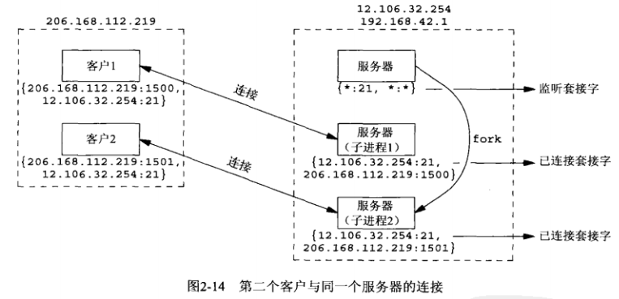
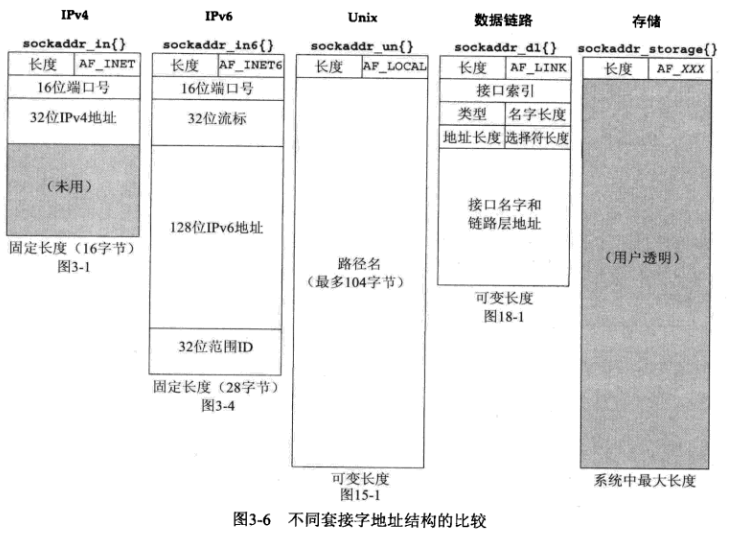
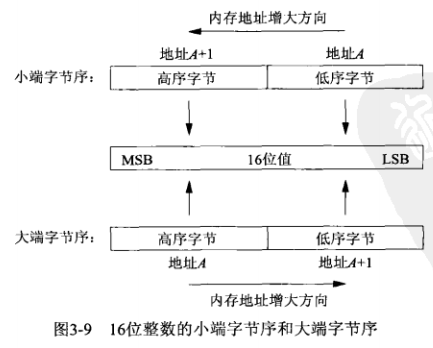
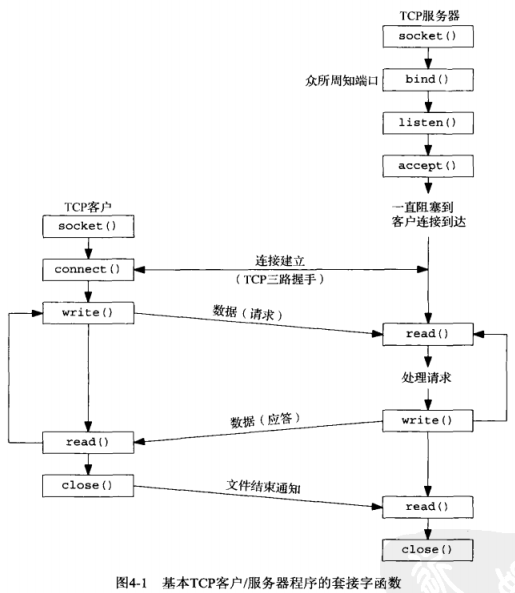
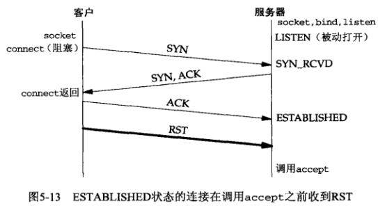
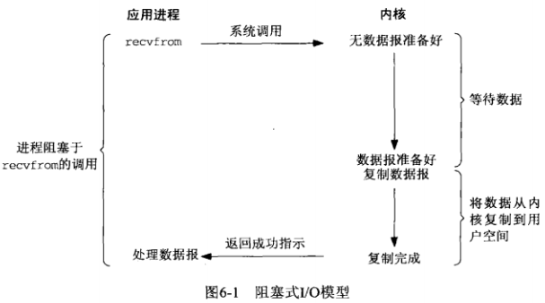
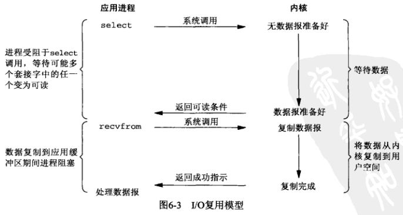
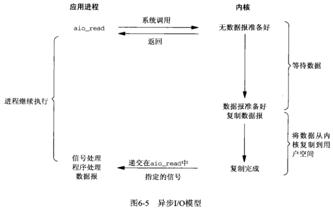

unp笔记

[TOC]

# 第2章 传输层：TCP、UDP和SCTP

## 2.6 TCP连接的建立和终止

### 2.6.1 三路握手

- 1.主动打开（通常为客户端）：发送第一个SYN的一端
- 2.被动打开（通常为服务器）：接收第一个SYN的一端
- 3.每一个SYN的ACK的确认号都是该SYN的初始序列号+1，因为SYN占据一个字节的序列号空间。FIN同理

### 2.6.2 TCP选项


这里的内容都是选项字段中的。

- 1.MSS选项：每一端都有
  - 表示：该端在本次连接的每个TCP分节中愿意接受的最大数据量
  - TCP_MAXSEG设置和提取
- 2.窗口规模选项：每一端都有
  - 表示：接收窗口
  - 旧时：因为窗口字段只有16位，因此窗口大小最大为2^16，即65535
  - 新时：在选项字段中，添加14位偏移，因此最大为65535*（2^14），需要两端都支持
  - SO_RCVBUF将影响这个选项
- 3.时间戳选择：
  - 表示：防止由失而复现的分组可能造成的数据损坏
  - 失而复得的分组：不是超时重传的分组。是暂时的路由原因造成的迷途分组，路由稳定后又正常到达目的地

### 2.6.3 TCP连接终止

- 1.主动关闭，首先发送FIN的一端
- 2.被动关闭，首先收到FIN的一端
- 3.被动关闭收到FIN后，将FIN作为文件结束符（EOF）传递给应用程序，放在所有数据之后。表示本端应用程序不会再收到对端的数据
- 4.不一定是4次个分组进行4次挥手：
  - 第一个FIN可能与最后的数据一起发送
  - 第一个FIN的ACK可能与第二个FIN一起发送
- 5.FIN的每个ACK确认号是这个FIN的序列号+1
- 6.半关闭：
  - 表示：被动关闭的一端还可以向主动关闭的一端发送数据
  - 实现：shutdown函数，参数为SHUT_WR（关闭写）
- 7.发送FIN的原因：
  - 1).调用close，并且该套接字的引用计数为0
  - 2).调用shutdown，参数为SHUT_RDWR或SHUT_WR（半关闭）
  - 3).自愿：进程调用exit或main函数退出
  - 4).非自愿：收到一个终止本进程的信号
- 8.任何一端都可以执行主动关闭
  - 通常：客户端
  - 例外：HTTP/1.0，服务器执行主动关闭

### 2.6.5 观察分组

- 第二次握手中的ACK和SYN也是有可能分开发送的
  - 如果服务器产生应答（SYN）的时间少于200ms，则SYN&ACK一起发送
  - 如果服务器产生应答的时间大于1s，则先发送ACK，再发送SYN

## 2.7 TIME_WAIT状态

- 1.MSL可能的时间为30秒~2分钟
- 2.TIME_WAIT可能的时间为1分钟~4分钟
- 3.存在TIME_WAIT的原因
  - 1).可靠地实现TCP全双工连接的终止
    - 如果没有WAIT_TIME。如果最后一个ACK丢失，被动关闭端回重新发送FIN，此时主动关闭端没有WAIT_TIME状态，将这个FIN以RST回应，被动关闭端会将RST解释成一个错误
  - 2).允许老的重复分节在网络中小时
    - 不允许在TIME_WAIT状态，再以同样的IP和端口创建连接
    - 否则，1).中提到的丢失的ACK其实没有丢失，有可能只是迷途了，那么TIME_WAIT的对端就回收到这个ACK而发生错误
- 4.TIME_WAIT是2MSL的原因
  - 每个方向上的分组都需要一个MSL来确保消逝

## 2.9 端口号

- 1.众所周知的端口：0~1023
  - 也是“保留端口”，需要超级用户特权启动
- 2.已经登记的端口：1024~49151
- 3.动态或私用端口：49152~65535
  - 也叫“临时端口”
  - 49152为65535的四分之三
- 4.套接字对：一个定义该连接的两个端点的四元组
  - 本地IP地址、本地TCP端口号
  - 外地IP地址、外地TCP端口号

## 2.10 TCP端口号与并发服务器



- 1.多宿主机：多个网卡、多个IP
- 2.服务器可选择一个IP或任意IP作为接受连接的IP地址（不能是指定的多个）
  - 任意IP：使用通配地址，在设置套接字地址结构时，将IP地址字段设为INADDR_ANY
- 3.已连接套接字和监听套接字都使用服务器的21端口
- 4.TCP无法通过查看目的端口号来区分外来节点到不同的端点（进程），因为本地端口21有3个套接字，必须查看4元素才能确定到达哪个端点接收某个到达的分节。例如：
  - 如果分节来自206.168.112.219:1500，则到达子进程1（连接套接字）
  - 如果分节来自206.168.112.219:1501，则到达子进程2（连接套接字）
  - 所有的目的端口为21的其他TCP分节到达父进程（监听套接字）

## 2.11 缓冲区大小及限制

**IPv4**


- 1.IPv4最大大小是2^16（65535，包括IPv4首部，实际载荷为65535-20）


- 2.IPV4最小链路MTU为68，因为IPv4首部=20字节+40多字节的选项部分
- 3.路径MTU：两个主机之间的路径中最小的MTU
- 4.分片：这些分片在到达最终目的之前通常不重组
  - IPv4与IPv6的区别：
    - IPv4：主机对其产生和路由对其转发的数据报进行分片
    - IPv6：主机对其产生的数据报分片，路由不对其转发的数据报进行分片（路由对其产生的还是会分片的）
  - DF位：置位表示，不允许分片
    - IPv4：当路由器收到一个超出其外出链路MTU大小且设置了DF位的IPv4数据报时，将产生一个ICMPv4（目的不可达，需分片但DF已置位）
    - IPv6：隐含一个DF位（IPv6本来就不允许路由转发时分片），将产生一个ICMPv6（分组太大）
- 5.DF位的作用：发现路径MTU
- 7.最小重组缓冲区大小，表示IP的任何实现版本都必须保证的最小数据报大小（即双方还没开始交换MSS大小）
  - IPv4：576字节
  - IPv6：1500字节
- 8.MSS：用于向对端TCP通告对端在每个分节中能发送的最大TCP数据量，目的是告诉对端其重组缓冲区大小的实际值，从而避免分片
  - 通常值：MTU-IP首部固定长度-TCP首部固定长度（以太网为：1500-20-20=1460）
  - 实现：通过SYN分节（第一次和第二次握手）上的MSS选项设置
  - 最大值：2^16（65535）字节

### 2.11.1 TCP输出


这里描述的是应用进程写数据到一个TCP套接字中时发生的步骤。

这里涉及以下知识点：

- 1.每一个TCP套接字都有一个发送缓冲区，由SO_SNDBUF更改大小
- 2.write调用发生的事情：
  - 内核从应用进程的缓冲区中复制所有数据写到套接字的发送缓冲区
  - 如果套接字缓冲区无法容下，可能原因：
    - 应用进程的缓冲区大于套接字的发送缓冲区
    - 套接字的发送缓冲区已有其他数据
  - 如果无法容下，进程被睡眠
  - 内核不从write返回（假设是阻塞的套接字） ，直到应用进程的缓冲区所有的数据都复制到套接字缓冲区中
  - 如果write返回，表示当前进程数据已经复制到套接字缓冲区，进程缓冲区可继续使用。但不表示对端已经收到
- 3.TCP套接字缓冲区需要保留已经发送的数据，直到收到该数据的ACK

### 2.11.2 UDP输出


这里描述的是应用进程写数据到一个UDP套接字中时发生的步骤。

这里涉及以下知识点：

- 1.UDP有发送缓冲区（通过SO_SNDBUF设置）,实际上不存在（因此上图用虚线），它表示的只是该UDP套接字的数据报上限。
- 2.应用程序写一个大于套接字发送缓冲区大小的数据报，内核返回进程EMSGSIZE错误
- 3.因UDP不可靠，不必保留应用进程的数据副本，因此无需一个真正的发送缓冲区
- 4.数据保存的过程：应用进程的数据在沿协议向下传递时，通常被复制到某种格式的一个内核缓冲区中，当数据发送后，副本被链路层丢弃
- 5.UDP的write成功返回表示所写的数据报或其所有分段已经被加入数据链路层的输出队列
- 6.如果链路层输出队列没有足够的空间存放数据报或分段，返回ENOBUFS错误到进程


# 第3章 套接字编程简介

[UNPv1第三章：套接字编程简介](https://blog.csdn.net/lxj1137800599/article/details/51244629)

## 3.2 套接字地址结构

### 3.2.1 IPv4套接字地址结构

IPv4套接字地址结构通常也称为“网际套接字地址结构”

```c
//<netinet/in.h>
struct in_addr {
    in_addr_t s_addr; //32位IPv4地址网络字节序
    				
};

struct sockaddr_in{
 　　uint8_t             sin_len;          //带符号8位整数地址结构长度，用于简化套接字地址结构的处理
 　　sa_family_t         sin_family;       //协议族，IPv4为AF_INET
 　　in_port_t           sin_port;         //TCP或UDP端口号，16字节，网络字节序
 　　struct in_addr       sin_addr;         //32位IPv4，网络字节序地址
 　　char                sin_zero[8];      //填充对齐位，未使用，通常为0
};
//必须的字段：sin_family、sin_port、sin_addr
//sockaddr_in至少16字节
//总是在填写该结构前将整个结构置为0
//该结构仅在给定主机上使用，不在主机之间传递
```

从进程到内核传递套接字地址结构的函数有4个，它们都要调用sockargs函数

- 1.bind
- 2.connect
- 3.sendto
- 4.sendmsg

从内核到进程传递套接字地址结构的函数有5个

- 1.accept
- 2.recvfrom
- 3.recvmsg
- 4.getpeername
- 5.getsockname

### 3.2.2 通用套接字地址结构

用处：兼容所有协议的套接字地址结构，对指向特定于协议的套接字地址结构的指针执行类型强制转换

ANSI C后，可以使用void*解决

```c
//<sys/socket.h>
struct sockaddr {
  uint8_t            sa_len;
  sa_family_t        sa_family;       /* address family: AF_xxx value */
  char               sa_data[14];     /* protocol-specific address */
};

//例子：
struct sockaddr_in  serv;      /* IPv4 socket address structure */
bind(sockfd, (struct sockaddr *) &serv, sizeof(serv));
```

### 3.2.3 IPv6套接字地址结构

```c
//<netinet/in.h>
struct in6_addr{
 　　uint8_t            s6_addr[16];            //128位IPv6网络字节序地址
};

#define SIN6_LEN                                //编译时测试所需
struct sockaddr_in6{
 　 uint8_t             sin6_len;               //这个结构的长度
 　 sa_family_t         sin6_family;            //协议族，AF_INET6
 　 in_port_t           sin6_port;              //端口号，网络字节序

　　uint32_t            sin6_flowinfo;          //流信息，未定义
 　 struct in6_addr     sin6_addr;              //IPv6地址，网络字节序

　　uint32_t            sin6_scope_id;          //一定范围的接口
 };
```

### 3.2.4 新的通用套接字地址结构

```c
//<netinet/in.h>
struct sockaddr_storage {
  uint8_t      ss_len;       /* length of this struct (implementation dependent) */
  sa_family_t  ss_family;    /* address family: AF_xxx value */
  /*其他字段对用户来说的透明的 故没有列出*/  
};
//优势：足以容纳系统所支持的任何套接字地址结构
```

与sockaddr的对比：

- 1.sockaddr_storage通用套接字地址结构满足对齐要求
- 2.sockaddr_storage通用套接字地址结构足够大，能够容纳系统支持的任何套接字地址结构

### 3.2.5 套接字地址结构的比较



## 3.3 值-结果参数

**1.从进程到内核传递套接字结构函数**


- bind
- connect
- sendto

这些函数的一个参数是指向某个套接字地址结构的指针，另一个参数是该结构体的整数大小 

```c
struct sockaddr_in serv;
connect (sockfd, (SA *) &serv, sizeof(serv));
```

**2.从内核到进程传递套接字地址结构的函数**


- accept
- recvfrom
- getsockname
- getpeername

两个参数指向某个套接字结构体的指针和指向表示该结构体大小的整数变量的指针

```c
struct sockaddr_un cli; /* Unix domain */
socklen_t len;
len = sizeof(cli); /* len is a value */
getpeername(unixfd, (SA *) &cli, &len);	
/* len may have changed */
```

长度为指针的原因（什么是值-结果参数 Value-result）：

- 函数调用时：结构大小len是一个值（value）, 它告诉内核cli结构的大小，使内核在写cli结构时不至于越界
- 函数返回时：结构大小len是一个结果（result），它告诉进程内核在cli结构中确切存储了多少信息

## 3.4 字节排序函数

**小端字节序**：将低序字节存储在起始地址

**大端字节序**：将高序字节存储在起始地址

”大端“、”小端“表示多个字节值的哪一端（小端或大端）存储在该值的起始地址

**MSB**：most significant bit，最高有效位

**LSB**：least significant bit，最低有效位

**主机字节序**：某个给定系统所用的字节序称为主机字节序（不同系统有不同）



```c
union {
	  short  s;
      char   c[sizeof(short)];
    } un;
un.s = 0x0102;
if(un.c[0] == 1 && un.c[1] == 2); //大端
if (un.c[0] == 2 && un.c[1] == 1); //小端
```

**网络字节序**：网络协议使用**大端字节序**来传递这些字节整数

主机字节序与网络字节序之间的转换函数：

```c
#include <netinet/in.h>
//h表示host, n表示network，s代表short，l代表long
//均返回：网络字节序的值
uint16_t htons(uint16_t host16bitvalue);    //主机to网络 short
uint32_t htonl(uint32_t host32bitvalue);    //主机to网络 long

//均返回：主机字节序的值
uint16_t ntohs(uint16_t net16bitvalue);     //网络to主机 short
uint32_t ntohl(uint32_t net32bitvalue);     //网络to主机 long

```

**字节==八位组==8位的量**

**位序**：按照在线缆上出现的顺序排列的4个字节（32个位）


## 3.5 字节操作函数

**Berkely**

```c
#include <strings.h>
void bzero(void *dest,size_t nbytes);               //将目标字符串制定数目的字节置0
void bcopy(const void *src,void *dest,size_t nbytes);         //拷贝指定字节
int bcmp(const void*ptrl,const void *ptr2,size_t nbytes);     //若相等返回0
```

**ANSI C**

```c
#include<string.h>
void *memset(void *dest,const void *c,size_t len);
void *memcpy(void *dest,const void *src,size_t nbytes);
int memcmp(const void *ptrl,const void *ptr2,size_t nbytes);
//返回：若相等则为0，否则为<0或者>0
```

**注意：**

- 1.memcpy类似bcopy
- 2.bcopy能正确处理源字符串与目的字符串重叠情况
- 3.memcpy不能正确处理源字符串与目的字符串重叠情况，可以使用memmove替代
- 4.memcmp需要将比较的字节转换为无符号字符（unsigned char）

## 3.6 inet_aton、inet_addr、和inet_ntoa函数

地址转换函数

inet_aton、inet_addr和inet_ntoa在点分十进制数串（eg：“206.168.112.96”）与它的32位网络字节序二进制值间转换IPv4地址。

```c
#include<arpa/inet.h>

//作用：将strptr所指的C字符串转换成32位的网络字节序二进制值，并通过指针addrptr来存储
//返回：1--字符串有效， 0--字符串有错
//如果strptr为空，仍然对输入函数进行有效性检查，但addrptr不存储任何结果
int inet_aton(const char *strptr, struct in_addr *addrptr);　

//返回：若成功，返回32位二进制的网络字节序地址；若有错，返回INADDR_NONE
//作用与inet_aton一样，但是返回的是二进制值
//不能处理255.255.255.255,因为它的错误返回值INADDR_NONE也是这个值
//该函数已被废弃，使用inet_aton代替
in_addr_t inet_addr(const char *strptr);

//作用：将一个32位的网络字节序二进制IPv4地址转换成相应的点分十进制数串
//返回：指向点分十进制数串的指针
//该函数不可重入,即不能被中断，因为函数返回值所指的串驻留在静态内存中
//注意：以结构为参数，而不是指向结构的指针
char *inet ntoa(struct in_addr inaddr);
　　　　　　　　　　　             
```

## 3.7 inet_pton和inet_ntop函数

IPv4地址和IPv6地址都可用

函数名中p和n分别代表表达(presentation)和数值(numeric)地址的表达式通常是ASCII字符串

表达式即ASCII字符串

数值即存放在套接字地址结构中的二进制值

```c
#include <arpa/inet.h>

//family可以是AF_INET和AF_INET6

//作用：ASCII字符串--->套接字地址结构中的二进制值
//返回：若成功为1，若输入不是有效的表达式为0，若出错为-1
int inet_pton(int family, const char *strptr, void *addrptr);

//作用：套接字地址结构中的二进制值--->ASCII字符串
//注意：strptr不能为空，调用者必须为目标存储单元分配内存并制定其大小
//返回：若成功则为指向结果的指针，若出错则为null
const char *inet_ntop(int family, const void *addrptr, char *strptr, size_t len);

//len的定义
//<netinet/in.h>
#define INET_ADDRSTRLEN 16
#define INET6_ADDRSTRLEN 46
```


## 3.8 sock_ntop和相关函数（本书自定义函数）

本书自定义函数

```c
#include "unp.h"
#define	SA	struct sockaddr

//将统配地址和一个临时端口绑定到一个套接字
int		 sock_bind_wild(int sockfd, int family);
//比较两个套接字地址结构的地址部分
int		 sock_cmp_addr(const SA *sockaddr1, const SA *sockaddr2, socklen_t addrlen);
//比较两个套接字地址结构的端口号部分
int		 sock_cmp_port(const SA *sockaddr1, const SA *sockaddr2, socklen_t addrlen);
//只返回端口号
int		 sock_get_port(const SA *sockaddr, socklen_t addrlen);
//把一个套接字地址结构中的主机部分转换为表达格式（不包括端口号）
char	*sock_ntop_host(const SA *sockaddr, socklen_t addrlen);
//把一个套接字地址结构中的地址部分设为ptr所指的值
void	 sock_set_addr(SA *sockaddr, socklen_t addrlen, const void *ptr);
//只设置一个套接字地址结构的端口号部分
void	 sock_set_port(SA *sockaddr, socklen_t addrlen, int port);
//把一个套接字地址结构中的地址部分置为通配地址
void	 sock_set_wild(SA *sockaddr, socklen_t addrlen);
```

## 3.9 readn、writen和readline函数（本书自定义函数）

字节流套接字上调用read或write输入或输出的字节数可能比请求的数量少

- 原因：套接字的缓冲区可能已经达到了极限
- 解决方法：
  - 1.再次调用read或write函数，以输入或输出剩余的字节
  - 2.实现自定义函数

自定义的目的：实现一个输入或输出的字节数与请求数量一样的函数

```c
#include "unp.h"
//实际上就是read、write函数增强版
ssize_t readn(int filedes, void *buff, size_t nbytes);
ssize_t writen(int filedes, const void *buff, size_t nbytes);
ssize_t readline(int filedes, void *buff, size_t maxlen);
//均返回：读或写的字节数，若出错则为-1，连接已经关闭为0
```

readline原本的实现版本较慢，原因是每次调用read只读取一个字符。可以通过自己实现一个my_read，维护一个自己的缓冲区，readline调用自己实现的my_read从而得到一个较快的版本

# 第4章 基本TCP套接字编程

[UNPv1第四章：基本TCP套接口编程](https://blog.csdn.net/lxj1137800599/article/details/51247813)

连接过程图：



## 4.2 socket函数

```c
#include <sys/socket.h>
/*
** 用处：创建套接字
** @family:协议族、协议域
** @type:套接字类型
** @protocol:协议类型
** @返回值：成功时返回文件描述符（套接字描述符），错误时返回-1
*/
int socket (int family, int type, int protocol);
```

**family:**


**type:**


**protocol:**


**family与type组合是否有效**


**对比AF_XX和PF_XX**

`AF_`前缀便是地址族，`PF_`前缀表示协议族

曾经的想法：单个协议族可以支持多个多个地址族，`PF_`用于创建套接字，`AF_`用于套接字地址结构

实际上：支持多个地址族的协议族未实现过

头文件`<sys/socket.h>`中，给定协议定义的`PF_`和`AF_`值总是相等的

更多使用`AF_`，本书亦是如此

## 4.3 connect函数

```c
#include <sys/socket.h>
/*
** 用处：建立与TCP服务器的连接
** @sockfd:由socket函数返回的套接字描述符
** @servaddr:指向套接字地址结构的指针
** @addrlen:servaddr结构的长度
** @返回值：成功返回0，失败返回-1
*/
int connect(int sockfd, const struct sockaddr *servaddr, socklen_t addrlen);
```

TCP套接字调用connect函数将触发三次握手过程，在连接成功或失败时返回。

**出错的返回的情况有：**

- 1.超时错误：若TCP客户没有收到SYN包的响应，则返回**ETIMEDOUT**错误
- 2.RST错误：若对客户端的SYN的响应是RST（表示复位），则表明该服务器主机在我们制定的端口没有进程在等待与之连接（例如服务器进程也许没有在允许），返回**ECONNREFUSED**错误，这是一种**硬错误**
- 3.目的地不可达：若客户发出的SYN在中间的某个路由器上引发一个“destination unreachable”（目的地不可达）ICMP错误，多次重传超时后仍然不可达，则保存的ICMP消息作为**EHOSTUNREACH**或**ENETUNREACH**错误返回给进程，这是一种**软错误**

若connect失败则该套接字不再可用，必须关闭，不能对该套接字再次调用connect函数。每次调用connect失败后，必须close当前的套接字描述符并重新调用socket

**RST产生的条件**

- 1.端口未监听：目的地为某个端口的YSN到达，然而该端口没有正在监听的服务器
- 2.取消连接：TCP想取消一个已有连接
- 3.收到无法解释的分节：TCP接收到一个根本不存在的连接上的分节

## 4.4 bind函数

```c
#include <sys/socket.h>
/*
** 作用：把一个本地协议地址赋予一个套接字
** @sockfd：由socket函数返回的套接字描述符
** @myaddr：一个指向特定于协议的地址结构的指针
** @addrlen：myaddr地址结构的长度
** @返回值：成功返回0，失败返回-1
*/
int bind (int sockfd, const struct sockaddr *myaddr, socklen_t addrlen);
```

本地协议地址：由32位的IPv4地址或128位的IPv6地址与16位的TCP或UDP端口号的结合

**常见的bind出错情况：**返回**EADDRINUSE**（“Address already in use”，地址已经使用）

**关于端口绑定：**

如果一个TCP客户或服务器未曾调用bind绑定一个端口，在调用connect或listen时，内核就为相应的套接字选择一个临时端口。

通常，服务器是绑定“众所周知端口”，例外是，远程过程调用服务器，使用内核为其选择的临时端口

如果让内核为套接字选择一个临时端口，为了得到内核所选的这个临时端口值，调用`getsockname`函数来返回协议地址

**关于地址绑定：**

TCP客户端通常不把IP地址绑定到它的套接字上，当连接套接字时，内核将根据所用外出网络接口来选择IP地址

TCP服务器没有把IP地址绑定到它的套接字上，内核就把客户端发送的SYN的目的IP地址作为服务器的源IP地址

**绑定与不绑定**：

bind可以指定IP地址或端口，也可以两者都指定，也可以两者都不指定


**关于通配地址**

对于IPv4，通配地址由常值INADDR_ANY指定，其值一般为0

```c
struct sockaddr_in servaddr;
servaddr.sin_addr.s_addr = htonl( INADDR_ANY );
```

对于IPv6，因为地址是存放在一个结构中的，因此不能直接用INADDR_ANY常量，而应该使用如下方式：

```c
struct sockaddr_in6 serv;
serv.sin6_addr = in6addr_any;
//in6addr_any变量由系统预分配，并初始化为常值IN6ADDR_ANY_INIT
```

## 4.5 listen函数

```c
#include <sys/socket.h>
/*
** 作用：把未连接的套接字变为被动套接字（监听套接字），指示内核应该接受指向该套接字的连接请求。相对的，TCP客户端用于主动发起连接的套接字称为主动套接字
** @sockfd：由socket函数返回的套接字描述符,未连接的套接字
** @backlog:队列长度（未完成队列+已完成队列），但这个值的确切含有对于不同系统有不同的解释
*/
int listen (int sockfd, int backlog);
```

内核为任何一个给定的监听套接字维护**两个队列**：

- 1.未完成队列：已经完成第二次握手（服务器发出SYN&ACK），处于SYN_RCVD的套接字
  - 直到三次握手的三个个分节到达或该套接字超时，则该套接字被移除未完成队列
  - 套接字超时为RTT，因此该队列中的任何一项保留时间为RTT，该值取决于特定的客户端和服务器
- 2.已完成队列：已经完成三次握手，处于ESTABLISHED的套接字，等待服务器进程accept取走这些套接字
  - 当进程调用accept函数时，已完成队列中的队头项将返回给进程，或如果队列为空，那么进程将被投入睡眠，直到TCP在该队列中放入一项才唤醒


**队列满时的处理**

当一个客户SYN到达时，若未完成队列是满的，TCP忽略该分节，且不会发送RST

不发送的原因：

- 1.这种情况是暂时的，客户端TCP将重发SYN，期待不久就能在这些队列中找到可用空间
- 2.若发送RST，客户端connect会返回错误，客户端就需要处理错误，而不是让TCP重传机制来处理
- 3.客户无法区影响SYN的RST意味着“该端口没有服务器在监听”还是“端口有服务器在监听，但它队列满了”

**三次握手完成之后，accept之前**

在此阶段，服务器收到客户端的数据由服务器TCP排队，最大数量为相应套接字的缓冲区大小

**关于安全性**

- 1.SYN洪泛：给受害者主机发送SYN，用以装填一个或多个TCP端口的未完成连接队列
- 2.IP欺骗：在SYN洪泛中，每个SYN的源IP地址都是随机数，这样服务器的SYN/ACK就不知道发往什么地方

## 4.6 accept函数

```c
#include <sys/socket.h>
/*
** 作用：用于从已完成连接队列列头返回下一个已完成连接，如果已完成连接队列为空，进程将被投入睡眠（假设套接字为默认的阻塞方式）
** @sockfd：调用listen由未连接套接字变为的监听套接字
** @cliaddr:指向客户端的协议地址结构的指针
** @addrlen:是一个指针，是值-结果参数。调用前，cliaddr所指向套接字地址结构的长度；返回时，为由内核放在该套接字地址结构内的确切字节数
** @返回值：若成功返回套接字描述符（与客户端的已连接套接字），出错返回-1
*/
int accept (int sockfd, struct sockaddr *cliaddr, socklen_t *addrlen);
```

**监听套接字与已连接套接字的区别**

- 监听套接字：一个服务器通常仅仅创建一个监听套接字，它在服务器的生命周期内一直存在
- 已连接套接字：内核为每个由服务器进程接受的客户连接创建一个已连接套接字，当服务器完成对某个给定客户的服务时，相应的已连接套接字就被关闭

**该函数的返回值**

有三个返回值：

- 1.新套接字描述符或出错指示的整数
- 2.客户的协议地址（cliaddr），如不关心，可置为空指针
- 3.协议地址的长度（addrlen），如不关心，可置为空指针

## 4.7 fork和exec函数

**关于fork函数**

```c
#include <unistd.h>
/*
** 作用：Unix中派生新进程的唯一方法
** 返回值：成功时，返回两次，在子进程中返回0，在父进程中返回子进程ID。若出错，返回一次，为-1
*/
pid_t fork(void);
```

**关于父子进程：**

父进程中调用fork之前打开的所有描述符在fork返回之后由子进程分享（实际上是COW机制，如果子进程需要修改，则会新拷贝一份）

fork之后，子进程会拷贝父进程的数据空间、堆和栈空间（实际上是采用写时复制技术），二者共享代码段。所以在子进程中修改全局变量（局部变量，分配在堆上的内存同样也是）后，父进程的相同的全局变量不会改变

父进程调用accept之后调用fork，所接受的已连接套接字随后就在父进程与子进程之间共享。通常情况下，子进程接着读写这个已连接套接字，父进程则关闭这个已连接套接字

**fork的两个典型用法：**

- 1.一个进程创建一个自身的副本，每个副本执行各自的操作（网络服务器的典型用法）
- 2.一个进程想要执行另外一个程序，那么它先调用fork函数创建一个自身的副本，然后调用exec函数把自身替换成新的程序（Shell之类程序的典型用法）


**关于exec函数**

可执行程序文件能够被Unix执行的唯一方法：由一个现有进程调用6个exec函数中的某一个

exec的特点：exec把当前进程映像换成新的程序文件，而且该新程序通常从main函数开始执行，进程ID并不改变。调用exec的进程称为“调用进程”，新执行的程序称为“新程序”

```c
#include <unistd.h>

//若成功则不返回，将控制权交给新程序的main函数；出错返回-1
//其他5个函数（库函数），最终都是调用execve（系统调用）
int execl (const char *pathname, const char *arg0, ... /* (char *) 0 */ );
int execv (const char *pathname, char *const argv[]);
int execle (const char *pathname, const char *arg0, .../* (char *) 0, char *const envp[] */ );
int execve (const char *pathname, char *const argv[], char *const envp[]);
int execlp (const char *filename, const char *arg0, ... /* (char *) 0 */ );
int execvp (const char *filename, char *const argv[]);
```

以上6个exec函数的区别是：

- 1.待执行的程序是由文件名还是由路径名指定 
- 2.新程序的参数是一一列出还是由一个指针数组来引用 
- 3.把调用进程的环境传递给新程序还是给新程序指定新的环境

进程在调用exec之前打开着的描述符通常跨exec继续保持打开。可以使用fcntl设置FD_CKIEXEC描述符标志禁止掉

## 4.8 并发服务器

**迭代服务器：**由主进程直接处理已连接套接字，没有使用fork

**并发服务器：**由主进程fork出子进程，由子进程处理已连接套接字

```c
pid_t pid;
int listenfd, connfd;
listenfd = Socket(AF_INET, SOCK_STREAM, 0);
Bind(listenfd,...);
Listen(listenfd, LISTENQ);
for ( ; ; ) {
    connfd = Accept(listenfd,...);
    if ( (childpid = Fork()) == 0) { //子进程
			Close(listenfd); //关闭子进程监听套接字（引用计数-1）
        	doit(connfd); //处理已连接套接字的请求
        	Close(connfd); //关闭已连接套接字，该句并非必须，因为exit时会自动处理
			exit(0); //终止子进程
    }
    Close(connfd); //父进程不等待子进程，关闭已连接套接字（引用计数-1），并继续循处理新的另一个连接
}

```

**关于Close**

父进程对connfd调用close没有终止它与客户端连接的原因：

每个文件或套接字都有一个引用计数，在文件表项中维护，是当前打开着的引用该文件或套接字的描述符的个数。如上代码所示，Socket函数返回时，listenfd关联的文件表项的引用计数为1，Accept函数返回后connfd的引用计数也为1，fork后，子进程复制父进程数据，它们的引用计数都为2。套接字真正清理和资源释放要等引用计数为0时才发生

**创建连接和子进程的过程：**

**第一步**


**第二步：**


**第三步：**


**第四步：**


## 4.9 close函数

```c
#include <unistd.h>
/**
** 作用：用来关闭套接字（实际上是套接字引用计数-1），并终止TCP连接
** @sockfd：想要进行close操作的套接字描述符
** @返回值：若成功为0，出错为-1
**/
int close (int sockfd);         
```

**关闭后的套接字描述符**

关闭后的套接字描述符不能再由调用进程使用，也就是说它不能再作为read或write的第一个参数。但在这之前，会尝试发送已经排队等待发送到对端的数据，发送完这些数据后再进行正常的TCP终止序列（四次挥手）

**描述符引用计数**

**知识点1**：close只是减少引用计数，如果调用close后，引用计数仍大于0，则不引发四次挥手。如果想要某个TCP连接立马发送FIN，可以使用shutdown函数

**知识点2：**如果父进程对accept返回的已连接套接字都不调用close，会发生什么？

- 1.父进程最终将耗尽可用描述符
- 2.没有一个客户连接会被终止。子进程退出后，已连接套接字的引用计数由2变为1，父进程永远不会关闭任何已连接套接字。这妨碍TCP连接终止序列的发生，导致连接一直打开着


## 4.10 getsockname和getpeername函数

```c
#include <sys/socket.h>
/*
** 作用：返回与某个套接字关联的本地协议地址（IP地址和端口号的组合）
** @sockfd：本地套接字，该函数就是获取该套接字的本地协议地址
** @localaddr:本地协议地址指针
** @addrlen:值-结果参数
** @返回值：成功为0，失败为-1
*/
int getsockname(int sockfd, struct sockaddr *localaddr, socklen_t *addrlen);

/*
** 作用：返回与某个套接字关联的外地协议地址，应该就是与该socket连接的套接字的地址（IP地址和端口号的组合）
** @sockfd：本地套接字，该函数就是获取与该套接字相连的套接字的地址
** @localaddr:外地协议地址指针
** @addrlen:值-结果参数
** @返回值：成功为0，失败为-1
*/
int getpeername(int sockfd, struct sockaddr *peeraddr, socklen_t *addrlen);
```

# 第5章 TCP客户/服务器程序示例

[UNPv1第五章：TCP客户服务器程序实例](https://blog.csdn.net/lxj1137800599/article/details/51247971)

## 5.1 概述

回射服务器的执行步骤：

- 1.客户从标准输入读一行文本，写到服务器上
- 2.服务器读入此行，并回射给客户
- 3.客户读此回射行写到标准输出 


## 5.2 TCP回射服务器程序：main函数

```c++
// tcpcliserv/tcpserv01.c
#include	"unp.h"

int
main(int argc, char **argv)
{
	int					listenfd, connfd;
	pid_t				childpid;
	socklen_t			clilen;
	struct sockaddr_in	cliaddr, servaddr;

	//1.创建套接字，目前为未连接套接字，Listen之后变为监听套接字
	listenfd = Socket(AF_INET, SOCK_STREAM, 0);

	//2.设置地址结构
    //2.1.将地址结构清空
	bzero(&servaddr, sizeof(servaddr));
    //2.2.设置协议族
	servaddr.sin_family      = AF_INET;
    //2.3.绑定通配地址：告知系统：要是系统是多宿主机，我们将接受目的地址为任何本地接口的连接
	servaddr.sin_addr.s_addr = htonl(INADDR_ANY);//通配地址INADDR_ANY
    //2.3.绑定端口，#define SERV_PORT 9877
	servaddr.sin_port        = htons(SERV_PORT);//端口号SERV_PORT(9877)

	//3.将套接字绑定到地址
    //#define	SA	struct sockaddr，IPv4通用套接字地址结构
	Bind(listenfd, (SA *) &servaddr, sizeof(servaddr));

	//4.将未连接套接字转换为监听套接字
	Listen(listenfd, LISTENQ);

	for ( ; ; ) {
		clilen = sizeof(cliaddr);
		//5.阻塞在Accept，等待来自客户端的连接
		connfd = Accept(listenfd, (SA *) &cliaddr, &clilen);
        
		//6.为每个客户派生一个处理它们的子进程，子进程会关闭监听套接字（引用计数-1），父进程关闭已连接套接字（引用计数-1），继续在监听套接字监听
		if ( (childpid = Fork()) == 0) {	/* child process */
			Close(listenfd);	//关闭监听套接字（引用计数-1）
			//7.子进程调用str_echo接收并回显客户端发来的消息
			str_echo(connfd);	/* process the request */
			exit(0);
		}
		Close(connfd);		//关闭已连接套接字（引用计数-1）
	}
}
```

## 5.3 TCP回射服务器程序：str_echo函数

```c
// lib/str_echo.c
#include	"unp.h"

//作用：处理每个客户的服务：从客户读入数据，并把它们回射给客户
void
str_echo(int sockfd)
{
	ssize_t		n;
	char		buf[MAXLINE];

again:
    //read从套接字读入数据,如果客户关闭连接，那么接收到客户的FIN将导致服务器子进程的read返回0，否则返回读取到的字节数
	while ( (n = read(sockfd, buf, MAXLINE)) > 0)
        //Writen把buf中的内容回射给客户
		Writen(sockfd, buf, n);

	if (n < 0 && errno == EINTR)
		goto again;
	else if (n < 0)
		err_sys("str_echo: read error");
}
```

## 5.4 TCP回射客户程序：main函数

```c
// tcpcliserv/tcpcli01.c
#include	"unp.h"

int
main(int argc, char **argv)
{
	int					sockfd;
	struct sockaddr_in	servaddr;

	if (argc != 2)
		err_quit("usage: tcpcli <IPaddress>");
	
    //1.创建套接字
	sockfd = Socket(AF_INET, SOCK_STREAM, 0);
	
    //2.创建服务器地址结构
    //2.1将地址结构清空
	bzero(&servaddr, sizeof(servaddr));
    //2.2.设置协议族
	servaddr.sin_family = AF_INET;
    //2.3.绑定端口，#define SERV_PORT 9877
	servaddr.sin_port = htons(SERV_PORT); //端口号SERV_PORT(9877)
    //2.4.根据main函数参数argv[1]获取服务器ip地址
    //Inet_pton的作用：ASCII字符串--->套接字地址结构中的二进制值
	Inet_pton(AF_INET, argv[1], &servaddr.sin_addr);
	
    //3.发起TCP 3次握手建立连接
	Connect(sockfd, (SA *) &servaddr, sizeof(servaddr));
	
    //4.从输入按行读取文本，发送至服务器，接收并显示回显
	str_cli(stdin, sockfd);		/* do it all */

	exit(0);
}
```

## 5.5 TCP回射客户程序：str_cli函数

```c
// lib/str_cli.c
#include	"unp.h"

void
str_cli(FILE *fp, int sockfd)
{
	char	sendline[MAXLINE], recvline[MAXLINE];
	//Fgets从客户端读入一行数据
	//当遇到文件结束符或错误，fgets（库函数）将返回一个空指针，于是客户端循环终止
	//Fgets包裹fgets，检查是否发送错误，出错则终止程序，因此Fgets只有遇到文件结束符时才返回一个空指针
	while (Fgets(sendline, MAXLINE, fp) != NULL) {
		//Writen把从客户端读到的数据发送到服务端
		Writen(sockfd, sendline, strlen(sendline));
		//Readline读取从服务器回射的数据
		if (Readline(sockfd, recvline, MAXLINE) == 0)
			err_quit("str_cli: server terminated prematurely");
		//Fputs把它写到标准输出
		Fputs(recvline, stdout);
	}
}
```

## 5.6 正常启动

**启动服务器**

```shell
# 启动服务器
$ ./tcpserv01 

# 查看服务器套接字的状态
# Local Address *:9877 表示本地地址为 通配地址+9877端口
# State LISTEN 表示套接字处于监听状态
# 
$ netstat -a | grep 9877
Active Internet connections (servers and established)
Proto Recv-Q Send-Q Local Address           Foreign Address         State
tcp        0      0 *:9877                  *:*                     LISTEN
```

**启动客户端**

```shell
# 启动客户端
# 由于Fgets，进入阻塞状态
# 此时还存在另两个阻塞状态：服务器主进程阻塞与Accept，服务器子进程阻塞于readline
$ ./tcpcli01 127.0.0.1

# 查看套接字状态
# 由于服务器和客户端都在同一台主机，因此我们可以看到服务器的：监听套接字、服务器已连接套接字（第一个ESTABLISHED）和客户端的已连接套接字（第二个ESTABLISHED）
$ netstat -a | grep 9877
Active Internet connections (servers and established)
Proto Recv-Q Send-Q Local Address           Foreign Address         State
tcp        0      0 *:9877                  *:*                     LISTEN     
tcp        0      0 localhost:9877          localhost:51030         ESTABLISHED
tcp        0      0 localhost:51030         localhost:9877          ESTABLISHED

# 查看进程状态和关系
# 处于inet_csk_accept（阻塞于accept）为服务器的父进程，其PPID为1700，应该就是shell(bash)的PID
# 处于sk_wait_data（阻塞于read）为服务器的子进程，其PPID为1813，即服务器的父进程ID
# 处于wait_woken（阻塞与fgets）的为客户端进程
# STATE S+表示进程在等待某些资源而睡眠
$ ps -a -o pid,ppid,tty,stat,args,wchan
   PID   PPID TT       STAT COMMAND                     WCHAN
  1813   1700 pts/8    S+   ./tcpserv01                 inet_csk_accept
  1818   1742 pts/9    S+   ./tcpcli01 127.0.0.1        wait_woken
  1819   1813 pts/8    S+   ./tcpserv01                 sk_wait_data
```

## 5.7 正常终止

**客户端与服务器数据交换**

```shell
$ ./tcpcli01 127.0.0.1
hello,world
hello,world
```

**正常终止**

```shell
# 客户端
# 输入EOF
$ Control-D

# 查看连接状态
$ netstat -a | grep 9877
Active Internet connections (servers and established)
Proto Recv-Q Send-Q Local Address           Foreign Address         State
tcp        0      0 *:9877                  *:*                     LISTEN     
tcp        0      0 localhost:51030         localhost:9877          TIME_WAIT

# 查看进程状态
# 注意处于STAT Z+状态的进程，这是服务器子进程退出后，变为僵死状态，因为没被父进程回收
$ ps -a -o pid,ppid,tty,stat,args,wchan
   PID   PPID TT       STAT COMMAND                     WCHAN
  1813   1700 pts/8    S+   ./tcpserv01                 inet_csk_accept
  1819   1813 pts/8    Z+   [tcpserv01] <defunct>       exit
```

**正常终止客户和服务器的步骤**

- 1.键入EOF（Control-D），客户端的fgets返回一个空指针，于是从str_cli函数返回
- 2.str_cli返回到客户端的main函数，main通过调用exit(0)终止
- 3.客户端进程终止处理的部分工作是关闭所有打开的描述符，因此客户端打开的套接字由内核关闭：
  - 客户端TCP发送一个FIN给服务器（第一次挥手），客户端进入FIN_WAIT_1
  - 服务器以ACK响应（第二次挥手），服务器进入CLOSE_WAIT，客户端进入FIN_WAIT_2
- 4.服务器收到TCP的FIN时，服务器子进程阻塞与str_echo函数的readline调用，于是readline返回0，str_echo返回服务器子进程的main函数
- 5.服务器子进程通过调用exit(0)来终止
- 6.服务器子进程中打开的所有描述符随之关闭。由子进程来关闭已连接套接字，引发TCP连接终止的最后两个分节：
  - 服务器子进程发送FIN（第三次挥手），服务器进入LAST_ACK
  - 客户端发送最后的ACK（第四次挥手），客户端进入TIME_WAIT，服务器CLOSED

**除了以上步骤，需要注意的是：**

在服务器子进程终止时，给父进程发送了一个SIGCHLD信号（这里点在本例中发生了，但没有在代码中捕获该信号，而该信号的默认行为是被忽略），父进程未加处理，子进程进入僵死状态。看到下面的Z+表示子进程进入僵死状态

```shell
# 查看进程状态
# 注意处于STAT Z+状态的进程，这是服务器子进程退出后，变为僵死状态，因为没被父进程回收
$ ps -a -o pid,ppid,tty,stat,args,wchan
   PID   PPID TT       STAT COMMAND                     WCHAN
  1813   1700 pts/8    S+   ./tcpserv01                 inet_csk_accept
  1819   1813 pts/8    Z+   [tcpserv01] <defunct>       exit
```

## 5.8 POSIX信号处理

### 信号基本知识

信号（signal）：告知某个进程发生了某个事件的通知，也称为软件中断

信号通常是异步的：即进程预先不知道信号的发生时刻

信号可以：

- 1.由一个进程发送给另一个进程（或自身）
- 2.由内核发给某个进程


信号的行为：每个信号都有一个与之关联的处置，称为信号的行为。可以通过调用sigaction函数设定一个信号的行为

设置信号的行为有三种方式：

- 1.捕获信号：提供一个信号处理函数，只要有特定信号发生它就被调用
  - `void handler(int signo);`
  - 不能被捕获的信号：SIGKILL、SIGSTOP
- 2.忽略信号：把某个信号的处置设为SIG_IGN来忽略它
  - 不能被忽略的信号：SIGKILL、SIGSTOP
- 3.默认处置：把某个信号的处置设定为SIG_DEF来启用它的默认处置
  - 默认处置的行为有两种：
    - 通常是收到信号后终止进程，其中某些信号还在工作目录下生产一个进程的核心映像（core image，也称为内存影像）
    - 忽略信号，例如SIGCHLD和SIGURC的默认处置就是忽略该信号

### signal函数

建立信号处置的POSIX方法是调用sigaction函数

```c
 #include<signal.h>
/*
** @signum:要操作的信号
** @act:要设置的对信号的新处理方式，指向sigaction结构的指针
** @sigaction:原来对信号的处理方式
** @返回值：0 表示成功，-1 表示有错误发生
*/
 int sigaction(int signum,const struct sigaction *act ,struct sigaction *oldact);
```

由于该函数的act必须分配和添加，因此使用下面的signal（注意与标准C库函数中signal的区别，在一些系统中，C库函数中signal不会使得内核自动重启被中断的系统调用）对sigaction进行封装

```c
/* include signal */
#include	"unp.h"

//typedef	void	Sigfunc(int);
/*
** @signo:信号名
** @func:指向处置函数的指针、或为常值SIG_IGN、SIG_DEF
** 返回值：signal的返回值为一个Sigfunc类型的函数指针
** 这个指针指向的函数仅有一个整型参数，且没有返回值
*/
Sigfunc *
signal(int signo, Sigfunc *func)
{
	//处置结构
	struct sigaction	act, oact;

	//设置处理函数
	act.sa_handler = func;
	/*
	** 作用：设置处理函数的信号掩码
	** POSIX允许指定一组信号，它们在信号处理函数被调用时阻塞。任何阻塞的信号都不能递交给进程
	** 这里是把act.sa_mask设为空集，意味着在该信号处理函数运行期间，不阻塞额外的信号
	** 注意：这里的阻塞与之前说的阻塞于Accept函数的意义不一样
	** 这里的阻塞指：阻塞某个信号或信号集，防止它们在阻塞期间递交。反操作为：解阻塞
	** 之前的阻塞指：阻塞在某个系统调用上，这个系统调用因没有必要资源而必须等待，直到这些资源可用才返回。等待期间进程进入睡眠状态。相对的概念为：非阻塞
	*/
	sigemptyset(&act.sa_mask);
	//设置SA_RESTART标志，可选的。如果设置，由相应信号中断的系统调用将由内核自动重启
	act.sa_flags = 0;
	if (signo == SIGALRM) {
#ifdef	SA_INTERRUPT
		act.sa_flags |= SA_INTERRUPT;	/* SunOS 4.x */
#endif
	} else {
#ifdef	SA_RESTART
		act.sa_flags |= SA_RESTART;		/* SVR4, 44BSD */
#endif
	}
	//调用sigaction函数
	if (sigaction(signo, &act, &oact) < 0)
		return(SIG_ERR);
    //将相应信号的旧行为（上一次设置的行为）作为signal函数的返回值
	return(oact.sa_handler);
}
/* end signal */

//对signal再封装，多了一步错误处理
Sigfunc *
Signal(int signo, Sigfunc *func)	/* for our signal() function */
{
	Sigfunc	*sigfunc;

	if ( (sigfunc = signal(signo, func)) == SIG_ERR)
		err_sys("signal error");
	return(sigfunc);
}
```

### POSIX信号语义

信号处理的总结：

- 1.一旦安装了信号处理函数，它便一直安装着
- 2.在一个信号处理函数运行期间，正在递交的信号时阻塞的。且可以通过安装处理函数时传递给sigaction函数的sa_mask信号集中指定的额外信号也被阻塞（上面的代码中，sa_mask为空集，意味除了被捕获的信号外，没有额外信号被阻塞）
- 3.如果一个信号在阻塞期间产生了一次或多次，那么该信号被解阻塞后通常只递交一次，即Unix信号时默认不排队的
- 4.利用sigprocmask函数选择性地阻塞或解阻塞一组信号是可能的。这样可以做到一段临界区代码执行期间，防止捕获某些信号，以保护这段代码

## 5.9 处理SIGCHLD信号

僵死（zombie）状态的**目的**：维护子进程的信息，以便父进程在以后某个时候获取，这些信息包括：

- 1.子进程的进程ID
- 2.终止状态
- 3.资源利用情况（CPU时间、内存使用量）

如果一个进程终止，而该进程有子进程处于僵死状态，那么它的所有僵死进程的父进程ID将被重置为1（由init进程管理），继承这些子进程的init进程将清理它们（init进程将wait这些僵死进程，从而去除它们的僵死状态）

僵死进程的**危害**：占用内核中的空间，最终可能导致耗尽进程资源。因此fork出来的子进程一定要wait它们，以防止它们变成僵死进程

处理僵死进程的**可移植方法**：捕获SIGCHLD，并调用wait或waitpid

### 处理僵死进程

**SIGCHLD信号处理函数**

```c
#include	"unp.h"

void
sig_chld(int signo)
{
	pid_t	pid;
	int		stat;

	pid = wait(&stat);
	printf("child %d terminated\n", pid);
    //return的作用：当某个系统调用被我们编写的某个信号处理函数中断时，可以得知该系统调用具体是被哪个信号处理函数的哪个return语句中断的
	return;
}
```

**Signal函数的实现**

```c
Sigfunc *
Signal(int signo, Sigfunc *func)	/* for our signal() function */
{
	Sigfunc	*sigfunc;
	//这里使用的是标准C库函数的signal，而不是第5.8节中实现的版本
	if ( (sigfunc = signal(signo, func)) == SIG_ERR)
		err_sys("signal error");
	return(sigfunc);
}
```

**可处理僵死进程的服务器main函数**

```c
//源码 tcpcliserv/tcpserv02.c
#include	"unp.h"

int
main(int argc, char **argv)
{
	int					listenfd, connfd;
	pid_t				childpid;
	socklen_t			clilen;
	struct sockaddr_in	cliaddr, servaddr;
	void				sig_chld(int);

	listenfd = Socket(AF_INET, SOCK_STREAM, 0);

	bzero(&servaddr, sizeof(servaddr));
	servaddr.sin_family      = AF_INET;
	servaddr.sin_addr.s_addr = htonl(INADDR_ANY);
	servaddr.sin_port        = htons(SERV_PORT);

	Bind(listenfd, (SA *) &servaddr, sizeof(servaddr));

	Listen(listenfd, LISTENQ);
	//实际上调用的是标准C库函数的signal，而不是第5.8节中实现的版本
    //注册信号处理函数
	Signal(SIGCHLD, sig_chld);

	for ( ; ; ) {
		clilen = sizeof(cliaddr);
		connfd = Accept(listenfd, (SA *) &cliaddr, &clilen);

		if ( (childpid = Fork()) == 0) {	/* child process */
			Close(listenfd);	/* close listening socket */
			str_echo(connfd);	/* process the request */
			exit(0);
		}
		Close(connfd);			/* parent closes connected socket */
	}
}

```

**运行效果**

服务器

```shell
$ ./tcpserv02 # 启动服务器
# 客户端键入EOF之后
child 2114 terminated                 # 信号处理函数sig_chld中的输出
accpet error: Interrupted system call # main函数中止执行
```

客户端

```shell
$ ./tcpcli01 127.0.0.1 # 启动客户端
hi there               # 键入一行数据  
hi there               # 在标准输出上回射一行数据
Control-D              # 键入EOF字符
```

**键入EOF后的具体步骤**

- 1.键入EOF字符终止客户端。客户TCP发送一个FIN（第一次挥手）给服务器，服务器响应一个ACK（第二次挥手）
- 2.收到客户的FIN导致服务器TCP传递一个EOF给子进程中str_echo函数中的readline，从而子进程终止
- 3.当SIGCHLD信号递交时，父进程阻塞于accept调用。sig_chld函数（信号处理函数）执行，其wait调用取到子进程的PID和终止状态，随后是printf调用，最后返回
- 4.信号在父进程阻塞于**慢系统调用**accpet函数时由父进程捕获的，内核会使accpet返回一个EINTER错误（被中断的系统调用），而如下代码显示，父进程不处理该错误

```c
#include	"unp.h"
//父进程使用的包裹Accept函数的实现
int
Accept(int fd, struct sockaddr *sa, socklen_t *salenptr)
{
	int		n;

again:
	if ( (n = accept(fd, sa, salenptr)) < 0) {
#ifdef	EPROTO
		if (errno == EPROTO || errno == ECONNABORTED)
#else
		if (errno == ECONNABORTED)
#endif
			goto again;
		else
			err_sys("accept error");
	}
	return(n);
}
```

**运行效果中的软中断**

运行效果中最后的`accpet error: Interrupted system call`是由与被中断的系统调用（accpet）没有被处理。

以上的运行效果使用的是标准C库函数中提供的signal函数，在一些系统中，它不会使得内核自动重启被中断的系统调用（在一些系统中会）。

而5.8节中实现的signal函数，设置了SA_RESTART标志，可以应对不同的操作系统，使得所有的操作系统都会自动重启被中断的系统调用

### 处理被中断的系统调用

**慢系统调用**：可能永远阻塞的系统调用，即可能永远无法返回，多数网络支持函数都属于这一类，例如accept函数

**适用于慢系统调用的基本规则**：当阻塞于某个慢系统调用的一个进程捕获某个信号且相应处理函数返回时，该系统调用可能返回一个EINTR错误。有些内核自动重启某些软中断的系统调用，而有的却不会

为了移植性，我们编写捕获信号的程序时，必须对慢系统调用返回EINTR有所准备。下面是能正确处理EINTER错误的服务器main函数

```c
// tcpcliserv/tcpserv03.c

#include	"unp.h"

int
main(int argc, char **argv)
{
	int					listenfd, connfd;
	pid_t				childpid;
	socklen_t			clilen;
	struct sockaddr_in	cliaddr, servaddr;
	void				sig_chld(int);

	listenfd = Socket(AF_INET, SOCK_STREAM, 0);

	bzero(&servaddr, sizeof(servaddr));
	servaddr.sin_family      = AF_INET;
	servaddr.sin_addr.s_addr = htonl(INADDR_ANY);
	servaddr.sin_port        = htons(SERV_PORT);

	Bind(listenfd, (SA *) &servaddr, sizeof(servaddr));

	Listen(listenfd, LISTENQ);

	Signal(SIGCHLD, sig_chld);

	for ( ; ; ) {
		clilen = sizeof(cliaddr);
		if ( (connfd = accept(listenfd, (SA *) &cliaddr, &clilen)) < 0) 		{
			//用户实现重启被中断的系统调用
			if (errno == EINTR)
				continue;		/* back to for() */
			else
				err_sys("accept error");
		}

		if ( (childpid = Fork()) == 0) {	/* child process */
			Close(listenfd);	/* close listening socket */
			str_echo(connfd);	/* process the request */
			exit(0);
		}
		Close(connfd);			/* parent closes connected socket */
	}
}
```

可以用户实现重启被中断的系统调用：accept、read、write、select、open

不可以用户实现重启被中断的系统调用：connect

connect的处理方法：如果系统不自动重启，则调用select等待连接完成

## 5.10 wait和waipid函数

```c
#include <sys/wait.h>

/*
** 作用：处理已终止的子进程，如果调用wait时没有已终止的子进程，但有仍然在允许的子进程，则wait会阻塞到现有子进程第一个终止为止
** @statloc：子进程终止状态，可以调用三个宏来检查终止状态，并分辨子进程是正常终止、由某个信号杀死还是作业控制停止
** @返回值：已终止子进程的进程ID号
*/
pid_t wait (int *statloc);

/*
** 相比wait，waipid可以选择等待哪个进程，以及是否阻塞等
** @pid：指定想等待的进程ID，-1表示等待第一个终止的子进程
** @statloc：子进程终止状态
** @options：指定附加选项，如WNOHANG表示告知内核再没有已终止子进程时不要阻塞
** @返回值：已终止子进程的进程ID号
*/
pid_t waitpid (pid_t pid, int *statloc, int options);
```

### 函数wait和waipid的区别

**发现问题**

可以与服务器建立5个连接的客户端程序，目的是从并发服务器上派生多个子进程

```c
// tcpcliserv/tcpcli04.c
#include	"unp.h"

int
main(int argc, char **argv)
{
	int					i, sockfd[5];
	struct sockaddr_in	servaddr;

	if (argc != 2)
		err_quit("usage: tcpcli <IPaddress>");

	for (i = 0; i < 5; i++) {
		sockfd[i] = Socket(AF_INET, SOCK_STREAM, 0);

		bzero(&servaddr, sizeof(servaddr));
		servaddr.sin_family = AF_INET;
		servaddr.sin_port = htons(SERV_PORT);
		Inet_pton(AF_INET, argv[1], &servaddr.sin_addr);

		Connect(sockfd[i], (SA *) &servaddr, sizeof(servaddr));
	}

	str_cli(stdin, sockfd[0]);		/* do it all */

	exit(0);
}
```

建立连接后如图所示：


客户端终止，调用exit函数，5个连接基本在同一时刻终止，引发5个FIN。从而导致服务器的5个子进程基本在同一时刻终止，从而差不多同一时刻有5个SIGCHLD信号传递给父进程


运行效果如下：

服务器

```shell
$ ./tcpserv03 #启动服务器

# 客户端键入EOF后
child 2411 terminated
child 2410 terminated
child 2412 terminated
child 2413 terminated
```

客户端

```shell
$ ./tcpcli04 127.0.0.1
hello
hello
Control-D

# 查看进程状态，可以看到仍然有僵死进程
$ ps -a -o pid,ppid,tty,stat,args,wchan
   PID   PPID TT       STAT COMMAND                     WCHAN
  2307   1668 pts/0    S+   ./tcpserv03                 inet_csk_accept
  2414   2307 pts/0    Z+   [tcpserv03] <defunct>       exit
```

书本中的效果是只有一个子进程被wait，还有4个僵死进程。但我的运行效果是4个子进程被wait，还有1个僵死进程。根据书中的说法，这有可能是FIN的时机没有同时到达导致的。

问题：所有5个信号都在信号处理函数执行之前产生，而信号处理函数只执行一次，因为Unix信号一般是不排队的

为了解决**遗留的僵死进程**问题，应该使用**waitpid**：在信号处理函数中循环调用waitpid（因为其在无已终止子进程时可以不阻塞，所以可以循环调用。而wait不能循环调用是因为它会阻塞）

```c
#include	"unp.h"

void
sig_chld(int signo)
{
	pid_t	pid;
	int		stat;
	//循环调用waipid，当有已终止子进程时，能马上处理
	while ( (pid = waitpid(-1, &stat, WNOHANG)) > 0)
		printf("child %d terminated\n", pid);
	return;
}
```

**最终版本的服务器main函数**

该版本的做到的：

- 1.当fork子进程时，必须捕获SIGCHLD信号
- 2.当信号捕获时，必须处理中断的系统调用
- 3.SIGCHLD的信号处理函数使用循环waitpid处理，避免留下僵死进程

```c
// 源码:tcpcliserv/tcpserv04.c
#include	"unp.h"

int
main(int argc, char **argv)
{
	int					listenfd, connfd;
	pid_t				childpid;
	socklen_t			clilen;
	struct sockaddr_in	cliaddr, servaddr;
	void				sig_chld(int);

	listenfd = Socket(AF_INET, SOCK_STREAM, 0);

	bzero(&servaddr, sizeof(servaddr));
	servaddr.sin_family      = AF_INET;
	servaddr.sin_addr.s_addr = htonl(INADDR_ANY);
	servaddr.sin_port        = htons(SERV_PORT);

	Bind(listenfd, (SA *) &servaddr, sizeof(servaddr));

	Listen(listenfd, LISTENQ);

	//1.、3.捕获SIGCHLD信号,并使用循环waitpid处理
	Signal(SIGCHLD, sig_chld);	/* must call waitpid() */

	for ( ; ; ) {
		clilen = sizeof(cliaddr);
		if ( (connfd = accept(listenfd, (SA *) &cliaddr, &clilen)) < 0) {
			//2.处理SIGCHLD信号发生导致的系统调用中断
			if (errno == EINTR)
				continue;		/* back to for() */
			else
				err_sys("accept error");
		}

		if ( (childpid = Fork()) == 0) {	/* child process */
			Close(listenfd);	/* close listening socket */
			str_echo(connfd);	/* process the request */
			exit(0);
		}
		Close(connfd);			/* parent closes connected socket */
	}
}
```

## 5.11 accept返回前连接中断

**accept返回错误的情况：**

- 1.捕获某个信号且相应处理函数返回时，该系统调用可能返回一个EINTR错误（如SIGCHLD信号）
- 2.ESTABLISHED状态的连接在调用accpet之前收到来自客户的RST，如图所示：



如何处理这种情况依赖于不同的实现：

- 1.Berkely版本：在内核中处理终止的连接，服务器进程看不到
- 2.SVR4版本：accpet返回一个EPROTO错误（“protocol error”，协议错误）
  - 解决方法：再次调用accept
- 3.POSIX：accpet返回一个ECONNABORTED错误（“software caused connection abort”）
  - 解决方法：再次调用accept

## 5.12 服务器进程终止

**客户端的str_cli函数**

```c
// lib/str_cli.c
#include	"unp.h"

void
str_cli(FILE *fp, int sockfd)
{
	char	sendline[MAXLINE], recvline[MAXLINE];
	//Fgets从客户端读入一行数据
	//当遇到文件结束符或错误，fgets（库函数）将返回一个空指针，于是客户端循环终止
	//Fgets包裹fgets，检查是否发送错误，发生则终止程序，因此Fgets只有遇到文件结束符时才返回一个空指针
	while (Fgets(sendline, MAXLINE, fp) != NULL) {
		//Writen把从客户端读到的数据发送到服务端
		Writen(sockfd, sendline, strlen(sendline));
		//Readline读取从服务器回射的数据
		if (Readline(sockfd, recvline, MAXLINE) == 0)
			err_quit("str_cli: server terminated prematurely");
		//Fputs把它写到标准输出
		Fputs(recvline, stdout);
	}
}
```

**问题描述**：处于ESTABLISHED的连接，服务器子进程崩溃（或被主动关闭），服务器子进程终止，并关闭所有打开着的描述符，导致向客户端发送FIN，而客户端则回应服务器ACK。此时由于客户端阻塞与Fgets而无法得知服务器已经发送了FIN，此时如果客户端再键入数据（向一个已经收到FIN的套接字发送数据，将收到一个RST），发送给服务器，服务器由于该连接的套接字已经终止，因此回应RST，之后，将会发生以下两种情况：

- 1.Readline函数发生在RST到达之前：那么Readline函数因为服务器的FIN（子进程终止时发送的）而返回0，即收到一个未预期的EOF，因此err_quit退出，并打印"str_cli: server terminated prematurely"（服务器过早终止）
- 2.Readline函数发生在RST到达之后：Readline中的readline返回一个ECONNRESET（"connection reset by peer"，对方复位连接错误），此时不会退出（Readline出错返回到str_cli，继续循环Fgets）。如果再向收到RST的套接字写数据，才会发生内核向进程发送SIGPIPE信号，并导致默认退出

**问题本质**：当FIN到达套接字时，客户正阻塞与Fgets调用上。客户实际上应该对两个描述符（套接字和用户输入）进行监听，而不能阻塞于其中一个

**解决方法**：可以通过select和poll来解决，使用这两个函数后，一旦杀死服务器子进程，客户就理解被告知收到FIN

## 5.13 SIGPIPE信号

当一个进程向某个已经收到RST的套接字执行写操作时，内核向该进程发送一个SIGPIPE信号。该信号的默认行为是终止进程，如果进程不希望被终止，需要捕获该信号

**可能出错的情景：**在readline之前，执行两次或更多的write操作。因为第一次write之前，服务器已经半关闭，第一次write（向一个已经收到FIN的套接字写）将收到RST，而继续write（向一个已经收到RST的套接字写），则会引发SIGPIPE错误

**注意：**写一个已经收到FIN的套接字是没有问题的，此时服务器会回应RST，再次写一个收到RST的套接字，将引发SIGPIPE信号

**处理SIGPIPE的方法：**

- 1.如果没有特殊的事情要做，则将信号处理处理办法设为SIG_IGN，并假设后续的输出操作将捕获EPIPE错误并终止
- 2.如果信号出现时需要采取措施（如记录日志），就需要捕获信号，并编写信号处理函数

## 5.14 服务器主机崩溃

**服务器主机崩溃（或网络不可达）：**区别于“服务器进程终止（会发送FIN）”和“服务器因操作员执行命令关机（会发送FIN）”。崩溃应该是指死机、拔网线、拔电线一类的（不发送FIN）

**过程描述：**

- 1.客户与服务器建立连接，处于ESTABLISHED状态


- 2.服务器主机崩溃，不发送FIN
- 3.客户键入文本，调用Writen写入内核，并由客户TCP发送分节
- 4.客户阻塞于readline，等待回射的应答
- 5.客户TCP持续重传数据分组，试图从服务器上收到ACK
- 6.客户TCP放弃，给客户进程返回一个错误，此时客户仍然阻塞于readline，readline将返回该错误

**错误的类别：**

根据情况不同，有可能发生不同的错误

- 1.如果某个中间路由器判定服务器主机已经不可达，则路由向客户主机发送"destination unreachable"（目的地不可达）ICMP消息，那么客户TCP向客户进程返回的错误是EHOSTUNREACH或ENETUNREACH
- 2.服务器主机崩溃，客户的数据分节没有响应，返回错误ETIMEDOUT（超时）

**解决方法：**

在本例中，只有我们向服务器发送数据时才能检测出它已经崩溃，如果不主动发送也想检测到服务器主机崩溃，可以使用SO_KEEPLIVE（心跳机制，7.5节介绍）

## 5.15 服务器主机崩溃后重启

**前提：**不使用SO_KEEPLIVE，即客户不主动给服务器发送数据，客户将不会知道服务器主机已经崩溃

**过程描述：**

- 1.客户与服务器建立连接，处于ESTABLISHED状态
- 2.服务器主机崩溃并重启
- 3.客户键入文本，调用Writen写入内核，并由客户TCP发送分节
- 4.客户阻塞于readline，等待回射的应答
- 5.当服务器重启好后，服务器TCP丢失了崩溃前所有的连接信息，因此服务器TCP收到客户的数据分节响应以RST
- 6.当客户TCP收到服务器的RST，此时客户阻塞于readline，导致该调用返回ECONNRESET错误（"connection reset by peer"，对方复位连接错误），此时不会退出（Readline出错返回到str_cli，继续循环Fgets）。如果再向收到RST的套接字写数据，才会发生内核向进程发送SIGPIPE信号，并导致默认退出

## 5.16 服务器主机关机

**过程描述**

- 1.Unix系统关机
- 2.init进程向所有进程发送SIGTERM信号（该信号可被捕获）
  - 若不忽略该信号，该信号默认行为是终止进程，进程终止后，跳到第5步
  - 若忽略该信号，继续第3步
- 3.等待一段固定的时间（5到20秒）
- 4.给所有仍然在运行的进程发送SIGKILL信号（该信号不能被捕获），所有进程被终止
- 5.服务器进程终止时，它将关闭所有打开着的描述符，发送FIN

## 5.18 数据格式

### 5.18.1 例子：在客户与服务器之间传递文本串

**要求：**

- 1.客户端：键入包含空格分开的两个整数
- 2.服务器：返回客户端输入的两个整数的和

需要修改的只是服务器的str_echo函数

```c
// 源码：tcpcliserv/str_echo08.c
#include	"unp.h"

void
str_echo(int sockfd)
{
	long		arg1, arg2;
	ssize_t		n;
	char		line[MAXLINE];

	for ( ; ; ) {
		if ( (n = Readline(sockfd, line, MAXLINE)) == 0)
			return;		/* connection closed by other end */
		//sscanf把文本串中的两个参数转换为长整数
		if (sscanf(line, "%ld%ld", &arg1, &arg2) == 2)
			//snprintf把结果转换为文本串
			snprintf(line, sizeof(line), "%ld\n", arg1 + arg2);
		else
			snprintf(line, sizeof(line), "input error\n");

		n = strlen(line);
		Writen(sockfd, line, n);
	}
}
```

### 5.18.2 例子：在客户与服务器之间传递二进制结构

**要求**：客户和服务器穿越套接字传递二进制值

**三个潜在问题：**

- 1.不同的实现以不同的格式存储二进制数
  - 如使用大端字节序或小端字节序
- 2.不同的实现在存储相同的C数据类型上可能存在异常
  - 大多数32位Unix系统使用32位表示长整数，而64位系统却使用64位来表示长整数
  - short、int或long等整数类型，各自的大小也都没有明确的保证
- 3.不同的实现给结构打包的方式存在差异
  - 打包方式取决于各种数据类型所使用的位数以及机器的对齐限制

**解决方法**

- 1.把所有的数值数据作为文本串来传递（前提是客户与服务器主机具有相同的字符集）
- 2.显示定义所支持数据类型的二进制格式（位数、大端或小端字节序），并以这样的格式在客户与服务器之间传递所有数据
  - 远程过程调用软件包通常使用这种技术

**问题描述**

客户和服务器的main函数不需要修改，只需修改客户的`str_cli`函数和服务器的`str_echo`函数，同时，为参数和结果定义结构

```c
// 源码: tcpcliserv/sum.h
//为参数和结果定义结构
struct args {
  long	arg1;
  long	arg2;
};

struct result {
  long	sum;
};
```

**客户端str_cli**

```c
// 源码：tcpcliserv/str_cli09.c

#include	"unp.h"
#include	"sum.h"

void
str_cli(FILE *fp, int sockfd)
{
	char			sendline[MAXLINE];
	struct args		args;
	struct result	result;

	while (Fgets(sendline, MAXLINE, fp) != NULL) {
		//sscanf把两个参数从文本串转换为二进制数
		if (sscanf(sendline, "%ld%ld", &args.arg1, &args.arg2) != 2) {
			printf("invalid input: %s", sendline);
			continue;
		}
		//将参数数据结构发送给服务器
		Writen(sockfd, &args, sizeof(args));
		//读取服务器回应
		if (Readn(sockfd, &result, sizeof(result)) == 0)
			err_quit("str_cli: server terminated prematurely");
		//输出结果
		printf("%ld\n", result.sum);
	}
}
```

**服务器str_echo**

```c
// 源码：tcpcliserv/str_echo09.c

#include	"unp.h"
#include	"sum.h"

void
str_echo(int sockfd)
{
	ssize_t			n;
	struct args		args;
	struct result	result;

	for ( ; ; ) {
		//读入参数
		if ( (n = Readn(sockfd, &args, sizeof(args))) == 0)
			return;		/* connection closed by other end */
		//计算和
		result.sum = args.arg1 + args.arg2;
		//把结果结果发回客户
		Writen(sockfd, &result, sizeof(result));
	}
}
```

**结果展示**

情况一：如果客户和服务器具有相同的体系结构，不会存在什么问题

```shell
$ tcpcli09 12.106.32.254
11 22                  #客户键入两个数
33                     #服务器应答
-11 -44                #客户再次键入两个数
-55                    #服务器应答
```

情况二：如果客户和服务器具有不同的体系结构，则无法正常工作

```shell
$ tcpcli09 12.106.32.254
1 2                    #客户键入两个数
3                      #服务器应答，结果正确
-22 -77                #客户再次键入两个数
-16777314              #服务器应答，结果错误
```

# 第6章 I/0复用：select和poll函数

内核一旦发现进程指定的一个或多个I/O条件就绪（也就是说输入已准备好被读取，或描述符已能承接更多的输出），它就通知进程，这个能力称为I/O复用，是由select、poll、pselect、epoll函数支持的

I/O复用适合的网络应用场景：

- 1.当客户处理多个描述符（交互式输入和网络套接字）时
- 2.一个客户同时处理多个套接字
- 3.TCP服务器既要处理监听套接字，又要处理已连接套接字
- 4.服务器既要处理TCP，又要处理UDP
- 5.服务器要处理多个服务或者多个协议

I/O复用并非只限于网络编程，许多重要的应用程序也需要使用这项技术

## 6.2 I/O模型

**五种I/O模型**：阻塞式I/O、非阻塞I/O，I/O复用，信号驱动式I/O，异步I/O

对于一次IO访问（以read举例），数据会先被拷贝到操作系统内核的缓冲区中，然后才会从操作系统内核的缓冲区拷贝到应用程序的地址空间。所以说，当一个read操作发生时，它会经历两个阶段：

- 等待数据准备 (Waiting for the data to be ready)：数据拷贝到操作系统内核的缓冲区中
  - 涉及等待数据从网络中到达，当所等待分组到达时，它被复制到内核中的某个缓冲区
- 将数据从内核拷贝到进程中 (Copying the data from the kernel to the process)
  - 把数据从内核缓冲区复制到应用进程缓冲区

**下面的例子环境说明：**

基于udp进行说明，因为概念较简单

### 6.2.1 阻塞式I/O模型



默认情况下，所有套接字都是阻塞的

把recvfrom视为系统调用

进程调用recvfrom，其系统调用直到

- 1.数据报到达且被复制到应用进程的缓冲区中
- 2.发生错误

才返回

### 6.2.2 非阻塞式I/O模型


把一个套接字设为非阻塞是在通知内核：当所请求的I/O操作非得把本进程投入睡眠才能完成时，不把本进程投入睡眠，而是返回一个错误（EWOULDBLOCK）

如果调用recvfrom已有一个数据报准备好，它将被复制到应用进程缓冲区，然后recvfrom成功返回

这种方式也称为**轮询**：应用进程持续轮询内核，以查看某个进程是否就绪。这样做往往消耗大量CPU时间

### 6.2.3 I/O复用模型



有了I/O复用模型，就可以调用select或poll并阻塞在这两个系统调用中，而不是阻塞在真正的I/O系统调用上

执行步骤：

- 1.阻塞于select调用，等待数据报套接字变为可读
- 2.select返回套接字可读
- 3.调用recvfrom把所读数据报复制到应用进程缓冲区

### 6.2.4 信号驱动式I/O模型


**步骤：**

- 1.开启套接字的信号驱动式I/O功能（在25.2节讲解）
- 2.通过sigaction系统调用安装一个信号处理函数，该系统调用立即返回
- 3.进程继续工作，不阻塞
- 4.当数据准备好读取时（在内核缓冲区中），内核为该进程产生一个SIGIO信号
- 5.接着，可以有两种方式：
  - 5.1.信号处理函数中调用recvfrom读取数据报，并通知主循环数据已经准备好待处理
  - 5.2.立即通知主循环，让它读取数据报

### 6.2.5 异步I/O模型



**工作机制**：进程告知内核启动某个操作，并让内核在整个操作（包括将数据从内核复制到进程缓冲区）完成后再通知进程

**信号驱动式I/O模型与异步I/O模型的主要区别**：信号驱动式I/O由内核通知进程**何时启动**一个I/O操作（recvfrom），而异步I/O模型由内核通知进程I/O操作**合适完成**

**步骤：**

- 1.调用aio_read函数，给内核传递描述符、缓冲区指针、缓冲区大小、文件偏移，并告知内核当整个操作完成时通知进程。该系统调用立即返回
- 2.在等待I/O期间，进程不阻塞
- 3.数据复制到应用程序缓冲区后，内核向进程发送某个信号

**注意**：本书编写的时候，支持POSIX异步I/O模型的系统仍较罕见

### 6.2.6 各种I/O模型的比较

**各种模型的区别**

- 前4种之间的区别：第一阶段是否阻塞；他们的第二阶段都是一样的（阻塞）
- 同步（前4种）与异步（第5种）的区别：第二阶段是否阻塞（真正的I/O操作：recvfrom阶段是否阻塞）


## 6.3 select函数

```c
#include <sys/select.h>
#include <sys/time.h>

int select(int maxfpd1, fd_set *readset, fd_set *writeset, fd_set *exceptset, const struct timeval *timeout);
```

**参数解释**

- **timeout:**

作用：告知内核等待所指定描述符中的任何一个就绪可花多长时间

```c
struct timeval {
    long tv_sec; //秒数
    long tv_usec; //微秒
};
```

timeout参数有**三种可能**

- 1.空指针：永远等待，仅在一个描述符准备好I/O时才返回
- 2.timeval指定秒数和微秒数：等待设定的时间，在有一个描述符准备好I/O才返回
- 3.timeval的两个变量值为0：不等待，检查描述符后立即返回，也称为轮询

select**返回的情况**

- 1.一个或多个描述符就绪
- 2.等待期间，从信号处理函数返回时，得到EINTR错误（永远等待、等待设定时间情况下可能发生）

timeout中**const表示**：timeout中的变量值不会被select修改为剩余时间


- **readset、writeset、expectset：**

表示让内核测试读就绪、写就绪和异常条件的描述符集

异常条件有：

- 1.某个套接字的带外数据的到达（第24章）
- 2.某个已置为分组模式的伪终端存在可从其主端读取的控制状态信息

三个中，如果对某一个条件不感兴趣，可以设为空指针。如果三个都设为空指针，select就成为一个比Unix的sleep函数更精确的定时器

三个都是**值-结果参数**：

- 1.调用函数时：指定所关心的描述符的值
- 2.函数返回时：描述符就绪，则设为1；未就绪，则设为0
- 3.函数返回后：使用`FD_ISSET`宏来测试`fd_set`数据类型中的描述符
- 4.每次重新调用select时，需要再次把描述符集内所关心的位设为1

描述符集的实质是：整数数组，每一位对应一个描述符

**相关操作**

```c
void FD_ZERO(fd_set *fdset); //清除描述符集中的所有位
void FD_SET(int fd, fd_set *fdset); //将fd描述符的位设为1，表示对此感兴趣
void FD_CLR(int fd, fd_set *fdset); //将fd描述符的位设为0，表示对此不感兴趣
void FD_ISSET(int fd, fd_set *fdset); //测试fd描述符是否为1
```

**例子**

```c
fd_set rset;
FD_ZERO(&rset); //初始化，一定要做，否则后果不可预期
FD_SET(1,&rset); //对1描述符设为感兴趣
FD_SET(4,&rset); //对4描述符设为感兴趣
FD_SET(5,&rset); //对5描述符设为感兴趣
```


- **maxfdp1**

指定待测试的描述符个数，它的值是最大描述符加1（并不只是值为1的个数），例如打开描述符1、4、5，则maxfdp1的值是6（即[0,5]范围有几个描述符）。这样做的目的是为了效率，maxfdp1之后的描述符可以不轮训

### 6.3.1 描述符就绪条件

**套接字准备好读**

- 1.套接字接收缓冲区中的数据字节大于等于套接字接收缓冲区低水位标记的当前大小
  - 返回情况：不阻塞，返回一个大于0的值（返回准备好读入的数据大小）
  - 低水平标记：使用SO_RCVLOWAT套接字选项设置，TCP、UDP默认为1
- 2.套接字连接读半部关闭（接收了对端的FIN的TCP连接）
  - 返回情况：不阻塞，返回0（即EOF）
- 3.套接字是一个监听套接字，已完成连接数不为0
  - 返回情况：accept函数不阻塞，返回一个已连接套接字的sockfd
- 4.有套接字错误待处理
  - 返回情况：不阻塞，返回-1，把errno设为错误条件
  - 获取错误方式：
    - errno
    - 指定SO_ERROR套接字选项调用getsockopt获取并清除

**套接字准备好写**

- 1.套接字发送缓冲区中的可用空间字节数大于等于套接字发送缓冲区低水位标记的当前大小
  - 套接字条件：已连接（TCP），不需要连接（UDP）
  - 返回情况：如果套接字设为非阻塞，不阻塞，返回一个正值（由传输层可接受的字节数）
  - 低水平标记：使用SO_SNDLOWAT套接字选项设置，TCP、UDP默认为1024
- 2.套接字连接写半部关闭（本端已经发送FIN）
  - 对写半关闭的套接字写，将产生SIGPIPE信号（对于收到RST的套接字写也会产生该信号）
- 3.使用非阻塞式connect的套接字已建立连接，或connect已经以失败告终
- 4.有套接字错误待处理
  - 返回情况：不阻塞，返回-1，把errno设为错误条件
  - 获取错误的方式：
    - errno
    - 指定SO_ERROR套接字选项调用getsockopt获取并清除
- 5.如果一个套接字存在带外数据或仍处于带外标记，那么它有异常条件待处理

**注意**：当某个套接字发生错误时，它将由select标记为既可读又可写

**低水位标记**

- 接收低水位标记和发送低水位标记的**目的**：允许应用进程控制在select返回可读或可写条件之前有多少数据可读或有多大空间可用于写
- 任何UDP套接字只要其发送低水位标记小于等于发送缓冲区大小，则总是可以写，因为UDP不需要连接


### 6.3.2 select的最大描述符数

**每个进程使用描述符的限制**：数目无上限，只受限于内存总量和管理性限制

select最大限制：1024个（32位系统）

相关文件与宏

```c
#include <sys/types.h> //或#include <sys/select.h>
#ifndef FD_SETSIZE
#define FD_SETSIZE 256 //但但修改这个值是无法扩展select描述符数的最大限制的
#endif
```

## 6.4 str_cli函数（select修订版1）

调用select所处理的各种条件

- 1.fgets调用
- 2.客户套接字


如图的客户**套接字**的三个条件处理如下：

- 1.对端TCP发送数据，该套接字变为可读，read返回一个大于0的值（读入数据的字节数）
- 2.对端TCP发送FIN（对端进程终止），该套接字变为可读，read返回0（EOF）
- 3.对端TCP发送RST（对端主机崩溃并重启），该套接字变为可读，read返回-1，errno设为错误码

```c
// select/strcliselect01.c
#include	"unp.h"

void
str_cli(FILE *fp, int sockfd)
{
	int			maxfdp1;
	fd_set		rset;
	char		sendline[MAXLINE], recvline[MAXLINE];
	//初始化描述符集
	FD_ZERO(&rset);
	for ( ; ; ) {
		//fileno(fp)把标准I/O文件指针fp转换为对应的描述符
		FD_SET(fileno(fp), &rset);
		//将套接字描述符设为关心
		FD_SET(sockfd, &rset);
		//获取两个描述符中的较大值，并+1计算出maxfdp1值
		maxfdp1 = max(fileno(fp), sockfd) + 1;
		//包裹函数Select，增加了返回值小于0的错误处理
		//将readset和writeset设为NULL，表示不感兴趣
		//将timeout设为NULL，表示永远等待，直到有描述符准备好
		Select(maxfdp1, &rset, NULL, NULL, NULL);
		//如果套接字可读
		if (FD_ISSET(sockfd, &rset)) {	/* socket is readable */
			//读取套接字
			if (Readline(sockfd, recvline, MAXLINE) == 0)
				//如果套接字返回0，表示对端进程终止，输出错误并退出客户进程
				err_quit("str_cli: server terminated prematurely");
			//输出套接字读入的结果
			Fputs(recvline, stdout);
		}
		//如果标准输入可读
		if (FD_ISSET(fileno(fp), &rset)) {  /* input is readable */
			//读取标准输入
			if (Fgets(sendline, MAXLINE, fp) == NULL)
                //如果为NULL表示读到EOF,退出客户进程
				return;		/* all done */
			//将标准输入读到的内容写入套接字
			Writen(sockfd, sendline, strlen(sendline));
		}
	}
}
```

## 6.5 批量输入

批量输入时，6.4节版本的str_cli函数存在的问题：

- 1.批量方式下，标准输入中的EOF并不意味着同时也完成了从套接字的读入。可能仍有请求在去往服务器的路上，或有应答在返回客户的路上
  - 解决方法：写半关闭，当标准输入读到EOF时，给服务器发送FIN，告诉它我们完成了数据发送，但仍然保持套接字描述符打开以便读取
  - 解决函数：shutdown
- 2.客户进程使用文本作为输入（标准输入）时，fgets函数读取输入时，文本输入行被读入到stdio所用的缓冲区中，而fgets只返回其中一行，其余输入仍在stdio缓冲区中。write只将其中一行写给服务器，随后select再次被调用而等待新的工作，而不管stdio缓冲区中还有额外的输入待消费
  - 原因：select不知道stdio使用了缓冲区，它只从read系统调用的角度考虑是否有数据可读，而不是在fgets的角度考虑（//TODO：read和fgets的区别是什么）
- 3.客户进程从套接字读取时，在readline调用时，套接字缓冲区也存在2.中提到的问题

这里提到的三个问题将在6.7节中的str_cli函数（select修订版2）中解决

## 6.6 shutdown函数

close函数有两个限制，可以使用shutdown来避免

close的限制：

- 1.close把描述符的引用计数-1，仅在计数变为0时才关闭套接字。shutdown可以不管引用计数，直接激发TCP的正常连接终止序列
- 2.close终止读和写两个方向的数据传送。shutdown可以告知对端已经完成了数据发送，但仍然可以接收对方发送的数据


```c
#include <sys/socket.h>
//返回：成功返回0，出错返回-1
int shutdown(int sockfd, int howto);
```

**howto参数的解释**

- 1.**SHUT_RD**：关闭连接的读，套接字不再有数据可接收
  - 套接字接收缓冲区中的现有数据被丢弃
  - 进程不能再对这样的套接字调用任何读函数
  - 由该套接字接收的来自对端的任何数据都被确认，然后丢弃
- 2.**SHUT_WR**：关闭连接的写，对于TCP套接字，也称为**半关闭**
  - 套接字发送缓冲区中的数据被发送，接着发送TCP的终止序列FIN
  - 该方式不管套接字引用计数是否为0
  - 进程不能对该套接字调用任何写函数
- 3.**SHUT_RDWR**:先关闭连接的读，再关闭连接的写
  - 等效于连接先后调用1.2.

（//TODO:这张图中关于close的部分还需要去了解）


## 6.7 str_cli函数（select修订版2）

解决6.5节中在批量数据下提出的三个问题：输入的EOF不代表进程结束问题、标准输入（文件输入）缓冲区问题、套接字接收缓冲区问题

```c
// 源码：select/strcliselect02.c
#include	"unp.h"

void
str_cli(FILE *fp, int sockfd)
{
	//当标准输入键入EOF时，表示不会再有新的内容发往服务器
	//此时客户只需要等待所有“回射”的数据都被接收到后，就能
	//返回，stdineof就是记录是否已经键入EOF
	int			maxfdp1, stdineof;
	fd_set		rset;
	char		buf[MAXLINE];
	int		n;

	stdineof = 0;
	FD_ZERO(&rset);
	for ( ; ; ) {
		//如果标准输入EOF标记不为0，则对标准输入描述符设为关心
		if (stdineof == 0)
			FD_SET(fileno(fp), &rset);
		FD_SET(sockfd, &rset);
		maxfdp1 = max(fileno(fp), sockfd) + 1;
		Select(maxfdp1, &rset, NULL, NULL, NULL);

		if (FD_ISSET(sockfd, &rset)) {	/* socket is readable */
			//如果套接字遇到EOF
			//使用Read直接对套接字缓存进行操作，上一版本使用Readline
			if ( (n = Read(sockfd, buf, MAXLINE)) == 0) {
				//如果标准输入也已经EOF，则表示正常的终止
				if (stdineof == 1)
					return;		/* normal termination */
				else //否则，标准输入没有遇到EOF，说明服务器进程提前终止
					err_quit("str_cli: server terminated prematurely");
			}

			Write(fileno(stdout), buf, n);
		}

		if (FD_ISSET(fileno(fp), &rset)) {  /* input is readable */
			//如果标准输入遇到EOF
			//使用Read直接对缓冲区进行操作，上一版本使用Fgets
			if ( (n = Read(fileno(fp), buf, MAXLINE)) == 0) {
				//将标准输入EOF标记设为1
				stdineof = 1;
				//写端关闭
				Shutdown(sockfd, SHUT_WR);	/* send FIN */
				//取消对标准输入描述符的关心
				FD_CLR(fileno(fp), &rset);
				continue;
			}

			Writen(sockfd, buf, n);
		}
	}
}
```

**比较Read、Realine、Fgets**

Read的实现

```c
// lib/wrapunix.c
ssize_t
Read(int fd, void *ptr, size_t nbytes)
{
	ssize_t		n;

	if ( (n = read(fd, ptr, nbytes)) == -1)
		err_sys("read error");
	return(n);
}
```

Realine的实现

```c
// lib/readline.c
ssize_t
Readline(int fd, void *ptr, size_t maxlen)
{
	ssize_t		n;

	if ( (n = readline(fd, ptr, maxlen)) < 0)
		err_sys("readline error");
	return(n);
}
```

Fgets的实现

```c
// lib/wrapstdio.c
char *
Fgets(char *ptr, int n, FILE *stream)
{
	char	*rptr;

	if ( (rptr = fgets(ptr, n, stream)) == NULL && ferror(stream))
		err_sys("fgets error");

	return (rptr);
}
```

归根结底是read、readline和fgets的区别

[gets、fgets、puts、fputs、scanf、read、readline、getline等](https://blog.csdn.net/taozhi20084525/article/details/26606149)

- fgets:
  - 当遇到换行符或者缓冲区已满，fgets就会停止，返回读到的数据。注意换行符会被保存在缓冲区中，只是后面再加个'\0'
  - 对于fgets来说，'\n'是一个特别的字符，而'\0'并无任何特别之处，如果读到'\0'就当作普通字符读入。如果文件中存在'\0'字符（或者0x00字节），调用fgets之后就无法判断缓冲区中的'\0'究竟是从文件读上来的字符还是由fgets自动添加的结束符，所以fgets只适合读文本文件而不适合读二进制文件，并且文本文件中的所有字符都应该是可见字符，不能有'\0'。
- readline库:
  - readline 是一个强大的库，只要使用了它的程序，都可以用同一个配置文件配置，而且用同样的方法操作命令行，让你可以方便的编辑命令行
- read
  - 是一个系统调用，其他函数会调用该函数
  - read 函数从 filedes 指定的已打开文件中读取 nbytes 字节到 buf 中


