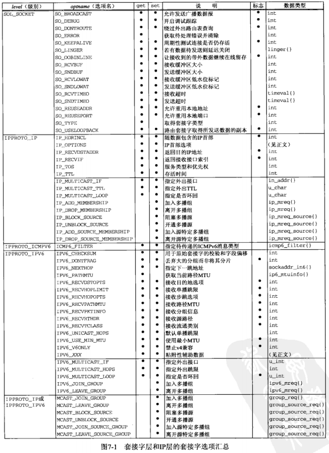
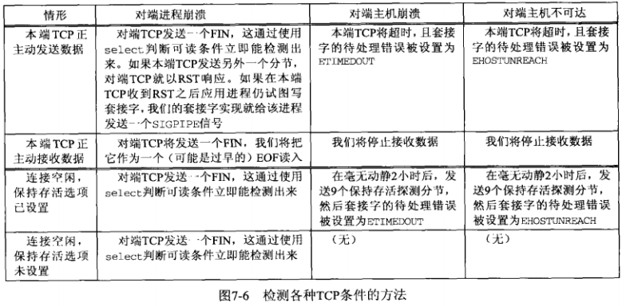
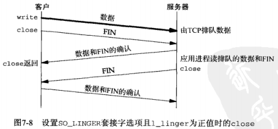
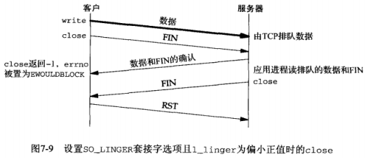
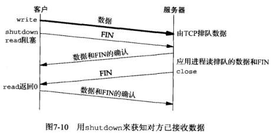
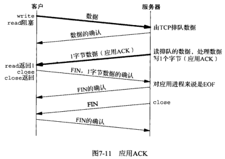
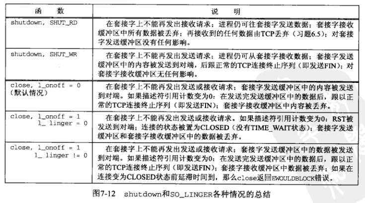

[TOC]

# 第7章 套接字选项

## 7.1 概述

获取和设置影响套接字的选项的方法

- 1.getsockopt和setsockopt
- 2.fcntl函数：把套接字设置为阻塞式I/O、信号驱动式I/O以及设置套接字属主的POSIX的方法
- 3.ioctl函数

## 7.2 getsockopt和setsockopt

这两个函数仅用于套接字

```c
#include <sys/socket.h>

int getsockopt(int sockfd, int level, int optname, void *optval, socklen_t *optlen);

int setsockopt(int sockfd, int level, int optname, const void *optval, socklen_t optlen);
```

- sockfd：必须指向一个打开的套接字描述符
- level：指定系统中解释选项的代码
  - 通用套接字代码（`SOL_SOCKET`）
  - 某个特定协议的代码（如IPv4（`IPPROTO_IP`），IPv6、TCP（`IPPROTO_TCP`）或SCTP）
- optval：指向某个变量的指针
  - setsockopt从*optval中取得选项待设置的新值
  - getsockopt把已获取的选项当前值放到*optval中
- optlen：指定*optval的大小
  - setsockopt：值参数
  - getsockopt：值-结果参数
- 返回值： 成功返回0，错误返回-1

对下图的**解释**：

- 1.表中“数据类型”列出了指针optval必须指向的数据类型，后跟花括号的表示一个结构，如`linger{}`表示`struct linger`

- 2.套接字选项粗分为两大基本类型：

  - **标志选项**：启用或禁止某个特性的二元选项，图中“标志”有黑圆点的，此时
    - *optval：一个整数，0表示被禁止，非0表示被启用
  - **值选项**：取回并返回我们可以设置或检查的特定值的选项，图中“标志”没有黑圆点的，此时
    - *optval：用于在用户进程与系统之间传递所指定数据类型的值

  

  

  


  

## 7.4 套接字状态

以下的套接字选项由TCP已连接套接字从监听套接字继承而来

  - `SO_DEBUG`（开启调试跟踪）
  - `SO_DONTROUTE`（绕过外出路由表查询）
  - `SO_KEEPLIVE`（周期性测试连接是否存活）
  - `SO_LINGER`（若有数据待发送则延迟关闭）
  - `SO_OOBINLINE`（让接收到的带外数据继续再线留存）
  - `SO_RCVBUF`（接收缓冲区大小）
  - `SO_RCVLOWAT`（接收缓冲区低水位标记）
  - `SO_SNDBUF`（发送缓冲区大小）
  - `SO_SNDLOWAT`（发送缓冲区低水位标记）
  - `TCP_MAXSEG`（TCP最大分节大小）
  - `TCP_NODELAY`（禁止Nagle算法）

  ## 7.5 通用套接字选项

这些选项是协议无关的，不过其中有些选项只能应用到某些特定类型的套接字中。如称`SO_BROADCAST`套接字选项是“通用”的，但它只能用于数据报套接字

  ### 7.5.1 SO_BROADCAST套接字选项

**限制**：只有**数据报**套接字支持广播，并且必须是支持广播消息的网络上（如以太网）

**作用**：开启或禁止进程发送广播消息的能力

由于应用进程在发送广播数据报之前必须设置本套接字选项，因此它能够有效地防止一个进程在其应用程序根本没有设计成可广播时就发送广播数据报

如果发送数据报的目的地址为广播地址且本套接字选项没有设置，则返回EACCES错误

  ### 7.5.2 SO_DEBUG套接字选项

  **限制**：仅由TCP支持

  **作用**：当给一个TCP套接字开启本选项时，内核将为TCP在该套接字发送和接收的所有分组保留详细跟踪信息。这些信息保留在内核的某个唤醒缓冲区中，并可使用trpt程序进程检查

  ### 7.5.3 SO_DONTROUTE套接字选项

**作用**：规定外出的分组将绕过底层协议的正常路由机制

**举例**：如果开启本选项，IPv4情况下外出分组将被定向到适当的本地接口（由目的地址的网络和子网部分确定）。如果这样的本地接口无法由目的地址确定（如目的主机不在一个点对点链路的另一端，也不在一个共享的网络上），则返回ENETUNREACH错误

**相同效果的做法**：给函数send、sendto、sendmsg使用MSG_DONTROUTE标志，也能在个别的数据报上取得相同效果

**应用**：路由守护进程（routed和gated）使用本选项绕过路由表（路由表不正确的情况下），以强制将分组从特定接口送出

  ### 7.5.4 SO_ERROR套接字选项

**背景**:当一个套接字上发生错误时，源自Berkeley的内核中的协议模块将该套接字的名为so_error的变量设为标准的Unix Exxx值中的一个，称为该套接字的**待处理错误**

**内核通知进程该错误的方法**：

  - 1.如果进程阻塞在该套接字的select调用上，那么无论是检查该套接字的可读条件还是可写条件，select均返回并设置其中一个或两个条件为“就绪”
  - 2.如果进程使用信号驱动I/O模型，内核给进程或进程组产生一个SIGIO信号

**进程获取该错误的方法**：使用`getsockopt + SO_ERROR`获取，其中*valopt就是该套接字的待处理错误。获取之后，so_error由内核复位为0

**read和write发现该错误的过程**：

  - read：
    - 无数据可读时：当进程调用read且没有数据返回时，如果`so_error`为非0，则read返回-1且**errno**被设置为`so_error`的值，随后so_error被复位为0
    - 有数据可读时：如果该套接字上有数据在排队等待读取，read返回数据而不是错误条件
  - write：
    - 如果进程在调用write时so_error为非0，write返回-1，且**errno**被设置为`so_error`的值，随后`so_error`被复位为0

  ### 7.5.5 SO_KEEPLIVE套接字选项

**功能**：检测对端主机是否崩溃或变得不可达

给一个TCP套接字设置**保持存活选项**后，如果2个小时内在该套接字的任何一方上没有数据交换，TCP就自动给对端发送一个**保持存活探测分节**，此时对端必须响应，并可能产生3种情况：

  - 1.**正常**：对端以期望的ACK响应，应用进程得不到通知
  - 2.**对端已经崩溃且已重启**：对端以RST响应，套接字的待处理错误被置为ECONNRESET，套接字本身被关闭
  - 3.**无响应**：对端对**保持存活探测分节**没有任何响应，Berkeley的TCP将另外发送8个探测分节，两两相隔75秒，试图得到响应。在第一个探测分节后11分15秒内若没有任何响应则放弃
    - 没有任何响应：套接字的待处理错误设为ETIMEDOUT，套接字本身被关闭
    - 收到ICMP错误，返回相应错误，套接字本身被关闭
      - 如，ICMP错误为“host unreachable”（主机不可达），说明对端没有崩溃，只是不可达，待处理错误设为EHOSTUNREACH

**修改探测定时**：通常为2小时。如果修改该参数,则会影响到主机上所有开启本选项的套接字。因为是基于整个内核维护这些时间参数的，而不是基于每个套接字维护

**谁启用**：一般由服务器使用，因为它们花大部分时间阻塞在等待穿越TCP连接的输入上，如果客户主机连接掉线、电源掉电、系统崩溃，服务器进程将永远不知道，并永远等待，这种状态称为**半开连接**。保持存活选项将检测出这些搬开连接并终止它们

**替代方法**：应用层超时，由应用层进程本身完成

下图，展示了一个TCP连接的另一端发生某些事情时我们可以采用的各种检测方法的汇总



### 7.5.6 SO_LINGER套接字选项

**该选项指定close函数对面向连接的协议如何操作**。默认操作是close函数立即返回，但是如果有数据残留在套接字发送缓冲区中，系统将试着把这些数据发送给对端。SO_LINGER套接字选项使得我们可以改变这个默认设置 

选项要求在用户进程与内核间传递如下结构：

  ```c
  //定义在头文件<sys/socket.h>
  struct linger{
  	int l_onoff;   /* 0=off（关闭）, nozero=on（开启） */
  	int l_linger;  /* 延滞时间，POSIX指定单位为秒 */
  };
  ```

有以下3种情形：

  - 1.**l_onoff为0**：此时l_linger值会被忽略。关闭该选项，默认设置生效，即close立即返回 （**图7.7**） 

  

  - 2.**l_onoff非0，且l_linger为0**：TCP将终止连接，丢弃保留在套接字发送缓冲区中的任何数据，并发送一个RST给对端，而没有通常的四分组连接终止序列，这么一来**避免了TIME_WAIT状态**，然而存在以下可能性：在2MSL秒内创建该连接的另一个化身，导致来自刚被终止的连接上的旧的重复分节被不正确地传送到新的化身上 
  - 3.**l_onoff非0，且l_linger非0**：当套接字关闭时，内核将拖延一段时间。如果在套接字发送缓冲区中仍残留有数据，那么进程将投入睡眠，直到：
    - (a)所有数据都已经发送完且均被对方确认；
    -  (b)延滞时间到；（如果套接字被设置为非阻塞，那么将不等待close完成，即使延滞时间非0也是如此） 

当使用SO_LINGER选项的这个特性时，应用进程检查**close的返回值**是非常重要的，因为如果在数据发送完并被确认前延滞时间到的话，close将返回-1，errno设为EWOULDBLOCK错误，且套接字发送缓冲区中的任何残留数据都被丢弃。这种组合可能存在下列几种情况： 

  - **延滞时间合适**：close直到数据和FIN已被服务器主机的TCP确认后才返回（**图7.8**） 
    - 问题：在服务器应用进程读剩余数据之前，服务器主机可能崩溃，并且客户应用进程永远不会知道。因此，close成功返回只是告诉我们先前发送的数据和FIN已由对端TCP确认，而不能告诉我们对端应用进程是否已读取数据 
  - **延滞时间偏低**：在接收到服务器主机的TCP确认前close返回 （**图7.9**） 

  

  

**一个基本原则**：设置`SO_LINGER`套接字选项后，close的成果返回只是告诉我们先前发送的数据和FIN已经由对端TCP确认，而不能告诉我们对端应用进程是否已经读取数据

**知道对端已经读取数据的方法**：

  - 1.使用shutdown，且第二个参数为SHUT_WR，后跟一个read调用--->read直到收到对端的FIN才返回0（**图7.10**）

  

  - 2.应用级确认，也称为“应用ACK"(**图7.11**)

  

**在客户端**：向服务器发送数据后调用read来获取1个字节的数据

  ```c
  char ack;
  Write(sockfd, data, nbytes); // 从客户到服务器的数据
  n = Read(sockfd, &ack, 1); // 等待应用ACK
  ```

**服务器**：读取客户的数据后发回1个字节的应用级ACK

  ```c
  nbytes = Read(sockfd, buff, sizeof(buff)); // 来自客户的数据
  Write(sockfd,"",1); //服务器发送给客户的ACK
  ```

  

下图汇总了对**shutdown**的两种可能调用和对**close**的三种可能调用以及它们对TCP套接字的影响：

  

  ### 7.5.8 SO_RCVBUF和SO_RCVSNDBUF套接字选项

**作用**：每个套接字都有一个发送缓冲区和一个接收缓冲区。这两个套接字选项允许我们改变这两个缓冲区的默认大小 

**TCP流量控制**：对于TCP来说，套接字接收缓冲区中可用空间的大小限定了TCP通告对端的窗口大小。TCP套接字接收缓冲区不可能溢出，因为不允许对端发出超过本端所通告窗口大小的数据。如果对端无视窗口大小而发出了超过该窗口大小的数据，本端TCP将丢弃它们 

**UDP无流量控制**：对于UDP来说，当接收到的数据报装不进套接字接收缓冲区时，该数据报就被丢弃。UDP是没有流量控制的：较快的发送端可以很容易地淹没较慢的接收端，导致接收端的UDP丢弃数据报，事实上较快的发送端甚至可以淹没本机的网络接口，导致数据报被本机丢弃 

**TCP窗口规模的建立**：TCP的窗口规模选项是在建立连接时用SYN分节与对端互换得到的，因此SO_RCVBUF的设置要在建立连接之前完成：

  - 对于**客户** 
    - SO_RCVBUF选项必须在调用connect之前设置
  - 对于**服务器**
    - SO_RCVBUF选项必须在调用listen之前给监听套接字设置 
    - 给已连接套接字设置该选项对于可能存在的窗口规模选项没有任何影响，因为accept直到TCP的三路握手完成才会创建并返回已连接套接字。这就是必须给监听套接字设置该选项的原因。（套接字缓冲区的大小总是由新创建的已连接套接字从监听套接字继承而来） 

**TCP缓冲区的大小**：

  - 至少为MSS的4倍。依据是TCP快速恢复算法（3个重复的确认来检测某个分节是否丢失）
  - 应该是响应连接的MSS值的偶数倍
  - 如果套接字缓冲区小于**带宽-延迟积**，连接管道将不会处于满状态
    - 带宽-延迟积：带宽和RTT相乘

  ### 7.5.9 SO_RCVLOWAT和SO_SNDLOWAT套接字选项

每个套接字还有一个**收低水位标记**和一个**发送低水位标记**。它们由select函数使用 

**接收低水位标记** :让select返回“可读”时套接字接收缓冲区中所需的数据量（对于TCP、UDP、SCTP套接字，其默认值是1） 

**发送低水位标记**：让select返回“可写”时套接字发送缓冲区中所需的可用空间 （对于TCP套接字，其默认值通常是2048；UDP也使用发送低水位标记，然而由于UDP并不为应用程序传递给它的数据报保留副本，因此UDP套接字的发送缓冲区中可用空间的字节数从不改变，只要一个UDP套接字的发送缓冲区大小大于该套接字的低水位标记，该UDP套接字就总是可写的。UDP并没有发送缓冲区，只有发送缓冲区大小这个属性） 

### 7.5.10 SO_RCVTIMEO和SO_SNDTIMEO套接字选项

这两个选项允许我们给套接字的接收和发送设置一个超时值。访问它们的getsockopt和setsockopt函数的参数指向timeval结构的指针，与select所用参数相同

```c
struct timeval {
    long tv_sec; //秒数
    long tv_usec; //微秒
};
```

**接收超时**影响5个输入函数：

- read
- readv
- recv
- recvfrom
- recvmsg

**发送超时**影响5个输出函数：

- write
- writev
- send
- sendto
- sendmsg

### 7.5.11 SO_REUSEADDR和SO_REUSEPOPT套接字

**SO_REUSEADDR**套接字选项的4个功能

>  **1.允许启动一个监听服务器并捆绑其众所周知端口，即使以前建立的将该端口用作它们的本地端口的连接仍然存在**，这个条件通常是这样产生的：

- a）启动一个监听服务器
- b）连接请求到达，派生一个子进程来处理这个客户
- c）监听服务器终止，但子进程继续为现有连接上的客户提供服务
- d）重启监听服务

**解释**：默认情况下，当监听服务器在步骤d通过调用socket、bind和listen重新启动时，由于它试图绑定一个现有连接（即正由早先派生的那个子进程处理着的连接）上的端口，从而bind调用会失败。但如果该服务器在socket和bind两个调用之间设置了SO_REUSEADDR套接字选项，那么bind成功。

**建议**：所有TCP服务器都应该指定本套接字选项，以允许服务器在这种情况下被重新启动

> **2.允许在同一端口上启动同一服务器的多个实例（多个进程），只要每个实例捆绑一个不同的本地IP地址即可** 

**举例**：三个服务器实例，一个使用通配地址、另两个使用指定地址

**建议**：执行通配地址的服务器进程最后一个启动

> **3.允许单个进程捆绑同一端口到多个套接字上，只要每次捆绑指定不同的本地IP地址即可** 

**举例**：

- 1.要求知道客户请求的目的IP地址的UDP服务器
- 2.希望在一个多目的主机的若干个（非全部）本地地址上服务连接的TCP服务器

> **4.允许完全重复的捆绑：当一个IP地址和端口已捆绑到某个套接字上时，如果传输协议支持，同样的IP地址和端口还可以捆绑到到另一个套接字上**

**举例**：一般来说该特性仅支持UDP套接字，用于多播

**所用规则**：如果数据报的目的地址时一个广播地址或多播地址，那就给每个匹配的套接字递送一个该数据报的副本。如果是单播地址，且有多个套接字匹配该数据报，那么该选择由哪个套接字接收它取决于实现

---

**SO_REUSEPOPT**的功能

- 1.本选项允许完全重复的绑定，不过只有在想要捆绑同一IP地址和端口的每个套接字都指定了套接字选项才行
- 2.如果被捆绑的IP地址时一个多播地址，那么`SO_REUSEADDR`和`SO_REUSEPOPT`被认为是等效的

**缺点**：并非所有系统都支持，不支持时，可改用SO_REUSEADDR

---

**总结**：

- 1.在所有TCP服务器程序中，在调用bind之前设置SO_REUSEADDR套接字选项
- 2.当编写一个可在同一时刻在同一主机上运行多次的多播应用时，设置SO_REUSEADDR套接字选项，并将所有参加多播组的地址作为本地IP地址捆绑

### 7.5.12 SO_TYPE套接字选项

**功能**：返回套接字的类型，返回的整数值时一个诸如`SOCK_STREAM`或`SOCK_DGRAM`之类的值

**场景**：通常由启动时继承了套接字的进程使用

## 7.6 IPv6套接字选项

这些套接字选项由IPv4处理，它们的级别为IPPROTO_IP

### 7.6.2 IP_OPTIONS套接字选项

**作用**：允许我们在IPv4首部中设置IP选项

将在27.3节讨论

### 7.6.3 IP_RECVDSTADDR套接字选项

**作用**：导致所收到的UDP数据报的目的IP地址由recvmsg函数作为辅助数据返回

将在22.2节给出一个例子

### 7.6.4 IP_RECVIF套接字选项

**作用**：导致所收到的UDP数据报的接收接口索引由recvmsg函数作为辅助数据返回

将在22.2节给出一个例子

### 7.6.5 IP_TOS套接字选项

**作用**：允许我们为TCP、UDP或SCTP套接字设置IP首部中的服务类型字段（该字段包含DSCP和ECN子字段）

**给本选项调用getsockopt**：

- 1.用于放入外出IP数据报首部的DSCP和ECN字段中的EOS当前值（默认为0）将返回
- 2.没有办法从接收到的IP数据报中取得该值

### 7.6.6 IP_TTL套接字选项

**作用**：设置或获取系统用在从某个给定套接字发送的单播分组上的默认TTL值（多播TTL值使用IP_MULTICAST_TTL套接字选项）

**默认值**：

- 1.TCP、UDP：64
- 2.原始套接字：255

**给本选项调用getsockopt**：

- 1.返回系统将用于外出数据报的字段的默认值
- 2.没有办法从接收到的IP数据报中取得该值

## 7.9 TCP套接字选项


  