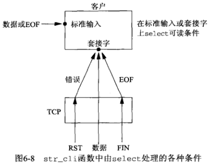
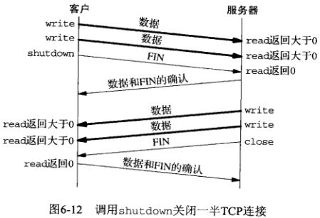

[TOC]

## 6.3 select函数

```c
#include <sys/select.h>
#include <sys/time.h>

int select(int maxfpd1, fd_set *readset, fd_set *writeset, fd_set *exceptset, const struct timeval *timeout);
```

**参数解释**

- **timeout:**

作用：告知内核等待所指定描述符中的任何一个就绪可花多长时间

```c
struct timeval {
    long tv_sec; //秒数
    long tv_usec; //微秒
};
```

timeout参数有**三种可能**

- 1.空指针：永远等待，仅在一个描述符准备好I/O时才返回
- 2.timeval指定秒数和微秒数：等待设定的时间，在有一个描述符准备好I/O才返回
- 3.timeval的两个变量值为0：不等待，检查描述符后立即返回，也称为轮询

select**返回的情况**

- 1.一个或多个描述符就绪
- 2.等待期间，从信号处理函数返回时，得到EINTR错误（永远等待、等待设定时间情况下可能发生）

timeout中**const表示**：timeout中的变量值不会被select修改为剩余时间


- **readset、writeset、expectset：**

表示让内核测试读就绪、写就绪和异常条件的描述符集

异常条件有：

- 1.某个套接字的带外数据的到达（第24章）
- 2.某个已置为分组模式的伪终端存在可从其主端读取的控制状态信息

三个中，如果对某一个条件不感兴趣，可以设为空指针。如果三个都设为空指针，select就成为一个比Unix的sleep函数更精确的定时器

三个都是**值-结果参数**：

- 1.调用函数时：指定所关心的描述符的值
- 2.函数返回时：描述符就绪，则设为1；未就绪，则设为0
- 3.函数返回后：使用`FD_ISSET`宏来测试`fd_set`数据类型中的描述符
- 4.每次重新调用select时，需要再次把描述符集内所关心的位设为1

描述符集的实质是：整数数组，每一位对应一个描述符

**相关操作**

```c
void FD_ZERO(fd_set *fdset); //清除描述符集中的所有位
void FD_SET(int fd, fd_set *fdset); //将fd描述符的位设为1，表示对此感兴趣
void FD_CLR(int fd, fd_set *fdset); //将fd描述符的位设为0，表示对此不感兴趣
void FD_ISSET(int fd, fd_set *fdset); //测试fd描述符是否为1
```

**例子**

```c
fd_set rset;
FD_ZERO(&rset); //初始化，一定要做，否则后果不可预期
FD_SET(1,&rset); //对1描述符设为感兴趣
FD_SET(4,&rset); //对4描述符设为感兴趣
FD_SET(5,&rset); //对5描述符设为感兴趣
```


- **maxfdp1**

指定待测试的描述符个数，它的值是最大描述符加1（并不只是值为1的个数），例如打开描述符1、4、5，则maxfdp1的值是6（即[0,5]范围有几个描述符）。这样做的目的是为了效率，maxfdp1之后的描述符可以不轮训

### 6.3.1 描述符就绪条件

**套接字准备好读**

- 1.套接字接收缓冲区中的数据字节大于等于套接字接收缓冲区低水位标记的当前大小
  - 返回情况：不阻塞，返回一个大于0的值（返回准备好读入的数据大小）
  - 低水平标记：使用SO_RCVLOWAT套接字选项设置，TCP、UDP默认为1
- 2.套接字连接读半部关闭（接收了对端的FIN的TCP连接）
  - 返回情况：不阻塞，返回0（即EOF）
- 3.套接字是一个监听套接字，已完成连接数不为0
  - 返回情况：accept函数不阻塞，返回一个已连接套接字的sockfd
- 4.有套接字错误待处理
  - 返回情况：不阻塞，返回-1，把errno设为错误条件
  - 获取错误方式：
    - errno
    - 指定SO_ERROR套接字选项调用getsockopt获取并清除

**套接字准备好写**

- 1.套接字发送缓冲区中的可用空间字节数大于等于套接字发送缓冲区低水位标记的当前大小
  - 套接字条件：已连接（TCP），不需要连接（UDP）
  - 返回情况：如果套接字设为非阻塞，不阻塞，返回一个正值（由传输层可接受的字节数）
  - 低水平标记：使用SO_SNDLOWAT套接字选项设置，TCP、UDP默认为1024
- 2.套接字连接写半部关闭（本端已经发送FIN）
  - 对写半关闭的套接字写，将产生SIGPIPE信号（对于收到RST的套接字写也会产生该信号）
- 3.使用非阻塞式connect的套接字已建立连接，或connect已经以失败告终
- 4.有套接字错误待处理
  - 返回情况：不阻塞，返回-1，把errno设为错误条件
  - 获取错误的方式：
    - errno
    - 指定SO_ERROR套接字选项调用getsockopt获取并清除
- 5.如果一个套接字存在带外数据或仍处于带外标记，那么它有异常条件待处理

**注意**：当某个套接字发生错误时，它将由select标记为既可读又可写

**低水位标记**

- 接收低水位标记和发送低水位标记的**目的**：允许应用进程控制在select返回可读或可写条件之前有多少数据可读或有多大空间可用于写
- 任何UDP套接字只要其发送低水位标记小于等于发送缓冲区大小，则总是可以写，因为UDP不需要连接


### 6.3.2 select的最大描述符数

**每个进程使用描述符的限制**：数目无上限，只受限于内存总量和管理性限制

select最大限制：1024个（32位系统）

相关文件与宏

```c
#include <sys/types.h> //或#include <sys/select.h>
#ifndef FD_SETSIZE
#define FD_SETSIZE 256 //但但修改这个值是无法扩展select描述符数的最大限制的
#endif
```

## 6.4 str_cli函数（select修订版1）

调用select所处理的各种条件

- 1.fgets调用
- 2.客户套接字



如图的客户**套接字**的三个条件处理如下：

- 1.对端TCP发送数据，该套接字变为可读，read返回一个大于0的值（读入数据的字节数）
- 2.对端TCP发送FIN（对端进程终止），该套接字变为可读，read返回0（EOF）
- 3.对端TCP发送RST（对端主机崩溃并重启），该套接字变为可读，read返回-1，errno设为错误码

```c
// select/strcliselect01.c
#include	"unp.h"

void
str_cli(FILE *fp, int sockfd)
{
	int			maxfdp1;
	fd_set		rset;
	char		sendline[MAXLINE], recvline[MAXLINE];
	//初始化描述符集
	FD_ZERO(&rset);
	for ( ; ; ) {
		//fileno(fp)把标准I/O文件指针fp转换为对应的描述符
		FD_SET(fileno(fp), &rset);
		//将套接字描述符设为关心
		FD_SET(sockfd, &rset);
		//获取两个描述符中的较大值，并+1计算出maxfdp1值
		maxfdp1 = max(fileno(fp), sockfd) + 1;
		//包裹函数Select，增加了返回值小于0的错误处理
		//将readset和writeset设为NULL，表示不感兴趣
		//将timeout设为NULL，表示永远等待，直到有描述符准备好
		Select(maxfdp1, &rset, NULL, NULL, NULL);
		//如果套接字可读
		if (FD_ISSET(sockfd, &rset)) {	/* socket is readable */
			//读取套接字
			if (Readline(sockfd, recvline, MAXLINE) == 0)
				//如果套接字返回0，表示对端进程终止，输出错误并退出客户进程
				err_quit("str_cli: server terminated prematurely");
			//输出套接字读入的结果
			Fputs(recvline, stdout);
		}
		//如果标准输入可读
		if (FD_ISSET(fileno(fp), &rset)) {  /* input is readable */
			//读取标准输入
			if (Fgets(sendline, MAXLINE, fp) == NULL)
                //如果为NULL表示读到EOF,退出客户进程
				return;		/* all done */
			//将标准输入读到的内容写入套接字
			Writen(sockfd, sendline, strlen(sendline));
		}
	}
}
```

## 6.5 批量输入

批量输入时，6.4节版本的str_cli函数存在的问题：

- 1.批量方式下，标准输入中的EOF并不意味着同时也完成了从套接字的读入。可能仍有请求在去往服务器的路上，或有应答在返回客户的路上
  - 解决方法：写半关闭，当标准输入读到EOF时，给服务器发送FIN，告诉它我们完成了数据发送，但仍然保持套接字描述符打开以便读取
  - 解决函数：shutdown
- 2.客户进程使用文本作为输入时，fgets函数读取输入时，文本输入行被读入到stdio所用的缓冲区中，而fgets只返回其中一行，其余输入仍在stdio缓冲区中。write只将其中一行写给服务器，随后select再次被调用而等待新的工作，而不管stdio缓冲区中还有额外的输入待消费
  - 原因：select不知道stdio使用了缓冲区，它只从read系统调用的角度考虑是否有数据可读，而不是在fgets的角度考虑（//TODO：read和fgets的区别是什么）
- 3.客户进程从套接字读取时，在readline调用时，套接字缓冲区也存在2.中提到的问题

这里提到的三个问题将在6.7节中的str_cli函数（select修订版2）中解决

## 6.6 shutdown函数

close函数有两个限制，可以使用shutdown来避免

close的限制：

- 1.close把描述符的引用计数-1，仅在计数变为0时才关闭套接字。shutdown可以不管引用计数，直接激发TCP的正常连接终止序列
- 2.close终止读和写两个方向的数据传送。shutdown可以告知对端已经完成了数据发送，但仍然可以接收对方发送的数据



```c
#include <sys/socket.h>
//返回：成功返回0，出错返回-1
int shutdown(int sockfd, int howto);
```

