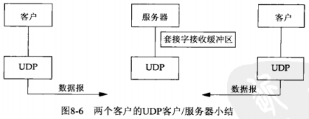

# 第8章 基本UDP套接字编程

## 8.1 概述

使用UDP编写的一些常见的应用程序有：DNS（域名系统）、NFS（网络文件系统）、SNMP（简单网络管理协议）


## 8.2 recvfrom和sendto函数

```c++
#include <sys/socket.h>

/*
** 共同参数
** @sockfd:描述符
** @buff:指向读入或写出缓冲区的指针
** @nbytes:读写字节数
** @flags：将在14章讨论，目前都设为0
*/

/*
** 作用：
** @from:指向一个将由该函数在返回时填写数据报发送者的协议地址的套接字地址结构
** @addrlen:from所指向的套接字地址结构的大小，注意：值-结果参数
** @返回值：成功：所读数据的长度；出错：-1
*/
sszie_t recvfrom(int sockfd, void *buff, size_t nbytes, int flags, struct sockaddr *from, socklen_t *addrlen);

/*
** 作用：
** @to:指向一个含有数据报接收者的协议地址（IP地址和端口号）的套接字地址结构
** @addrlen:to所指向的套接字地址结构的大小，注意：整数值
** @返回值：成功：所写数据的长度；出错：-1
*/
ssize_t sentto(int sockfd, const void *buff, size_t nbytes, int flags, const struct sockaddr *to, socklen_t addrlen);
```

- recvfrom的最后两个参数（from、addrlen）类似与accept（cliaddr、addrlen）的最后两个参数
  - UDP情况下：返回时其中套接字地址结构的内容告诉我们是谁发送了数据报
  - TCP情况下：谁发起了连接
- sendto的最后两个参数（to、addren）类似与connect（servaddr、addrlen）的最后两个参数
  - UDP情况下：调用时其中套接字地址结构被我们填入数据报将发往的协议地址
  - TCP情况下：与之建立连接的协议地址

**写0长度的数据报**

写一个长度为0的数据报是可行的，UDP情况下，会形成一个只包含一个IP首部（IPv4为20字节，IPv6为40字节）和一个8字节UDP首部而没有数据的IP数据报

**读0长度的数据报**

recvfrom返回值是0，它并不像TCP套接字read返回0表示对端已经关闭连接，因为UDP无连接，因此没有关闭连接之说。返回值为0说明读到的对端发送的“写0长度的数据报”

**from参数为空**

recvfrom的from参数可以是空指针，此时addrlen也必须为空，表示我们不关心数据报发送者的协议地址

**TCP使用这两个函数**

recvfrom和sendto可以用于TCP，但通常不会这么做

## 8.3 UDP回射服务器程序：main函数


```c++
// 源码： udpcliserv/udpserv01.c

#include	"unp.h"

int
main(int argc, char **argv)
{
	int					sockfd;
	struct sockaddr_in	servaddr, cliaddr;

	//SOCK_DGRAM表示创建一个UDP套接字
	sockfd = Socket(AF_INET, SOCK_DGRAM, 0);

	bzero(&servaddr, sizeof(servaddr));
	servaddr.sin_family      = AF_INET;
	servaddr.sin_addr.s_addr = htonl(INADDR_ANY);

	//#define SERV_PORT 9877
	servaddr.sin_port        = htons(SERV_PORT);

	Bind(sockfd, (SA *) &servaddr, sizeof(servaddr));

	//调用dg_echo函数来执行服务器的处理工作
	dg_echo(sockfd, (SA *) &cliaddr, sizeof(cliaddr));
}
```

## 8.4 UDP回射服务器程序：dg_echo函数

```c++
// 源码：lib/dg_echo.c

#include	"unp.h"

void
dg_echo(int sockfd, SA *pcliaddr, socklen_t clilen)
{
	int			n;
	socklen_t	len;
	char		mesg[MAXLINE];

	//简单的循环
	for ( ; ; ) {
		len = clilen;
		//使用recvfrom读入下一个到达服务器端口的数据报
		n = Recvfrom(sockfd, mesg, MAXLINE, 0, pcliaddr, &len);

		//把读到的数据报再发送回去
		Sendto(sockfd, mesg, n, 0, pcliaddr, len);
	}
}
```

**该函数的特点**

- 1.该函数永不终止，因为UDP是一个无连接的协议，它没有像TCP中EOF之类的东西
- 2.该函数提供的是一个迭代服务器。一般来说，TCP服务器是并发的，UDP服务器是迭代的

**接收缓冲**

对于本套接字，UDP层中隐含有排队发生。事实上每个UDP套接字都有一个接收缓冲区，到达该套接字的每个数据报都进入该套接字接收缓冲区。

- 每当调用recvfrom时，缓冲区中的下一个数据报以FIFO顺序返回给进程
- 如果有多个数据报到达该套接字，那么相继到达的数据报仅仅加到该套接字的接收缓冲区中（接收缓冲区大小是有限的，通过SO_RCVBUF套接字选项修改）

**TCP与UDP套接字对比**

- TCP套接字

服务器上有两个已连接套接字，每一个都有各自的套接字接收缓冲区


- UDP套接字

只有一个服务器进程，仅有的单个套接字用于接收所有到达的数据报并发回所有的响应。该套接字只有一个接收缓冲区用来存放所有到达的数据报



## 8.5 UDP回射客户程序：main函数

```c++
// 源码： udpcliserv/udpcli01.c

#include	"unp.h"

int
main(int argc, char **argv)
{
	int					sockfd;
	struct sockaddr_in	servaddr;

	if (argc != 2)
		err_quit("usage: udpcli <IPaddress>");

	//把服务器的IP地址和端口号填入一个IPv4的套接字地址结构
	//该结构将传递给dg_cli函数，以指明数据报发往何处
	bzero(&servaddr, sizeof(servaddr));
	servaddr.sin_family = AF_INET;
	servaddr.sin_port = htons(SERV_PORT);
	Inet_pton(AF_INET, argv[1], &servaddr.sin_addr);

	//创建一个UDP套接字
	sockfd = Socket(AF_INET, SOCK_DGRAM, 0);

	dg_cli(stdin, sockfd, (SA *) &servaddr, sizeof(servaddr));

	exit(0);
}
```

## 8.6 UDP回射客户程序：dg_cli函数

```c++
// 源码： lib/dg_cli.c

#include	"unp.h"

void
dg_cli(FILE *fp, int sockfd, const SA *pservaddr, socklen_t servlen)
{
	int	n;
	char	sendline[MAXLINE], recvline[MAXLINE + 1];

	//使用fgets从标准输入读入一行文本行
	while (Fgets(sendline, MAXLINE, fp) != NULL) {

		//使用sendto将该文本行发送给服务器
		Sendto(sockfd, sendline, strlen(sendline), 0, pservaddr, servlen);

		//使用recvfrom读回服务器的回射
		n = Recvfrom(sockfd, recvline, MAXLINE, 0, NULL, NULL);

		recvline[n] = 0;	/* null terminate */
		//使用fputs把回射的文本行显示到标准输出
		Fputs(recvline, stdout);
	}
}
```

**端口号**

该函数未请求内核给它的套接字指派一个临时端口。

对于临时端口的指派：

- 1.TCP：connect调用时指派
- 2.UDP：进程首次调用sendto时如果没有绑定一个本地端口，内核在此时为它选择一个临时端口

显示指定端口：UDP客户也可以显示调用bind指定端口，但很少这么做

**风险（待解决的问题）**

recvfrom指定的第五个和第六个参数（from、addrlen）是空指针，这告知内核我们不关心应答数据报由谁发送

这样做存在一个风险：任何进程不论是在与本客户进程相同的主机还是在不同的主机上，都可以向本客户的IP地址和端口号发送数据报，这些数据报被客户读入并认为是服务器的应答。该问题将在8.8节中解决

