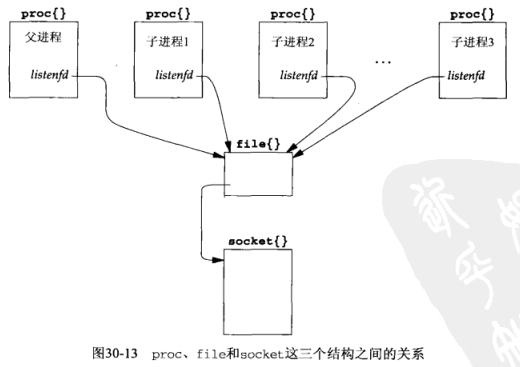

# 第30章 服务/服务器程序设计范式

## 30.1 概述

开发一个Unix服务器程序时，有如下类型的进程控制可供选择：

- 1.迭代服务器（第1章）
  - 缺点：这样的服务器在完成对当前客户的服务之前无法处理已等待服务的新客户
- 2.多进程并发服务器（第5章）：为每个客户调用fork派生一个子进程
- 3.TCP select单进程服务器（第6章）：TCP服务器程序由使用select处理任意多个客户的单个进程构成
- 4.多线程并发服务器（第26章）：服务器程序被改为服务器为每个客户创建一个线程，以取代派生一个进程
- 5.预先派生子进程服务器（第30章）：让服务器在启动阶段调用fork创建一个子进程池。每个客户请求由当前可用子进程池中的某个（闲置）子进程处理
- 6.预先创建线程服务器（第30章）：让服务器在启动阶段创建一个线程池，每个客户由当前可用线程池中的某个（闲置）线程处理

## 30.2 TCP客户程序设计范式

对本书中实现的TCP客户程序的优缺点总结：

- 1.基本的TCP客户程序（第5章），存在两个问题：
  - a).进程在被阻塞以等待用户输入期间，看不到诸如对端关闭连接等网络事件
  - b).以“停-等”模式运作，批处理效率极低
- 2.select版TCP客户程序（第6章）：通过调用select使得进程能够在等待用户输入期间得到网络事件通知，问题：
  - 不能正确地处理批量输入问题
- 3.select shutdown版TCP客户程序（第6章）：使用shutdown函数解决了2.中“不能正确地处理批量输入问题”
- 4.非阻塞I/O客户程序（第16章）
- 5.多进程客户程序（第16章）：使用fork派生一个子进程，并由父进程（或子进程）处理从客户到服务器的数据，由子进程（或父进程）处理从服务器到客户的数据
- 6.多线程客户程序（第26章）：使用两个线程取代5.中的两个进程

**总结**：

- 1.非阻塞式I/O版本是最快的，但其代码复制度高
- 2.两个进程或两个线程的版本相比之下代码简化得多，而运行速度只是稍逊“非阻塞式I/O版本”

## 30.3 TCP测试用客户程序

给出的客户程序用于测试我们的服务器程序的各个变体

```c
// 源码： server/client.c

#include	"unp.h"

#define	MAXN	16384		/* max # bytes to request from server */

int
main(int argc, char **argv)
{
	int		i, j, fd, nchildren, nloops, nbytes;
	pid_t	pid;
	ssize_t	n;
	char	request[MAXLINE], reply[MAXN];

	//要求输入 0.程序名 1.服务器的主机名或IP地址 2.服务器的端口 3.由客户fork的子进程数
	//4.每个子进程发送给服务器的请求数 5.每个请求要求服务器返送的数据字节数
	if (argc != 6)
		err_quit("usage: client <hostname or IPaddr> <port> <#children> "
				 "<#loops/child> <#bytes/request>");

	nchildren = atoi(argv[3]); //3.由客户fork的子进程数
	nloops = atoi(argv[4]); //4.每个子进程发送给服务器的请求数
	nbytes = atoi(argv[5]); //5.每个请求要求服务器返送的数据字节数
	snprintf(request, sizeof(request), "%d\n", nbytes); /* newline at end */

	for (i = 0; i < nchildren; i++) {
		if ( (pid = Fork()) == 0) {		/* child */
			for (j = 0; j < nloops; j++) {
				fd = Tcp_connect(argv[1], argv[2]);

				Write(fd, request, strlen(request));

				if ( (n = Readn(fd, reply, nbytes)) != nbytes)
					err_quit("server returned %d bytes", n);

				Close(fd);		/* TIME_WAIT on client, not server */
			}
			printf("child %d done\n", i);
			exit(0);
		}
		/* parent loops around to fork() again */
	}

	while (wait(NULL) > 0)	/* now parent waits for all children */
		;
	if (errno != ECHILD)
		err_sys("wait error");

	exit(0);
}
```

执行本客户程序的命令如下：

```shell
# client:程序名
# 206.62.226.36：服务器IP
# 8888：服务器端口号
# 5：由客户fork的子进程数
# 500：每个子进程发送给服务器的请求数
# 4000：每个请求要求服务器返送的数据字节数
% client 206.62.226.36 8888 5 500 4000
```

这将建立2500个服务器的TCP连接（5个子进程*每个子进程500个请求），在每个连接上，客户向服务器发送5个字节数（“4000\n”），服务器向客户返回4000字节数据。我们在**两个**不同的主机上针对同一个服务器执行本客户程序，于是总共提供5000个TCP连接，而且任意时刻服务器端最多同时存在10个连接

以此客户程序分别测试后面9个不同的服务器程序设计范式

- 1.TCP迭代服务器程序
- 2.TCP并发服务器程序，每个客户一个子进程
- 3.TCP预先派生子进程服务器程序，accept无上锁保护
- 4.TCP预先派生子进程服务器程序，accpet使用文件上锁保护
- 5.TCP预先派生子进程服务器程序，accpet使用线程上锁保护
- 6.TCP预先派生子进程服务器程序，传递描述符
- 7.TCP并发服务器程序，每个客户一个线程
- 8.TCP预先创建线程服务器程序，每个线程各自accpet
- 9.TCP预先创建线程服务器程序，主线程统一accpet

## 30.4 TCP迭代服务器程序

从进程控制角度看，迭代服务器是最快的，因为它不执行进程控制

## 30.5 TCP并发服务器程序，每个客户一个子进程

**限制**：在此程序中，客户数目的唯一限制是操作系统对以其名义运行服务器的用户ID能够同时拥有多少个子进程的限制

**问题**：每个客户现场fork一个进程比较耗费CPU时间

**main函数**:

```c
// 源码： server/serv01.c

/* include serv01 */
#include	"unp.h"

int
main(int argc, char **argv)
{
	int					listenfd, connfd;
	pid_t				childpid;
	void				sig_chld(int), sig_int(int), web_child(int);
	socklen_t			clilen, addrlen;
	struct sockaddr		*cliaddr;

	if (argc == 2)
		listenfd = Tcp_listen(NULL, argv[1], &addrlen);
	else if (argc == 3)
		listenfd = Tcp_listen(argv[1], argv[2], &addrlen);
	else
		err_quit("usage: serv01 [ <host> ] <port#>");
	cliaddr = Malloc(addrlen);

	//处理子进程终止时发出的SIGCHLD信号
	Signal(SIGCHLD, sig_chld);
	//捕获由键入终端中断产生的SIGINT信号
	//在客户运行完毕之后键入该键以显示服务器程序运行所需的CPU时间
	//sig_int函数的工作就是输出CPU时间
	Signal(SIGINT, sig_int);

	for ( ; ; ) {
		clilen = addrlen;
		if ( (connfd = accept(listenfd, cliaddr, &clilen)) < 0) {
			if (errno == EINTR)
				continue;		/* back to for() */
			else
				err_sys("accept error");
		}

		if ( (childpid = Fork()) == 0) {	/* child process */
			Close(listenfd);	/* close listening socket */
            //调用web_child函数处理用户请求
            //回复客户以客户要求的字节数
			web_child(connfd);	/* process request */
			exit(0);
		}
		Close(connfd);			/* parent closes connected socket */
	}
}
/* end serv01 */
```

**web_child函数**

```c
// 源码： server/web_child.c

#include	"unp.h"

#define	MAXN	16384		/* max # bytes client can request */

void
web_child(int sockfd)
{
	int			ntowrite;
	ssize_t		nread;
	char		line[MAXLINE], result[MAXN];

	for ( ; ; ) {
		if ( (nread = Readline(sockfd, line, MAXLINE)) == 0)
			return;		/* connection closed by other end */

			/* 4line from client specifies #bytes to write back */
		ntowrite = atol(line);
		if ((ntowrite <= 0) || (ntowrite > MAXN))
			err_quit("client request for %d bytes", ntowrite);

		Writen(sockfd, result, ntowrite);
	}
}
```

**sig_int函数**

```c
// 源码： server/serv01.c


/* include sigint */
void
sig_int(int signo)
{
	void	pr_cpu_time(void);
	
    //输出CPU时间
	pr_cpu_time();
	exit(0);
}
/* end sigint */
```

## 30.6 TCP预先派生子进程服务器程序，accept无上锁保护

在服务器启动阶段预先派生一定数量的子进程，当各个客户程序连接到达时，这些子进程立即就能为它们服务


**优点**：无须引入父进程执行fork的开销就能处理新到的客户

**缺点**：

- 服务器端：父进程必须在服务器启动阶段猜测需要预先派生多少个子进程。如果某个时刻客户数恰好等于进程总数，那么新到的客户将被忽略，直到至少有一个子进程重新可用。进一步分析，这些客户并未被完全忽略。内核将为每个新到的客户完成三路握手，直到达到相应套接字上listen调用的backlog数为止，然后再服务器调用accpet时把这些已经完成的连接传递给它
- 客户端：客户能觉察到服务器在响应时间上的恶化，因为尽管它的connect调用立即返回，但是它的第一个请求可能是在一段时间之后才被服务器处理

**解决方法**：通过增加代码，服务器应对客户负载的变动，父进程持续监视可用（即闲置）子进程数：

- 一旦该值降到低于某个阈值就派生额外的子进程
- 一旦该值超过另一个阈值就终止一些过剩的子进程

**main函数（无服务器负载变动）**：

```c
// 源码： server/serv02.c

/* include serv02 */
#include	"unp.h"

static int		nchildren;
static pid_t	*pids;

int
main(int argc, char **argv)
{
	int			listenfd, i;
	socklen_t	addrlen;
	void		sig_int(int);
	pid_t		child_make(int, int, int);

	if (argc == 3)
		listenfd = Tcp_listen(NULL, argv[1], &addrlen);
	else if (argc == 4)
		listenfd = Tcp_listen(argv[1], argv[2], &addrlen);
	else
		err_quit("usage: serv02 [ <host> ] <port#> <#children>");
	//需要fork的子进程数
	nchildren = atoi(argv[argc-1]);
	//分配一个存放各个子进程ID的数组，
	//用于父进程即将终止时由main函数终止所有子进程（在sig_int函数中完成）
	pids = Calloc(nchildren, sizeof(pid_t));

	for (i = 0; i < nchildren; i++)
		//生成子进程，并将子进程ID存入数组中
		pids[i] = child_make(i, listenfd, addrlen);	/* parent returns */

	//服务器父进程终止时的信号处理函数
	//该函数完成的事情：
	//1.终止并wait所有子进程
	//2.打印CPU时间
	Signal(SIGINT, sig_int);
	
	//父进程暂停，由子进程进行处理客户的连接和请求
	for ( ; ; )
		pause();	/* everything done by children */
}
/* end serv02 */
```

**child_make函数**：

```c
// 源码： server/child02.c

/* include child_make */
#include	"unp.h"

pid_t
child_make(int i, int listenfd, int addrlen)
{
	pid_t	pid;
	void	child_main(int, int, int);

	if ( (pid = Fork()) > 0)
		//父进程返回到服务器main函数
		return(pid);		/* parent */

	//子进程，不返回，进入child_main函数
	//该函数是个无限循环，进行客户连接和请求的处理
	child_main(i, listenfd, addrlen);	/* never returns */
}
/* end child_make */
```

**child_main函数**：

```c
// 源码： server/child02.c

/* include child_main */
void
child_main(int i, int listenfd, int addrlen)
{
	int				connfd;
	void			web_child(int);
	socklen_t		clilen;
	struct sockaddr	*cliaddr;

	cliaddr = Malloc(addrlen);

	printf("child %ld starting\n", (long) getpid());
	//子进程在这个循环中反复，直到父进程被终止
	//父进程发送SIGTERM信号终止所有子进程
	for ( ; ; ) {
		clilen = addrlen;
		//每个子进程调用accept返回一个已连接套接字
		connfd = Accept(listenfd, cliaddr, &clilen);
		
		//处理客户请求
		web_child(connfd);		/* process the request */
		//关闭“已连接套接字”
		Close(connfd);
	}
}
/* end child_main */
```

**sig_int函数**：

```c++
// 源码： server/serv02.c

/* include sigint */
void
sig_int(int signo)
{
	int		i;
	void	pr_cpu_time(void);

		/* 4terminate all children */
	//给每个子进程发送SIGTERM信号终止它们
	for (i = 0; i < nchildren; i++)
		kill(pids[i], SIGTERM);
	//调用wait汇集所有子进程的资源利用统计
	while (wait(NULL) > 0)		/* wait for all children */
		;
	if (errno != ECHILD)
		err_sys("wait error");
	//打印CPU时间
	pr_cpu_time();
	exit(0);
}
/* end sigint */
```

### 30.6.1 4.4BSD上实现多进程accept同一监听描述符

本章将描述4.4BSD上如何实现多个进程在同一个监听描述符上调用accept

父进程在派生任何子进程之前创建监听套接字，而每次调用fork时，所有描述符也被复制。下图展示了proc结果（每个进程一个）、监听描述符的单个file结构以及单个socket结构之间的关系



**描述符**是本进程引用file结构的proc结构中一个数组中某个元素的下标。子进程中一个给定描述符引用的file结构正是父进程中同一个描述符引用的file结构

**file的引用计数**：每个file结构都有一个引用计数。当打开一个文件或套接字时，内核将为之构造一个file结构，并由作为打开操作返回的**描述符**引用，它的引用计数初值为1；以后每当调用fork以派生子进程或对打开操作返回的**描述符**（或其复制品）调用dup以复制描述符时，该file结构的引用计数就递增（每次增1）

**惊群（thundering herd）问题**：服务器进程在程序启动阶段派生N个子进程，它们各自调用accept并因而均被内核投入睡眠。当第一个客户连接到达时，所有N个子进程均被唤醒。这是因为所有N个子进程所用的监听描述符（它们有相同的值）指向同一个socket结构，致使它们在同一个等待通道，即这个socket结构的so_timeo成员上进入睡眠。尽管所有N个子进程均被唤醒，其中只有最先运行的子进程获得那个客户连接，其余N-1个子进程继续回复睡眠，因为它们将发现队列长度为0（因为最先运行的连接早已取走了本来只有一个的连接）。

- **危害**：尽管只有一个子进程将获得连接，所有N个子进程却都被唤醒了。每当仅有一个连接准备好被接受时却唤醒太多进程的做法会导致**性能损失**。为了避免惊群问题，我们不希望有太多的额外子进程一直闲置着
- **例外**：某些Unix内核有一个往往命名为wakeup_one的函数，它只唤醒等待某个事件的多个进程中的一个，而不是所有。但BSD/OS内核没有这样的函数

### 30.6.3 连接在子进程中的分布

在“TCP预先派生子进程服务器程序，accept无上锁保护”中，内核调度算法把各个连接均匀散步到各个子进程

### 30.6.4 select冲突

**select函数的冲突现象**：当多个进程在引用同一个套接字的描述符上调用select时就会发生冲突

- **原因**：在socket结构中为存放本套接字就绪时应该唤醒哪些进程而分配的仅仅是一个进程ID的空间。如果有多个进程在等待同一个套接字，那么内核必须唤醒的是阻塞在select调用中的所有进程，因为它不知道哪些进程受刚变得就绪的这个套接字影响

**经验**：如果有多个进程阻塞在引用同一个实体（如套接字或普通文件，由file结构直接或间接描述）的描述符上，那么最好直接阻塞在如accept之类的函数而不是select之中

## 3.7 TCP预先派生子进程服务器程序，accept使用文件上锁保护

4.4BSD实现允许多个进程在引用同一个监听套接字的描述符上调用accept，然而这种做法也仅仅适用于在内核中实现accept的源自Berkeley的内核

在基于SVR4的Solaris 2.5内核上运行3.6节的服务器程序，客户开始连接到该服务器后不久，某个子进程的accept就会返回EPROTO错误（表示协议有错）

**原因**：SVR4的流实现机制和库函数版本的accept并**非一个原子操作**。Solaris 2.6修复了这个问题，但大多数SVR4实现仍然存在这个问题

**解决方法**：让应用进程在调用accept前后安置某种形式的锁，任意时刻只有一个子进程阻塞在accept调用中，其他子进程则阻塞在试图获取用于保护accept的锁上

本节使用**fcntl函数呈现的POSIX文件上锁功能**

**main函数**

```c

```


