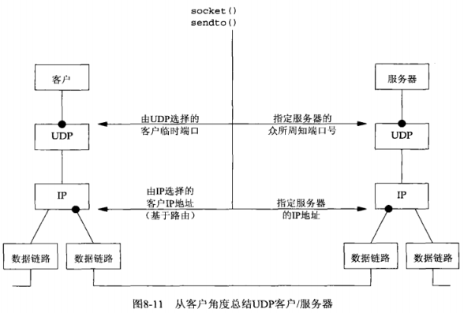
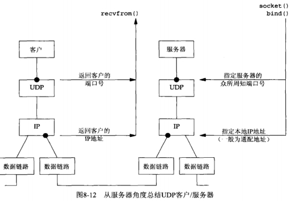
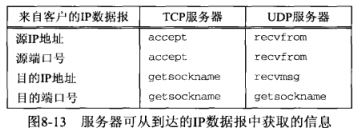
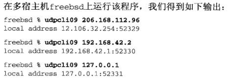

# 第8章 基本UDP套接字编程

## 8.1 概述

使用UDP编写的一些常见的应用程序有：DNS（域名系统）、NFS（网络文件系统）、SNMP（简单网络管理协议）


## 8.2 recvfrom和sendto函数

```c++
#include <sys/socket.h>

/*
** 共同参数
** @sockfd:描述符
** @buff:指向读入或写出缓冲区的指针
** @nbytes:读写字节数
** @flags：将在14章讨论，目前都设为0
*/

/*
** 作用：
** @from:指向一个将由该函数在返回时填写数据报发送者的协议地址的套接字地址结构
** @addrlen:from所指向的套接字地址结构的大小，注意：值-结果参数
** @返回值：成功：所读数据的长度；出错：-1
*/
sszie_t recvfrom(int sockfd, void *buff, size_t nbytes, int flags, struct sockaddr *from, socklen_t *addrlen);

/*
** 作用：
** @to:指向一个含有数据报接收者的协议地址（IP地址和端口号）的套接字地址结构
** @addrlen:to所指向的套接字地址结构的大小，注意：整数值
** @返回值：成功：所写数据的长度；出错：-1
*/
ssize_t sentto(int sockfd, const void *buff, size_t nbytes, int flags, const struct sockaddr *to, socklen_t addrlen);
```

- recvfrom的最后两个参数（from、addrlen）类似与accept（cliaddr、addrlen）的最后两个参数
  - UDP情况下：返回时其中套接字地址结构的内容告诉我们是谁发送了数据报
  - TCP情况下：谁发起了连接
- sendto的最后两个参数（to、addren）类似与connect（servaddr、addrlen）的最后两个参数
  - UDP情况下：调用时其中套接字地址结构被我们填入数据报将发往的协议地址
  - TCP情况下：与之建立连接的协议地址

**写0长度的数据报**

写一个长度为0的数据报是可行的，UDP情况下，会形成一个只包含一个IP首部（IPv4为20字节，IPv6为40字节）和一个8字节UDP首部而没有数据的IP数据报

**读0长度的数据报**

recvfrom返回值是0，它并不像TCP套接字read返回0表示对端已经关闭连接，因为UDP无连接，因此没有关闭连接之说。返回值为0说明读到的对端发送的“写0长度的数据报”

**from参数为空**

recvfrom的from参数可以是空指针，此时addrlen也必须为空，表示我们不关心数据报发送者的协议地址

**TCP使用这两个函数**

recvfrom和sendto可以用于TCP，但通常不会这么做

## 8.3 UDP回射服务器程序：main函数


```c++
// 源码： udpcliserv/udpserv01.c

#include	"unp.h"

int
main(int argc, char **argv)
{
	int					sockfd;
	struct sockaddr_in	servaddr, cliaddr;

	//SOCK_DGRAM表示创建一个UDP套接字
	sockfd = Socket(AF_INET, SOCK_DGRAM, 0);

	bzero(&servaddr, sizeof(servaddr));
	servaddr.sin_family      = AF_INET;
	servaddr.sin_addr.s_addr = htonl(INADDR_ANY);

	//#define SERV_PORT 9877
	servaddr.sin_port        = htons(SERV_PORT);

	Bind(sockfd, (SA *) &servaddr, sizeof(servaddr));

	//调用dg_echo函数来执行服务器的处理工作
	dg_echo(sockfd, (SA *) &cliaddr, sizeof(cliaddr));
}
```

## 8.4 UDP回射服务器程序：dg_echo函数

```c++
// 源码：lib/dg_echo.c

#include	"unp.h"

void
dg_echo(int sockfd, SA *pcliaddr, socklen_t clilen)
{
	int			n;
	socklen_t	len;
	char		mesg[MAXLINE];

	//简单的循环
	for ( ; ; ) {
		len = clilen;
		//使用recvfrom读入下一个到达服务器端口的数据报
		n = Recvfrom(sockfd, mesg, MAXLINE, 0, pcliaddr, &len);

		//把读到的数据报再发送回去
		Sendto(sockfd, mesg, n, 0, pcliaddr, len);
	}
}
```

**该函数的特点**

- 1.该函数永不终止，因为UDP是一个无连接的协议，它没有像TCP中EOF之类的东西
- 2.该函数提供的是一个迭代服务器。一般来说，TCP服务器是并发的，UDP服务器是迭代的

**接收缓冲**

对于本套接字，UDP层中隐含有排队发生。事实上每个UDP套接字都有一个接收缓冲区，到达该套接字的每个数据报都进入该套接字接收缓冲区。

- 每当调用recvfrom时，缓冲区中的下一个数据报以FIFO顺序返回给进程
- 如果有多个数据报到达该套接字，那么相继到达的数据报仅仅加到该套接字的接收缓冲区中（接收缓冲区大小是有限的，通过SO_RCVBUF套接字选项修改）

**TCP与UDP套接字对比**

- TCP套接字

服务器上有两个已连接套接字，每一个都有各自的套接字接收缓冲区


- UDP套接字

只有一个服务器进程，仅有的单个套接字用于接收所有到达的数据报并发回所有的响应。该套接字只有一个接收缓冲区用来存放所有到达的数据报


## 8.5 UDP回射客户程序：main函数

```c++
// 源码： udpcliserv/udpcli01.c

#include	"unp.h"

int
main(int argc, char **argv)
{
	int					sockfd;
	struct sockaddr_in	servaddr;

	if (argc != 2)
		err_quit("usage: udpcli <IPaddress>");

	//把服务器的IP地址和端口号填入一个IPv4的套接字地址结构
	//该结构将传递给dg_cli函数，以指明数据报发往何处
	bzero(&servaddr, sizeof(servaddr));
	servaddr.sin_family = AF_INET;
	servaddr.sin_port = htons(SERV_PORT);
	Inet_pton(AF_INET, argv[1], &servaddr.sin_addr);

	//创建一个UDP套接字
	sockfd = Socket(AF_INET, SOCK_DGRAM, 0);

	dg_cli(stdin, sockfd, (SA *) &servaddr, sizeof(servaddr));

	exit(0);
}
```

## 8.6 UDP回射客户程序：dg_cli函数

```c++
// 源码： lib/dg_cli.c

#include	"unp.h"

void
dg_cli(FILE *fp, int sockfd, const SA *pservaddr, socklen_t servlen)
{
	int	n;
	char	sendline[MAXLINE], recvline[MAXLINE + 1];

	//使用fgets从标准输入读入一行文本行
	while (Fgets(sendline, MAXLINE, fp) != NULL) {

		//使用sendto将该文本行发送给服务器
		Sendto(sockfd, sendline, strlen(sendline), 0, pservaddr, servlen);

		//使用recvfrom读回服务器的回射
		n = Recvfrom(sockfd, recvline, MAXLINE, 0, NULL, NULL);

		recvline[n] = 0;	/* null terminate */
		//使用fputs把回射的文本行显示到标准输出
		Fputs(recvline, stdout);
	}
}
```

**端口号**

该函数未请求内核给它的套接字指派一个临时端口。

对于临时端口的指派：

- 1.TCP：connect调用时指派
- 2.UDP：进程首次调用sendto时如果没有绑定一个本地端口，内核在此时为它选择一个临时端口

显示指定端口：UDP客户也可以显示调用bind指定端口，但很少这么做

**风险（待解决的问题）**

recvfrom指定的第五个和第六个参数（from、addrlen）是空指针，这告知内核我们不关心应答数据报由谁发送

这样做存在一个风险：任何进程不论是在与本客户进程相同的主机还是在不同的主机上，都可以向本客户的IP地址和端口号发送数据报，这些数据报被客户读入并认为是服务器的应答。该问题将在8.8节中解决

## 8.7 数据报的丢失

UDP客户/服务器例子是不可靠的

- 1.如果一个**客户数据报丢失**（例如，被客户主机与服务器主机之间的某个路由丢弃），客户将永远阻塞与dg_cli函数中的recvfrom调用，等待一个永远不会到达的服务器应答
- 2.如果客户数据报到达服务器，但**服务器应答丢失**，客户也将永远阻塞与recvfrom调用

解决方法：给客户的recvfrom设置一个超时（14.2节）。但该方法不是完整的解决方案，因为如果确实超时了，我们无法判定超时原因是数据报没到达服务器，还是服务器的应答没有回到客户（22.5节增加UDP客户/服务器可靠性）

## 8.8 验证收到的响应（dg_cli服务器IP验证版）

需要修改的地方：

- 1.把客户端的main函数改为使用标准回射服务器

```c++
//将客户main函数的
servaddr.sin_port = htons(SERV_PORT);
//改为
servaddr.sin_port = htnos(7);
```

- 2.修改dg_cli函数

```c++
// 源码： udpcliserv/dgcliaddr.c

#include	"unp.h"

void
dg_cli(FILE *fp, int sockfd, const SA *pservaddr, socklen_t servlen)
{
	int				n;
	char			sendline[MAXLINE], recvline[MAXLINE + 1];
	socklen_t		len;
	struct sockaddr	*preply_addr;

	//调用malloc分配另一个套接字地址结构
	preply_addr = Malloc(servlen);

	while (Fgets(sendline, MAXLINE, fp) != NULL) {

		Sendto(sockfd, sendline, strlen(sendline), 0, pservaddr, servlen);

		len = servlen;
		n = Recvfrom(sockfd, recvline, MAXLINE, 0, preply_addr, &len);
		//首先比较由recvfrom在值-结果参数中返回的长度
		//再用memcpy比较套接字地址结构本身
		if (len != servlen || memcmp(pservaddr, preply_addr, len) != 0) 		{
			printf("reply from %s (ignored)\n",
					Sock_ntop(preply_addr, len));
			continue;
		}

		recvline[n] = 0;	/* null terminate */
		Fputs(recvline, stdout);
	}
}
```

**问题**

如果服务器运行在一个只有单个IP地址的主机上，该版本的客户工作正常

如果服务器主机是所宿的，该客户有可能失败

```shell
# 获取freebsd4服务器的ip地址
# macosx为客服主机名
macosx % host freebsd4
freebsd4.unpbook.com has address 172.24.37.94 # freebsd4有两个IP地址
freebsd4.unpbook.com has address 135.197.17.100

# 客户向freebsd4的135.197.17.100IP发送数据报
macosx % udpcli02 135.197.17.100
hello # 客户输入
reply from 172.24.37.94:7 (ignored) #由于数据报的源IP为服务器的另一个IP，因此被忽略
goodbye # 客户输入
reply from 172.24.37.94:7 (ignored) # 同上
```

**解决办法**

- 1.**客户端解决**：得到由recvfrom返回的ip地址后，客户通过DNS中查找服务器主机的名字来验证该主机的域名
- 2.**服务器解决**UDP服务器给服务器主机上配置的每个IP地址创建一个套接字，用bind捆绑每个IP地址到各自的套接字，然后再所有套接字上使用select（等待其中任何一个变得可读），再从可读的套接字给出应答，这样可以保证应答的源地址与请求的目的地址相同

## 8.9 服务器进程未运行

**情景**：不启动服务器的前提下启动客户，客户键入一行文本。那么什么也不会发生，客户永远阻塞于它的recvfrom调用，等待一个永远不出现的服务器应答

首先，在主机macosx上启动tcpdump，然后在同一主机上启动客户，指定主机freebsd4为服务器主机

```shell
#客户
macosx % udpcli01 172.24.37.94
hello world
```

tcpdump的输出


从第4行看到，服务器主机响应的是一个“port unreachable”（端口不可达）ICMP消息，不过这个ICMP消息不返回给客户进程

该ICMP错误称为**异步错误**。该错误由sendto引起，但是sendto本身却成功返回

UDP中，sendto成功返回仅仅表示在接口输出队列中具有存放所形成IP数据报的空间。该ICMP错误直到后来才返回，这就是称其为**异步的原因**

**为什么不返回**：如果在同一UDP套接字上连续向不同IP发生3个数据报，并阻塞与recvfrom，其中只有1个IP无法到达，发送这3个数据报的客户需要知道引发错误的数据报的目的地址以区分究竟是哪一个数据报引发了错误。但是内核如何把信息返回给客户进程呢？recvfrom可以返回的信息仅有errno，它没有办法返回出错数据报的目的IP地址和目的UDP端口号，因此作出决定：仅在进程已经被其UDP套接字连接到恰恰一个对端后，这些异步错误才返回给进程

**基本规则**：对于一个UDP套接字，由它引发的异步错误却并不返回给它，除非它已连接（8.11节讨论如何给UDP套接字调用connect从而完成“连接”）。仅在进程已经被其UDP套接字连接到恰恰一个对端后，这些异步错误才返回给进程

## 8.10 UDP程序例子小结

> 客户角度

图中圆点表示发送UDP数据报时必须指定或选择的四个值



**必须指定的**：服务器的IP地址和端口号

**可选择的**：客户的IP地址和端口号（可由内核自动选择，也可以调用bind指定）

- 内核自动选择**端口号**：第一次调用sendto时一次性选择，**不能改变**
- 内核自动选择**IP地址**：可以随客户发送的每个UDP数据报而变动（假设客户没有捆绑一个具体的IP地址到其套接字上）。**原因**：如图，如果客户主机是所宿的，客户有可能在两个目的地址之间交替选择，其中一个由左边的数据链路外出，另一个由右边的数据链路外出，由内核基于外出数据链路选择的客户IP地址将随每个数据报而改变

**问题**：如果客户绑定到一个IP地址到其套接字上，但内核决定外出数据报必须从另一个链路发出，会发生什么？

- 答：IP数据报将包含一个不同于外出链路IP地址的源IP地址（习题8.6）

> 服务器角度



服务器可能想从到达的IP数据报上获取至少四条信息：源IP地址、目的IP地址、源端口号、目的端口号，下图显示了TCP服务器和UDP服务器返回这些信息的函数调用



UDP套接字的**目的IP地址**只能通过IPv4设置`IP_RECVDSTADDR`套接字选项（或IPv6设置`IPV6_PKTINFO`套接字选项）然后调用**recvmsg**。由于UDP是无连接的，因此目的IP地址可随发送到服务器的每个数据报而改变

## 8.11 UDP的connect函数

**给UDP套接字调用connect**：不给对端主机发送任何信息，没有三次握手过程，它完全是一个本地操作，内核只是检查是否存在立即可知的错误（如一个显然不可达的目的地），记录对端的IP地址和端口号（取自传递给connect的套接字地址结构），然后connect立即返回到调用进程。如果在一个未绑定到端口号的UDP套接字上调用connect同时也给该套接字指派一个临时端口

**未连接UDP套接字**：新创建UDP套接字默认状态

**已连接UDP套接字**：对UDP套接字调用connect的结果

已连接套接字与未连接套接字相比，有**三个变化**：

- 1.不再给输出操作指定目的IP地址和端口号，不使用sendto（也可以使用，但不能指定目的地址，即to、addrlen参数必须为空和0），而**改用write或send**。写到已连接UDP套接字上的任何内容都自动发送到由connect指定的协议地址
- 2.不使用recvfrom获取数据报的发送者，而**改用read、recv或recvmsg**。在一个已连接UDP套接字上，由内核为输入操作返回的数据报只有那些来自connect所指定协议地址的数据报。目的地位这个已连接套接字的本地协议地址，发源地不是该套接字早先conncect到的协议地址的数据报，不会投递到给套接字。已连接套接字仅能与一个对端交换数据报
- 3.由已连接UDP套接字引发的异步错误会返回给它们所在的进程，而未连接UDP套接字不接收任何异步错误


**不对应的数据报如何处理**：来自任何其他IP地址或端口的数据报，不投递给不与其对应的已连接UDP套接字，可能投递给同一个主机上的其他某个UDP套接字，如果没有匹配的其他套接字，UDP将丢弃它们，并生成相应的ICMP端口不可达错误

### 8.11.1 给一个UDP套接字多次调用connect

一个拥有**已连接UDP套接字**的进程，可出于下列2个目的再次调用connect： 

- 1.**指定新的IP地址和端口号** 
  - 对于TCP，要再次调用connect必须先close套接字再重新调用socket创建套接字描述符 
- 2.**断开套接字**： 调用connect时，把套接字地址结构的地址族成员设置为AF_UNSPEC 
  - 对于IPv4为sin_family，对于IPv6为sin6_family
  - 可能回返回一个EAFNOSUPPORT错误，不过没关系，使套接字断开连接的是在已连接UDP套接字上调用connect的进程

### 8.11.2 性能

当应用进程要给同一目的地址发送多个数据报时，使用连接套接字可以获得更高的效率 ，因为：

- 1.当应用进程在一个未连接的UDP套接字上调用sendto时，源自Berkeley的内核暂时连接该套接字，发送数据报，然后断开该连接
- 2.减少搜索路由表的次数
  - 第一次临时连接需为目的IP地址搜索路由表并高速缓存这条信息
  - 第二次临时连接注意到目的地址等于已告诉缓存的路由表信息的目的地，于是就不必再次查找路由表
- 3.已连接UDP套接字只复制一次含有目的IP地址和端口号的套接字地址结构，未连接UDP套接字调用sendto时，每次都要复制

## 8.12 dg_cli函数（UDP已连接套接字修订版）

将前一个版本的dg_cli函数把它重写成调用connect

```c++
// 源码： udpcliserv/dgcliconnect.c

#include	"unp.h"

void
dg_cli(FILE *fp, int sockfd, const SA *pservaddr, socklen_t servlen)
{
	int		n;
	char	sendline[MAXLINE], recvline[MAXLINE + 1];

	//调用connect，将未连接UDP套接字变为已连接UDP套接字
	Connect(sockfd, (SA *) pservaddr, servlen);

	while (Fgets(sendline, MAXLINE, fp) != NULL) {

		//以write代替sendto
		Write(sockfd, sendline, strlen(sendline));

		//以read代替recvfrom
		n = Read(sockfd, recvline, MAXLINE);

		recvline[n] = 0;	/* null terminate */
		Fputs(recvline, stdout);
	}
}
```

**服务器进程未运行情景**：

在主机macosx上运行该程序，并制定主机freebsd4的IP地址（它没有在端口号9877上运行相应的服务器程序）

```shell
macosx & udpcli04 172.24.37.94
hello,world #客户键入一行内容
read error : Connection refused #发送上一条数据报引来了服务器主机的ICMP错误
```

发送数据报引来了服务器主机的ICMP错误，该ICMP错误由内核映射成ECONNREFUSED错误，对应于由err_sys函数输出的消息串：“Connection refused”（连接被拒绝）

## 8.13 UDP缺乏流量控制（dg_echo套接字缓冲区修订版）

由于UDP缺乏流量控制，在服务器中，如果到达的数据报大于UDP套接字缓冲区，会被丢弃，而该“丢弃”行为不会给服务器进程或客户进程任何指示以说明数据报已丢失

**UDP套接字接收缓冲区**

由UDP给某个特定套接字排队的UDP数据报数目受限于该套接字接收缓冲区的大小

可以使用`SO_RCVBUF`套接字修改缓冲区大小。在FreeBSD下UDP套接字接收缓冲区的默认大小为42080字节（30个*1400字节数据报的空间）

增大套接字缓冲区的大小，服务器有望接收更多的数据报

下例中，把缓冲区大小设为240KB（220*1024）

```c++
// 源码： udpcliserv/dgecholoop2.c

#include	"unp.h"

static void	recvfrom_int(int);
static int	count;

void
dg_echo(int sockfd, SA *pcliaddr, socklen_t clilen)
{
	int			n;
	socklen_t	len;
	char		mesg[MAXLINE];

	//注册SIGINT信号的行为
	Signal(SIGINT, recvfrom_int);

	n = 220 * 1024;
	//设置缓冲区大小为240KB
	Setsockopt(sockfd, SOL_SOCKET, SO_RCVBUF, &n, sizeof(n));

	for ( ; ; ) {
		len = clilen;
		Recvfrom(sockfd, mesg, MAXLINE, 0, pcliaddr, &len);

		count++;
	}
}

//当服务器进程收到SIGINT信号时，输出count值
static void
recvfrom_int(int signo)
{
	printf("\nreceived %d datagrams\n", count);
	exit(0);
}
```

## 8.14 UDP中的外出接口的确定

已连接UDP套接字还可用来确定（获取）用于某个特定目的地的外出接口

**做法**：UDP被connect到一个指定IP地址后，调用getsockname得到本地IP地址和端口号

```c++
// 源码： udpcliserv/udpcli09.c

#include	"unp.h"

int
main(int argc, char **argv)
{
	int					sockfd;
	socklen_t			len;
	struct sockaddr_in	cliaddr, servaddr;

	if (argc != 2)
		err_quit("usage: udpcli <IPaddress>");

	sockfd = Socket(AF_INET, SOCK_DGRAM, 0);

	bzero(&servaddr, sizeof(servaddr));
	servaddr.sin_family = AF_INET;
	servaddr.sin_port = htons(SERV_PORT);
	Inet_pton(AF_INET, argv[1], &servaddr.sin_addr);
	//connect到一个指定IP地址
	Connect(sockfd, (SA *) &servaddr, sizeof(servaddr));

	len = sizeof(cliaddr);
	//调用getsockname得到本地IP地址和端口号
	Getsockname(sockfd, (SA *) &cliaddr, &len);
	printf("local address %s\n", Sock_ntop((SA *) &cliaddr, len));

	exit(0);
}
```

**执行效果**：

