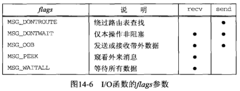
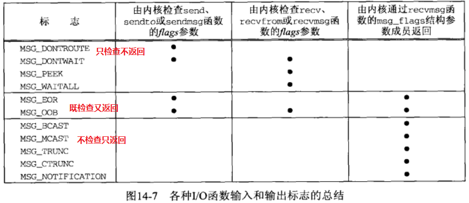
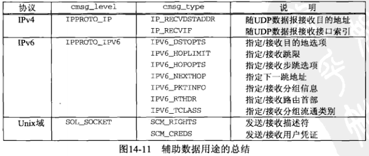
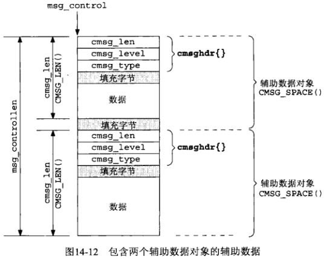
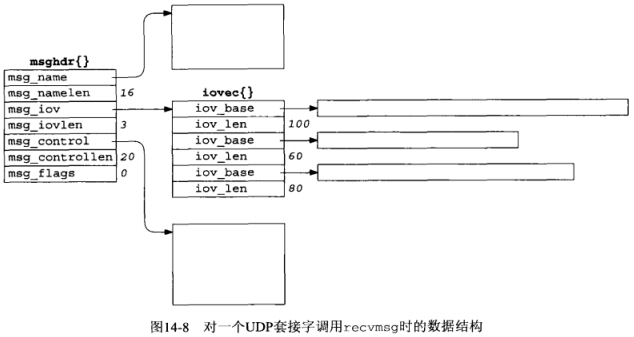
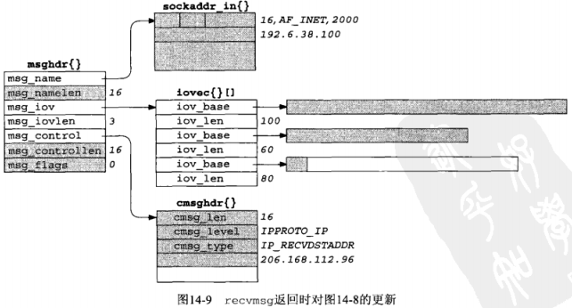

# 第14章 高级I/O函数

## 14.2 套接字超时

涉及套接字的I/O操作上设置超时的方法有以下3种

- 1.使用**alarm**，它在指定超时期满时产生SIGALRM信号（**适用于任何描述符**） 
  - 缺点：涉及信号处理，信号处理在不同实现上存在差异，而且可能干扰进程中现有的alarm信号
- 2.在**select**中阻塞等待I/O（select有内置的时间限制），以此替代直接阻塞在read或write调用上（**适用于任何描述符**） 
- 3.使用**SO_RCVTIMEO**和**SO_SNDTIMEO**套接字选项 （**仅使用于套接字描述符**） 
  - 缺点：并非所有实现都支持

上述3个技术都适用于输入和输出操作（read、write、recvfrom、sendto等）。但是对于connect（connect的**内置超时相当长，典型值为75s**）

- 1.使用SIGALRM设置（14.2.1详细介绍）
- 2.select用来在connect上设置超时的先决条件是相应套接字处于非阻塞模式 
- 3.`SO_RCVTIMEO`和`SO_SNDTIMEO`套接字选项对connect不适用 

### 14.2.1 使用SIGALRM为connect设置超时

```c
// 源码： lib/connect_timeo.c

/* include connect_timeo */
#include	"unp.h"

static void	connect_alarm(int);

int
connect_timeo(int sockfd, const SA *saptr, socklen_t salen, int nsec)
{
	Sigfunc	*sigfunc;
	int		n;

	//为SIGALRM建立一个新的信号处理函数
	//旧的信号处理函数保存在sigfunc中，以便在本函数结束时恢复它
	sigfunc = Signal(SIGALRM, connect_alarm);
	//报警时钟设置成由调用者指定的秒数
	//如果此前已经给本进程设置过报警时钟，那么alarm的返回值是这个报警时钟的当
	//剩余秒数，否则alarm返回值为0
	//如果是已经设置过的情况，需要显示一个警告信息，因为我们推翻了先前设置的报警时钟
	if (alarm(nsec) != 0)
		err_msg("connect_timeo: alarm was already set");

	//如果本调用被中断（即返回EINTR错误），
	//就把errno值设为ETIMEOUT，同时关闭套接字，以防三路握手继续进行
	if ( (n = connect(sockfd, saptr, salen)) < 0) {
		close(sockfd);
		if (errno == EINTR)
			errno = ETIMEDOUT;
	}
	//通过以0位参数调用alarm关闭本进程的报警时钟
	alarm(0);					/* turn off the alarm */
	//恢复原来的信号处理函数
	Signal(SIGALRM, sigfunc);	/* restore previous signal handler */

	return(n);
}

static void
connect_alarm(int signo)
{
	//信号处理函数只是简单的返回，
	//本return语句将中断进程主控制流中那个未决的connect调用，
	//使得它返回一个EINTR错误，当捕获的信号为SIGALARM时，不设置SA_RESTART标志
	return;		/* just interrupt the connect() */
}
/* end connect_timeo */

void
Connect_timeo(int fd, const SA *sa, socklen_t salen, int sec)
{
	if (connect_timeo(fd, sa, salen, sec) < 0)
		err_sys("connect_timeo error");
}
```

**缺点**：

- 1.总能减少connect的超时期限，但是无法延长内核现有的超时期限（比如能比75小，但是不能更大） 
- 2.使用了系统调用的可中断能力，使得它们能够在内核超时发生之前返回，前提是：执行的是系统调用，并且能够直接处理由它们返回的EINTR错误 
- 3.在多线程中正确使用信号非常困难 

**建议**：只是在未线程化或简单线程化的程序使用本技术

### 14.2.2 使用SIGALRM位recvfrom设置超时

改写8.6节中的dg_cli函数，新的dg_cli函数通过调用alarm使得一旦在5秒内收不到任何应答就中断recvfrom

```c
// 源码： advio/dgclitimeo3.c

#include	"unp.h"

static void	sig_alrm(int);

void
dg_cli(FILE *fp, int sockfd, const SA *pservaddr, socklen_t servlen)
{
	int	n;
	char	sendline[MAXLINE], recvline[MAXLINE + 1];

	//建立信号处理函数
	Signal(SIGALRM, sig_alrm);

	while (Fgets(sendline, MAXLINE, fp) != NULL) {

		Sendto(sockfd, sendline, strlen(sendline), 0, pservaddr, servlen);

		//调用recvfrom前设置5秒的超时
		alarm(5);
		if ( (n = recvfrom(sockfd, recvline, MAXLINE, 0, NULL, NULL)) < 0) {
			//如果fecvfrom被信号处理函数中断，
			//输出一个信息并跳过本次循环执行下一次循环
			if (errno == EINTR)
				fprintf(stderr, "socket timeout\n");
			else
				err_sys("recvfrom error");
		} else {
			//如果读到一行来自服务器的文本，则关掉报警时钟并输出服务器应答
			alarm(0);
			recvline[n] = 0;	/* null terminate */
			Fputs(recvline, stdout);
		}
	}
}

static void
sig_alrm(int signo)
{
	//简单的返回，以发送让recvfrom返回小于0，从而中断被阻塞的recvfrom
	return;			/* just interrupt the recvfrom() */
}
```

### 14.2.3 使用select为recvfrom设置超时

这个名为readable_timeo的函数等待一个描述符最多在指定的描述内变为可读。本函数不执行度操作，它只是等待给定描述符变为可读，因此本函数适合于任何类型的套接字（TCP、UDP）

**readable_timeo函数**：

```c
// 源码： lib/readable_timeo.c

/* include readable_timeo */
#include	"unp.h"

int
readable_timeo(int fd, int sec)
{
	fd_set			rset;
	struct timeval	tv;

	FD_ZERO(&rset);
	//在读描述符集中打开与调用者给定描述符对应的位
	FD_SET(fd, &rset);

	//把调用者给定的等待秒数设置在一个timeval结构中
	tv.tv_sec = sec;
	tv.tv_usec = 0;

	//select等待该描述符变为可读，或发生超时
	//出错时为-1
	//超时发生时为0
	//正常则返回正值，为已就绪描述符的数目
	return(select(fd+1, &rset, NULL, NULL, &tv));
		/* 4> 0 if descriptor is readable */
}
/* end readable_timeo */

int
Readable_timeo(int fd, int sec)
{
	int		n;

	if ( (n = readable_timeo(fd, sec)) < 0)
		err_sys("readable_timeo error");
	return(n);
}
```

**readable_timeo使用例子**：

```c
// 源码： advio/dgclitimeo1.c

#include	"unp.h"

void
dg_cli(FILE *fp, int sockfd, const SA *pservaddr, socklen_t servlen)
{
	int	n;
	char	sendline[MAXLINE], recvline[MAXLINE + 1];

	while (Fgets(sendline, MAXLINE, fp) != NULL) {

		Sendto(sockfd, sendline, strlen(sendline), 0, pservaddr, servlen);
		
		if (Readable_timeo(sockfd, 5) == 0) {
			fprintf(stderr, "socket timeout\n");
		} else {
			n = Recvfrom(sockfd, recvline, MAXLINE, 0, NULL, NULL);
			recvline[n] = 0;	/* null terminate */
			Fputs(recvline, stdout);
		}
	}
}
```

### 14.2.4 使用SO_RCVTIMEO套接字选项为recvfrom设置超时

本例展示SO_RCVTIMEO套接字选项如何设置超时

本选项一旦设置到某个描述符（包括指定超时值），其超时设置将应用与该描述符上的素有读操作

**优势**：一次性设置选项。SIGALARM和select方法在每个操作发生之前必须做一些工作

SO_RCVTIMEO仅仅应用与读操作；SO_SNDTIMEO仅仅应用于写操作。都无法用于connect设置超时

```c
// 源码： advio/dgclitimeo2.c

#include	"unp.h"

void
dg_cli(FILE *fp, int sockfd, const SA *pservaddr, socklen_t servlen)
{
	int				n;
	char			sendline[MAXLINE], recvline[MAXLINE + 1];
	struct timeval	tv;

	tv.tv_sec = 5;
	tv.tv_usec = 0;
	//设置超时
	Setsockopt(sockfd, SOL_SOCKET, SO_RCVTIMEO, &tv, sizeof(tv));

	while (Fgets(sendline, MAXLINE, fp) != NULL) {

		Sendto(sockfd, sendline, strlen(sendline), 0, pservaddr, servlen);

		n = recvfrom(sockfd, recvline, MAXLINE, 0, NULL, NULL);
		if (n < 0) {
			//如果超时，recvfrom返回-1，且errno设为EWOULDBLOCK
			if (errno == EWOULDBLOCK) {
				fprintf(stderr, "socket timeout\n");
				continue;
			} else
				err_sys("recvfrom error");
		}

		recvline[n] = 0;	/* null terminate */
		Fputs(recvline, stdout);
	}
}
```

## 14.7 排队的数据量

有时我们想要在不真正读取数据的前提下知道一个套接字上已有多少数据排队等着读取。**有3个技术可用于获悉已排队的数据量**： 

- 1.如果获悉已排队数据量的目的在于避免读操作阻塞在内核中（因为没有数据可读时我们还有其它事情可做），那么可以使用**非阻塞式I/O**（第16章）
- 2.如果既想查看数据，又想数据仍留在接收队列中以供本进程其它部分稍后读取，可以使用**MSG_PEEK**标志。如果想这样做，但是不能肯定是否真有数据可读，那么可以结合非阻塞套接字使用该标志，也可以组合使用MSG_DONTWAIT标志和MSG_PEEK标志 
  - 就一个字节流套接字而言，其接受队列中的数据量可能在两次相继的recv调用之间发生变化。因为在这两次调用之间TCP可能又收到一些数据
  - 就一个UDP套接字而言，即使另有数据报在两次调用之间加入接收队列，两个调用的返回值也完全相同（假设没有其他进程共享该套接字并从中读取数据） 
- 3.一些支持ioctl的FIONREAD命令。该命令的第3个ioctl参数是指向某个整数的一个指针，内核通过该整数返回的值就是套接字接收队列的当前字节数。该值是已排队字节的综合
  - 对于UDP套接字而言包括所有已排队的数据报（Berkely的实现还包括一个套接字地址结构的空间）

# Unix I/O函数

这部分介绍的函数称为Unix I/O。它们围绕描述符工作，**通常作为Unix内核中的系统调用实现** 

包括

- 14.3 recv和send函数
- 14.4 readv和writev函数
- 14.5 recvmsg和sendmsg函数

## 14.3 recv和send函数

这两个函数与标准的read和write的不同在于第4个参数： 

```c
#include <sys/socket.h>

ssize_t recv(int sockfd, void* buff, size_t nbytes, int flags);

ssize_t send(int sockfd, const void* buff, size_t nbytes, int flags);

//返回值：若成功则为读入或写出的字节数，若出错则为-1
```

- **flag**：参数的值或为0，或为下图中一个或兑个常值的**逻辑或**



**解释**：

- **MSG_DONTROUTE**： 告知内核目的主机在某个直接连接的本地网络上，因而无需执行路由表查找 
  - 既可以使用`MSG_DONTROUTE`标志针对单个输出操作开启
  - 也可以使用`SO_DONTROUTE`套接字选项针对某个给定套接字上的所有输出操作开启
- **MSG_DONTWAIT**： 在无需打开相应套接字的非阻塞标准下，把单个I/O操作临时指定为非阻塞，接着执行I/O操作，然后关闭非阻塞标志
-  **MSG_OOB**：对于send，本标志指明即将发送带外数据；对于recv，指明即将读入的是带外数据而不是普通数据
- **MSG_PEEK**：本标志适用于**recv**和**recvfrom**。允许我们查看已经可读取的数据，而且系统不在recv或recvfrom返回后丢弃这些数据 
- **MSG_WAITALL**：告知内核不要在尚未读入请求数目的字节之前让一个读操作返回，但如果发生以下情况之一，相应的读函数仍然有可能返回比所请求字节数要少的数据
  - 捕获一个信号
  - 连接被终止
  - 套接字发生一个错误

**flags参数在设计上存在一个基本问题：它是值传递的，而不是一个值-结构参数。因此它只能用于从进程向内核传递标志。内核无法向进程传递标志**。对于TCP/IP协议这一点不成问题，因为TCP/IP几乎从不需要从内核向进程传回标志。然而随着OSI协议被加到4.3BSD Reno中，却提出了随输入操作向进程返送MSG_EOR标志的需求。4.3BSD  Reno做出的决定是保持常用输入函数(recv和recvfrom)的参数不变，而改变recvmsg和sendmsg的msghdr结构。这个决定同时意味着如果一个进程需要由内核更新标志，它就必须调用recvmsg，而不是recv或recvfrom 

## 14.4 readv和writev函数

与标准的read和write不同在于：readv和writev允许单个系统调用读入到或写出自一个或多个缓冲区，这些操作分别称为**分散读**和**集中写**，因为来自读操作的输入数据被分散到多个应用缓冲区中，而来自多个应用缓冲区的输出数据则被集中提供给单个写操作： 

```c
#include <sys/uio.h>

ssize_t readv(int filedes, const struct iovec *iov, int iovcnt);

ssize_t write(int filedes, const struct iovec *iov, int iovcnt);

//返回值：若成功则为读入或写出的字节数，若出错则为-1
```

- **iov**：指向某个iovec结构数组的一个指针 

```c
//定义在头文件<sys/uio.h>

struct iovec{
    void *iov_base; //buf的起始地址
    size_t iov_len; //buf的大小
};
```

- **iovcnt**：iovec结构数组中元素的个数存在某个限制，取决于具体实现。4.3BSD和Linux均最多允许1024个，而HP-UX最多允许2100个。POSIX要求在头文件<sys/uio.h>中定义IOV_MAX常值，其值至少为16

**一些特性**：

- 1.这两个函数可用于任何描述符，而不仅限于套接字
- 2.writev是一个**原子操作**，意味着对于一个基于记录的协议（如UDP）而言，一次writev调用只产生单个UDP数据报
  - **应用**：7.9节中提到的，一个4字节的writev后跟一个396字节的write可能触发Nagle算法，首选办法之一是针对这两个缓冲区调用writev

## 14.5 14.6 recvmsg和sendmsg、辅助数据

### recvmsg和sendmsg

这两个函数是最通用的I/O函数

可以把所有read、readv、recv、recvfrom调用替换成recvmsg调用

可以把所有write、writev、send、sendto调用替换成sendmsg调用

```c
# include<sys/socket.h>

ssize_t recvmsg(int sockfd, struct msghdr *msg, int flag);

ssize_t sendmsg(int sockfd, struct msghdr *msg, int flag);

//返回值：若成功则为读入或写出的字节数，若出错则为-1
```

- **msg**：指向一个msghdr结构，这个结构封装了大部分参数： 

```c
struct msghdr {
    /*
    ** msg_name和msg_namelen用于套接字未连接的场合（如UDP套接字）
    ** msg_name指向一个套接字地址结构，调用者在其中存放接收者或发送者的协议地址
    ** 如果无需指明协议地址（TCP或已连接UDP套接字）。msg_name应置为空指针
    ** namelen对于sendmsg是一个值参数，对于recvmsg却是一个值-结果参数
    */
	void *msg_name;
    socklen_t msg_namelen;
    /*
    ** msg_iov和msg_iovlen指定输入或输出缓冲区数组，
    ** 类似readv或writev的iov和iovcnt参数
    */
    struct iovec *msg_iov;
    int msg_iovlen; 
    /*
    ** msg_control和msg_controllen指定可选的辅助数据(控制信息)的位置和大小
    ** msg_controllen对于recvmsg是一个值-结果参数
    */
    void *msg_control;
    socklen_t msg_controllen;
    int msg_flags; 
};
```

对于recvmsg和sendmsg，必须区别**flags**参数（值参数）和msghdr结构（值-结果参数）的**msg_flags**成员

- 只有**recvmsg使用**msg_flags成员。recvmsg被调用时，flags参数被复制到msg_flags成员，并由内核使用其值驱动接收处理过程。内核还依据recvmsg的结果更新msg_flags成员的值
- **sendmsg则忽略**msg_flags成员，因为它直接使用flags参数驱动发送处理过程 

下图汇总了内核为输入和输出函数检查的flags参数值以及recvmsg可能返回的msg_flags： 



### 辅助数据

msghdr结构中的msg_control字段指向一个**辅助数据**，又称为**控制信息**

```c
// 定义在头文件<sys/socket.h>

struct cmsghdr{
	socklen_t cmsg_len; //该辅助对象的长度（结构体+数据）
    int cmsg_level;     //协议
    int cmsg_type;      //协议相关的辅助数据类型
};
```

cmsg_level和cmsg_type的取值和说明如下表： 



**辅助数据由一个或多个辅助数据对象构成。每个辅助数据对象用一个cmsghdr结构表示**

- **msghdr结构**的msg_control指向第一个辅助数据对象
- **msghdr结构**的msg_controllen指定了辅助数据(即所有辅助数据对象)的总长度
- **cmsghdr结构**的msg_len是包括这个结构在内的字节数（结构体+数据）
- 填充字节
  - 在**cmsghdr结构**的cmsg_type成员和实际数据之间可以有填充字节
  - 从数据结尾处到下一个辅助数据对象之前也可以有填充字节



下面**5个宏**可以对应用程序屏蔽可能出现的填充字节，以简化对辅助数据的处理： 


**GMSG_LEN与GMSG_SPACE的区别**：

- GMSG_LEN：不计辅助数据对象中数据部分之后可能的填充字节，因而返回的是用于存放在cmsg_len成员中的值
- GMSG_SPACE：计上结尾处可能的填充字节，因而返回的是为辅助数据对象动态分配空间的大小

**5个宏的使用例子**

```c
//伪代码

struct msghdr msg;
struct cmsghdr* cmsgptr;

for( cmsghdr = CMSG_FIRSTHDR(&msg); cmsghdr != NULL; cmsghdr = CMSG_NXTHDR(&msg,cmsgptr)){
	u_char *ptr;
    ptr = CMSG_DATA(cmsghdr);
}
```

**下面以一个例子说明msghdr结构**：

- 假设进程即将对一个UDP套接字调用recvmsg，在调用前为这个套接字设置了IP_RECVDSTADDR套接字选项，以接收所读取UDP数据报的目的IP地址。调用时，msghdr结构如下：



- 接着假设从198.6.38.100端口2000到达一个170字节的UDP数据报，它的目的地址是我们的UDP套接字，目的IP地址为206.168.112.96。recvfrom返回时，msghdr结构如下： 



# 标准I/O函数

## 14.8 套接字和标准I/O

