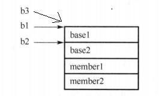

王道程序员求职宝典

[TOC]


# 8 类

## 8.2 类成员简介

### 8.2.1 成员函数

- 1.在类内**定义**的函数默认为内联函数。
- 2.非static成员函数都有一个隐式的this常量指针，指向调用函数的对象。

### 8.2.2 构造函数

#### 构造函数

- 1.自动生成的默认构造函数对成员的初始化特性：
  - 类成员：调用其默认构造函数，如果没有则出错
  - 内置或复合类型成员，取决于调用默认构造函数的对象的位置：
    - 全局：初始化为0
    - 局部：不初始化，垃圾值


- 2.如果一个类NoDefault定义了一个接收string的构造函数，则有：
  - 编译器不合成默认构造函数
  - 具有NoDefault类作为类成员的类：不会自动生成默认构造函数，需自己定义，并显示初始化NoDefault类成员
  - 数组
    - 动态数组：不能作为其元素
    - 静态数组：需要提供显示的初始化式
  - 容器，例如vector
    - 提供初始化式：`vector<noDefault> v1(10,init);`，其中init为已经存在的 noDefault 对象，vector 中的元素都是从它复制构造的。
- 3.构造函数不能被定义为虚函数

#### 成员初始化列表

- 1.成员变量初始化顺序：与声明顺序一致，与初始化列表顺序无关。
- 2.构造函数初始化阶段：
  - 初始化阶段：初始化列表。
    - 类成员：调用默认构造函数，没有则报错。
    - 内置或复合类型成员：全局，初始化0；局部，不初始化，垃圾值。
  - 普通的计算阶段：构造函数体。
    - 类成员：如果在函数体内再次初始化类成员，相等于重复初始化，效率低。
- 3.必须使用初始化列表的成员变量：
  - 没有默认构造函数的类成员
  - const成员变量：但可以与static一起使用，在类外定义
  - 引用

#### 复制构造函数

- 1.复制控制：复制构造函数、赋值操作符、析构函数。
- 2.三法则：如果需要析构函数，则需要复制控制的所有（三种）。
- 3.需要自定义复制控制的情况：类具有指针成员。
- 4.复制构造函数的形式：const+引用：`MyClass(const MyClass &other)`
- 5.复制构造函数的使用场景：
  - 根据另一个同类型的对象初始化一个对象：
    - 直接初始化（圆括号）：在对象初始化时，通过括号给对象提供一定的参数，并且要求编译器使用普通的函数匹配来选择与我们提供的参数最匹配的构造函数
    - 复制初始化（=号）：将一个已有的对象拷贝到正在创建的对象，如果需要的话还需要进行类型转换。拷贝初始化发生在下列情况：
      - 使用赋值运算符定义变量
      - 将对象作为实参传递给一个非引用类型的形参
      - 将一个返回类型为非引用类型的函数返回一个对象
      - 用花括号列表初始化一个数组中的元素或一个聚合类中的成员
  - 类类型作为实参传给非引用类型形参
  - 类类型作为非引用类型的返回值
  - 初始化顺序容器：先调用默认构造函数，再调用复制构造函数
  - 数组：
    - 如果没有初始化式，调用默认构造函数
    - 有初始化式：`MyClass test[] = { MyClass(1) }`，先调用构造函数，再调用复制构造函数，但有的编译器会优化掉后来那步（编译器的思想是能不用临时对象就不用临时对象）
- 6.复制构造函数的形参必须是引用，否则无限循环。
- 7.浅复制、深复制：引用、指针变量有区别

### 8.2.3 析构函数

- 1.析构函数何时被自动调用：
  - 对象超出作用域
  - 动态分配的对象被delete
- 2.自动生成的析构函数，会自动执行类中非static数据成员的析构函数
- 3.类中定义了虚函数，析构函数也应该定义为虚函数，否则：
  - 基类指针指向派生类对象时，delete基类指针，只会调用基类的析构函数，释放基类对象，而派生类对象不被释放
- 4.即使定义了析构函数，也会合成析构函数，并在允许定义的析构函数之后运行合成析构函数
- 5.合成析构函数的释放顺序：
  - 非static成员在类中定义的逆序释放
  - 类成员：调用该成员的析构函数

### 8.2.4 构造函数与析构函数调用顺序

#### 单继承

- 1.构造函数不能继承，派生类需重新定义构造函数，若不显示调用基类构造函数，则调用其默认构造函数，调用格式：

  ```
  派生类类名（总参数列表）：基类构造函数(参数列表),派生类初始化列表{
      //派生类构造函数体
  }
  ```

- 2.派生类构造函数调用顺序：

  - 开辟派生类所需内存
  - 调用基类构造函数，对基类成员初始化
  - 派生类初始化列表：const、引用、没有默认构造函数的派生类 类类型成员
  - 派生类构造函数函数体

- 3.析构函数不能继承，但派生类析构函数会自动调用基类析构函数，调用顺序

  - 派生类析构函数
  - 基类析构函数

#### 多继承

- 1.派生类构造函数调用顺序：
  - 基类构造函数按派生列表顺序调用
  - 派生类初始化列表
  - 派生类构造函数体
- 2.析构函数调用顺序是构造函数调用的逆序
- 3.下图所示的构造函数的调用为
  - ZooAnimal构造函数
  - Bear构造函数
  - Endangered构造函数
  - Panda初始化列表
  - Panda构造函数函数体
- 4.如果在派生类的初始化列表可以显示指示调用基类的哪个构造函数，不影响顺序。


#### 虚继承

[关于C++中的虚拟继承的一些总结](http://www.cnblogs.com/BeyondAnyTime/archive/2012/06/05/2537451.html)

### 9.1.3 转换构造函数（感觉应该把它放在这里）

- 1.例子：`class{ Integral(int); //转换构造函数};`，以下情况都可以成为int转为Integral的转换构造函数：
  - 仅有一个int的构造函数
  - 构造函数有多个参数，但包含一个int参数，且至少除int之外，都有缺省值
  - 有一个可以隐式转换成int的参数的构造函数，如float
- 2.禁止通过构造函数进行隐式转换：`explicit Integral(int); `

### 9.1.4 类型转换函数

- 1.转换构造函数的作用：int--->Integral；类型转换函数的作用：Integral--->int

```c++
class Integral{
    Integral(int); //转换构造函数
    operator int(); //类型转换函数
}；
Integral integ = 1; //调用转换构造函数
int i = integ; //调用类型转换函数
```

- 注意点：
  - 1.必须为成员函数，不能是友元
  - 2.不指定返回类型，但必须返回
  - 3.不能有形参

# 9 面向对象编程

## 9.1 继承

- 继承：可以继承除构造函数和析构函数以外的成员。
- 多继承：直接基类有共同的间接基类，那么派生类中保存有这个间接基类的多份同名成员。可以在直接基类继承间接基类时使用**虚继承**，这样，派生类中就只有一份拷贝。

### 9.1.1 基类成员在派生类中的访问属性


### 9.1.2 继承时导致的二义性

#### 类间的转换

- 前提：基本类型的指针之间不含有隐式转换
- **公有**继承时：派生类的对象/对象指针/对象引用可以赋值给基类，反之不行
- 基类的对象指针/引用可以显示转换为派生类的指针/引用
- 非内建类型A和B，B能隐式转换为A有如下情况：
  - B公有继承自A，可以是间接继承：`class B: public A`
  - B中有A的类型转换函数：`class B{ operator A(); };`
  - A中实现了非explicit的构造转换函数：`class A{ A(const B&)};`

#### 多继承

- 1.多继承中的指针转换

```c++
class mi : public base1, public base2{
    member1 m1;
    member2 m2;
}

void main()
{
    mi MI;
    base1* b1 = &MI;
    base2* b2 = &MI;
    mi* b3 = &MI;
    //如果直接输出b1、b2、b3的this指针地址，b1的地址与b3的地址相等，但b2与b3不等
    //但如果进行比较
    if( b1 == b3 ) cout << "b1 == b3" << endl;
    if( b2 == b3 ) cout << "b2 == b3" << endl;
    //以上两个都会输出，因为b3会进行到基类的隐式转换，转换后才比较。
}
```



- 2.多继承中的二义性：多个基类中存在同名成员
  - 使用限定符`A::print()`（A为基类之一，print为同名成员）
- 3.菱形继承（直接基类有共同的基类）中的二义性：存在重叠的子对象
  - 在派生类对象调用函数时：使用限定符指定直接基类：`mi.D1::print()`（mi为派生类对象，D1为直接基类，print为直接基类的基类base中的函数）
  - 在将派生类对象mi转为BASE指针时：`BASE* pBase = (BASE*)(D1*)&d;`
  - 使用虚基类


## 9.2 虚函数多态

- 1.静态多态（函数重载、操作符重载、模板），动态多态（虚函数）
- 2.派生类派生类覆盖基类虚函数时：
  - 参数：个数和类型必须相同
  - 返回值：
    - 相同
    - 指针类型时，派生类返回的可以是基类返回的子类型的指针/引用

### 虚函数的访问

- 1.普通类型：取决于静态类型
- 2.指针/引用类型：访问指针所指向对象的虚函数
- 3.动态调用的条件：
  - 虚函数
  - 指向派生类的基类指针/引用
- 4.构造函数不能为虚函数，假设A是B的基类，若构造函数可以虚函数：
  - 根据继承的性质，构造函数执行顺序为A() B()
  - 根据虚函数性质，若B定义了构造函数，则构造B时就不会调用A的构造函数
  - 以上两者矛盾
- 5.不能声明为虚函数的有：
  - 普通函数（非成员函数）：只有重载，没有重写
  - 静态成员函数：不归对象所有，没有多态的必要，而且也不会被继承
  - 构造函数
  - 友元函数：友元函数不被继承
- 6.声明为虚函数无意义的有：
  - 内联成员函数：内联函数是在编译时期展开,而虚函数的特性是运行时才动态联编,所以两者矛盾,不应该定义内联函数为虚函数
  - 赋值操作符重载函数：形参要求与类本身相同

